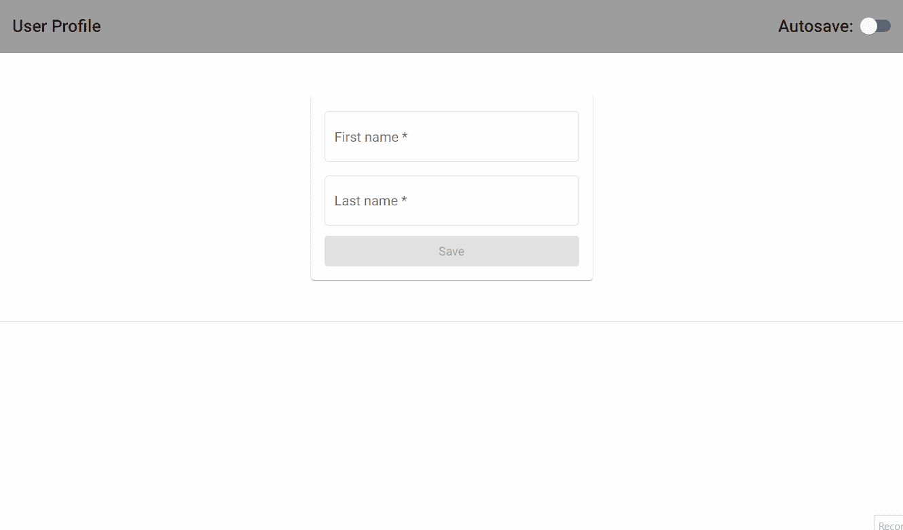
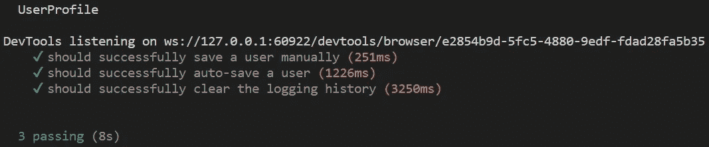
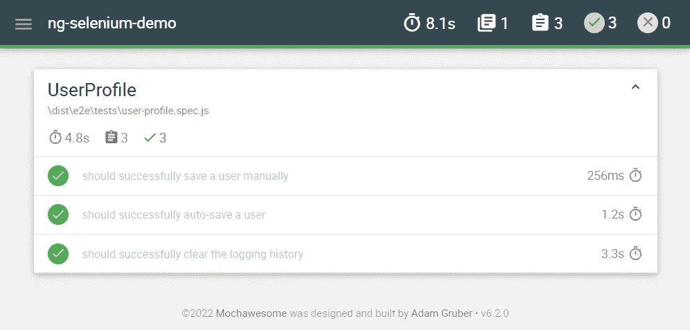

# 如何在 angle 项目中设置 Selenium

> 原文：<https://betterprogramming.pub/how-to-setup-selenium-in-an-angular-project-6b25e27302b3>

## 角状|硒

## 将 Angular 应用程序和 Selenium 测试放在同一个工作空间中，并使用 Mocha 运行它们


Chait Goli 摄:[https://www . pexels . com/photo/photo-of-teepee-a-starry-sky-2666598/](https://www.pexels.com/photo/photo-of-teepee-under-a-starry-sky-2666598/)

在本文中，我们将研究如何设置 ***硒角*** 。更具体地说，我们将执行以下操作:

*   通过使用`npm`安装 Selenium 的 web 驱动程序和所需的浏览器驱动程序来设置 Selenium
*   创建第二个项目，将测试与测试中的应用程序放在同一个工作区中
*   创建一个运行命令来使用 Mocha 运行 selenium 测试
*   为演示应用程序创建并运行一个示例 selenium 测试
*   查看生成的报告

所以，让我们开始吧！

> **免责声明:**本文主要关注如何在 Angular 项目中设置和使用 Selenium。最好熟悉 Selenium 及其术语，但这不是必须的。

# 以角度设置硒

首先，我们需要通过运行以下命令来安装 Selenium 所需的依赖项:

```
npm install --save-dev selenium-webdriver @types/selenium-webdriver mocha @types/mocha mochawesome @types/mochawesome mochawesome-report-generator chai @types/chai chromedriver
```

这将在我们的项目中安装以下开发依赖项:

*   [Selenium WebDriver](https://www.selenium.dev/documentation/webdriver/) 是我们用来编写脚本和自动化浏览器的 API。
*   [Mocha](https://mochajs.org/) 是“一个运行在 Node.js 和浏览器中的功能丰富的 JavaScript 测试框架。”这是我们将要运行测试的框架。
*   [mochawesome](https://www.npmjs.com/package/mochawesome) 和[moch awesome-report-generator](https://www.npmjs.com/package/mochawesome-report-generator)是用于生成测试报告的有用包。
*   Chai 是“一个用于节点和浏览器的断言库，可以与任何 JavaScript 测试框架愉快地配对。”
*   浏览器驱动允许各自的浏览器自动化，比如 Chrome 的 chromedriver。Safari [的驱动已经安装在 macOS](https://www.selenium.dev/documentation/webdriver/getting_started/open_browser/#safari) 中。

有更多的方法来安装驱动程序，但是在我们的例子中，使用`npm`是最简单的一种。

所有这些包都作为开发依赖项安装，并将作为`devDependencies`的一部分出现在`package.json`文件中。测试不会包含在产品包中。因此，这些包只在开发阶段是必需的。

# 创建 E2E 项目

接下来，我们创建一个新的 TypeScript 项目来托管我们的测试。我们创建以下基本目录结构。


现在，让我们解释一下项目的层次结构。

*   `e2e/tsconfig.json`是一个文件，表示当前目录是一个 TypeScript 项目的根目录。这使得`e2e`成为根文件夹(咄)。
*   `src`包含所有源代码。
*   `src/common`包含常用的实用程序类。
*   `src/pages`包含`.page.ts`文件，是基于[页面对象设计模式](https://www.selenium.dev/documentation/test_practices/encouraged/page_object_models/#overview)的页面对象模型类。我们正在创建代表应用程序不同页面的类。然后，我们定义可重用的方法来表示用户在相关页面上的动作。
*   `src/tests`包含`.spec.ts`文件，它们是实际的 Selenium 测试。

# 创建运行命令

我们的下一步是向`package.json`文件中的`scripts`属性添加一个定制脚本。

太好了！现在我们可以通过键入`npm run e2e`来运行我们的测试。

不要被这个命令的长度吓倒。我们来分解一下，一条一条的解释。

*   `tsc -p e2e`将类型脚本文件编译成 JavaScript。这是必需的，因为 Mocha 是一个 JavaScript 测试框架。因此，它只理解 JavaScript。
*   `&&`可以翻译为“运行第一个命令，并且只有当它成功时，才运行第二个命令。”
*   `mocha dist/e2e/tests`将使用 Mocha 运行测试(假设编译成功完成)。
*   `--reporter mochawesome`用于设置我们想要使用的报告器。我们也可以使用`--reporter-options`来提供一些[记者选项](https://www.npmjs.com/package/mochawesome-report-generator#options)。

# 创建并运行我们的第一个测试

我们把最好的留到了最后。是时候举个例子了！

我们将使用上一篇文章中的演示应用程序[。下面是该应用程序的外观:](/angular-auto-save-forms-1a396d17ed7d)



长话短说，用户可以使用这个表单保存个人信息。表单支持手动保存和自动保存。每次保存新信息时，都会创建一个新的历史日志。用户也可以清除记录历史。

为了简洁起见，我们将只遍历一个场景，清除日志记录历史。我们选择这个场景是因为它展示了比演示中其他场景更多的东西。

在我们开始编写测试之前，我们必须注意一些事情。

## 1.草拟一个方案

首先，我们需要在脑海中草拟一个场景。硒测试是端到端(e2e)测试。这就好像一个真实的用户正在与应用程序进行交互。相反，我们正在给一个“机器人”编程，让它自动完成这些交互。

要想出一个场景，想想作为一个人，你会做什么来测试手头的功能。在我们的示例中，假设有日志，我们只需简单地按下 clear 按钮，并确保以后看不到日志。

注意，这只是一个演示。因此，我们将在测试中创建所需的数据。在实际应用中，我们永远不会这样做。就执行时间而言，E2e 测试是“昂贵的”。因此，在测试执行之前，我们最好以不同的方式设置所需的数据。

## 2.使元素可识别

其次，我们需要 Selenium 来唯一地标识页面上的元素。

一个人可以告诉点击哪里，因为她/他可以看到元素。类似地，Selenium 使用 id、类、属性和其他东西来定位元素。

我们只是为独特的元素分配一个 id，比如 clear history 按钮。对于像日志这样的重复元素，我们附加了`data-*`属性。

## 3.创建页面对象类

最后，我们需要创建我们前面谈到的页面对象类。这些方法对应于可以在该页面上执行的可重用操作。

## 4.编写测试

好吧！现在我们已经准备好编写测试了。

基于 Mocha 的文档，`describe()`定义了一个测试套件，`it()`定义了我们的测试套件中的一个测试。`this.timeout(0)`禁用默认的两秒钟摩卡超时。`before`、`beforeEach`、`after`为挂钩方式。

你可能想知道这个`CustomDriver`类是什么。这是一个包装实用程序类，它初始化一个`WebDriver`实例并设置一些特定的选项。除此之外，其余的都是不言自明的。

在运行测试之前，我们用`npm run start`启动应用程序。应用程序启动后，我们执行`npm run e2e`。

另一件要记住的事情是，如果你在一个容器中运行你的测试，你将不能看到它们实时运行。容器只支持`headless`模式，在这种情况下，您需要取消注释`custom-driver.ts`文件中的选项。

当测试执行完成时，应该打印以下控制台消息。



# 查看生成的报告

我们所有的测试都成功通过了。耶！

如果您发现控制台消息不是那么用户友好，不要担心。我们会掩护你的。我们已经安排好了摩卡牛逼记者，记得吗？

每当您运行您的测试时，都会为您生成一个“棒极了”的报告。该报告保存在与您的应用程序和 e2e 项目位于同一层的`mochawesome-report`目录下。

报告通常是这样的:



你可以在[这个 GitHub 库](https://github.com/kagklis/ng-selenium-demo)里找到源代码。

最后，不要忘记[订阅我的时事通讯](https://vkagklis.medium.com/subscribe)来关注更多类似的内容。

# 结论

本文介绍了如何在 Angular 中设置 Selenium。

我们从安装所有必需的依赖项开始。然后创建一个单独的项目，在与 Angular 应用程序相同的工作空间下托管我们的测试。接下来，为了方便起见，我们添加了一个运行命令。我们起草了一个测试场景，实现了它，并看到了如何使用 Mocha 运行它。最后，我们展示了从测试执行中生成的报告。

我希望你喜欢这篇文章，并且你学到了一些新的东西。

*感谢阅读。敬请关注更多内容。*