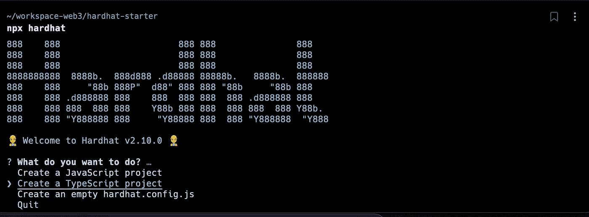
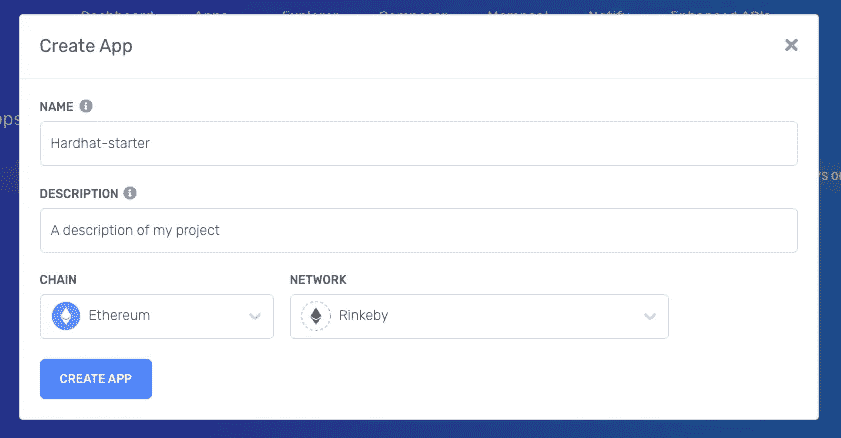
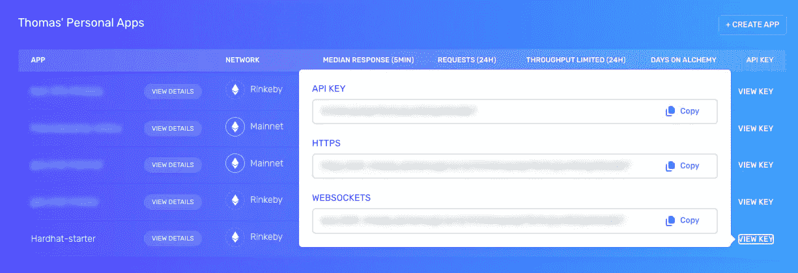

# 如何设置你的硬件环境

> 原文：<https://betterprogramming.pub/how-to-setup-your-hardhat-environment-af70b39c16d1>

## 在五分钟内创建、测试和部署您的智能合同


照片由 [Emmanuel Ikwuegbu](https://unsplash.com/@emmages?utm_source=medium&utm_medium=referral) 在 [Unsplash](https://unsplash.com?utm_source=medium&utm_medium=referral) 上拍摄

# 什么是安全帽？

Hardhat 是以太坊软件的开发环境。

它由不同的组件组成，用于编辑、编译、调试和部署您的智能合约和 dApps，所有这些组件共同创建一个完整的开发环境。

# 设置您的安全帽环境

在本指南中，我将以最简单的方式带您完成环境的安装，这样您可以在几分钟内开始。

这就是说，Hardhat 是非常可定制的。如果您需要任何特定的东西，请不要犹豫，看看文档！

## 创建 npm 项目并安装 hardhat

```
$ mkdir hardhat-starter && cd hardhat-starter
$ npm init -y
```

并将 Hardhat 作为开发依赖项安装:

```
$ npm i -D hardhat
```

让我们借此机会添加`dotenv`，我们稍后会用到它:

```
$ npm i -D dotenv
```

## 创建一个示例安全帽项目

若要创建示例项目，请在项目文件夹中运行以下命令:

```
$ npx hardhat
```

这将生成一个包含契约、测试和部署脚本的示例项目。



系统将提示您几个问题，询问您希望如何设置项目。

几秒钟后，项目就应该创建好了。如前所述，它附带了一个`Lock`智能契约、测试和部署脚本。

如果一切正常，您应该能够运行以下命令:

```
// Compile your contracts
$ npx hardhat compile// Run the tests
$ npx hardhat test// Deploy your contract in a local environment
$ npx hardhat run scripts/deploy.ts
```

# 设置您的环境以部署到 Rinkeby

因此，您拥有在本地运行项目的一切。让我们更进一步，设置您的项目，以便您可以将您的合同部署到 Rinkeby Testnet。

注意，Mainnet 的步骤是相同的。

## 访问一个 Rinkeby 节点

我们将在本指南中使用炼金术，但 [Infura.io](https://infura.io/) 是另一个等效的选项。

如果您没有帐户，请在[Alchemy.com](https://www.alchemy.com/)上创建一个。连接到仪表板后，单击页面右上角的创建应用程序。这将提示以下模态:



**别忘了把网络放到 Rinkeby。**

您的项目现在应该出现在列表中。点击“查看密钥”访问我们需要的 URL 和 API 密钥。



炼金术的仪表板

## 将 Rinkeby 添加到我们的 Hardhat 配置

创建一个`.env`文件，我们将在其中存储我们的 RPC URL:

```
// .envALCHEMY_RINKEBY_URL="Your URL"
```

抬头至`hardhat.config.ts`并添加`networks`设置:

## 使用元掩码创建新的钱包

我们需要一个可以用来部署合同的钱包。

按照以下步骤创建新的钱包:

*   打开元掩码扩展
*   打开账户列表，点击“创建账户”
*   为您的新帐户设置一个相关的名称
*   创建完成后，点击“三点”菜单，然后点击“账户详情”
*   一个模态应该打开，点击导出私钥
*   然后要求您写下元掩码密码
*   您终于可以使用您的私钥了

## **安全提醒**

*   不要与任何人分享你的私人钥匙，否则你会失去你的资金。
*   对每个网络使用不同的帐户，这样你的活动就不会被跟踪

## 将钱包添加到 Rinkeby 设置

给你的`.env`文件添加一个`RINKEBY_WALLET_PRIVATE_KEY`。

```
// .envALCHEMY_RINKEBY_URL="Your URL"
RINKEBY_WALLET_PRIVATE_KEY="Your private key"
```

如果你打算把这个项目上传到 GitHub，别忘了给你的项目加一个`.gitignore`，给它加`.env`。你不想在 Github 上发布你的私钥，对吗？

## 修改安全帽配置

## 向林克比进行部署

让我们看看一切是否如预期的那样运作！

在`package.json`中，添加以下脚本:

```
// package.json{
  // ...
  scripts: {
    "deploy-rinkeby": "npx hardhat run scripts/deploy.ts --network rinkeby ",
  }
}
```

**获取 RinkebyETH**

如果您在上一步中创建了一个新的钱包，它可能是空的。你需要林克比思来部署你的合同。

获得 RinkebyETH 的一种方法是使用[链节龙头](https://faucets.chain.link/rinkeby)。

**修改部署脚本**

我们想要部署的智能协定是一个“锁定协定”，它要求在部署协定时将一定数量的 ETH 传递给构造函数。

在`scripts/deploy.ts`中，该值当前被设置为 1 ETH，这是一个批次。

让我们修改代码，发送 1 个 Wei 而不是 1 个 ETH:

完成后，我们就可以将合同部署到 Rinkeby 了:

```
$ npm run deploy-rinkeby// After a few seconds, you should get the confirmation message:"Lock with 1 Wei deployed to: [Contract address]"
```

*恭喜，一切正常！*

# 额外收获:在 Etherscan 上自动验证您部署的合同

以下是在 Etherscan 上自动验证您的合同的步骤。

虽然这不是强制性的，但我相信这对每个人来说都是一个很好的实践，尤其是你的用户，他们可以很容易地访问你的合同的源代码，并看到他们正在交互什么。

在[https://etherscan.io/](https://etherscan.io/)上创建一个账户，一旦你进入仪表盘，点击 API Keys 并创建一个新账户(这是免费的)。

然后回到我们的项目。

## 将以太扫描 API 密钥添加到`.env`

```
// .envALCHEMY_RINKEBY_URL="Your URL"
RINKEBY_WALLET_PRIVATE_KEY="Your private key"
ETHERSCAN_API_KEY="Your Etherscan key"
```

## 将 Etherscan API 密钥添加到 Hardhat 配置中

## 将以太扫描验证添加到我们的部署脚本中

然后，让我们再次尝试部署我们的`Lock.sol`契约:

```
$ npm run deploy-rinkeby// Here is the output you will get:
Lock with 1 Wei deployed to: [CONTRACT ADDRESS]
Nothing to compile
No need to generate any newer typings.
Successfully submitted source code for contract
contracts/Lock.sol:Lock at [CONTRACT ADDRESS]
for verification on the block explorer. Waiting for verification result...
```

厉害！现在，每次我们部署合同时，它也会在 Etherscan 上得到自动验证！

# 好处:对 Visual Studio 代码使用 Hardhat

如果你是一个 VSCode 用户，你不会想错过 Visual Studio Code 扩展的 [Hardhat。](https://marketplace.visualstudio.com/items?itemName=NomicFoundation.hardhat-solidity)

它增加了对[可靠性](https://soliditylang.org/)的语言支持，并带来了那些惊人的特性:

*   代码完成
*   转到定义、类型定义和引用
*   符号重命名
*   固体代码格式
*   针对 Hardhat 项目的编译器错误/警告的内联代码验证
*   变量、函数调用、错误、事件等的悬停帮助。
*   Hardhat 项目的编译器错误/警告中建议的代码操作(快速修复)

# 结论

您已到达本指南的结尾。

我希望它足够简单，并且您在这个过程中学到了一些新东西！

感谢阅读。😄