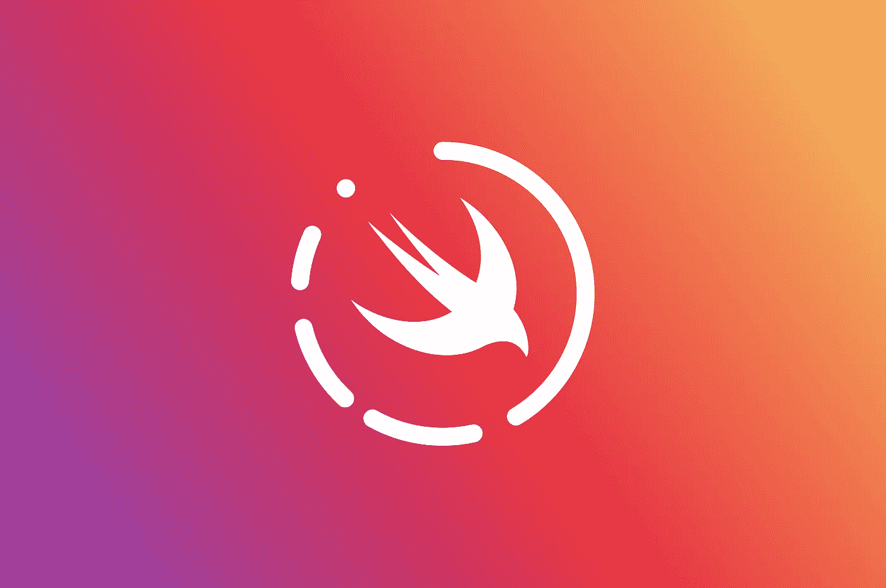

# 如何在 Swift 中分享 Instagram Stories 上的照片

> 原文：<https://betterprogramming.pub/how-to-share-a-photo-on-instagram-stories-in-swift-75319a669596>

## 通过丰富的 URL 方案将自定义照片或视频分享到 Instagram Stories



Instagram 为其故事实现了丰富的 URL 方案。关于 URL 方案最好的事情是我们不需要包含任何框架。如果用户安装了 Instagram 应用程序，它将完成所有的脏活累活。让我们深入了解更多细节！


来自 [Unsplash](https://unsplash.com/) 的第三张屏幕上的照片。

如上图所示，有三个主要图层:

*   背景层，可以由照片、视频、纯色或渐变组成。
*   贴纸层(可选)，包含图像，可由用户编辑。
*   属性链接(只对部分用户开放测试版)。

# 编码时间到了

让我们回顾一下代码。

1.  基本上，这里我们用 Instagram 的方案创建了一个 URL。我们使用可选绑定`if-let`，因为 URL init 返回一个可选值。
2.  之后，我们检查了系统是否可以打开 insta gram——或者说它是否在设备上。
3.  一旦我们确定了这一点，我们就可以继续了。为了传递图像或视频，我们必须将其转换为数据。对于图片，我们可以使用`.pngData()` *。*一旦我们将图像或视频转换成正确的格式，我们需要将其复制到系统粘贴板中，Instagram 将从那里获取数据。
4.  我们现在创建一个字典数组，我们需要在粘贴板中放置一些内容。我们还为粘贴板创建了选项，在本例中，我们设置了图像的到期日期。那将是五分钟。
5.  这一步很重要，因为我们用选项(生命的五分钟)将项目(我们的图像数据)设置到粘贴板。
6.  最后，我们打开开始时创建的 URL。Instagram 将打开，它将在 story composer 中显示我们的图像。

我们做到了！

# 更多定制

但是使用视频、渐变或贴纸作为背景呢？

## 背景图像/视频

如上所述，为了有一个背景图像或视频，我们需要为这两个键之一设置一个数据对象:

```
com.instagram.sharedSticker.backgroundImagecom.instagram.sharedSticker.backgroundVideo
```

## 贴纸

作为图像，贴纸也接受数据。建议的大小是 640x480px 像素。贴纸的关键是:

```
com.instagram.sharedSticker.stickerImage
```

## 渐变背景

对于渐变背景，我们需要传递两种颜色:一种用于顶部，一种用于底部。在这种情况下，我们必须传递一个带有颜色的十六进制值的字符串。

```
com.instagram.sharedSticker.backgroundTopColor
com.instagram.sharedSticker.backgroundBottomColor
```

例如:

```
**let** items = [["com.instagram.sharedSticker.backgroundTopColor": "#EA2F3F", "com.instagram.sharedSticker.backgroundBottomColor": "#8845B9"]]
```

为了得到一个纯色背景，我们做了和渐变一样的事情，但是两种颜色必须匹配。