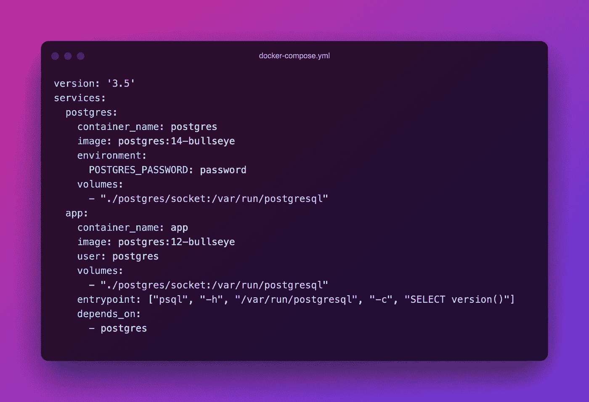
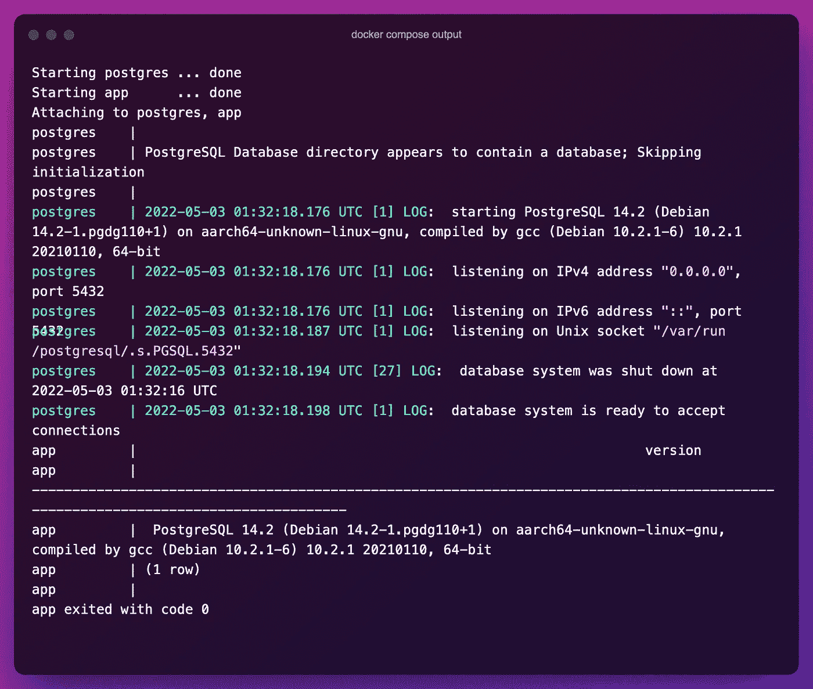

# 如何在 Docker 容器之间共享 Postgres 套接字

> 原文：<https://betterprogramming.pub/how-to-share-a-postgres-socket-between-docker-containers-ad126e430de7>

## 非本地容器上的本地 PG 会话


由[活动创作者](https://unsplash.com/@campaign_creators?utm_source=unsplash&utm_medium=referral&utm_content=creditCopyText)在 [Unsplash](https://unsplash.com/s/photos/database?utm_source=unsplash&utm_medium=referral&utm_content=creditCopyText) 上拍摄的照片

构建 Docker 容器是一项非常简单的任务。你抓取一个图像，运行几个命令，几分钟内你就有了一个完整的环境。当事情需要变得更复杂时会发生什么？

坚持呢？开放港口？共享资源？

如果您正在构建一个复杂的数据库设置，其中有许多服务连接到 Postgres 容器，如果不小心的话，很快就会变得一团糟。管理 Postgres 配置和臭名昭著的`pg_hba`文件是一件苦差事，但有一种更简单的方法可以绕过它。

使用一点小魔法，数据库就有可能看起来像和你的其他服务在同一个容器中。

默认情况下，大多数 PG 配置允许一些本地用户连接到数据库。你不需要打开任何端口，允许任何主机，或摆弄访问列表。在本文中，我们将探索如何在同一父主机上的容器之间建立和共享这种本地连接。这在设置复杂的数据库部署或构建功能丰富的开发环境时节省了时间。

# 先决条件

本指南假设您已经在将要使用的父主机上安装了 Docker 和 Docker Compose。如果您还不知道，请查看下面的链接:

*   [获取 Docker](https://docs.docker.com/get-docker/)
*   [获取 Docker 撰写](https://docs.docker.com/compose/install/)

您还需要为持久性卷分配一些存储空间。一开始您不需要太多，但是如果您打算将数据库数据保存在主机上，您将希望选择一个适合您的估计使用的路径和大小。

一旦 Docker 准备好在主机上运行，我们就可以开始构建我们的 Compose 文件了。

# Docker 撰写文件

在这个例子中，我们将使用一个`docker-compose.yml`文件。这将允许我们从一个文件中一次旋转出许多不同的容器。在这个文件中，我们将有两个服务。第一个是 Postgres，第二个是我们需要本地数据库访问的测试应用程序:



[docker-compose.yml](https://gist.github.com/tateg/53ee3072efd1799a3e215a9ebf47e09a)

让我们来分析一下这个文件中发生了什么:

*   我们有两个服务(容器)，第一个是我们的 Postgres 数据库，第二个是我们的“应用”。第二个只是另一个 Postgres 数据库，它将使用`psql`连接到第一个数据库。
*   我们通过与两个容器共享卷，将 Unix 套接字从第一个 Postgres 传递到第二个 Postgres。该插座通常位于`/var/run/postgresql`处。
*   在我们的第二个“app”服务中，我们使用了一个旧的 Postgres 映像，并修改了入口点，使其使用`psql`连接到数据库，并运行`SELECT`语句来显示版本信息。
*   Postgres 版本在“app”服务中是不同的，以说明它如何明确地连接到第一个 Postgres 实例，而不是在同一容器中的本地。在实际的生产应用程序中，你只需使用一个数据库适配器或某种类型的 [ORM](https://en.wikipedia.org/wiki/Object%E2%80%93relational_mapping) 库，并将其指向套接字。
*   我们还将第二个“app”服务的用户改为使用`postgres`而不是`root`，这样我们就不必更改数据库中套接字或角色的任何权限。生产应用程序应该使用具有适当权限的适当范围的用户。

# 把所有的放在一起

现在是时候运行我们的 Docker 合成文件并查看结果了。只需在与`docker-compose.yml`文件相同的目录下发出以下命令来运行整个合成:

```
docker-compose up --build
```

构建完成后，您应该会看到以下输出:



Docker 合成输出。

这里我们看到我们的数据库启动了，我们的应用程序连接了，并且成功执行了`SELECT`。注意应用程序的输出如何显示 Postgres 版本`14`，而不是安装在应用程序容器中的版本`12`。这意味着我们已经连接到从主机安装到容器中的插座。

如果您在启动任何容器时遇到问题，您可以使用以下命令重新构建它们:

```
docker-compose up --build --force-recreate
```

# 最后的想法

虽然这只是一个测试应用程序，它实际上并没有做任何有用的事情，但是您可以很容易地使用相同的方法来连接您自己的应用程序或服务。

这种方法允许您避免处理遗留应用程序的情况，遗留应用程序很难容器化，因为它与本地数据库紧密相关。虽然大多数现代的数据库支持的应用程序应该支持连接到远程数据库，但是有些情况下您可能希望使用套接字进行连接。

无论您是出于安全性考虑还是仅仅因为缺乏灵活性，在容器之间共享套接字都是一个快速而简单的选择。

感谢阅读！如果你喜欢这篇文章，请看看我下面的其他几篇文章:

*   [*用 Ansible*](/build-a-useful-linux-login-banner-on-aws-with-ansible-4c000aba1258) 在 AWS 上搭建一个有用的 Linux 登录 Banner
*   [*Python 的轻量级高效数据库替代品*](/lightweight-efficient-database-alternatives-for-python-bb990eee752)