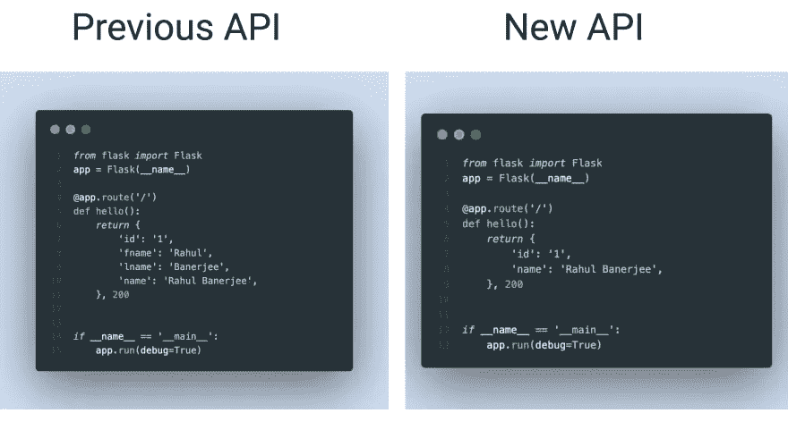
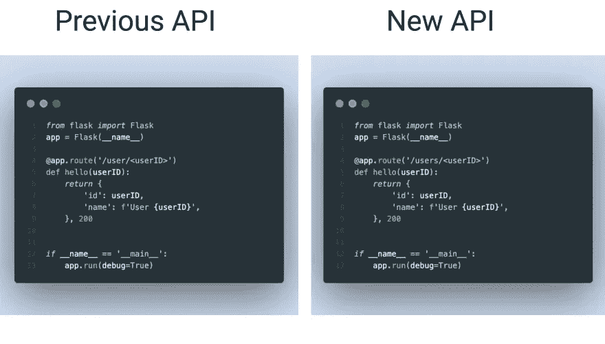
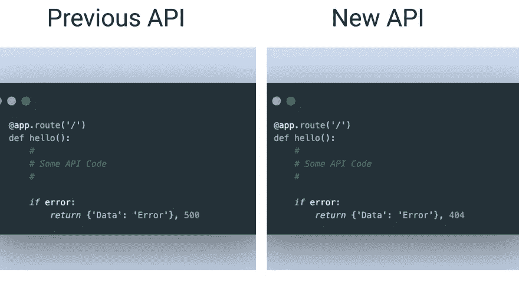
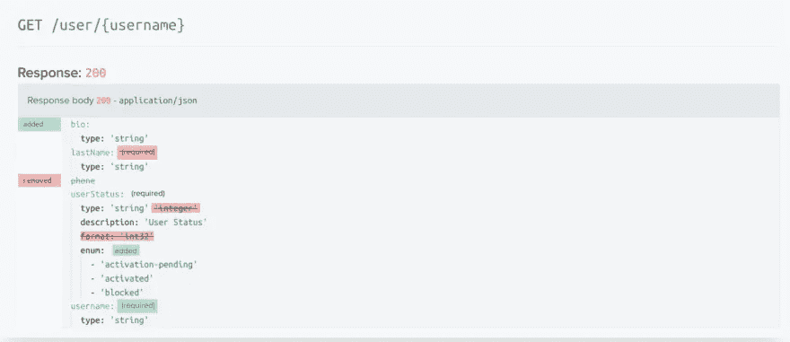
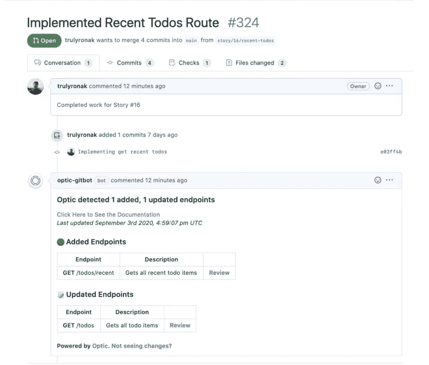

# 如何与你的团队分享 API 的变化

> 原文：<https://betterprogramming.pub/how-to-share-api-changes-with-your-team-d5753df38c38>

## 确保使用您的 API 的团队可以轻松迁移到更新版本的最佳实践


照片由[罗曼·丹斯克](https://unsplash.com/@romaindancre?utm_source=unsplash&utm_medium=referral&utm_content=creditCopyText)在 [Unsplash](https://unsplash.com/s/photos/document?utm_source=unsplash&utm_medium=referral&utm_content=creditCopyText) 拍摄

如果你的团队正在开发或更新一个 API 作为你的软件项目的一部分，你需要小心对那个 API 进行修改。这些变更可能会导致意想不到的错误或失败，并给不知道这些变更的团队成员留下不愉快的惊喜。缺乏沟通或协调会使你组织的小问题变成大问题。

记录 API 的变化并与你的团队和其他利益相关者分享是很重要的。在本文中，您将了解一些最佳实践，您可以使用这些实践来共享 API 更改并避免由于 API 更新而导致的错误。您还将了解像 [Optic](https://www.useoptic.com/) 这样的工具，您可以使用它们来跟踪和共享 API 变更。

# 什么样的 API 变化导致了问题？

下面是一些可能导致软件错误的 API 变化的例子。

## 更改端点的响应对象



假设您有一个简单的 Flask API。左边是带有单个端点的原始 API，它返回 ID、名字、姓氏和全名等信息。您认为名和姓是多余的，因为它们可以通过简单的拆分操作从全名中派生出来；右边是带有更新的响应对象的同一个端点。

如果您的团队成员之一使用您的 API，如下面的代码片段所示，对 API 的更改将会破坏他们的代码:

如果更新响应对象中某些字段的名称或数据类型，也会出现这种错误。

## 更改端点的名称或结构



上面的两个代码片段只有一个字母不同。在左边，端点使用`user`，而在右边，它使用`users`。

如果团队成员使用如下所示的 API，更新会破坏他们的代码，因为请求会发送到一个不存在的 URL:

## 更新端点的响应代码



如果您将其中一个 API 端点的错误响应代码从`500`更新到`404`，这可能会导致一个 bug。考虑下面的代码片段:

如果有人实现了错误处理，但是检查了状态代码`500`，那么新的响应代码`404`将不会被处理。结果，`else`块中的代码将被执行并导致错误。

# 需要可选参数

如果您使可选参数成为必需的，您可能会遇到另一个问题。假设您有一个从图书数据库返回图书的端点。端点接受要返回的书籍数量的可选参数，默认设置为 10。如果您后来决定将书籍数量作为一个必需的参数，那么任何以前使用过您的端点而没有传递可选参数的人都将面临错误。

以上只是一些可能出现问题的变化。甚至更新诸如身份验证或速率限制值之类的东西也会导致团队成员的代码出现错误。

# 为什么要和你的团队分享 API 的变化？

除了中断变更的可能性之外，以下是与您的团队共享变更的其他原因:

*   团队成员可以提供有价值的反馈，否则可能会丢失。在采取行动之前考虑任何 API 变化的潜在影响是很重要的，让您的团队参与进来将有助于确保您做出正确的选择。
*   他们需要为 API 的变化做准备。这可能包括测试更改或确保他们的代码与新的 API 兼容。他们需要能够解释他们代码中的变化；否则，他们可能会被意想不到的问题或错误弄得措手不及，这可能会破坏团队成员之间的关系。
*   更改不仅会破坏您的 API，还会对使用该 API 的其他应用程序造成损害。如果你的团队不知道这些变化，他们就不会准备好处理这些后果。

# 你应该如何分享 API 的变化？

有多种方法可以让您的团队了解变化。这里有一些选择。

# 代码审查

您可以建立一个代码审查系统，以确保对 API 的任何更新在最终确定之前都经过团队成员的审查。这让您的团队有机会发现问题并提出改进建议。

像[光学](https://www.useoptic.com/)这样的工具允许你回顾这些类型的变化。以下是 Optic 生成的 API 变更日志示例:



Optic 还提供了一个 [GitBot](https://www.useoptic.com/blog/launching-the-optic-gitbot/) ，它可以将 API 变更日志添加到您发出的每个拉取请求中。这里有一个例子:



# 沟通渠道

确保您的团队了解任何 API 变更的一个方法是使用一个单独的渠道来共享这些变更——例如，一个 Slack 渠道或一个电子邮件列表。这将确保每个人都知道会发生什么。以下是管理这种渠道的一些技巧:

*   使其成为只读频道，以避免任何讨论。您的团队应该能够检查通知，而不必滚动查看其他消息。
*   确保清楚记录潜在的突破性变化。你可以在信息的开头加上`[IMPORTANT]`或者加上红色背景。
*   提前就这些变化进行沟通。这将让你的团队有时间做好准备。

# API 文档更新

当涉及到 API 变更时，拥有全面和最新的文档是必不可少的。这将有助于确保团队中的每个人都理解这些变化，并知道如何实现它们。

文档既可以手动更新，也可以通过 Swagger 或 Postman 等自动化服务进行更新。例如， [Optic](https://www.useoptic.com/) 分析对 API 的请求、响应和流量，以便更准确地记录和呈现变化。[阅读更多](https://www.useoptic.com/blog/four-approaches-for-documenting-apis#method-4-documentation-diffs-with-optic)关于 Optic 如何处理文档中的 API 变更。

## API 合同测试

如果你根据用户的反馈更新你的 API，你可以和你的团队或者利益相关者一起建立一个 API 契约来描述你的 API 应该如何工作。您可以使用 JSON 模式来记录 API 的端点响应代码并设置契约。

该合同必须为各方所接受。然后，对 API 所做的任何更改在被批准之前都必须通过合同测试。合同测试可以自动化并整合到您的 CI/CD 渠道中。契约测试工具包括[契约](https://docs.pact.io/)和[春云契约](https://spring.io/projects/spring-cloud-contract)。

## 文档驱动的开发

这类似于测试驱动的开发，但是您将在开发 API 之前编写文档，而不是首先编写测试。这意味着对你的 API 所做的任何改变都必须首先被记录下来。您可以遵循 OpenAPI 标准来编写文档，或者使用类似于 [Optic](https://www.useoptic.com/) 的服务来编译文档，而不是手动完成。

# 版本化 API

使用版本化 API 允许团队成员和最终用户继续使用旧版本的 API，同时更新他们的代码以使用新版本。这大大降低了任何重大 API 变更的影响。但是这是有代价的，因为您可能仍然需要为旧版本提供支持。

您还需要维护额外的文档，以确保用户仍然可以使用旧版本。

确保您的 API 是向后兼容的；如果一个用户能够使用你的 API 的一个以前的版本，他们应该或者能够使用你的 API 的将来的版本而不做任何改变，或者仍然能够使用以前的版本。这可以通过为 API 的两个版本提供支持，并向旧 API 添加一个弃用警告来让用户知道他们必须尽快迁移来实现。

您还可以定义 API URLs，以便包含版本号。例如:

```
[www.myapi.com/v1/getBooks](http://www.myapi.com/v1/getBooks)
```

这将确保您的 API 的任何更新或新发布不会破坏您的团队成员或最终用户的代码，如果他们使用以前的版本。

# 结论

即使对 API 的响应对象或 URL 进行很小的更改，也会对其他团队成员或利益相关者产生很大的影响。让你的团队了解情况很重要。拥有一个好的工作流来共享 API 变更、记录它们并测试它们，将会防止错误或其他问题。

改进 API 开发工作流程的一个方法是使用 [Optic](https://www.useoptic.com/) 来自动化测试、文档和变更的透明性。该工具通过生成 changelog 来跟踪和检查 API 更改，然后使用对 API 的请求、响应和流量来生成文档。

想了解更多？Optic 是一个开源项目，所以你可以[加入社区](https://www.useoptic.com/docs/)努力使编写文档变得容易。

```
**Want to Connect?**This article was originally posted on [realjavascriptproject.com](https://realjavascriptproject.com/how-to-share-api-changes-with-your-team/)LinkedIn: [https://www.linkedin.com/in/rahulbanerjee2699/](https://www.linkedin.com/in/rahulbanerjee2699/)
```