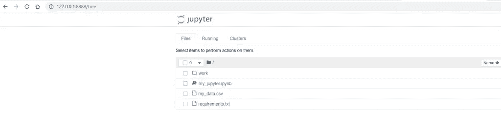
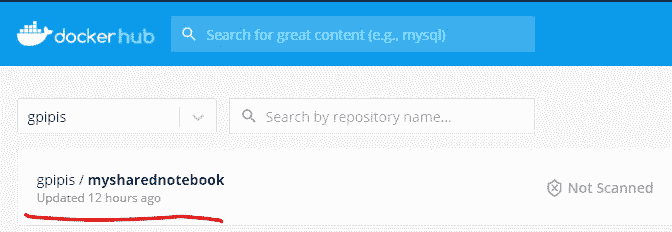
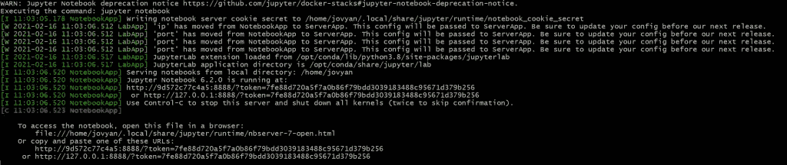

# 如何与 Docker 共享 Jupyter 笔记本

> 原文：<https://betterprogramming.pub/how-to-share-jupyter-notebooks-with-docker-2f19aa2cd87b>

## 共享笔记本的快速浏览示例


[Unsplash](https://images.unsplash.com/photo-1587606607115-1165198fd0de?ixid=MXwxMjA3fDB8MHxwaG90by1wYWdlfHx8fGVufDB8fHw%3D&ixlib=rb-1.2.1&auto=format&fit=crop&w=1050&q=80) 上的图像

[](https://jorgepit-14189.medium.com/membership) [## 用我的推荐链接加入媒体-乔治皮皮斯

### 阅读乔治·皮皮斯(以及媒体上成千上万的其他作家)的每一个故事。您的会员费直接支持…

jorgepit-14189.medium.com](https://jorgepit-14189.medium.com/membership) 

作为数据科学家，我们希望我们的工作是可重复的，这意味着当我们分享我们的分析时，每个人都应该能够重新运行它，并得出相同的结果。这并不总是容易的，因为我们要处理不同的操作系统(iOS、Windows、Linux)和不同的编程语言版本和软件包。这就是为什么我们鼓励您使用虚拟环境，如康达环境。conda environments 的另一个更强大的解决方案是与[码头工人](https://www.docker.com/)合作。

**场景**:我们已经使用 Python Jupyter 笔记本对我们自己的数据进行了分析，我们希望与各个社区分享这一分析，确保每个人都能够重现结果。

# 在本地运行分析

为简单起见，我们假设我已经运行了以下分析:


本质上，我尝试使用`pandas`、`numpy`和`vaderSentiment`库对`my_data.csv`进行情感分析。因此，我想分享这个 Jupyter 笔记本，我希望它是即插即用的。让我们看看如何创建一个包含 Jupyter 笔记本的 docker 映像，以及我的数据和所需的库。

# Jupyter Docker 堆栈

[Jupyter Docker Stacks](https://jupyter-docker-stacks.readthedocs.io/en/latest/) 是一组现成的 Docker 映像，包含 Jupyter 应用程序和交互式计算工具。您可以使用堆栈图像来执行以下任何操作(以及更多操作):

*   在本地 Docker 容器中启动个人 Jupyter 笔记本服务器
*   使用 JupyterHub 为团队运行 JupyterLab 服务器
*   编写自己的项目文档

我们将建立基于`[jupyter/scipy](https://jupyter-docker-stacks.readthedocs.io/en/latest/using/selecting.html#core-stacks)`的自定义图像

# 创建 requirements.txt 文件

Jupyter Docker 核心映像包含最常见的库，但可能需要安装一些额外的库。就像在我们的例子中，我们想要安装`vaderSentiment==3.3.2`库。这意味着我们必须创建`requirements.txt`文件。

`requirements.txt`文件是:

```
vaderSentiment==3.3.2
```

# 创建 Dockerfile 文件

现在我们需要如下创建`**Dockerfile**`:

```
FROM jupyter/scipy-notebookCOPY requirements.txt ./requirements.txt
COPY my_data.csv ./my_data.csv
COPY my_jupyter.ipynb ./my_jupyter.ipynbRUN pip install -r requirements.txt
```

因此，我们用`jupyter/scipy-notebook`开始我们的映像，然后我们将所需的文件从本地计算机复制到映像中。注意，我们可以使用路径和目录。最后，我们在`requirements.txt`文件中安装所需的库。

# 构建 Dockerfile 文件

因为我们已经创建了 Dockerfile 文件，所以我们准备构建它。请注意，您可以给它取任何名称。我选择叫它`mysharednotebook`。提示:不要忘记经期！

该命令如下所示:

```
$ docker build -t mysharednotebook .
```

如果您想确保您的图像已经创建，您可以键入:

```
$ docker images
```

去拿码头工人的照片。

# 运行图像

如果我们想确保映像按预期运行，我们运行:

```
$ docker run -it -p 8888:8888 mysharednotebook
```

我们将获得一个 Jupyter 笔记本的链接！



如果您想查看哪些容器正在运行，您可以键入:

```
$ docker ps -a
```

# 将您的图像推送到 Docker Hub

一旦你确定图像按预期工作，你就可以把它推送到 Docker Hub，这样每个人都可以拉它。你需要做的第一件事是标记你的图片。您可以使用以下命令:

```
$ docker tag 9811503b3d3a gpipis/mysharednotebook:first
```

`9811503b3d3a`是图像 ID，它是从命令`docker images`获得。`gpipis`是我的用户名，`mysharednotebook`是我在上面创建的图像名。最后，`:first`是一个可选标签。

现在，我们可以通过键入以下命令来推送映像了:

```
$ docker push gpipis/mysharednotebook:first
```



# 从 Docker Hub 提取图像

上面的工作是由想要分享他们工作的人完成的。现在，让我们看看如何获得这个图像，并在可复制的 Jupyter 笔记本上工作。

我们要做的是通过键入以下内容来`pull`图像:

```
$ docker pull gpipis/mysharednotebook:first
```

现在，我们可以通过键入以下命令来运行它:

```
$ docker run -it -p 8888:8888 gpipis/mysharednotebook:first
```



如果我们将 URL 复制粘贴到浏览器中，我们会得到:


请注意，您可以更改端口。例如，如果您想在`8889`上运行，那么您键入:

```
$ docker run -it -p 8888:8888 gpipis/mysharednotebook:first
```

您还必须将端口更改为您的 URL:

```
[http://127.0.0.1:8889/?token=7e767d9a8dbb92e9d93ce7a5f52ba3c524a3cfcc65401714](http://127.0.0.1:8889/?token=7e767d9a8dbb92e9d93ce7a5f52ba3c524a3cfcc65401714)
```

# 外卖

当你想与许多人分享你的工作，你希望他们能够复制你的分析，那么最好的方法是与码头工人合作。