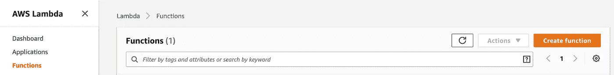
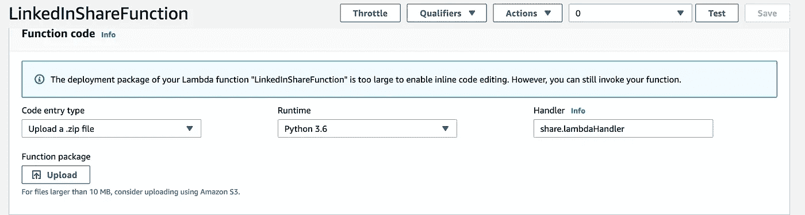
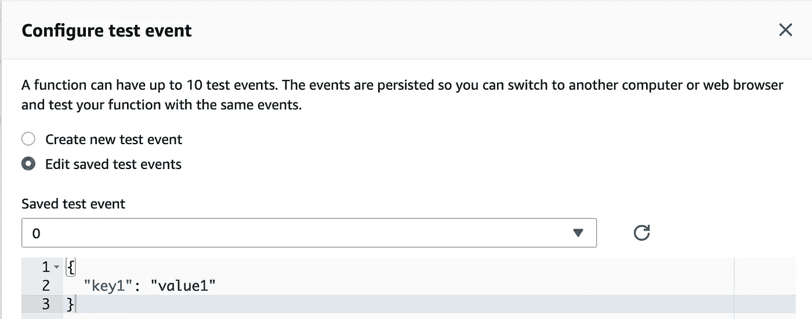
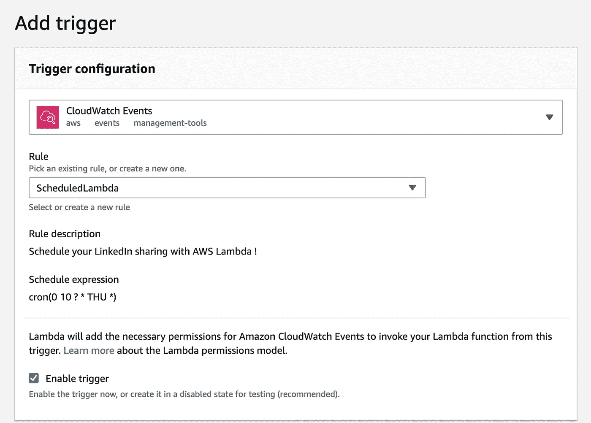
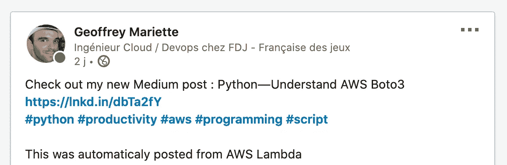

# 如何用 Python 和 AWS Lambda 分享你在 LinkedIn 上的中型帖子

> 原文：<https://betterprogramming.pub/how-to-share-your-medium-posts-on-linkedin-with-python-and-aws-lambda-c54f355a5195>

## 增加你的知名度和你的观众


照片由[merit Thomas](https://unsplash.com/@merittthomas?utm_source=unsplash&utm_medium=referral&utm_content=creditCopyText)在 [Unsplash](https://unsplash.com/s/photos/future?utm_source=unsplash&utm_medium=referral&utm_content=creditCopyText) 上拍摄

首先，我们来看看如何使用 Medium 的 API 抓取你的 Medium 帖子。

要做到这一点，你只需要请求中型团队访问他们的 API。您需要访问配置文件中的以下元素:

*   配置文件名称
*   简历
*   一个化身
*   你的两个写作样本发表在媒体上

然后你只需要给 yourfriends@medium.com 发一封电子邮件，请求一个客户端 ID 和一个客户端密码。灵媒的人会带着珍贵的钥匙回来找你。

注意，如果您只想解析您的提要，并且不需要访问您的媒体信息，则不需要 API 访问。Medium 不通过 API 公开你的提要，但它是通过 RSS 完成的。

现在你有了它们，让我们来谈谈 Python。

我们首先需要做的是导入请求(到`GET`和`POST`URL)，feedparser 解析 RSS 提要，以及 JSON，因为现在一切都是 JSON。

我们还需要导入 SSL 并稍微修改一下配置，因为使用 feedparser 会面临证书问题(关于这一点的更多信息，请参见 GitHub 链接)。

接下来我们需要做的是设置我们的头来使用 Medium 令牌，并设置一个用户代理(我只是在网上随机挑选了一个):

```
base_url = "https://api.medium.com/v1/"r = requests.get(base_url+'me', headers=headers)myUserJson = (r.json())
```

上面的代码将用我们的头在`me` API 上发出一个`GET`请求。响应以 JSON 格式存储在一个`var`中:

```
{'**data**': {'id': '164c349dea9b05a140503bfe7fa20c47a9ce54210eb46940b61b9ec039e88ec22', '**username**': '**geoffrey.mariette**', 'name': 'Geoffrey Mariette', 'url': '[https://medium.com/@geoffrey.mariette'](https://medium.com/@geoffrey.mariette'), 'imageUrl': '[https://cdn-images-1.medium.com/fit/c/400/400/2*UErYKnZmjLi1cjBoTZNGJQ.jpeg'](https://cdn-images-1.medium.com/fit/c/400/400/2*UErYKnZmjLi1cjBoTZNGJQ.jpeg')}}
```

这是来自 API 的完整响应。它包含唯一的 ID、用户名、姓名、用户资料的 URL 以及头像的 URL(例如我自己的帐户)。

这里我们需要的是用户名来获取我们的提要内容:

```
newsFeed = feedparser.parse('https://medium.com/feed/@'+myUserJson['data']['username'])
```

我们将 RSS 提要的结果存储在一个变量中，然后我们可以分析它并提取我们想要的特定信息。

*注意:您可以在浏览器中打开该链接，以便更好地查看内容。*

这里重要的是以下字段:文章标题和链接、发表日期，可能还有相关的标签。

我们将所有这些字段存储在一个`dict`中，T5 本身存储在一个列表中。我们的`var`会是这样的:

```
blogPosts = [{"title": "mytitle1", "link": "mylink1", "published" : "date1", "tags" : ["tag10", "tag11" ]},{"title": "mytitle2", "link": "mylink2", "published" : "date2", "tags" : ["tag20", "tag21" ]} ]
```

这导致了下面的代码:

```
blogPosts = []
for entry in newsFeed.entries:
  tags = []
  for tag in entry['tags']:
    tags.append(tag['term'])
    blogPosts.append({"title": entry['title'], "link": entry['id'], "published": entry['published'], "tags": tags})
```

## 是时候看看我们如何在两个网络之间自动共享了

LinkedIn API 访问比 Medium 的稍微复杂一点。

它使用 OAuth2 协议进行访问，在获得著名的访问令牌之前需要一些步骤。

为了学习这些步骤，我使用了在 Medium 上找到的这个[精彩教程](https://medium.com/@ellesmuse/how-to-get-a-linkedin-access-token-a53f9b62f0ce)。即使截图有一点旧，但流程是一样的。我将很快总结一下:

1.  创建 LinkedIn 应用程序。APi LinkedIn 上的每个授权都必须与一个应用程序链接。每个应用程序都链接到一个公司(所以你可能也需要创建一个)。
2.  选择权限。一旦您完成认证过程，您将被授予访问:
    *`r_emailaddress`
    `r_liteprofile`
    `w_member_social`的权限*
3.  *使用您的新客户 id 和客户密码，然后按照 Esther Liao 的教程将您的应用程序链接到一个网站，这样您就可以获得发布到您的 LinkedIn 个人资料所需的访问令牌。*

*现在您已经拥有了梦寐以求的令牌，您已经准备好使用 Python 了:*

*在上面的注释中，有一些 Python 行可以用来生成访问令牌。*

*与 Medium 一样，我们首先需要知道令牌背后的人是谁。为此，您可以调用 `/me` API。LinkedIn API 允许您在响应中直接请求您需要的字段，而不是检索需要由您解析的巨大 JSON。*

*投影场的例子可以在[这里](https://docs.microsoft.com/en-us/linkedin/shared/references/v2/profile)找到。*

```
*linkedinBaseUrl = 'https://api.linkedin.com/v2/'
headers = {'Authorization': 'Bearer ' + access_token}
r = requests.get(linkedinBaseUrl+'me?**projection=(id)**', headers=headers)
linkedInProfile = r.json()#create the author variable in linkedin urn format
author = "urn:li:person:"+linkedInProfile['id']*
```

*在这段代码中，只有我们用来创建 author var 的 id 字段引用 LinkedIn 资源。*

```
*#concat all tags extracted from medium with an hashtag
myTagsstr = ' #'.join(map(str, myposttags))*
```

*假设我们想用相同的媒体标签分享我们的文章。上面的代码将获取所有的 post 标签，然后在单词后面添加一个 hashtag(第一个除外)，并将项目列表转换为 string。*

*所以，如果我们有这样一个列表:*

```
*myposttags = ["tag1", "tag2", "tag3", "tag4"]*
```

*它将变成:*

```
*myTagsstr = "tag1 #tag2 #tag3 #tag4"*
```

*接下来，我们需要为 UGC Post API 准备我们的帖子内容，并在我们的帖子中包含我们想要的值(请参考[此链接](https://docs.microsoft.com/en-us/linkedin/marketing/integrations/community-management/shares/ugc-post-api)了解允许/必需的 JSON 帖子数据字段)。*

```
*data = { 
 "author": author,
 "lifecycleState": "PUBLISHED",
 "specificContent": {
  "com.linkedin.ugc.ShareContent": {
   "shareCommentary": {
    "text": "Check out my new Medium post : " + myposttitle + "\n" + myposturl + "\n #" + myTagsstr + "\n \n This was automaticaly posted from AWS Lambda"
   },
  "shareMediaCategory": "NONE"
  },
 },
 "visibility": {
 "com.linkedin.ugc.MemberNetworkVisibility": "PUBLIC"
 },
}*
```

*这里重要的是:*

*`author` =你*

*`text` =你想分享的内容。这里应该是这样的:*

> *查看我的新媒体帖子:如何在 LinkedIn 上与 API 分享
> https://medium.com/myarticlelink
> # tag 1 # tag 2 # tag 3 # tag 4
> 
> 这是自动从 AWS Lambda 发布的。*

*`shareMediaCategory` =可以是`JOB`、`ARTICLE`、`QUESTION`等等。*

*`visibility` =如果您希望您的帖子被以下人看到:*

*   *`CONNECTIONS` —代表业主一级网络。*
*   *任何人都可以查看。*
*   *`LOGGED_IN` —仅可由登录成员查看。*

*发布你的请求，你就完成了。我们只是记录内容回复，以确保文章被正确分享。*

# *自动化文章分享的最后一步:AWS Lambda 和 Python V-ENV*

*我们到了。我们的三部分教程的最后一部分是关于如何自动分享中型职位到你的 LinkedIn 帐户！*

*为此，我们将使用 AWS Lambda 和 Cloudwatch 事件。首先，让我们看看它们是什么:*

> *AWS Lambda 允许您在不提供或管理服务器的情况下运行代码。您只需为消耗的计算时间付费。Amazon CloudWatch Events 提供了一个近乎实时的系统事件流，描述了 Amazon Web Services (AWS)资源的变化。使用可以快速设置的简单规则，您可以匹配事件并将它们路由到一个或多个目标函数或流。*
> 
> *[*亚马逊*](https://aws.amazon.com/lambda/)*

*听起来很适合我们。*

*首先，我们不想构建一个运行简单 Python 函数的 VM。第二，由于我计划在每个星期四发布我的中型帖子，我也可以计划在其后立即触发我的 lambda。一个简单的 cron 事件将非常适合！*

*注意:这符合我的需要，但可能不符合你的需要。在任何情况下，您仍然可以找到如何自动触发 Lambda 的解决方案。*

*让我们先做λ部分。*

*登录您的 AWS 登录名，然后转到 Lambda 页面，然后创建一个新函数:*

**

*给你的函数命名，选择 python 作为框架(我选择 Python 3.6，因为我写函数的时候电脑上就有这个)。*

*至于权限，您可以将其保留为默认值。AWS 将为您创建一个具有基本权限(允许访问 cloudwatch 日志)的新 IAM 角色，这足以满足我们的需求。*

*我们的函数现在已经创建了，但是是空的！我们现在需要做的是将代码以 zip 格式直接上传到 Lambda 中。为什么要上传而不是直接将代码复制粘贴到 web 编辑器中？因为我们使用了一些 Lambda 环境中默认不存在的库(比如请求)。这没什么大不了的，因为我们可以使用 Python v-env 来上传函数依赖关系！*

*那么，Python 中的 v-env 是什么？基本上，v-env 允许你为你的函数创建一个专用的 env，带有特定的依赖项，这些依赖项也存在于特定的版本中！使用它们实际上是一种很好的实践，因为它允许不同的应用程序在同一台服务器上运行，而不会发生冲突。如果你对 v-env 感兴趣，请阅读这篇[有用的文档](https://docs.python.org/3/tutorial/venv.html)。*

*AWS 也有一个为 Lambda 创建 v-env 的简单指南。*

*在我们的例子中，我们需要在 v-env 中安装以下内容:*

*   *`requests`*
*   *`feedparser`*

*然后我们上传创建我们的功能代码(我的。py 文件是`share.py`。注意你可以改变它，但是你需要记住你的文件的名字来从 Lambda 调用它。*

*下面是 Lambda 页面配置。这里有两件事你需要明白。*

*   *您的 Lambda 函数将调用 share.py 文件中的函数`lambdaHandler`。*

**

*请注意处理程序部分:share (filename)。lambdaHandler(函数名)*

*   *您需要创建一个数据集来测试您的代码。你在里面放什么并不重要，因为你没有把参数传递给你的 Lambda。您可以将其保留为默认值。*

**

*基本测试事件*

*你可能会注意到你不能直接从 Lambda 接口修改你的脚本。那是因为我们的代码对于编辑器来说太大了。这意味着，如果您需要更改一些代码，您必须重新创建一个新的 zip 包并再次上传，然后才能测试它。*

# *Cloudwatch 事件触发器配置*

*既然我们的函数已经正确配置，我们需要安排一个`cloudwatch`事件来触发它。*

*这可以很容易地从 Lambda UI 中完成。您只需点击“添加触发器”，然后选择 cloudwatch 事件并配置您的 cron 表达式，如下所示:*

**

*我们函数的 CRON 配置:每周四上午 10 点。*

*既然我们的 Lambda 已经被正确调度，我们可以尝试触发它，看看它是否在工作。为此，我们直接从 web 界面使用“测试”按钮。*

*如果脚本运行正常，您可以访问您的 LinkedIn 个人资料并直接查看结果，如下所示:*

**

*你最近的媒体文章已经被自动分享了！*

**注意:如果你想做一些额外的测试，你需要删除你的 LinkedIn 帖子。这是因为脚本试图只共享你最新的媒体文章，而 LinkedIn API 不接受重复的共享内容。**

*这里是 GitHub 上的[完整源代码。](https://github.com/gmariette/sharing/blob/master/aws/lambda/share.py)*

*恭喜你，你现在可以自动分享你的文章了！*

*如果你有任何困难，不要犹豫地评论，我将很乐意帮助你通过这个过程。*