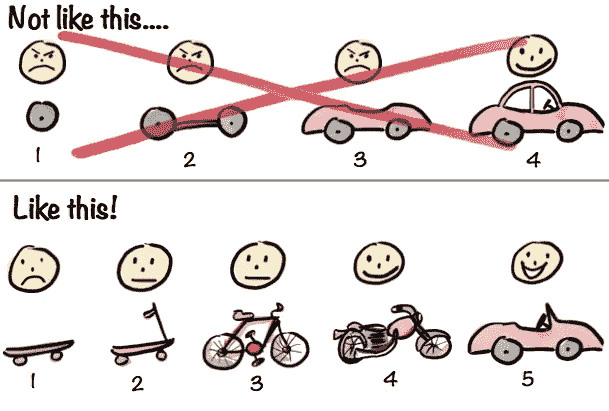

# 如何发布软件项目

> 原文：<https://betterprogramming.pub/how-to-ship-a-software-project-d9fdd2e626aa>

[阿里·叶海亚](https://unsplash.com/@ayahya09?utm_source=medium&utm_medium=referral)在 [Unsplash](https://unsplash.com?utm_source=medium&utm_medium=referral) 上的照片

我花了 14 年时间断断续续地开发软件。在那段时间里，我已经参加了几十次船上约会。一些我错过了。我打了很多。

通过所有这些冒险，我已经确定了一个基本的过程，我认为任何人都可以用它来从深深的杂草中获得胜利。这些都不是特别创新。很多人可能会使用这种程序的一些变体。但我想把它写下来，以防有用。

# 1.选择发货日期——但不要依赖它

首先，选择一个能让你的项目顺利发布的日期。任何标准在这里都有效。商业需求，你想申请的项目的截止日期，甚至是媒体策略。

但是不要太执着于这个出货日期。你不知道自己能否成功。在这一点上，这是一个*实验约束*，它将指导你的计划过程的其余部分。

# 2.确定项目成功发布所需的最低可行特性集

你的项目的观众需要比你从未发布过项目更好的东西是什么？为了产生影响，你能提供的最简单的功能集是什么？

亨利克·克里斯普的插图

你读这篇文章，大概是因为你想出货。因此，你必须明白，你不可能立即把你头脑中想象的一切都运出去。你不能运送完美。完美和运输互相讨厌，所以你必须选择一个。我建议挑船，但这取决于你。

航运需要艰难的选择。你试图捆绑到一个航运项目中的东西越多，你承担的风险就越大。风险会无形地增加，因为不可能提前知道会产生错误、降低性能或带来意外的复杂交互。

你一次运送的东西越少，你承担的风险就越小。所以当你列出你想在第一艘船上看到的东西时，尽你所能使它尽可能的短。

# 3.列出最低可行特性集必须满足的所有依赖项

这些功能需要具备哪些条件才能发挥作用？已经存在了多少？让你的思想围绕所有相关的任务，从需要建造的东西，到必须购买的东西，到必须设计的东西，以便这些功能为公众消费做好准备。幸运的话，您已经处理了其中的一些依赖关系。

你能许可或购买东西而不是自己建造吗？你能利用开源软件而不是推出自己的解决方案吗？想想有多少现成的机会可以满足你的依赖。但是也要记住没有免费的午餐:整合外部资源仍然是昂贵的。

# 4.估计满足你的依赖需要多少时间——然后相乘

软件开发时间估计很容易出错。但是如果你把评估风险*计入你的评估*，你就能为自己赢得一些喘息的机会。会有 bug 不断回来。当你集成第三方工具和内容时，会有惊喜。有些任务开始时看起来很简单，但在执行时却显示出大量额外的复杂性。

这就是软件行业的生活。

当你为你的依赖者和你估计他们需要烹饪的时间创建一个清单时，**乘以 2.5** 。

也许这看起来有些过分。但这是对这样一个事实的让步，即我们脆弱的大脑不善于存储和模拟软件系统的整体复杂性。当你做最初的猜测时，你很可能忽略了一半以上的情况。将有限的视角纳入你的最终猜测。

或者不要。这是你的船。你可以使用任何你觉得合适的倍数。长期的经验告诉我，对于*我的*估计，我通常想要 2.5 倍

不要忘记提前测试你的项目。我不能告诉你这需要多长时间，因为不同的环境有不同的限制。例如，如果你在 iOS 应用商店中发布原生代码以获得批准，你会希望比发布一个可以随意更新的 web 应用程序进行更彻底的测试。

你还需要根据你在 QA 过程中学到的东西来安排时间进行修复。

# 5.将你的估计时间加起来，并将时间表与你的发货日期进行比较

如果你非常幸运，你的时间估计和你的船期完全吻合。

但是你可能不幸运。你在和软件打交道，而软件以挫败我们的乐观主义为乐。如果您的需求远远超过发货日期，该怎么办？

你会被诱惑去操纵评估。不要这样。这是我们分批估算并累加的原因，而不是从发货日期开始往回算。

在这个过程中，我们按照从最真实到最不真实的顺序考虑了以下所有事情:

1.  我们期望的特性的依赖性
2.  最小可行特征集
3.  时间估计
4.  发货日期

发货日期是我们处理的最不真实的事情！不要让它开。

也就是说，如果您一定要将发货日期视为一个硬约束，您还有其他选择。没有一个包括使用谷歌搜索估算。

# 6.做出艰难的选择:缩小范围或改变发货日期

我知道。你想要一匹小马。

🗓💰

但现在你知道这匹小马值多少钱了。

您将比预期晚 18 个月交付小马。你有足够的钱度过这额外的 18 个月吗？你会因为额外的 18 个月而放弃一个重要的竞争优势吗？在从客户那里得到关于你是否在正确的轨道上的反馈之前，你能多等 18 个月吗？

也许你可以改变发货日期。有时候这是正确的选择。

但通常，这是练习中你拿出刀子开始修整瞄准镜的时候。也许你不打算运送一匹小马。也许是时候运送一辆自行车了。了解了最低可行特性集的时间和财务成本后，也许您可以找到进一步削减的灵感。

缩小范围，直到你对剩余工作的估计——你还没有完成的*——在你的发货日期下给你几天的余量。*

现在你可以开始工作了，清楚地知道什么是值得优先考虑的，什么是可以等待的。每当你觉得你的项目偏离轨道或失去动力时，你可以重复这个过程。它帮助我跟踪我的需求和对一些触觉上的东西的依赖，比如记事卡或便利贴，但是你可以使用任何对你和你的团队有意义的系统来记录你所经历的过程。

# 但是，Danilo，这不是敏捷/scrum/[cargo cult 方法论]的方式！

不管怎样，伙计。我肯定不是。这是我所知道的在所有各方都同意的日期启动项目的方法，所有各方都记录了范围，所有各方都理解了权衡。

在这种情况下，我已经看到它与 sprints、计划会议、站立会议和回顾会议等工具一起工作。我真的很喜欢做这些事情。如果您想要使用现有的系统进行交流和协作，您可以保留它们。

但你需要一种方法来理解成本、范围和结果之间的关系，并在所有职能部门之间传达这些约束。这是我长期以来使用的基本方法。希望对你的冒险有帮助。

延伸阅读:

[Rands 的 1.0](http://randsinrepose.com/archives/1-0/):“发布一个 1.0 产品不会要了你的命，但它会尝试。”