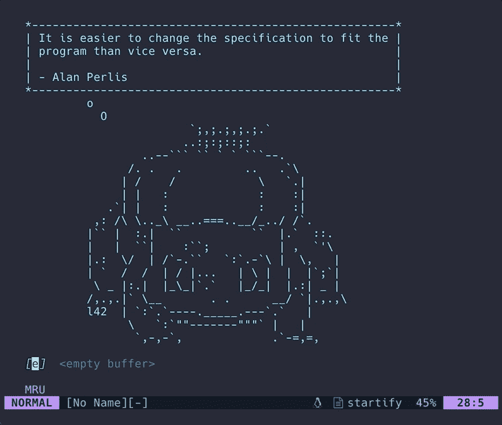
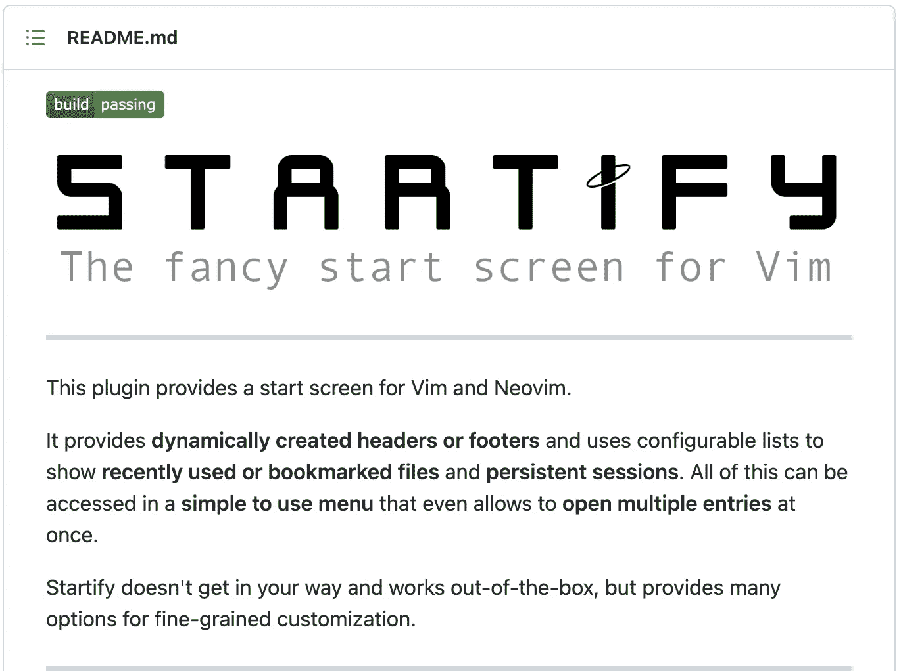

# 如何在 Vim 终端顶部显示 ASCII 艺术欢迎屏幕

> 原文：<https://betterprogramming.pub/how-to-show-an-ascii-art-welcome-screen-at-the-top-of-the-vim-terminal-b8787f6ea9f4>

## 从荷马、尤达或海绵宝宝那里获得灵感



ascii 艺术人物的一些励志语录。图片作者。

如果你使用 vim，你可能和我一样。你花了太多的时间定制你的配置文件来优化你的键盘快捷键，让事情看起来漂亮。如果您是 vim 新手或者还没有定制您的配置文件，我很抱歉。当你读到这篇文章的时候，你会有一个新的嗜好。

今天，我们将为您的 vim(或`neovim`)设置制作一个漂亮的启动页面。每次你打开 vim，你都会得到一个新的随机的灵感引语，由一个随机的 ascii 艺术人物说出。

*如果你不熟悉 vim，它是一个简单的命令行文本编辑器，几乎预装在每台 Linux 或 mac 机器上，可以用命令:* `*vim*` *运行。如果你在 windows 上，你将能够和 Linux 的* [*Windows 子系统*](https://docs.microsoft.com/en-us/windows/wsl/install) *一起使用它，就像我在这篇文章中做的一样。你也可以在为 Linux 安装了非 Windows 子系统的 vim 之后继续使用 Windows 指南* [*这里*](https://www.freecodecamp.org/news/vim-windows-install-powershell/) *。vim 社区的大部分人(包括我)已经转移到了*[*neo vim*](https://github.com/neovim/neovim)*，这是一个包含了一系列新特性的分支，所以我将在这里为两者提供说明。*

可以在 mac 上用`brew install neovim`安装 neovim，或者在 ubuntu 上用`sudo apt install neovim`安装。

# 安装插件

为了实现我们想要的，我们需要定制一个名为`vim-startify`的插件 vim 的花哨的开始屏幕。但是首先，我们需要安装它！



vim-startify [自述文件](https://github.com/mhinz/vim-startify)的截图。

使用插件管理器进行安装，如 [vim-plug](https://github.com/junegunn/vim-plug) (点击安装说明链接)，并在 vim 配置文件中指定。使用 vim，该文件位于`~/.vimrc`。在 neovim 中，这个文件位于`~/.config/nvim/init.vim`。

如果您像我一样使用 vim-plug，那么将`Plug 'mhinz/vim-startify'`添加到您的 vim 配置文件中，如下所示:

```
call plug#begin(stdpath('data') . '/plugged')Plug 'mhinz/vim-startify'
" the rest of your plugins...call plug#end()" the rest of your vim config file...
```

然后关闭并重新打开 vim，用`:PlugInstall`命令安装。

如果你正在使用另一个插件管理器，请参阅那个管理器的使用说明。您只需要将`'mhinz/vim-startify'`添加到配置文件中的其他地方，并运行类似的命令。

# 默认 vim-startify 配置

默认情况下，`vim-startify`看起来相当不错。现在，当您打开 vim 时，您应该看到以下内容:


默认 vim-startify 配置。图片作者。

然而，本文的重点是添加不同的 ascii 艺术字符和引号。让我们现在做那件事。

# 定制 vim-startify 配置

为了定制我们的 ASCII 艺术字符和引号，我们可以将下面的代码添加到我们的 vim 配置文件中(在 neovim 上的`~/.vimrc`与 vim 和`~/.config/nvim/init.vim`一起找到)。如果你想更整洁一点，你也可以把它放在一个文件中，这个文件在插件加载后加载，在:

*   `~/.vim/after/plugin/vim-startify.vim`在 vim 上。
*   `~/.config/nvim/after/plugin/vim-startify.rc.vim`在 neovim 上。

本质上，我们在这里所做的是创建一个引用列表和一个包含我在网上找到的 ASCII 艺术收藏的列表(大部分来自 [www.asciiart.eu)。](http://www.asciiart.eu.)我把艺术家名字的归属留在了艺术品中。

这里有一个函数，在每次打开 vim 时随机选择要显示的艺术品。您可以随意以相同的格式添加您个人喜欢的 ASCII 艺术，但要确保您将`'`字符替换为`"`或```，因为`'`字符用于指定 vimscript 中字符串的结尾。

我还喜欢添加这些`vim-startify`设置，以便在启动时查看最近的文件，并设置书签(到我的配置文件，以便我可以自定义更多)，可以通过快捷方式`v`和`c`打开。

```
let g:startify_list = [
 \ { 'header': ['    Bookmarks'], 'type': 'bookmarks' },
 \ { 'header': ['    MRU'], 'type': 'files' },
 \ { 'header': ['    MRU ', getcwd()], 'type': 'dir' },
  \ ]

let g:startify_bookmarks = [
 \ { 'v': '~/.vimrc' },
 \ { 'c': '~/.config/' },
 \ ]if has("nvim")
 let g:startify_bookmarks = [
  \ { 'v': '~/.config/nvim/init.vim' },
  \ { 'c': '~/.config/' },
  \ ]
endif
```


自定义完 vim-startify 配置后。图片作者。

仅此而已。感谢阅读。