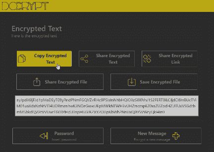
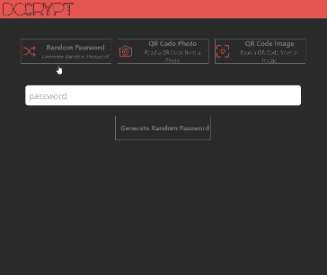

# 如何在 Web 应用程序中显示通知

> 原文：<https://betterprogramming.pub/how-to-show-notifications-in-a-web-application-72a1e76dabc2>

## 这一有用功能的简要指南

沃洛季米尔·赫里先科在 [Unsplash](https://unsplash.com?utm_source=medium&utm_medium=referral) 拍摄的照片

上个月，我做了一个兼职项目，一个允许你加密和解密短信的网络应用程序([DoCrypt.org](https://docrypt.org/))。这仍然是一项正在进行的工作，但我已经实现了一些我想分享的功能。我认为这是一个有趣的项目，我打算为此写几篇文章。我想把重点放在我最近实现的一个特性上:通知。

# 问题

我想从视觉上确认一些操作的成功。特别是加密文本的“复制到设备剪贴板”。这是我实现的一个特性，允许用户将密文复制到外部应用程序，比如文本消息。出于这个原因，我决定实现一个通知，确认复制到设备剪贴板。

视觉上，这是我想要达到的结果:

如您所见，通知是一个出现在右上角的小条。该栏为绿色，包含一条文本消息。该条在短时间内保持可见，然后消失。有趣的是，我可以使用相同的方法来显示不同颜色和不同消息的不同通知。

# 我创建一个通知存储

为了解决这个问题，我使用了一个细长的组件。背后的想法不是我的。这个[@ kevmodrome](https://twitter.com/kevmodrome)[repl](https://svelte.dev/repl/2254c3b9b9ba4eeda05d81d2816f6276)给了我灵感。我根据自己的需求定制了一切。

我需要两样东西:在屏幕上显示通知的 HTML 元素和跟踪通知本身及其生命周期的东西。我从这方面开始。为了解决这个问题，我使用了一个[存储库](https://svelte.dev/docs#run-time-svelte-store)。

我创建了`Notification.ts`文件，并从设置一些接口和创建一个简单的存储开始:

如您所见，我已经创建了一个表示通知的`Msg`界面。通知的类型可以是`default`、`danger`、`warning`、`info`或`success`。通知的类型决定了条形的颜色。消息是显示在栏中的文本。最后，超时是通知保持可见的时间。如果未指定，默认值为 3000 毫秒。

对于每个通知，我分配一个 ID；我需要一个唯一的标识符，以便稍后与通知本身进行交互。我不能使用基于数组长度的计数器，因为我可以取消一个通知，然后计数器将不再有效。出于这个原因，我使用`idGenerator()`函数来生成一个惟一的 ID。

因此，我需要一种方法来向存储添加通知:

我使用商店的`update()`方法向数组添加一个新的通知。`update()`方法接受一个函数，该函数接收存储的当前状态并返回更新后的状态。在本例中，我向数组添加了一个新的通知。

我对显式传递 id 感兴趣，因为在某些情况下，我可能对从组件外部访问通知感兴趣。如果我选择不传递 id，我会在内部生成它。

现在，我需要一种方法来从存储中删除通知:

我使用`update()`方法，结合`[filter()](https://developer.mozilla.org/en-US/docs/Web/JavaScript/Reference/Global_Objects/Array/filter)`方法从数组中移除通知。

为了管理消失的通知，我需要一个计时器或类似的东西。我使用`[SetTimeout()](https://developer.mozilla.org/en-US/docs/Web/API/setTimeout)`方法:

综合所有这些，我得到了完整的`Notification.ts`文件，如下所示:

完成商店部分后，我继续进行`component`部分。

# 我创建了一个显示通知的组件

我创建了`Notification.svelte`文件，并开始用以下代码导入商店:

要访问存储值，我可以使用[反应](https://svelte.dev/docs#component-format-script-4-prefix-stores-with-%24-to-access-their-values) `[$store](https://svelte.dev/docs#component-format-script-4-prefix-stores-with-%24-to-access-their-values)` [语法](https://svelte.dev/docs#component-format-script-4-prefix-stores-with-%24-to-access-their-values)。此外，为了显示存储中包含的所有值，我使用了`[{#each...}](https://svelte.dev/docs#template-syntax-each)`:

如您所见，我使用了`each`方法来迭代所有的存储值。对于每个值，我用通知文本创建一个 div。

组件是完整的，但我感兴趣的是添加一些风格，使它更多汁。

这样，我在屏幕的右上角显示通知，一个在另一个上面。

但是我如何根据类型用不同的颜色显示通知呢？为此，我根据通知类型和用作颜色引用的对象向`toast` div 添加了一个类:

我可以通过添加一个动画来突出通知的出现和消失，让它变得更漂亮。为此，我使用了[细长/过渡](https://svelte.dev/docs#run-time-svelte-transition)和[细长/动画](https://svelte.dev/docs#run-time-svelte-animate):

综合所有这些，我最终得到了我的`Notification.svelte`组件:

现在剩下的就是在我们的应用程序中使用它。

# 我将组件添加到页面中

为了将组件添加到页面中，我需要将其导入到`App.svelte`文件中。下面是如何做到这一点:

我只需要导入一次，在应用的主页面上。这样，我可以从任何应用程序页面开始显示通知。

例如，为了在我复制密文时显示通知，我向组件添加了以下代码:

或者，如果我想显示不同颜色的通知，我只需更改消息的`type`:

好吧，我想说现在就这些了。如果你想看完整的代码，可以在 [GitHub](https://github.com/el3um4s/docrypt) 上找到。该应用可在[docrypt.org](https://docrypt.org/)上获得。

感谢阅读！敬请关注更多内容。

***不要错过我的下一篇文章—报名参加我的*** [***中邮箱列表***](https://medium.com/subscribe/@el3um4s)

 [## 通过我的推荐链接加入 Medium—Samuele

### 阅读萨缪尔的每一个故事(以及媒体上成千上万的其他作家)。不是中等会员？在这里加入一块…

el3um4s.medium.com](https://el3um4s.medium.com/membership) 

*原载于 2022 年 10 月 15 日 https://blog.stranianelli.com***。**