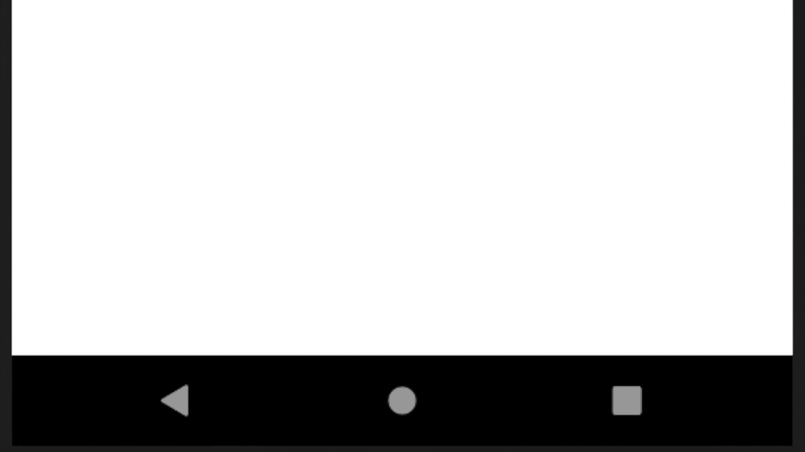
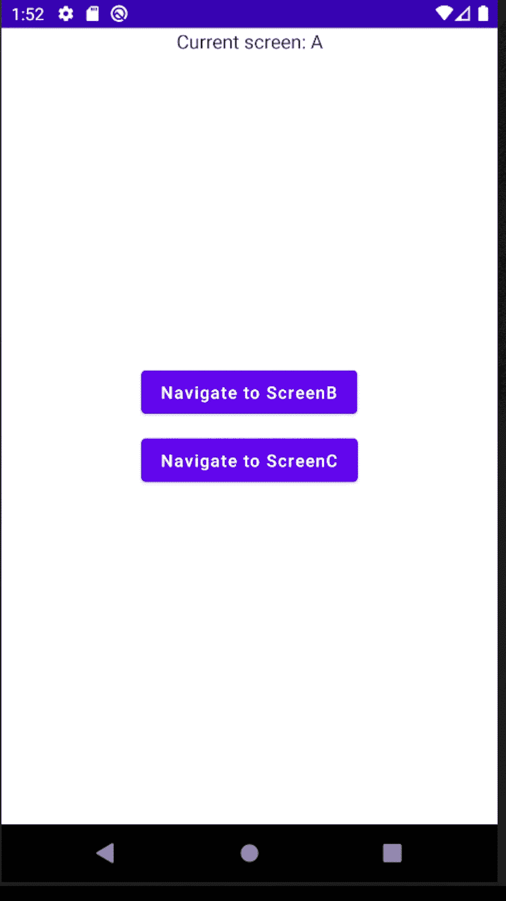

# 如何在 Jetpack Compose 中跨多个屏幕显示 Snackbars

> 原文：<https://betterprogramming.pub/how-to-show-snackbars-across-multiple-screen-in-jetpack-compose-dd4b40c6829a>

## 在你的 Android 应用中提供直观的反馈

# 目标

我们希望即使在 Jetpack Compose 中导航到新屏幕时，我们的小吃店也是可见的。所以 Snackbar 应该跨多个屏幕显示。

# TL；博士:

我们应该在应用程序状态保持器中保存一个 scaffoldState，并让屏幕触发一个`**showSnackbar**` 事件。

在本文中，我将解释如何在 Jetpack Compose 应用程序中触发导航时显示 Snackbars。这是一个小应用程序，但为了能够维护一个更大的项目，使用 Android 推荐的解决方案非常重要。

第一个关键点是应用状态作为真理的来源，这里解释:[状态持有者作为真理的来源](https://developer.android.com/jetpack/compose/state#state-holder-source-of-truth)。

第二个重点是状态提升，这里解释:[状态提升](https://developer.android.com/jetpack/compose/state#state-hoisting)。

解决方案依赖于这两点。我们将有一个应用程序状态保持器，我们的屏幕将触发一个事件，通知我们的单个`scaffoldState`应该显示一个 snackbar。由于我们在根可组合组件中只有一个脚手架(它的状态存储在 app state 中),所以它不仅处理 snack bar 的显示，还处理多个 snack bar 是否被调度，并且它将显示每个没有被取消的 snack bar。

# 让我们浏览一下代码:

首先，我们有`MainActivity.kt` ——没什么特别的:

根可组合组件如下所示:

我们可以看到，我们将状态容器注入到我们的可组合对象中，并使用它的属性和函数。

所以让我们看看`SnackbarDemoAppState`是什么样子的。

在这里，我们收集我们的应用程序应该记住的一切，然后创建我们自己的记忆。`AppState()`可组合函数。因为它在我们的根 composable 中，所以当屏幕离开 composite 时，我们的 Snackbar 不会消失。

因为我们只有一个`scaffoldState`，它将处理每个`showSnackbar`请求，并安排应该显示的每个消息。

`MyNavigation` composable 做什么:

它只是将`showSnackbar`传递到屏幕上，所以他们可以调用它。(并且明显处理导航。)

实际屏幕是什么样子的:

你可以看到当导航被触发时，我们也可以调用`showSnackbar`函数。我们必须提供我们的信息和持续时间。

# 结果

无论导航是否被调用(甚至是点击了后退按钮)，我们的小吃店总是显示的。

# 摘要

我们遵循推荐的解决方案，在我们的应用程序中存储状态，并在我们的合成树中发送可调用事件，以便在 Jetpack Compose 中导航到新屏幕时显示小吃店。

完整代码:[https://github.com/Abokyy/snackbardemo-app](https://github.com/Abokyy/snackbardemo-app)

 [## GitHub - Abokyy/snackbardemo-app

### 此时您不能执行该操作。您已使用另一个标签页或窗口登录。您已在另一个选项卡中注销，或者…

github.com](https://github.com/Abokyy/snackbardemo-app) 

感谢阅读。