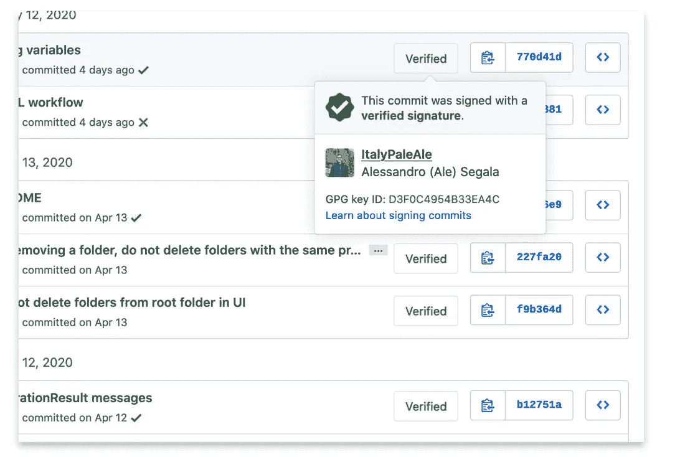
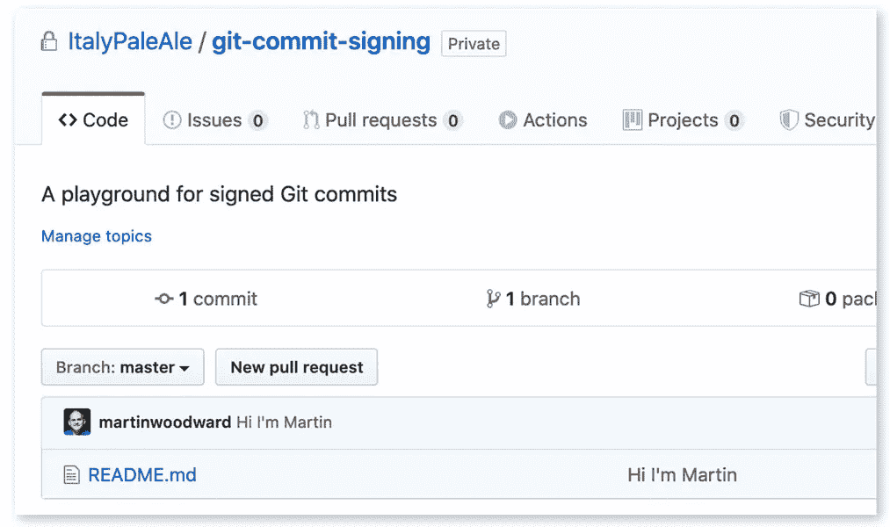
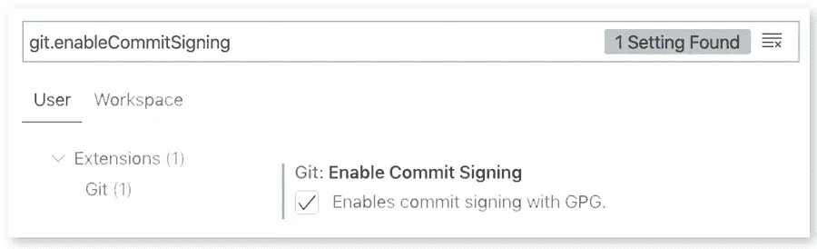

# 如何签署您的 Git 提交

> 原文：<https://betterprogramming.pub/how-to-sign-your-git-commits-1014edaf1e85>

## 以及为什么你应该这样做



即使你不知道签名 Git 提交，你也可能在 GitHub 上看到过上面的屏幕。

让我们暂时把其他的事情放在一边——在你的作品上有一个大的绿色“验证”徽章不是很令人满意吗？

提交*验证*，或者更准确地说，签署，并没有你想象的那么难。顾名思义，签名提交是使用 GPG 密钥加密签名的。

# 为什么签署 Git 提交？

在我们进入*如何*之前，让我们讨论一下*为什么*您应该签署您的 Git 提交。除了希望在你的 GitHub 作品上获得绿色“认证”徽章之外，还有一些具体的好处。

当您用 Git 提交一个更改时，它接受您想要的任何值作为作者。这意味着在创建提交时，您可以自称为任何人。

例如，这是我刚刚创建的一个回购。正如你所看到的，我尊敬的同事兼朋友 [@MartinWoodward](https://twitter.com/martinwoodward) 从 GitHub 马上承诺:



只有一个问题:马丁没有这样做；我做到了。

为了让 GitHub(和所有人)相信 Martin 编写了那个非常可怕的提交，我只需要运行`git config user.name`和`git config user.email`来匹配 Martin 的值。那些一点也不难得到。我只用了一分钟就克隆了他的一个回复，然后在里面运行了`git log`。

从 Git 的角度来看，这实际上是按照预期工作的。提交者的详细信息只是用来识别您的合作者中谁做了更改，而不是用来验证人员的身份。能够模拟其他提交者本身并不会引入漏洞。例如，仅仅通过将我的`user.name`设置为 Martin 的，我无法将代码推送到他的存储库。GitHub 会要求我用他的证书进行认证，然后我才能这么做。

然而，虽然这本身不是一个安全漏洞，但它可能会导致其他问题。当您看到未签名的提交时，您无法保证:

*   作者实际上是名字在提交上的人
*   您看到的代码更改实际上是作者写的(即，它没有被篡改)

相反，养成签署 Git 提交的习惯会让您有能力证明您是特定代码变更的作者。它还使您能够确保将来没有人能够修改您的提交(或其元数据，如您声称的提交时间)。

您正在处理的代码越敏感(例如，与安全性相关的东西，或者关键任务应用程序)，您就应该越注意。对软件供应链的攻击越来越普遍，其潜在后果也越来越危险。联邦调查局警告过我们。

下面是对软件供应链的两个假想攻击，带有未签名的提交。首先，想象一个心怀不满的员工可能故意想要在他们正在开发的应用程序中引入一个后门(在他们已经拥有写访问权限的回购上)，因此他们在提交代码时冒充他们的一个队友，以避免受到责备。

另一个例子是有人在一个开源项目中创建了一个恶意的拉请求。他们可以让它看起来像是其他人(例如，有很高声誉的人)共同撰写的，以使 PR 更有可能被接受(如果您维护开源库，您会知道全面彻底地审查每个 PR 是多么耗时)。

请注意，仅仅因为您签署了您的 Git 提交，并不能阻止其他人冒充您。大约一年来，我一直定期签署我的提交，但是你仍然可以修改代码，把我的名字放在上面。我没办法阻止你做那件事。然而，任何阅读您代码的人都不会看到我的数字签名(或“已验证”的徽章)，因此他们至少有能力质疑提交的真实性或完整性。另一方面，关注我的库的人可以看到我在去年创作了所有的提交。

对于您自己的项目，如果您的 Git 托管服务允许，您还可以要求一个策略，即所有提交都必须签名。在 GitHub 上，这是通过[保护分支](https://help.github.com/en/github/administering-a-repository/about-required-commit-signing)完成的。

# 加密签名和 GPG

如果您从未听说过加密签名或 GPG，这个简单明了的解释可能会对您有所帮助。

## 不对称密码术

你可能听说过有两种主要的加密算法:对称的和非对称的。对称加密是最容易理解的一种:首先使用一个密码对数据进行加密，然后使用相同的密码对消息进行解密，并再次以明文形式获得它。如果你想和其他人分享加密的数据，你也需要给他们密码。从概念上讲，AES 等算法就是这样工作的。

非对称加密使用两个独立的密钥:一个公钥和一个私钥。顾名思义，虽然必须不惜一切代价保护秘密密钥，但是公开密钥可以(并且必须)与世界共享。使用非对称加密技术，您使用公钥加密消息，然后使用私钥解密。如果您想要与您的朋友共享加密的信息，您可以使用您朋友的公钥来加密它。然后，您的朋友可以使用他们自己的私钥来解密和阅读您的消息。RSA 或各种椭圆曲线等算法就是这样工作的。尽管一般公众对非对称加密知之甚少，但它却被广泛使用，这也是 HTTPS 使用 TLS 的原因之一。

除了加密数据之外，非对称加密还可以用于签署消息(和验证签名)。这与此相反:您使用您的私钥签署消息，其他人可以使用您的公钥验证签名。

## 关于签名

当你签署一个消息时，你就添加了一个加密的强有力的证据，证明是你(或拥有你的私钥的人)写的，并且消息没有被篡改。

例如，假设您想要向您的朋友发送消息，说“您和我将在明天上午 11:30 见面”。您想要您的朋友 100%确定该消息来自您，并且您想要确保没有人能够更改其内容(例如，从上午 11:30 更改为下午 1 点)。您可以通过在消息中添加加密签名来做到这一点。

要做到这一点，原则上你必须做两件事:

1.  您计算您的消息的散列(或校验和)。你可以使用散列函数，比如 SHA-256。如您所知，哈希函数是单向操作，它从每条消息中生成一组唯一的字节，并且不可逆转。十六进制编码的 SHA-256 文摘“你我明天上午 11:30 见”是:`579c4547d8dec2c4513de8c858a490a8a2679db205a0b3471f81d5b129d29b88`。如果你仅仅改变了原始消息中的一个比特(例如，将时间改为上午 11:31)，最终的摘要将会完全不同([试试看](https://emn178.github.io/online-tools/sha256.html))。
2.  您使用自己的私钥对计算出的哈希进行签名，使用 RSA 之类的算法。

你现在可以将签名和明文信息一起发送，你的朋友会毫不怀疑是你写了那些精确的单词。

请注意，签名是添加到明文消息中的。仅仅对消息进行签名并不能加密它！因此，任何人仍然可以阅读您的原始邮件，并可以看到您签名。可以使用 RSA 对消息进行签名和加密，这就是所谓的*认证加密*，但这超出了本文的范围。

## GPG:GNU 隐私卫士

到目前为止，我希望您至少对非对称加密背后的思想有一个大致的了解。让我们看看如何使用它。

[OpenPGP](https://www.openpgp.org/) 标准包含算法、编码等方面的规范。基于加密技术的解决方案的实际应用。在 OpenPGP 标准的各种实现中，最广泛采用的可能是 GPG(也称为 GnuPG)。这是一个免费的开源(libre)应用程序，可以作为命令行工具在 Windows、macOS 和 Linux 上运行。无数的工具和应用程序依赖 GPG(或其使用的标准)以标准化、可互操作的方式处理加密。

GPG 做的(许多)事情之一是给你签署任意消息或文件的能力。这对于 Git 来说效果很好，我们马上就会看到如何实现。

GPG 是一个非常大的工具，具有许多不同的功能，就像许多与密码学相关的东西一样，它可以很快变得非常复杂。就我个人而言，由于各种原因，我已经与 GPG 打交道多年，我仍然对其运作方式有部分了解。然而，好消息是签署 Git 提交是一个相对简单的操作，在设置好 GPG 之后，您将能够忘记它。

除了作为命令行工具，GPG 还有一个分发公钥的标准。还记得我怎么写的，公钥不仅可以而且经常需要分发给全世界吗？公钥由 ID 标识，并映射到一个人的电子邮件地址，包括 GitHub 使用的电子邮件地址。

比如我的公钥 ID 是`[0x30a525d4](https://keyserver.ubuntu.com/pks/lookup?search=0x30a525d4&fingerprint=on&op=index)`，也映射到`[[email protected]](https://withblue.ink/cdn-cgi/l/email-protection)`。其中一个子密钥`0x4b33ea4c`用于签名，它也用于签名我的 Git 提交。

# 设置您的 Git 来签署提交

好了，我们终于准备好开始了。

## 安装 GPG

除了 Git，唯一的要求是你必须安装 GPG。我建议使用 2.2 版或更高版本:

*   在 Windows 上，你可以从 [GPG 网站](https://gnupg.org/download/)下载 Gpg4win 发行版。
*   在 macOS 上，最简单的就是用自制:`brew install gpg`。
*   大多数 Linux 发行版都预装了 GPG；如果没有，你可以在他们的官方资料库中找到。

注意:在一些 Linux 发行版中，应用程序被称为`gpg2`，所以您可能需要在下面的命令中用`gpg2`替换`gpg`。在这种情况下，您可能还需要运行`git config --global gpg.program $(which gpg2)`。

**仅适用于 macOS】**

在 macOS 上，您可能还想安装一个带有`brew install pinentry-mac`的图形 pin 输入应用程序，然后将这一行添加到`~/.gnupg/gpg-agent.conf`(如果文件不存在，创建它):

```
pinentry-program /usr/local/bin/pinentry-mac
```

**Linux 和 macOS 的附加配置**

在 Linux 和 macOS 上，您可以启用 GPG 代理，以避免每次都必须键入密钥的密码。为此，将这一行添加到`~/.gnupg/gpg.conf`(如果文件不存在，创建它):

```
# Enable gpg to use the gpg-agent
use-agent
```

您还需要将这两行添加到您的概要文件中(`~/.bashrc`、`~/.bash_profile`、`~/.zprofile`或任何合适的地方)，然后重新启动您的 shell(或运行`source ~/.bashrc`或类似的命令):

```
export GPG_TTY**=$(**tty**)**
gpgconf --launch gpg-agent
```

## 生成 GPG 密钥对

首先，生成一个新的 GPG 密钥对(公钥和私钥):

```
gpg --full-gen-key
```

使用以下内容配置密钥:

*   键的种类:为`(4) RSA (sign only)`键入`4`
*   密钥大小:`4096`
*   到期:选择一个合理的值，比如`2y`两年(可以续费)。

然后回答几个问题:

*   你的真名。如果你愿意，你可以在这里使用你的 GitHub 用户名。
*   电子邮件地址。如果您计划将这个密钥用于 Git 之外的地方，您可能需要输入您真实的电子邮件地址。如果只是为了 GitHub，可以使用 GitHub 为你生成的`@users.noreply.github.com`邮件。你可以在[邮件设置](https://github.com/settings/emails)页面找到。

您将被要求键入一个密码，该密码用于加密您在磁盘上的密钥。这很重要；否则，攻击者可能会窃取您的密钥，然后他们就可以伪装成您签署消息并提交。

您可以验证您的密钥是通过以下方式创建的:

```
$ gpg --list-secret-keys --keyid-format SHORT
/root/.gnupg/pubring.kbx
------------------------
sec   rsa4096/674CB45A 2020-05-16 **[**SC**]** **[**expires: 2022-05-16**]**
      65B8A7455C949E73FC3B7330C16132F5674CB45A
uid         **[**ultimate**]** ItalyPaleAle-demo <43508+ItalyPaleAle@users.noreply.github.com>
```

在上面的例子中，我的新密钥 ID 是`rsa4096/674CB45A`，或者仅仅是`674CB45A`。

您可以确认 GPG 正在工作，并且能够使用以下内容签署邮件:

```
echo "hello world" **|** gpg --clearsign
```

注意:如果您的 GPG 代理有问题，您可以使用以下命令重新启动它:

`gpgconf --kill gpg-agent && gpgconf --launch gpg-agent`

## 添加多个电子邮件

您可以通过编辑密钥来添加多个电子邮件地址:

```
# Replace 674CB45A with your key ID
gpg --edit-key 674CB45A
```

在 GPG 提示符下，键入:

```
gpgp> adduid
```

再次键入您想要添加的真实姓名和电子邮件地址。为了确认，将要求您键入密码来解密私钥。

然后，仍然在 GPG 提示符下，更新新身份的信任:

```
*# Use the number of the UID of the identity*
gnupg> uid **2**
gnupg> trust
*# Type "5" (for "I trust ultimately")*
```

最后，保存并退出:

```
gnupg> save
```

## 配置 Git 来签署您的提交

一旦您有了自己的私钥，您就可以配置 Git 用它来签署您的提交:

```
# Replace 674CB45A with your key ID
git config --global user.signingkey 674CB45A
```

现在，您可以用以下代码签署 Git 提交和标记:

*   创建提交时添加`-S`标志:`git commit -S`
*   用`git tag -s`而不是`git tag -a`创建一个标签

您还可以告诉 Git 自动签署您的所有提交:

```
git config --global commit.gpgSign true
git config --global tag.gpgSign true
```

## 将 GPG 密钥添加到 GitHub

为了让 GitHub 接受您的 GPG 密钥并显示您的提交为“已验证”，您首先需要确保您在提交代码更改时使用的电子邮件地址包含在 GPG 密钥中，并在 GitHub 上得到验证。

要设置 Git 在创建提交时使用的电子邮件地址，请使用:

```
git config --global user.email your@email.com
```

您可以使用您的`@users.noreply.github.com`电子邮件(从 GitHub 上的[电子邮件设置](https://github.com/settings/emails)页面)或任何其他添加到您的 GitHub 帐户并经过验证的电子邮件地址(在同一个设置页面)。

如果还没有，按照上面的说明，相同的电子邮件地址也必须添加到您的 GPG 键。

完成后，将您的 GPG 公钥上传到 GitHub，并将其与您的帐户相关联。在 [SSH 和 GPG 密钥设置](https://github.com/settings/keys)页面中，添加一个新的 GPG 密钥并粘贴您的公钥，您可以通过:

```
# Replace 674CB45A with your key ID
gpg --armor --export 674CB45A
```

您的公共 GPG 密钥以`-----BEGIN PGP PUBLIC KEY BLOCK-----`开始，以`-----END PGP PUBLIC KEY BLOCK-----`结束。

## 进行签名提交

配置完以上所有内容后，您的 Git 提交现在可以用您的 GPG 密钥签名了:

```
*# Add the -S flag if you did not configure Git to sign commits by default*
git commit -a -m "Making my first signed commit"
```

您可以检查提交是否由以下人员签名:

```
$ git log --show-signature -1
commit 8beed807e820d34cc7a35a0d69e9913bed7b1b03 **(**HEAD -> master**)**
gpg: Signature made Sun May **17** 01:44:55 **2020** UTC
gpg:                using RSA key 674CB45A
gpg: Good signature from "ItalyPaleAle-demo <43508+ItalyPaleAle@users.noreply.github.com>" **[**ultimate**]**
Author: ItalyPaleAle-demo <43508+ItalyPaleAle@users.noreply.github.com>
Date:   Sun May **17** 01:44:55 **2020** +0000

    Making my first signed commit
```

## 为签名提交配置 Visual Studio 代码

如果您使用的是 [VS 代码](https://code.visualstudio.com)，您可以将其配置为使用“Git: Enable commit signing”标志(`git.enableCommitSigning`)对 Git 提交进行签名。



## 使用硬件令牌

你的 GPG 密钥现在存储(加密)在你笔记本电脑的 GPG 钥匙圈里。虽然这应该为大多数用户提供了足够的保护，但仍然有可能将其导出并窃取。假设密钥是用密码加密的，那么您的密钥就和密码一样安全(明智地选择它！).

此外，文件中有一个私钥，这就留下了如何(安全地)备份它并可能在多个设备之间同步它的问题。关于栈交换信息安全的这个 Q & A 包含了各种想法，虽然有点过时。像 [Keybase](https://keybase.io/) 这样的服务可以帮助你在一个专门的云服务上存储你的秘密密钥。

然而，一个更安全的替代方案是使用硬件令牌，例如像 [YubiKey](https://www.yubico.com/) 这样的安全密钥。这也是我用的。在 YubiKey 支持的各种技术中，它可以将 GPG 密钥存储在一个安全的飞地中，无法从那里提取。

为 YubiKey 设置各种功能，包括存储一个 GPG 密钥(并使用它来签署 Git 提交或连接到 SSH 服务器)，需要一些时间。如果你刚刚得到一个 YubiKey，并且想知道如何最好地设置它，我强烈推荐 GitHub 上发布的@drduh 的这个指南。