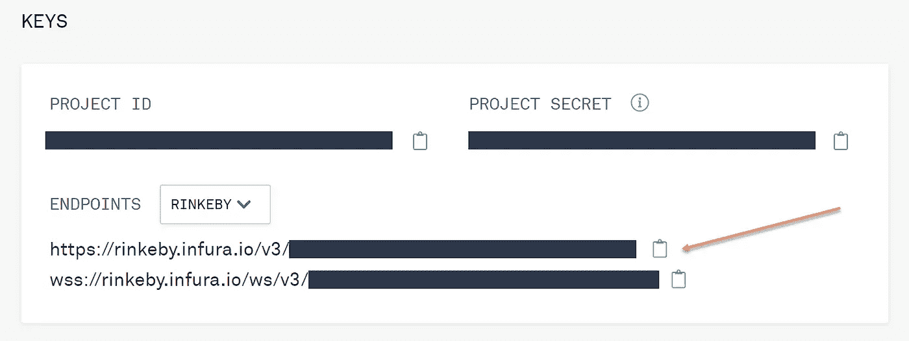
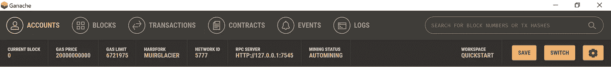
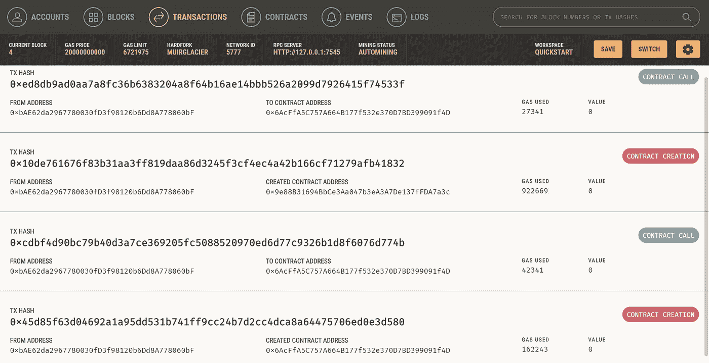
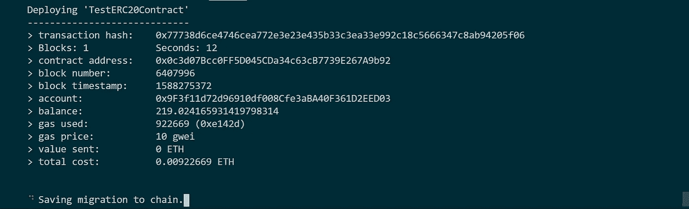
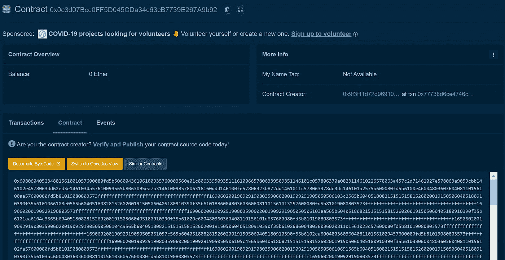
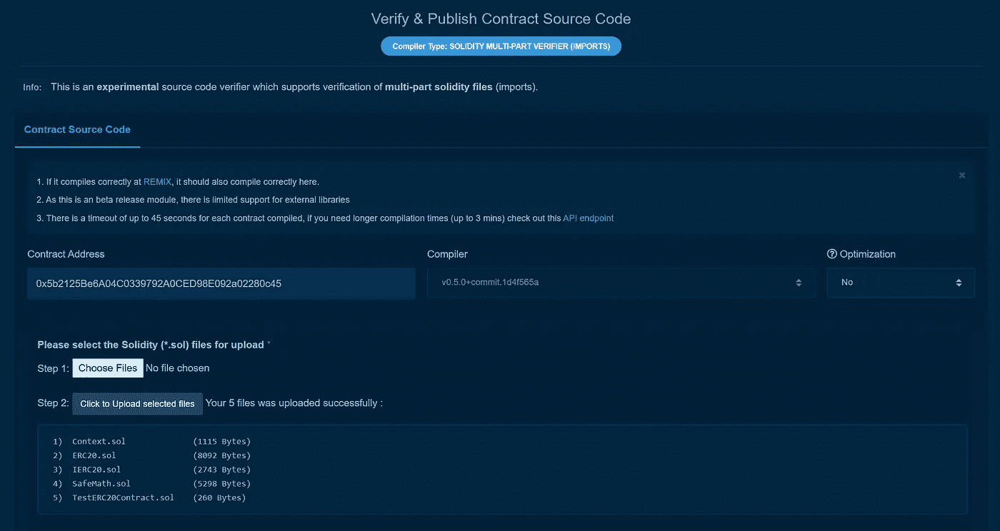
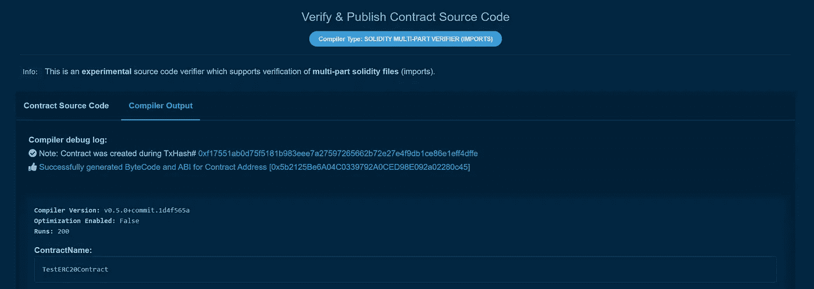
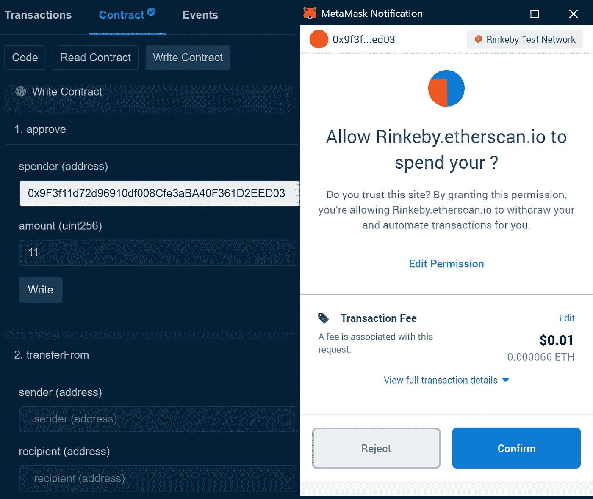

# 如何简单地在以太坊上部署智能合约(第 1 部分)

> 原文：<https://betterprogramming.pub/how-to-simply-deploy-a-smart-contract-on-ethereum-714c692e00c>

## 智能合约是以太坊概念的核心


照片由 [Clifford 摄影](https://unsplash.com/@cliffordgatewood?utm_source=unsplash&utm_medium=referral&utm_content=creditCopyText)在 [Unsplash](https://unsplash.com/s/photos/ethereum?utm_source=unsplash&utm_medium=referral&utm_content=creditCopyText)

以太坊区块链的核心是智能合约的概念。以太坊最初的动机实际上源于比特币的脚本限制，它为智能合约提供了有限的支持。

好吧——但这到底是什么意思？

嗯，比特币对智能合约的支持有限，因为它的脚本语言是非图灵完整的，部分原因是它没有循环。这意味着有很多应用可以被开发者在以太坊上编程，但在比特币上却不行。从技术上讲，以太坊从一开始就被设计成“[一个部署和执行智能合约的平台](https://epicenter.tv/episodes/259/)

# 图灵完全性

图灵完备是什么意思？

以太坊的图灵完整语言最初是基于艾伦·图灵的通用图灵机(UTM)的概念。

简单来说，图灵机是数学家艾伦·图灵在 1936 年发明的一种假设机器。尽管它很简单，但它可以模拟任何计算机算法，不管有多复杂。

UTM 只不过是一个图灵机，在任意输入上模拟任意图灵机。然而，由于以太坊实现了气体限制的概念，开发者不能运行需要比气体限制更多气体的程序。这就是为什么[以太坊黄皮书](https://ethereum.github.io/yellowpaper/paper.pdf)称以太坊虚拟机 EVM 为“准图灵-完全机”。

尽管有许多相似之处，以太坊并不是真正的图灵完备的，因为没有 gas，开发者无法编写任何他们想要的程序。

好的，但是我们仍然需要理解什么是智能合同！

# 智能合同

让我们快速看一下智能合同的定义:

*   智能合同是一种自动执行的合同。这意味着买方和卖方之间的协议条款直接写入代码。
*   该准则及其包含的协议存在于一个分散的区块链网络中。
*   代码控制执行，事务是可跟踪和不可逆的。

你是否从理论的角度来把握一切？太好了，现在我们动手吧。

*注:如果你想更深入地研究以太坊和智能合约的历史，我推荐这篇* [*博文*](https://medium.com/certik/how-ethereum-works-the-history-of-ethereum-abcc0b770315) *。*

# 智能合同教程

本教程的目的是向您展示在以太坊上部署智能合约的一种最简单的方法。这样做时，我将遵循智能契约开发领域中常见的结构。首先，我们在个人区块链上本地部署智能合约(我将使用 [Ganache](https://www.trufflesuite.com/ganache) )。接下来，我们在一个指定的测试网络上部署智能合约(我将使用 [Rinkeby](https://rinkeby.etherscan.io/) 测试网络)。最后，我们在[主网络](https://etherscan.io/)上部署智能合约。

对于开发框架，我使用的是 [Truffle](https://www.trufflesuite.com/) 。Truffle 是以太坊的开发环境、测试框架和资产管道，旨在让以太坊开发者的生活更轻松。

你准备好了吗？我们开始吧！

# 1.准备工作:安装必要的工具

我们需要一些基本的工具来开始。我们下载 [Node.js](https://nodejs.org/en/) ，8.9.4 版本，或以上。我假设我们使用的是 Windows、Linux 或 Mac OS X。准备好之后，我们打开 shell 并运行以下命令:

```
npm i -g truffle
```

Truffle 要求我们运行一个支持标准 JSON RPC API(几乎是全部)的以太坊客户端。我们将使用 Ganache，它是 Truffle suite 的一部分，是一个运行在桌面上的以太坊开发的个人区块链。你可以在这里下载[。](https://www.trufflesuite.com/ganache)

由于我们不想安装一个完整的节点，最终我们将使用 [Infura](https://infura.io/) 作为托管以太坊节点集群。这样做允许用户运行和部署他们的应用程序，而不必设置他们自己的以太坊节点。

在 Infura 上创建一个简单的免费帐户，并创建一个新项目。将项目设置中的端点更改为 Rinkeby，并将 Rinkeby 端点的 URL 复制并保存到您选择的位置。



现在，我们准备部署智能合同。当然，我们得先写一个…

# 2.利用 OpenZeppelin 库起草一份智能合同

我们为松露项目创建了一个新目录:

```
mkdir TestERC20Contractcd TestERC20Contracttruffle init
```

出于本教程的考虑，我们将只使用 [OpenZeppelin 库](https://openzeppelin.com/contracts)进行智能契约开发。我们可以通过运行以下命令来安装 OpenZeppelin:

```
npm init -ynpm i openzeppelin-solidity@2.5
```

*注意:由于块菌兼容性问题，我们使用特定的 OpenZeppelin 版本。*

在我们的 Truffle 项目的`contracts/`目录中，创建文件`TestERC20Contract.sol`并添加以下内容:

```
pragma solidity ^0.5.0;**import** "../node_modules/openzeppelin-solidity/contracts/token/ERC20/ERC20.sol";contract TestERC20Contract is ERC20 {uint256 **public** initialSupply = 1000;constructor() **public** {
  _mint(msg.sender, initialSupply);
}}
```

# 3.在 Ganache(你的个人区块链)上部署智能合约

现在，让我们将上面设计的智能契约部署到本地运行的区块链 Ganache。打开 Ganache，选择一个以太坊快速入门项目。RPC 服务器参数和网络 ID 可以在项目的标题中看到:



在`truffle-config.js`文件中调整这些参数。我们还将编译器版本配置为使用 0.5.0 版，因为契约是在这个特定的 Solidity 版本中编写的。

```
host: "127.0.0.1", // Localhost (default: none)
port: 7545, // Standard Ethereum port (default: none)
network_id: "5777", // Any network (default: none)compilers: {
 solc: {
  version: "0.5.0", // Fetch exact version from solc-bin (default:       truffle’s version)
 }
}
```

在`migrations/`目录下，创建`2_deploy_contracts.js`文件，添加以下内容:

```
**var** TestERC20Contract = artifacts.require("../contracts/TestERC20Contract.sol");module.exports = **function**(deployer) {
 deployer.deploy(TestERC20Contract);
};
```

现在，我们已经准备好编译和部署我们的合同到区块链。首先，在项目内部，我们运行以下命令来编译合同:

```
truffle compile
```

编译完成后，我们将合同部署到区块链:

```
truffle migrate
```

我们现在回到加纳切区块链，点击“交易”。恭喜，我们已经在本地部署了我们的第一个智能合同。



这绝不是故事的结尾。我们的下一个目标是部署公共测试网络 [Rinkeby](https://rinkeby.etherscan.io/) 。

# 4.在公共测试网络(如 Rinkeby)上部署智能合约

首先，我们需要安装软件包`@truffle/hdwallet-provider`:

```
npm i @truffle/hdwallet-provider
```

然后我们编辑`truffle-config.js`文件来设置`hdwallet-provider`和到 Rinkeby 网络的连接。我们提供了对助记符的引用，该助记符在[元掩码](https://metamask.io/)上生成一个帐户，并包含 Rinkeby 的 Infura 端点的 URL(见上文)。最终，我们确保我们的帐户拥有足够的 Rinkeby Ether 来进行部署。为此，我们可以使用[乙醚龙头](https://faucet.rinkeby.io/)。

```
**var** HDWalletProvider = require("@truffle/hdwallet-provider");
**var** mnemonic = "orange apple banana … ";
module.exports = {
 networks: {
  development: {
   host: "127.0.0.1",
   port: 8545,
   network_id: "*"
  },
  rinkeby: {
   provider: **function**() {
    **return** **new** HDWalletProvider(mnemonic,    "https://rinkeby.infura.io/v3/<INFURA_Access_Token>");
   },
   network_id: 4,
   gas: 4500000,
   gasPrice: 10000000000,
  }
 }
};
```

我们也像这样改变`2_deploy_contracts.js`文件:

```
**var** TestERC20Contract = artifacts.require("../contracts/TestERC20Contract.sol");module.exports = **function**(deployer, network, accounts) {
 deployer.deploy(TestERC20Contract, {from: accounts[0]});
};
```

如果尚未编译，运行`truffle compile`进行编译。最后，我们将其部署到 Rinkeby 测试网络:

```
truffle migrate --network rinkeby
```



现在我们开始专业了！我们现在可以使用合同地址在 [Etherscan](https://rinkeby.etherscan.io/) 上查看我们的智能合同。但是等等——当我们点击“合同”标签时，我们看到的是一大堆字母和数字。



为了实现智能合同交互，我们需要确保我们确实是合同的创建者。如果我们成功了，那堆字母和数字将会消失，我们可以调用智能合同功能。

# 5.验证智能合同代码

点击“验证并发布”,只需按照说明操作即可:



再次祝贺您，我们现在已经验证了我们的第一个智能合同！

# 6.通过简单的以太网扫描用户界面与智能合同进行交互

再次单击“Contract”选项卡，切换到“Write Contract”，您会发现与部署的智能合同交互变得很容易。我们所要做的就是连接到我们的元掩码帐户，然后我们就可以开始批准或转移令牌等等。我们已经走了很长的路了！

最后一步是在以太坊主网络上部署完全相同的智能合约。



# 7.在以太坊主网络上部署智能合约

对于最终部署，我们需要在我们的元掩码帐户上获得真正的以太网。此外，我们将`truffle-config.js`文件中的`network_id`更改为`1`,并通过引用主网络来调整 Infura URL。

就是这样！我们准备再次部署。我们现在是聪明的合同专家！

*警告:如果你向任何一个由 Ganache 默认助记符生成的账户发送乙醚，你将失去全部！*

显然，我没有深入研究许多在实践中至关重要的规范(例如单元测试)。然而，我希望我已经触发了你的好奇心，并促使你学习更多关于智能合约及其应用的知识。回头见！