# 如何在 Xcode 和模拟器中模拟位置

> 原文：<https://betterprogramming.pub/how-to-simulate-location-in-xcode-and-simulator-94ce701f5e1f>

## 静态和动态位置模拟


图片由 [Unsplash](https://unsplash.com?utm_source=medium&utm_medium=referral) 上的 [Taras Shypka](https://unsplash.com/es/@bugsster?utm_source=medium&utm_medium=referral) 拍摄

当在一个需要它指向特定位置或模拟自定义位置移动的应用程序上工作时，每次都要在模拟器或 iOS 设备上手动设置，这很繁琐。我们有一些快速排序的方法，这样你和你的团队就可以在排序后指向多个位置。

# **1。静态位置模拟**

当我们想要指向一个定制的静态位置时，我们有两个选择:

*   默认静态位置
*   自定义静态位置

## 默认静态位置

Xcode 附带了一些默认城市来帮助模拟位置。有两种方法可以做到:

㈠通过编辑方案

点击“产品”菜单和“选项”选项卡下的“运行”菜单，导航至编辑方案，如以下屏幕截图所示:

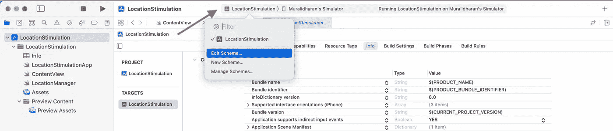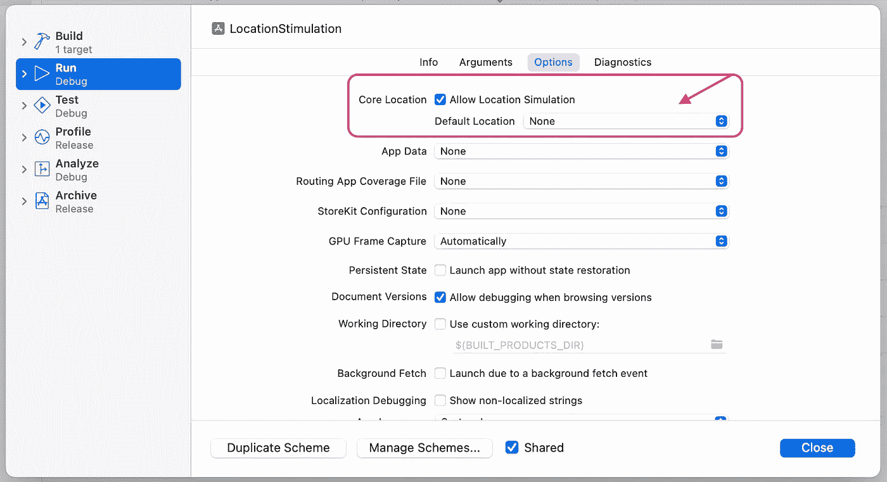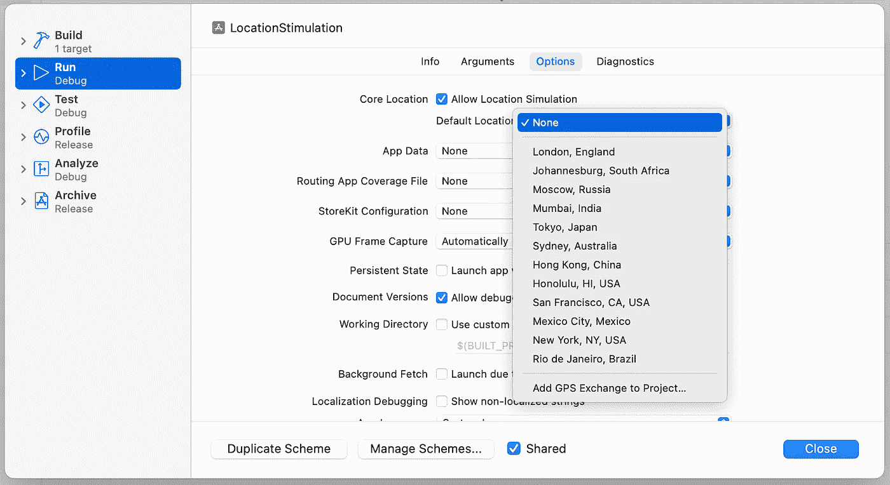

确保选择了允许位置模拟，您可以从给定的选项中选择一个位置，以模拟模拟器/设备在应用程序启动时指向该位置。

(ii)从菜单栏中

轻按 Xcode 菜单栏中的“调试”,然后点按“模拟位置”。将会看到相同的默认位置选项，如下图所示:

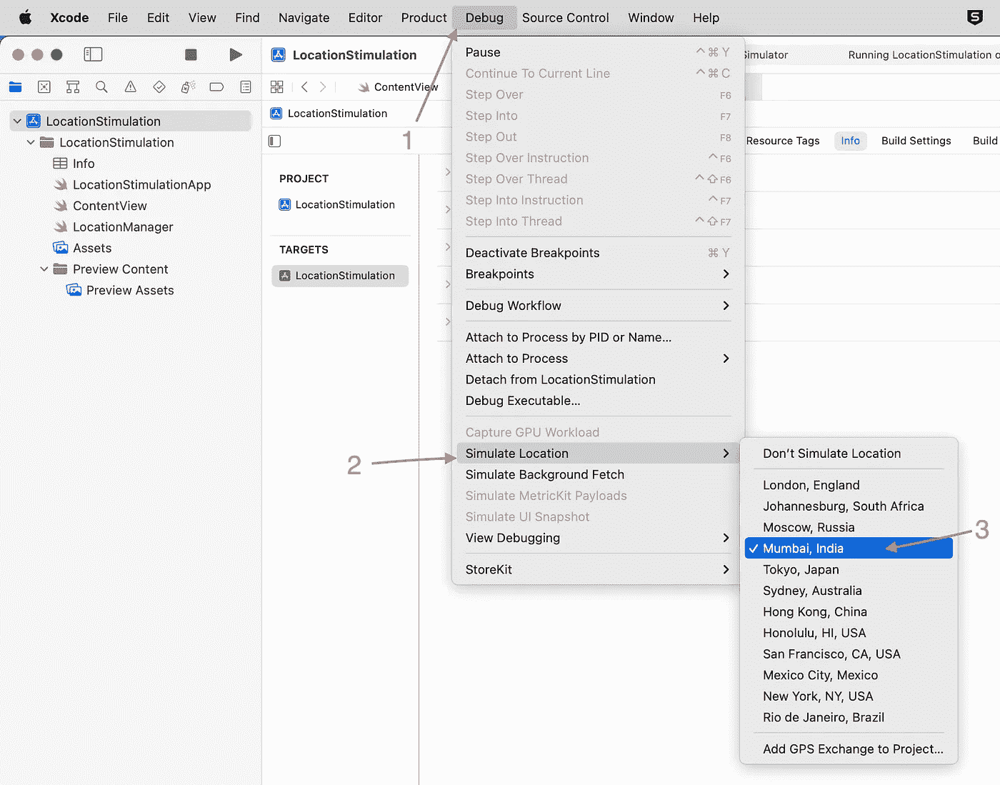

(iii)从底部调试栏

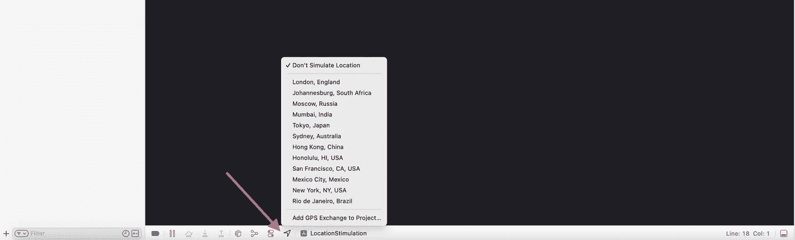

当应用程序启用了位置权限时，将启用此选项

## 自定义静态位置

如果我们需要将我们的应用指向一个特定的位置，例如，指向我的家乡， [Tiruchirappalli](https://goo.gl/maps/TqinzARhuNBWhjGH6) (默认列表中没有)，我们需要坐标。

> 在谷歌地图上点击右键，可以轻松获取任何地点的坐标。

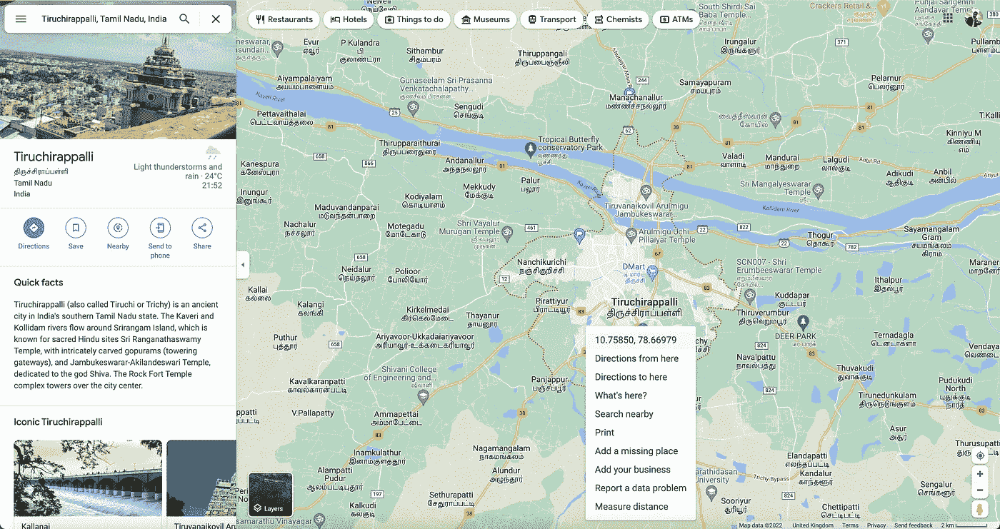

一旦我们得到它们，进入模拟器菜单，点击功能→自定义位置，并输入坐标。应用程序现在不会开始指向自定义位置。

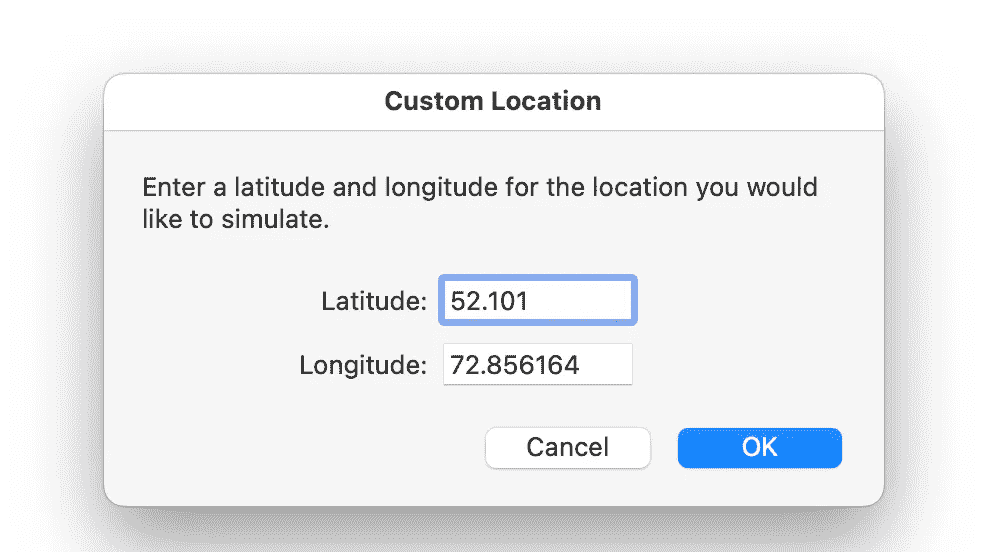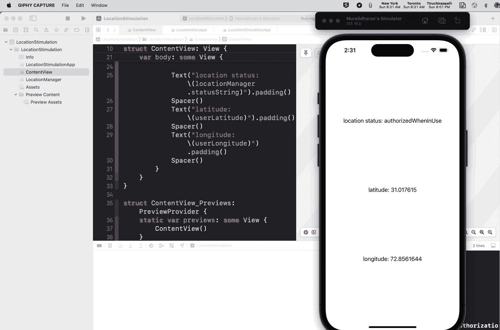

## **使用 GPX 文件自定义静态位置**

为了模拟一个位置，我们可以使用一个 GPX 文件。

> GPX，或称 GPS 交换格式，是一种为软件应用程序设计的通用 [GPS](https://en.wikipedia.org/wiki/GPS) 数据格式的 [XML 模式](https://en.wikipedia.org/wiki/XML_schema)。它可以用来描述[路点](https://en.wikipedia.org/wiki/Waypoint)、[轨迹](https://en.wikipedia.org/wiki/GPS_tracking)和路线。

## **如何创建 GPX 文件？**

(i) Xcode 文件菜单→新建→文件(Ctrl+N)，导航到资源列，可以找到 GPX 文件选项，点击下一步，定义一个名称，就大功告成了

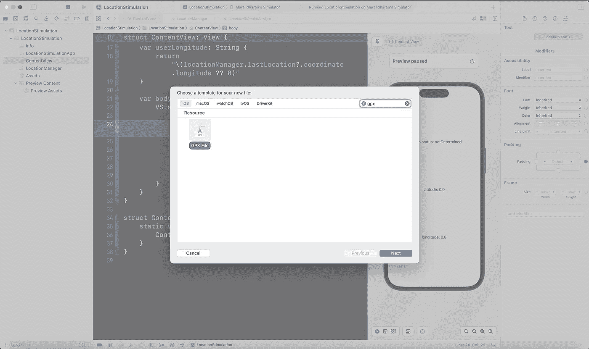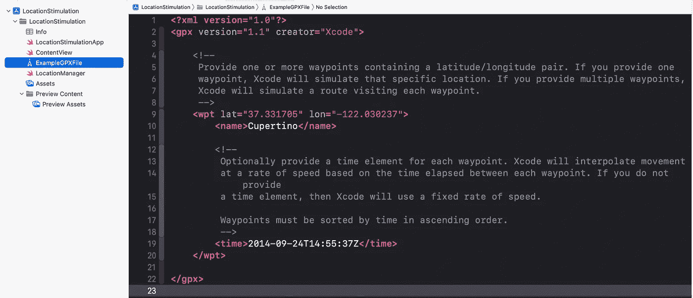

默认的 GPX 文件是苹果园区的位置。

> **注意**:创建一个 GPX 文件，其中只有一个航路点(`<wpt>`)和一个你想要模拟的坐标

完成后，在编辑方案位置选项下选择它，如下所示:

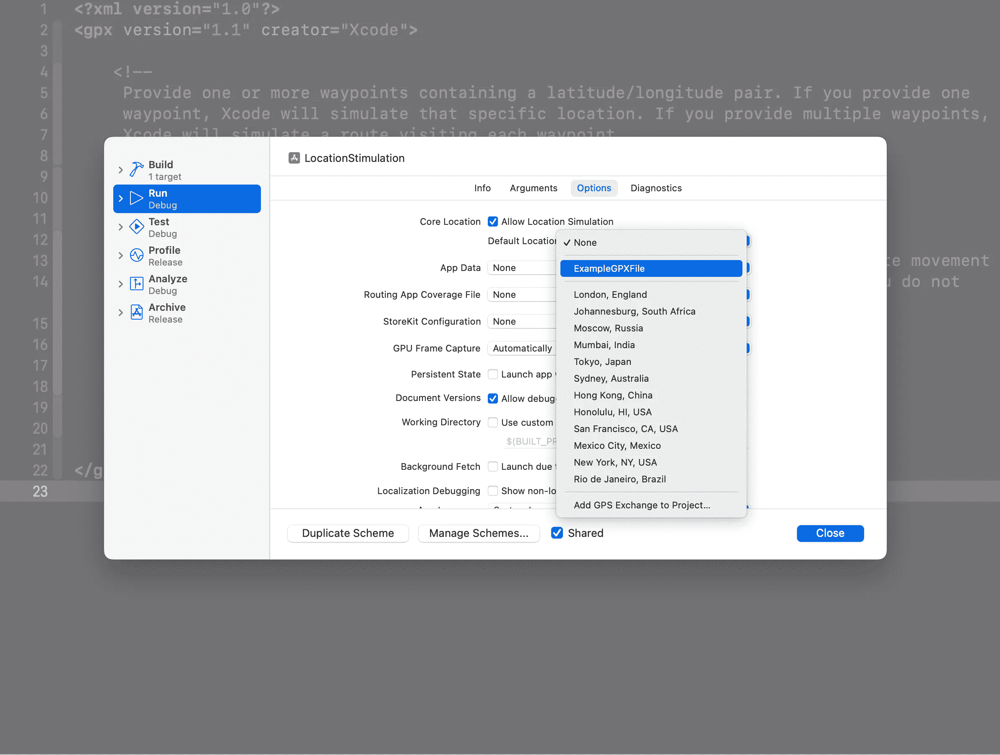

> **注意**:这里默认情况下，Xcode 会创建一个带有名称和时间的航点，但这些不是强制属性。

我们可以将任意数量的位置点(坐标)保存为 GPX 文件，并在 Xcode 中使用它们。

# **2。动态(多)位置模拟**

如果我们的应用程序需要模拟一个位置移动，就像健身应用程序或应用程序中的位置跟踪功能所需要的那样，那么仅仅一个自定义坐标是不够的。在这些情况下，我们可能需要在一个 GPX 文件中使用多个`<wpt>`标签！

这里需要时间(`<time>`)标签来模拟真实的运动，Xcode 会根据每个航点之间经过的时间，以一定的速度插入运动。如果不提供时间元素，Xcode 将使用固定的速率。

从一点到下一点的时间由`<time>`元素之间的差异决定。

> 从 P0 到 P1 花费的时间= (P1 时间)——(P0 时间)

在上面的例子中，点 1 的时间是`2022–12–04T17:28:09Z`，点 2 的时间是`2022–12–04T17:30:15Z`。相差两秒钟。Xcode 会用两秒的时间从点 1 转到点 2。在此期间，位置将会改变，这意味着如果您实现了

```
func locationManager(_ manager: CLLocationManager, 
                     didUpdateLocations locations: [CLLocation])
```

您将在 Xcode 从点 1 模拟到点 2 的两秒钟之间收到更新。

> **注意**:航路点必须按时间升序排列。

## **GPX 跟踪器**

有许多工具可以利用我们的专用输入生成 GPX 文件，其中之一是我使用的 [GPXTracker](https://apps.apple.com/us/app/open-gpx-tracker/id984503772) 一个 [opensource](https://github.com/merlos/iOS-Open-GPX-Tracker) 工具:

安装应用程序并打开它。只需长按您想要的位置点，如下所示:

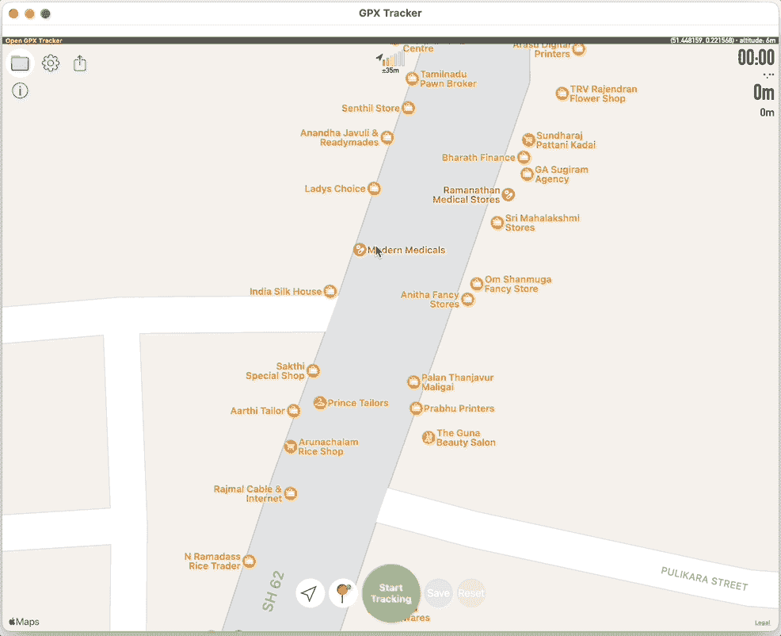

一旦你放置好点，你可以点击底部的保存按钮，将保存的点拖放到 Xcode 中。

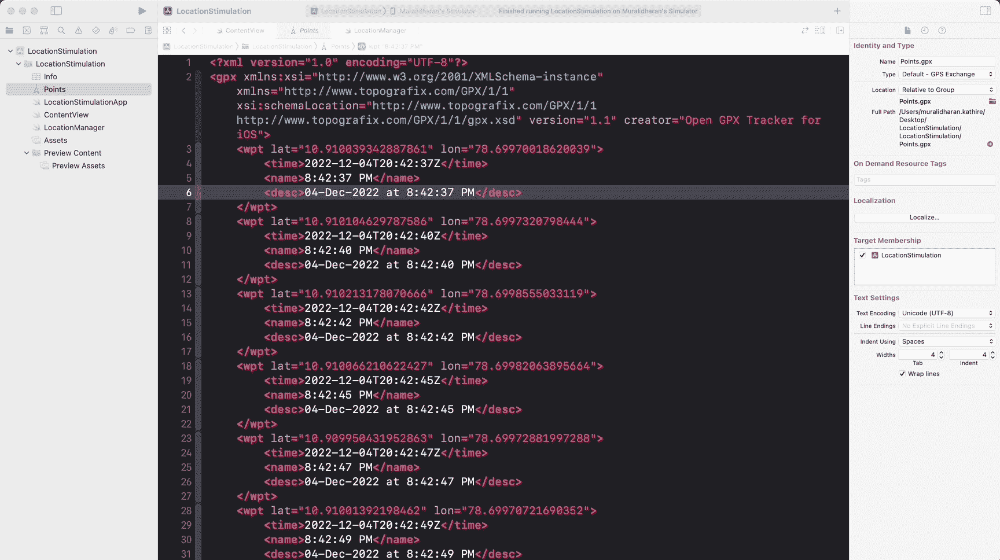

Xcode 还附带了一些默认的动态位置模拟(预定义的时刻)，如果它们适合您要调试的应用程序用例，您可以使用它们:

1.  城市运行
2.  城市自行车骑行
3.  高速公路车道

这三个选项将模拟跑步、骑行和驾驶的运动，根据速度而变化。这对于快速调试非常有用。


这适用于快速测试，因为您无法控制移动路线。为了更好地控制，你必须用 GPX 文件在 Xcode 中模拟运动。

## 位置模拟的缺点

这些模拟通常用于测试/实现目的，因为它们对实际移动速度和准确性没有帮助。

我感谢我的同事 Daniel 向我介绍了 GPX 追踪器和位置模拟技术。