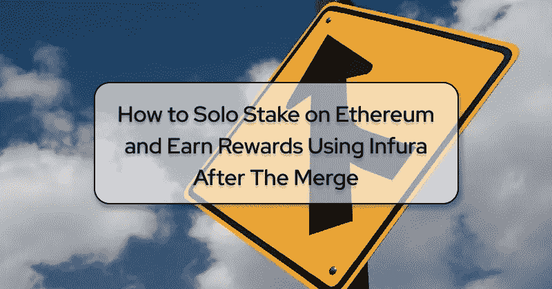

# 合并后如何使用 Infura 在以太坊玩单人游戏并获得奖励

> 原文：<https://betterprogramming.pub/how-to-solo-stake-on-ethereum-and-earn-rewards-using-infura-after-the-merge-aa2ebd6bdcc6>

## 合并前需要注意的事情，以及如何保持更新

作者图片

# 介绍

以太坊向股权证明的过渡(被称为“合并”)无疑是区块链网络自 2015 年成立以来最重大、最令人期待的改进。自从以太坊上线以来，合并就一直在进行中，它将发生在总终端难度(TTD) 5875000000000000000，或者 9 月 13 日[到 15 日](https://twitter.com/VitalikButerin/status/1566993505326710785)之间的某个时间。

以太坊社区，无论他们是开发者、利益相关者还是最终用户，显然都有许多与为合并做准备相关的问题，这取决于他们如何在网络之上交互或构建。

区块链最大的变化之一是用利害关系证明验证器取代了工作证明挖掘器。有希望的是，由于这一点，最受欢迎的变化之一是单人赌注的兴起，这加强了以太坊的健壮性、安全性和去中心化。

在这篇文章中，我们将探讨什么是单独下注，如果你已经是合并后的单独下注者，你需要知道什么，以及如何在合并前做好准备。

# 利害关系证明入门

工作证明是区块链像比特币一样使用的一种共识机制，用于在网络上达成一致。在这个协议中，矿工们互相竞争解决密码难题，并获得创建一个区块的权利以换取奖励。这需要大量能源，并导致矿商在电力上花费巨额资金，以获得确保网络安全所需的资本和诚实行事的激励。

另一方面，使用利害关系证明共识协议的区块链网络用验证者代替了挖掘者，验证者向网络(在以太坊的情况下是 32 ETH)存入一定数量的钱，以换取挖掘新块和验证现有块的能力。每当需要创建新块时，网络随机选择一个验证器，其他验证器验证所创建的块是合法的。如果一个验证者是诚实的，并且如所期望的那样运行，它将获得奖励。然而，如果一个验证器不诚实地行动或者拒绝执行期望的功能，它将失去部分或者全部它已经下注的令牌。

通过用桩加密货币取代电力作为保护协议和保持参与者诚实的主要方法，桩证可以将网络能耗[降低 99%以上](https://consensys.net/merge/)。它还通过允许没有昂贵硬件和采矿场的人参与维护网络并获得奖励，使参与变得更加民主。

# 什么是单人赌注？

Solo staking 是通过运行以太坊节点直接参与网络共识(作为个人)的过程，并通过存放恰好 32 个以太激活验证器。

你为什么要单干？通过保持其验证器的功能和在线状态，单个赌注者可以直接从协议中获得奖励——最高可达赌注 ETH 年百分比收益率(APY)的 15%。他们在一个完全不可信的环境中操作，完全控制他们的密钥、软件客户端和硬件。由于单独标桩在技术上是由个人完成的，它被认为是一种有吸引力的标桩形式，因为它增加了整个网络的分散性和安全性，同时是自治的。

除了单独下注之外，你还可以参加一个赌注池服务，比如[火箭池](https://rocketpool.net/)或[利多](https://lido.fi/)。但是，使用这种方法，您无法完全控制节点的网络活动。如果验证器没有正常运行，你就有失去你的赌注的风险。此外，获得的任何奖励都只是你作为单人赌注者所能获得的一小部分。有了 Rocket Pool，你可以运行他们的一个节点，但是你必须使用他们的软件，还是那句话，回报不会像运行自己的节点那么高。

# 如何使用 Infura 单独下注

要单独下注，你需要以下物品:

1.  至少 32 ETH
    要运行一个验证器，你必须将 32 ETH 存入一个指定的契约。照现在的情况，你不能拿掉你的赌注。这只有在上海升级后才有可能，可能是合并后的 6 到 12 个月。所以，做好心理准备，把自己的 ETH 锁起来一段时间。
2.  专用硬件
    虽然从您的主计算机上运行验证程序是可能的，但是强烈建议您为此目的分配一台专用机器。硬件应该至少有 4–8gb RAM，至少 1 TB SSD，并且访问互联网的速度要快于 10 Mbps。请参考以太坊的[运行节点](https://ethereum.org/en/run-a-node/)页面，了解更多详情以及 ConsenSys 的其他[硬件建议](https://consensys.net/blog/news/the-latest-release-of-besu-helps-test-the-merge-on-any-platform/)。
3.  软件客户端
    您需要两个软件来让您的 Infura 节点在合并后充当验证器:

*   执行层客户端—(以前的 Eth1 客户端)负责事务捆绑、执行和链状态管理。例子包括 Geth (Go 以太坊)、Nethermind、Erigon 和 Hyperledger Besu。
*   共识层客户端—负责 PoS 共识、封锁有效性和分叉选择规则。例子包括 Prysm、Lighthouse、Nimbus、Lodestar 和库特。

这里有一个 [Infura 研讨会](https://www.crowdcast.io/e/the-merge-weekly/4)概述了设置两者的步骤。安装可能需要对计算机和命令行有一定程度的熟悉。如果未能在合并前安装这些客户端，将会导致您的节点在合并后被视为“离线”,直到两个层都被同步和验证。

您需要维护您的硬件，并确保它保持在线并连接到网络。您还必须确保您的软件客户端定期升级和更新。此外，如前所述，如果您的验证器节点运行不正常，您可能会丢失部分或全部 32 个标记的 ETH。

幸运的是，以太坊基金会已经发布了一个[发射台](https://launchpad.ethereum.org/en/overview)，它将带你详细了解设置和运行验证器节点的所有步骤，以及 [ConsenSys](https://consensys.net/blog/developers/my-journey-to-being-a-validator-on-ethereum-2-0-part-5/) 。这包括强调风险、选择硬件和软件客户端、生成和保护密钥，以及成为以太坊 PoS 网络上成熟的独立验证者。

同样值得注意的是，每个验证节点只有 32 个 ETH 会被计入奖励。任何超过 32 ETH 的都不算，除非你旋转另一个节点。

# 单人赌注的注意事项

如上所述，solo staker 需要采取的最重要的步骤之一是安装和配置软件客户端。

以太坊基金会在其关于准备合并的网页上声明，一个赌注确认者(单独赌注者的另一个术语)将需要:

1.  运行共识层客户端和执行层客户端。
2.  使用共享的 JSON Web 令牌(JWT)秘密对执行层和共识层客户端进行身份验证，以便它们可以安全地进行通信。
    不完成上面的前两项将导致您的节点在合并后被视为“离线”,直到两个层都被同步和验证。
3.  设置费用接收地址，以接收您赚取的交易费小费/MEV。不设置费用接受者仍将允许你的验证器照常运行，但是你将错过未支付的费用提示和任何 MEV，否则你将在你的验证器建议的块中获得。

理想情况下，您应该选择其基本代码开源、经过审计和实战测试的客户端。Infura 分别以 [Hyperledger Besu](https://www.hyperledger.org/use/besu) 和 ConsenSys [库特](https://docs.teku.consensys.net/en/latest/)的形式提供同类最佳的执行层和共识层客户端。这些客户端是与更广泛的开源社区合作开发的，确保您的验证器节点在合并期间不会离线。

为了优化你的节点所能提供的价值，了解一下[最大可提取价值](https://ethereum.org/en/developers/docs/mev) (MEV)。Flashbots 开发的名为 [mev-boost](https://github.com/flashbots/mev-boost#installing) 的软件可以通过允许验证者购买交易订单已经优化的区块，来帮助最大化每个提议区块的价值。由于该软件与所有以太坊共识客户端兼容，mev-boost 有助于普及对 mev 的访问，同时确保最有利可图的块。

为了鼓励采用并教育利益相关者使用它，Infura 最近还举办了一系列每周[合并研讨会](https://www.crowdcast.io/e/the-merge-weekly/register?session=4)，由 Michael Wuehler(一位独立利益相关者，Infura 的联合创始人)主讲。最后，Infura 还发布了一系列文章，强调了一个单人赌注者成为以太坊验证者的经历。您可以在这里查看这些文章:

1.  [为合并做准备需要知道的事情:Infura 开发者版](https://blog.infura.io/post/what-you-need-to-know-to-get-ready-for-the-ethereum-merge-infura-developers-edition)
2.  [我成为以太坊 2.0 验证者的旅程，第 5 部分](https://consensys.net/blog/developers/my-journey-to-being-a-validator-on-ethereum-2-0-part-5/)
3.  [如何监控您的 Eth2 验证器并分析您的 P & L](https://consensys.net/blog/developers/how-to-monitor-your-eth2-validator-and-analyze-your-pl/)
4.  [如何安全地迁移您的以太坊 2.0 验证器客户端](https://consensys.net/blog/blockchain-explained/how-to-safely-migrate-your-ethereum-2-0-validator-client/)

# 为合并做准备

合并已经进行了这么长时间的原因之一是为了确保所有相关方的过渡尽可能无缝。这里有几件事，你可以做好充分准备。

1.  全面了解什么是合并，为什么要进行合并，以及为什么它很重要(不仅仅是对以太坊，而是对整个区块链生态系统)。Consensys 合并中心是一个很好的起点。
2.  试着尽可能地活跃在以太坊的生态系统中。我们建议您做以下事情:
    参加社区活动或加入社区，例如[ETH taker](https://ethstaker.cc/)
    阅读[官方合并文档](https://ethereum.org/en/upgrades/merge/)
    参与测试和验证活动
    获取更多 ETH，如果需要的话
    关注新闻— Ben Edgington 的[ETH 2 中的新内容](https://hackmd.io/@benjaminion/eth2_news)是一个极好的来源
    积累合并资源
    保持耐心
3.  了解您需要单独参与的组件，包括身份验证引擎 API、共识客户机和执行客户机。[合并准备清单](https://launchpad.ethereum.org/en/merge-readiness/)和[官方以太坊单人游戏文档](https://ethereum.org/en/staking/solo/)是很好的起点。
4.  请注意，您存款参与的 ETH 将在不久的将来被锁定。在计划的上海升级之前，您将无法提取资金，因此请确保相应地预算您的财务。
5.  警惕可能以分叉以太坊能量链形式出现的骗局。在你想通过抛售战俘硬币来快速赚钱之前，看看这篇强调潜在风险的 Reddit 帖子。
6.  一旦你觉得你终于准备好赌你的以太网了，按照[以太坊的发射台](https://launchpad.ethereum.org/en/)上的指示，成为 PoS 网络上的活跃验证者。

# 结论

单人赌注是合并后最令人兴奋的活动之一。允许个人直接参与网络共识并获得奖励，对实现以太坊近乎完美的安全性和去中心化的目标大有帮助。

以太坊基金会和 Infura 已经做出了重要的努力，使单人赌注的过程尽可能的无缝和民主。然而，这并不意味着你不需要采取上述步骤来做好准备。

我们希望你和我们一样对区块链和互联网的未来感到兴奋！