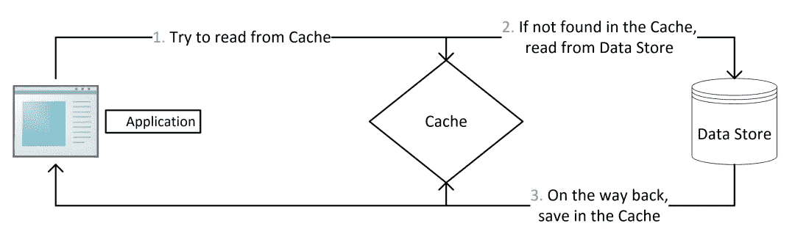
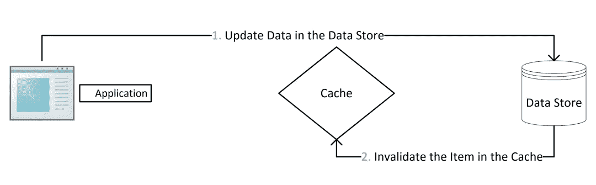
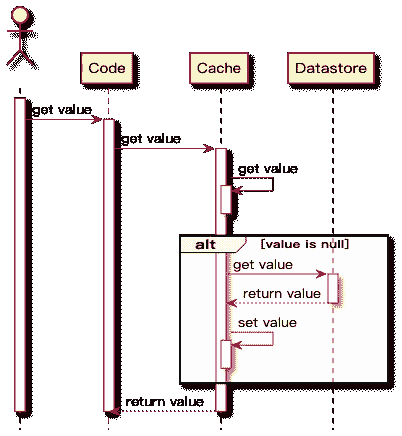
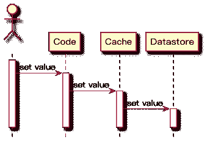
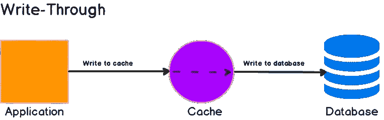
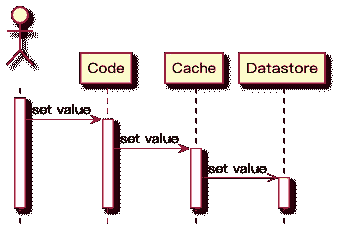
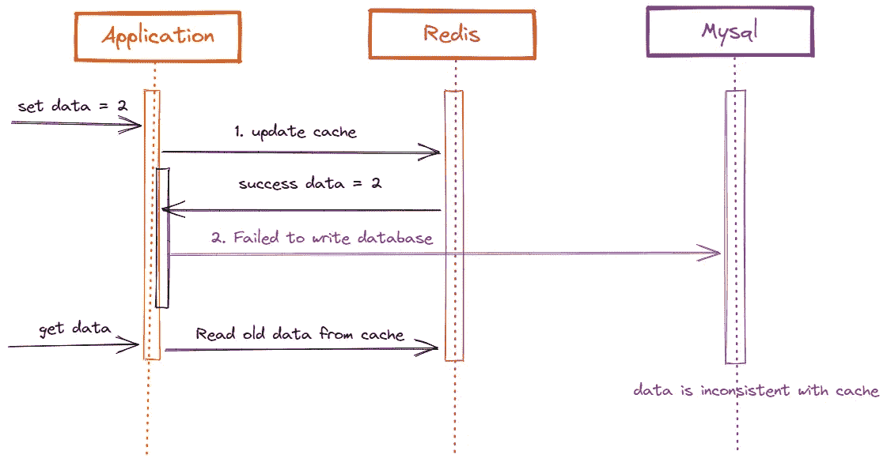
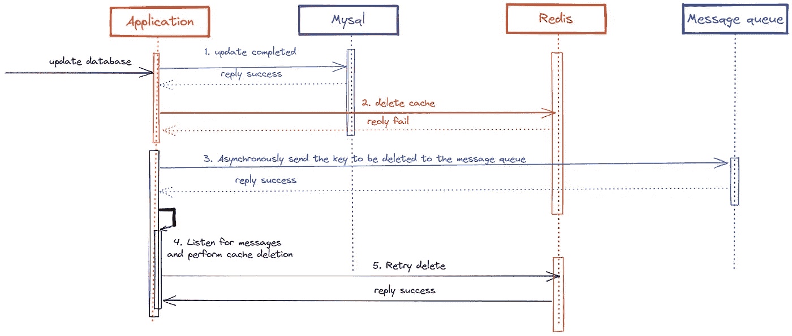

# 如何解决 Redis 和 MySQL 之间的数据一致性问题

> 原文：<https://betterprogramming.pub/how-to-solve-the-data-consistency-issues-between-redis-and-mysql-702f9ffa2452>

## Redis 和 MySQL 数据一致性解决方案

安妮·斯普拉特在 [Unsplash](https://unsplash.com?utm_source=medium&utm_medium=referral) 上的照片

Redis 具有高性能的数据读写功能，广泛应用于缓存场景。首先，它可以提高业务系统的性能，其次，它可以抵抗对数据库的高并发流量请求。

然后在使用过程中，经常会遇到一些场景，需要解决 Redis 和 Mysql 数据库之间的数据一致性问题。

今天我就分享一下自己的解决方案。

# 什么是数据库和缓存一致性？

数据一致性是指:

*   缓存中有数据，缓存的数据值等于数据库中的值
*   数据不在缓存中，数据库中的值等于最新值。

推回缓存与数据库不一致:

*   缓存的数据值不等于数据库中的值。
*   缓存或数据库中有旧数据，导致线程读取旧数据。

## 为什么会出现数据一致性问题？

在使用 Redis 作为缓存时，我们需要在数据发生变化时进行双写，以保证缓存与数据库中的数据一致。

数据库和缓存毕竟是两个系统。如果要保证强一致性，就需要引入分布式一致性协议如`2PC`或`Paxos`，或者分布式锁等。

这个很难执行，肯定会影响执行。性能有影响。

如果对数据的一致性要求这么高，真的有必要引入缓存吗？

# 缓存使用策略

使用缓存时，通常有以下缓存使用策略来提高系统性能:

*   `Cache-Aside Pattern`
*   `Read-Through Pattern`
*   `Write-Through Pattern`
*   `Write-Behind Pattern`

## **1。备用缓存**

所谓缓存靠边是指读取缓存、读取数据库、更新缓存的操作都在应用系统中完成，是业务系统最常用的缓存策略。

读取数据的逻辑如下:

*   当应用程序需要从数据库中读取数据时，它首先检查缓存的数据是否被命中。
*   如果缓存未命中，查询数据库获取数据，同时将数据写入缓存，这样后续对相同数据的读取就会命中缓存，最后将数据返回给调用者。
*   如果缓存命中，直接返回。

时序图如下:

**优势**

*   只有应用程序实际请求的数据才会包含在缓存中，这有助于保持缓存大小的成本效益。
*   它实现起来很简单，并且可以提高性能。

实现的伪代码如下:

**缺点**

由于数据仅在缓存未命中后才加载到缓存中，因此第一次调用的数据请求的响应时间会增加一些开销，因为需要额外的缓存填充和数据库查询时间。

## **更新数据**

在缓存备用模式下写入数据时，过程如下:

*   将数据写入数据库。
*   使缓存中的数据无效或更新缓存的数据。

使用缓存备用时，最常见的写入策略是将数据直接写入数据库，但是缓存可能与数据库不一致。

我们应该为缓存设置一个到期时间，这是确保最终一致性的解决方案。

如果过期时间太短，应用程序将不断从数据库中查询数据。同样，如果过期时间太长，并且更新没有使缓存失效，则缓存的数据很可能是脏的。

最常见的方法是删除缓存以使缓存的数据无效。

# **为什么不更新缓存？**

*第一:性能问题。*

当缓存的更新成本较高，需要访问多个表进行联合计算时，建议直接删除缓存，而不是更新缓存数据，以保证一致性。

*第二:安全问题。*

在高并发情况下，查询找到的数据可能是旧值。

## **2。通读**

当缓存未命中时，数据也从数据库加载，写入缓存，同时返回给应用程序系统。

虽然`read-through`与`cache-aside`非常相似，但是在`cache-aside`中，应用程序负责从数据库中获取数据并填充缓存。

另一方面，`Read-Through`将从数据存储获取值的责任转移给了缓存提供者。

`Read-Through`实行关注点分离原则。代码只与缓存交互，缓存组件管理自身与数据库之间的数据同步。

## **3。直写**

与`Read-Through`类似，当发生写请求时，`Write-Through`将写责任转移给缓存系统，缓存抽象层完成缓存数据和数据库数据的更新。

`Write-Through`的主要好处是应用系统不需要考虑故障处理和重试逻辑，交给缓存抽象层来管理实现。

直接使用这种策略是没有意义的，因为这种策略需要先写到缓存，再写到数据库，给写操作带来额外的延迟。

当`Write-Through`与`Read-Through`配合使用时，可以充分发挥读通的优势，同时保证数据一致性，无需考虑如何使缓存设置失效。

该策略颠倒了`Cache-Aside`填充缓存的顺序。不是在缓存未命中后延迟加载到缓存，而是首先将数据写入缓存，然后缓存组件将数据写入数据库。

**优势**

*   缓存和数据库数据总是最新的。
*   查询性能最佳，因为要查询的数据可能已经写入缓存。

**缺点**

*   不常请求的数据也会写入缓存，导致缓存更大、更昂贵。

## **4。后写**

乍一看，这个图形看起来和`Write-Through`一样，其实不然，不同的是最后一个箭头上的箭头:它从实线变成了直线。

这意味着缓存系统将异步更新数据库数据，应用程序系统只与缓存系统进行交互。

应用程序不必等待数据库更新完成，从而提高了应用程序的性能，因为数据库更新是最慢的操作。

在这种策略下，缓存和数据库的一致性不强，不建议用于高一致性的系统。

# **后备缓存一致性问题分析**

缓存备用策略是业务场景中最常用的策略。在这种策略下，客户端首先从缓存中读取数据，如果命中则返回。将数据写入缓存，因此读取操作不会导致缓存和数据库之间的不一致。

重点是写操作。数据库和缓存都需要修改，两者之间会有先后顺序，可能导致数据不再一致。对于写作，我们需要考虑两个问题:

*   先更新缓存还是更新数据库？
*   当数据发生变化时，选择修改缓存(更新)还是删除缓存(删除)？

结合这两个问题，出现了四种情况:

*   首先更新缓存，然后更新数据库。
*   首先更新数据库，然后更新缓存。
*   首先删除缓存，然后更新数据库。
*   首先更新数据库，然后删除缓存。

## 1.首先更新缓存，然后更新数据库。

如果先更新缓存，数据库写入失败，则缓存是最新数据，数据库是旧数据，缓存是脏数据。

在此之后，其他查询在立即进入时将获得这些数据，但这些数据并不存在于数据库中。

数据库中不存在的数据缓存并返回给客户端是没有意义的。

程序直接通过。

## 2.首先更新数据库，然后更新缓存。

一切正常，如下所示:

*   先写数据库，成功。
*   然后更新缓存，成功。

如果更新缓存失败。

这时，我们来推断一下，如果这两个操作的原子性被打破:如果第一步成功，第二步失败，会发生什么？

会导致数据库是最新数据，缓存是旧数据，造成一致性问题。

我不会画这幅画。和上图差不多，只是换一下 Redis 和 MySQL 的位置。

在高并发的场景下，如果多个线程同时写数据，然后再写到缓存，缓存的旧值和数据库的最新值肯定会出现不一致的情况。

# **有哪些一致的解决方案？**

## ***1。缓存延迟双删除***

*   请先删除缓存。
*   写数据库。
*   休眠 500 毫秒，然后删除缓存。

这样，最多只会有 500 毫秒的脏数据读取时间。关键是如何确定睡眠时间？

延迟时间的目的是确保读请求结束，写请求可以删除由读请求引起的缓存脏数据。

所以我们需要自己评估项目的数据读取业务逻辑的耗时，在读取时间的基础上增加几百毫秒作为延迟时间。

## ***2。移除缓存重试机制***

缓存删除失败怎么办？例如，如果延迟双重删除的第二次删除失败，则意味着脏数据无法删除。

使用重试机制来确保缓存删除成功。

例如，如果它重试三次并失败三次，它会将日志记录到数据库中，并发送一个需要手动干预的警告。

在高并发场景下，最好使用异步方法进行重试，比如向 MQ 中间件发送消息，实现异步解耦。

步骤(5)如果删除失败，且未达到最大重试次数，则该消息将重新排队，直到删除成功，否则将记录在数据库中，以便人工干预。

这种方案的缺点是造成对业务代码的侵入，于是有了下一种方案，启动一个专门订阅数据库 bin-log 的服务，读取要删除的数据，执行缓存删除操作。

## ***3。异步删除*读取 bin-log**

*   更新数据库。
*   数据库将在 bin-log 日志中记录操作信息。
*   使用 canal 订阅 bin-log 日志以获取目标数据和密钥。
*   缓存删除系统获取通道数据，解析目标键，并尝试删除缓存。
*   如果删除失败，将消息发送到消息队列。
*   缓存删除系统再次从消息队列中获取数据，并再次执行删除操作。

# **总结**

缓存策略的最佳实践是缓存备用模式。它们分为读取缓存最佳实践和写入缓存最佳实践。

读缓存最佳实践:首先读取缓存，如果命中则返回。如果数据库未命中，则查询数据库，然后写入缓存。

写缓存最佳实践:

*   先写数据库，再操作缓存。
*   直接删除缓存，而不是修改它。

因为当缓存的更新成本非常高，需要访问多个表进行联合计算时，建议直接删除缓存，而不是更新。

此外，删除缓存的操作很简单，副作用只是增加了缓存未命中。建议您使用此策略。

在上述最佳实践下，为了尽可能保证缓存和数据库的一致性，我们可以使用延迟双重删除。

为了防止删除失败，我们使用异步重试机制来确保正确删除。通过异步机制，我们可以向 MQ 消息中间件发送删除消息，或者使用一个通道来订阅 MySQL bin-log 日志，以监控删除相应缓存的写请求。

那么，如果我必须保证绝对一致性，首先给出结论:

没有办法做到绝对的一致，这是上限理论决定的。缓存系统的适用场景是非强一致性的场景，所以属于 CAP 中的 AP。

因此，我们必须妥协，我们可以达到基础理论中提到的最终一致性。

事实上，一旦在方案中使用了缓存，往往意味着我们放弃了数据的强一致性，但也意味着我们的系统可以在性能上得到一定的提升。

所谓权衡，也正是如此。

*感谢您阅读本文。*

*敬请期待更多。*