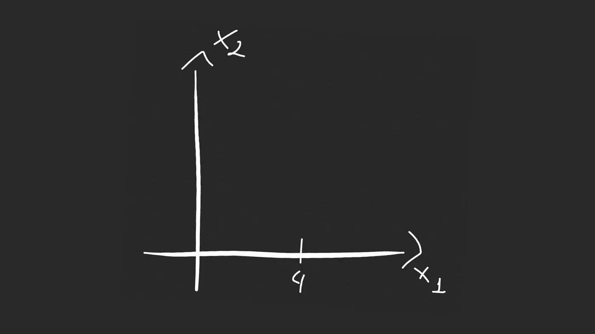
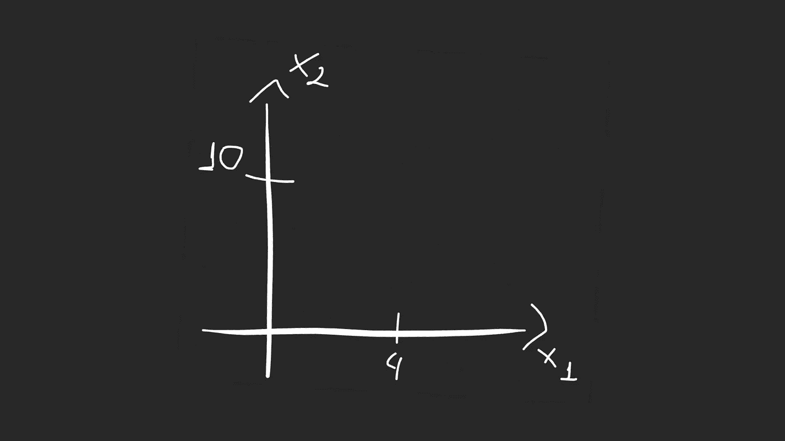
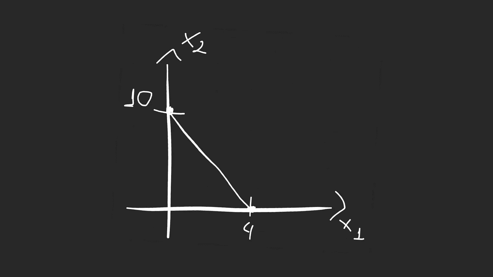
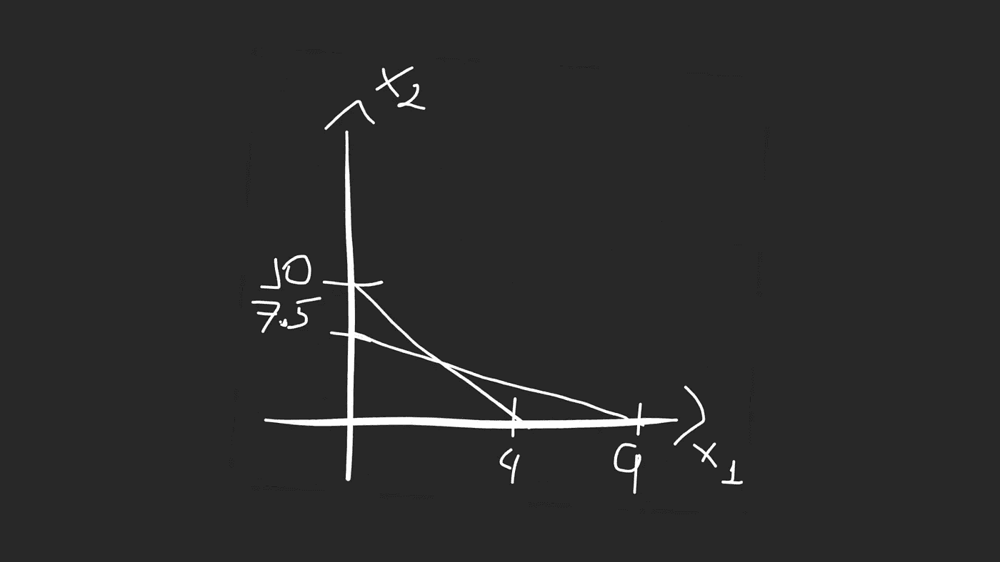
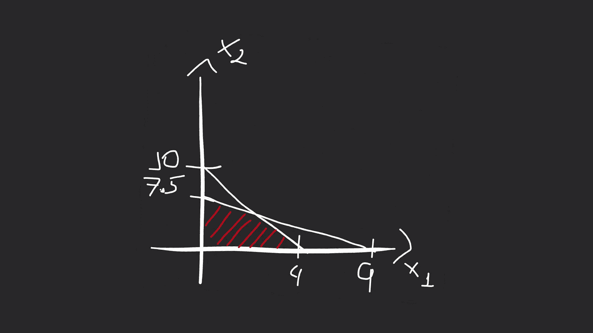
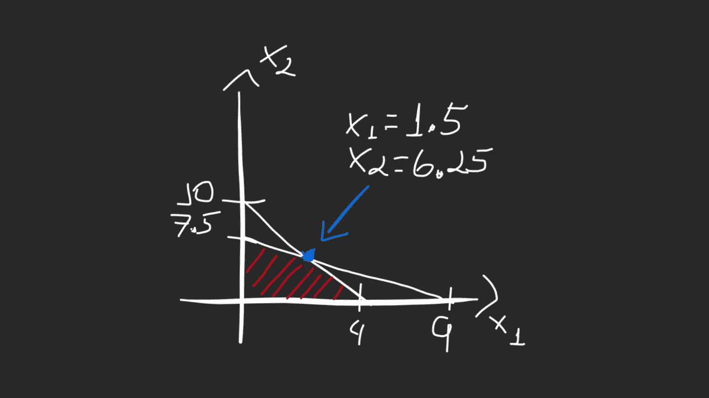

# 如何用 Python 中的实例和实现解决线性规划问题

> 原文：<https://betterprogramming.pub/how-to-solving-linear-programming-problems-with-examples-and-implementation-in-python-a7b7061bafc9>

## 人工智能优化算法


用 [Canva](https://www.canva.com/) 拍的照片。

线性规划的目标是最小化一个成本函数，这个函数有一些变量( *x₁* 、 *x₂* 、 *x₃* )，一直到 *x𝑛* 。这些变量与我想知道的值有关，它们可能会乘以一个系数，然后加在一起。

对于线性规划，我们只是处理线性方程，所以我们不会去平方或立方任何东西。

此外，我们将有一些线性约束:

*   *a₁x₁ + a₂x₂ + … + a𝑛x𝑛 ≤ b*
*   *a₁x₁ + a₂x₂ + … + a𝑛x𝑛 = b*

每个变量的界限如下:

*   *lᵢ ≤ xᵢ ≤ uᵢ*

# 例子

这是一个经常出现的问题的例子。你可以开始注意到这类问题的模式。如果你按照我下面将要描述的步骤去做，你将会解决这类问题。

## 问题是

在这个问题中，我们有这些约束:

*   两台机器——*x₁*和 *X₂.X₁每小时的跑步费用是 50 美元，而 X₂每小时的跑步费用是 80 美元。*
*   X₁要求每小时五个单位的劳动，而 X₂要求每小时两个单位的劳动。我们总共有 20 个单位的劳动力要花。
*   X₁每小时生产十个单位的产品。X₂每小时生产 12 单位的产品。该公司需要 90 单位的产量。

我们的目标是找出公司运行机器的时间，以使总成本最小化。

考虑到问题的约束，我们有下面的表格，分别是 *X₁* 和 *X₂* 的值。在第一行中，我们考虑两台机器的每小时成本。第二行显示每台机器上花费了多少人工单位。在第三行，我们有每台机器每小时的输出单位。

*注:我们不能忘记考虑公司需要 90 台的产量。*

```
 ╔═══════════════╦═══════════════╗
            ║       ***X₁***      ║       ***X₂***      ║
╔═══════════╬═══════════════╬═══════════════╣
║ Cost/Hour ║      $50      ║      $80      ║
║ Labor     ║       5       ║       2       ║
║ Units/Hour║      10       ║       2       ║
╚═══════════╩═══════════════╩═══════════════╝
```

现在让我们为这个问题建立方程式。

## 目标

这个问题的目标是找到这个方程的最小值:

*TC = 50 X₁ + 80 X₂*

*X₁* 是一个代表我们运行机器 *X₁.多少小时的变量*

*X₂* 是一个代表我们运行机器 *X₂.多少小时的变量*

## 限制

这里，我们讨论两个约束条件的方程:

*   *5 X₁ + 2 X₂ ≤ 20*
*   *10 X₁ + 12 X₂ ≥ 90*

我说过，在线性编程中，我们处理的是等于约束(`=`)或者小于等于(`≤`)约束。我们可以看到，第二个方程不遵循这种模式。我们可以将这个等式乘以负一，然后翻转成小于或等于(`≤`):

*-10 X₁ + -12 X₂ ≤ -90*

让我们用图形来表示它。考虑第一个约束方程，当 *X₂ = 0，*我们将有:

*5x₁+2(0)≤20
5x₁≤20
x₁≤4*



作者照片。

现在当 *X₁* 为 0 时，我们可以计算 *X₂* 的值:

*5(0)+2x₂≤20
2x₂≤20
x₂≤10*



作者照片。

现在我们可以在这两点之间画一条线:



作者照片。

下面我们来看第二个等式(- *10 X₁ + -12 X₂ ≤ -90* )。我们做同样的过程:

*   同*x₂= 0
    -10x₁=-90
    x₁= 9*
*   用*x₁= 0
    -12x₂=-90
    x₂= 7.5*



作者照片。

为了最大限度地降低成本，同时生产 90 个单位的产品，解决方案将位于这个红色区域:



作者照片。

为了得到边界点，我们必须计算交点。为此，我们将对约束方程求和:

*5x₁+2x₂≤20
-10x₁+-12x₂≤- 90*

我们将第一个等式乘以 *2:*

*10x₁+4x₂≤40
-10x₁+-12x₂=-90
———
0x₁+-8x₂=-50
-8x₂=-50
x₂= 6.25*

现在我们将使用第一个等式来计算 X₁:

*5x₁+2x₂≤20
5x₁+2(6.25)≤20
x₁= 1.5*

这样，我们就知道了交点的值(蓝色):



作者照片。

现在我们已经了解了所有要点，让我们创建一个对比表:

```
╔═══════════════╦═══════════════╦═══════════════╗
║       ***X₁***      ║       ***X₂***      ║      TC       ║
║═══════════════╬═══════════════╬═══════════════╣
║       4       ║       0       ║               ║   
║       0       ║      7.5      ║               ║
║      1.5      ║      6.25     ║               ║
╚═══════════════╩═══════════════╩═══════════════╝
```

我们使用我们的目标等式计算总成本:

*TC = 50 X₁ + 80 X₂*

*单位= 10 个 X₁ + 12 个 X₂*

```
╔═══════════════╦═══════════════╦═══════════════╦═══════════════╗
║       ***X₁***      ║       ***X₂***      ║       TC      ║     Units     ║
║═══════════════╬═══════════════╬═══════════════╬═══════════════╣
║       4       ║       0       ║      200      ║      40       ║
║       **0       ║      7.5      ║      600      ║      90**       ║
║      **1.5      ║      6.25     ║      575      ║      90**       ║
╚═══════════════╩═══════════════╩═══════════════╩═══════════════╝
```

## 结果

我们将丢弃第一个值，因为我们必须考虑要求输出 90 个单位的约束。因此，由于我们考虑的是最低成本，我们将得到 575 个总数，公司必须运行 *X₁* 机器 1.5 小时和 *X₂* 机器 6.25 小时。

## 用 Python 解决这类问题

为了用 Python 解决这个问题，我们将使用 [SciPy](https://docs.scipy.org/) lib。您可以使用`pip`进行安装:

```
$ pip install scipy
```

我们将使用我们的目标函数和约束函数来调用`optimize`包的`linprog`函数:

我们将得到与之前计算的结果相同的结果:

```
X1: 1.5 hours
X2: 6.25 hours
```

# 结论

在 AI 中，当我们不关心通向解的路径，而只关心解本身时，我们使用线性规划。