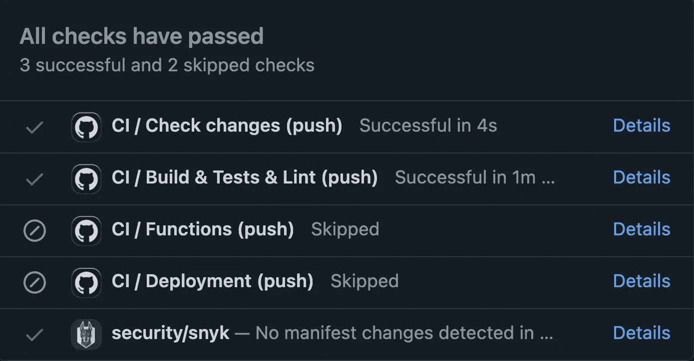
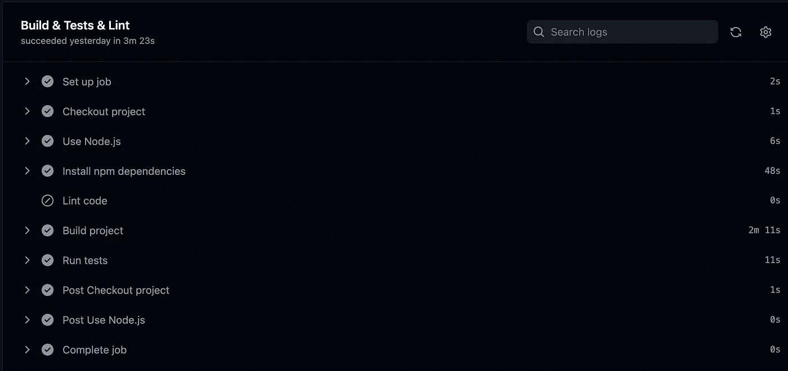
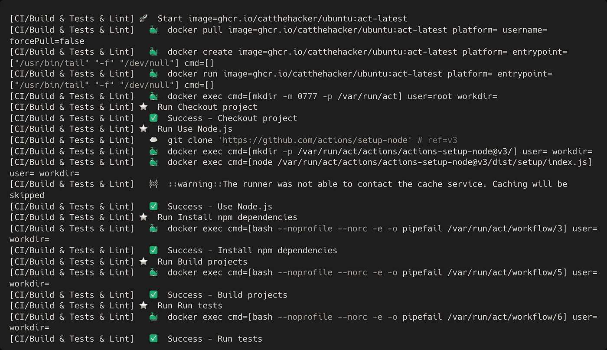

# 如何通过避免不必要的工作来加快 GitHub 的动作

> 原文：<https://betterprogramming.pub/how-to-speed-up-github-actions-by-avoiding-unnecessary-work-b51f02c6392b>

## 更新自述文件后，为您的 GitHub 操作节省时间，而不仅仅是运行作业


照片由 [GR Stocks](https://unsplash.com/@grstocks?utm_source=medium&utm_medium=referral) 在 [Unsplash](https://unsplash.com?utm_source=medium&utm_medium=referral) 拍摄

曾经有一段时间，如果你使用 GitHub，你必须使用第三方 CI/CD 工具，如 Jenkins 或 Travis CI。好在时代变了。

GitHub Actions 使软件工作流程自动化变得容易，无需使用第三方 CI/CD 工具。该社区已经创建了许多可重用的操作，您可以合并这些操作来构建自己的工作流。

在 GitHub 上运行工作流有多种方式。最常见的是推送事件，它通常会触发配置项工作流。在某些时候，您的工作流会遇到问题，包括以下问题:

*   与代码类似，工作流也可能随着时间而增长。不得不将工作流更改推送到 GitHub 来测试它们是否工作可能会变得很烦人(然后你意识到你有一个缩进错误，所以你不得不再次推)。
*   除了时间方面，还有成本方面:您的 GitHub 订阅包含每月有限的 CI/CD 分钟数(例如，团队计划为 3000 分钟)。

在本文中，我想分享一些如何更快、更有效地开发和执行 GitHub 工作流的方法，从而节省时间和金钱。

# 忽略不必要的路径和分支

假设我们更新了自述文件，提交了更改，然后推它。在更新工作流文件之前，您会在 GitHub 上看到以下内容:



一些 GitHub 作业运行了，尽管这毫无意义

正如您所看到的，即使实际的应用程序代码根本没有改变，代码还是被构建、测试和链接了。让我们用`ci-ignore-paths.yml`更新我们的 GitHub 工作流。

如果我们现在用更新的自述文件再次推送更改，我们会看到所有的 GitHub 工作流都被跳过了。这次没有构建、测试或测试任何代码。


这次没有执行自定义 GitHub 工作流

这已经是一个进步，但我们还可以做得更好。目前，GitHub 不支持基于 pull 请求修改的文件的工作流步骤和作业的条件执行。不过，一个名为 paths-filter 的便捷 GitHub 操作可以帮助我们实现这一点。

下面的工作流包含两个任务:一个是确定变更(例如，检查是否应该测试`functions`项目)，另一个是实际执行我们想要的操作(例如，运行`functions`项目的测试)。代码如下:

# 有条件地跳过步骤和作业

使用 GitHub 工作流，我们可以自动化很多事情:构建、测试、林挺、格式化、部署等等。然而，这可能会耗费时间和信用。有些任务只有在某些情况下才有意义。

例如，您通常希望仅在合并到主分支时进行部署。类似地，如果您在一个特性分支上，那么您可以验证代码格式和样式，但是在主分支上这可能是不必要的。

我们可以使用`if`条件来有条件地运行或跳过步骤或整个作业。下面的工作流包含一个跳过主分支上的林挺步骤的作业，因为这不应该阻止进一步的步骤，如构建或部署我们的应用程序。



推进到主分支时，跳过了“Lint 代码”步骤

## 使用类似 [Nx](https://nx.dev) 的 monorepo 工具，只构建和测试受影响的部分

Nx 可以缓存构建和测试等任务的结果。如果使用 Nx 来触发一个任务，它将检查是否有会破坏该更改的代码更改(例如，更改一个规范文件或`package.json`)。如果没有这样的变化，Nx 将重用缓存，从而节省宝贵的时间。

下面的工作流包含一个包含几个步骤的作业，包括构建、测试和林挺应用程序。使用 Nx(云)时，我们将受益于智能重建功能。假设您有一个 monorepo，带有一个客户端应用程序和多个特性库。如果您更改了某个特性库中的代码，我们应该只为直接受影响的代码(库本身以及使用它的任何其他应用程序或库)运行任务。下面是如何做到这一点:

## 在本地运行 GitHub 工作流

如果我们能在本地运行 GitHub 工作流不是很好吗？毕竟，我们如何调试问题而不推动每一个小的变化，从而浪费大量的 CI 时间？

对于简单的工作流，可以尝试手动调用这些步骤，但是在某些时候会变得混乱或复杂，例如，由于本地设置或缺少环境变量。

事实证明，这并不太难！我们所需要的就是 [Docker](https://www.docker.com) 和一个叫做 [act](https://github.com/nektos/act) 的有用命令行工具。虽然它不是 100%准确，但 act 与实际情况非常接近。使用 act，我们可以运行将在 Docker 容器中执行的单个作业或工作流。在我的 Mac 上，这相当快，有点类似于直接在 GitHub 上运行工作流。

要运行`ci_web`作业，我们需要运行以下命令:

```
act -j ci_web
```



使用 act 运行 GitHub 工作流时的终端输出

# 结论

感谢您阅读这篇短文。

如您所见，有几种方法可以加速 GitHub 工作流的开发和执行。Act 尤其有助于避免不必要的向 GitHub 推送提交。

你也有更多的建议吗？

请在评论中告诉我。