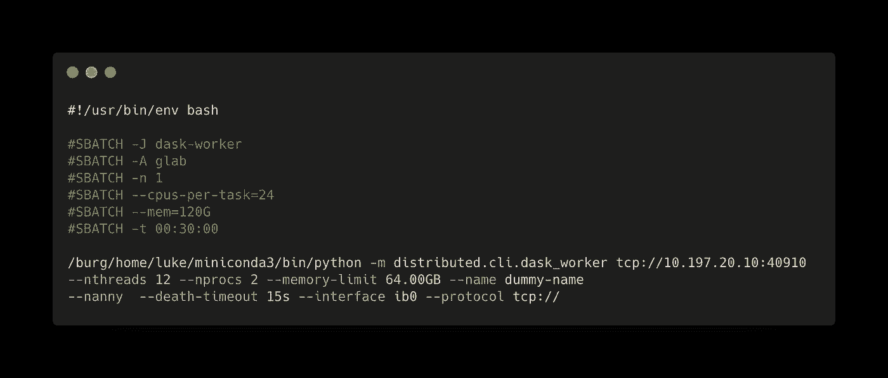
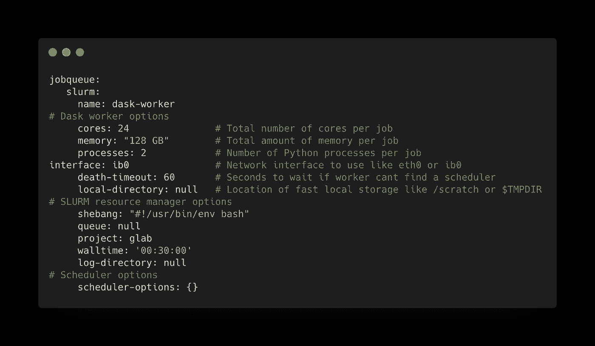
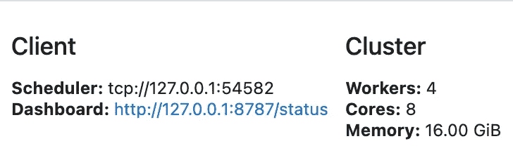
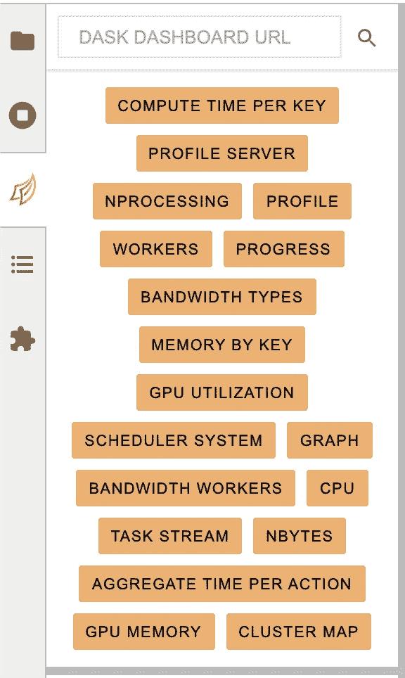
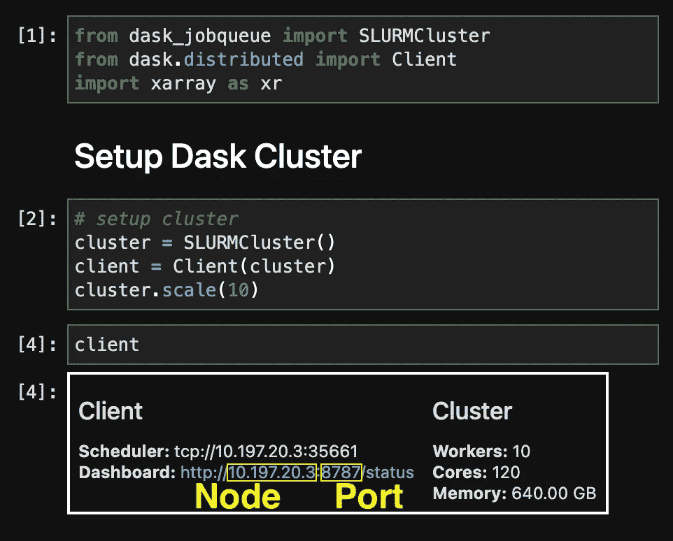
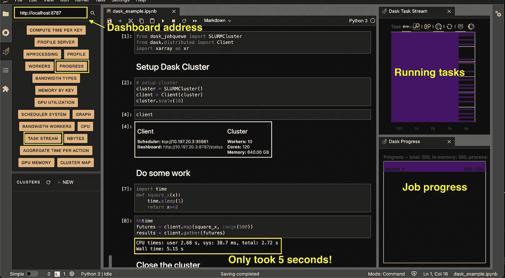

# 如何加快 Python 中的日常工作

> 原文：<https://betterprogramming.pub/how-to-speed-up-your-day-to-day-work-in-python-213762cd56b1>

## 使用所有可用的计算能力


杰克·吉文斯在 Unsplash 上的照片

在我的日常数据工作中，我经常发现自己运行许多`for`循环。这些可能需要几分钟才能完成，这不一定是很长的时间，但循环是令人尴尬的并行化。我们可以做得更好。

在本文中，我将讨论如何在使用 Python 时更有效地利用时间。无论您使用笔记本电脑还是高性能计算机(HPC ),您都可以充分利用所有可用的计算能力来加快工作流程。这可以通过`Dask`和`Dask-jobqueue`库来实现。这篇文章将讨论如何在本地计算机和 HPC 上创建和使用`dask`集群。

`Dask`是一个用于并行计算的 Python 库，`dask-jobqueue`让你从一个 Jupyter 笔记本上与任务调度器交互，比如 Slurm。`Dask`让简单的事情变得更容易，复杂的事情变得可能，它的`numpy` 和`pandas`式的 API 让编写代码成为 Pythonic 数据从业者熟悉的事情。

## **目录**

*   [安装](#bfbe)
*   [在笔记本电脑上安装 Dask 集群](#b21c)
*   [在 HPC 上设置 Dask 集群](#6ec5)
*   [向集群提交工作](#069f)
*   [Dask labe extension](#7ec2)
*   [最后的想法](#067c)

# 装置

首先，您需要安装`dask`和`dask-jobqueue`

*注意:* `*dask-jobqueue*` *仅在使用带有作业调度程序的 HPC 时需要。*

`Dask`也可以通过 pip 或者直接从源代码[安装](https://docs.dask.org/en/latest/install.html)。默认情况下，它也包含在 [Anaconda 发行版](https://www.anaconda.com/products/individual)中。然而，我推荐最小的 [miniconda](https://docs.conda.io/en/latest/miniconda.html) 安装程序来设置 Python 环境。如何设置 miniconda 的说明如下:

[](/how-to-use-miniconda-with-python-and-jupyterlab-5ce07845e818) [## 如何将 Miniconda 与 Python 和 JupyterLab 结合使用

### 从头开始设置极简 Python 环境

better 编程. pub](/how-to-use-miniconda-with-python-and-jupyterlab-5ce07845e818) 

# 在笔记本电脑上设置 Dask 集群

安装好软件包后，您只需几行代码就可以创建一个本地集群，连接到我们笔记本电脑上的所有内核:

这会将笔记本电脑上的所有内核变成一个`dask`集群。如果你只想在你的机器上使用一定数量的内核，你可以调整`localCluster()`中的参数。文档在这里是。

# 在 HPC 上设置 Dask 集群

HPC 通常由多个用户共享，并使用一个调度器(如 Slurm)来分配任务。在 HPC 上加速 Python 的一种方法是并行化工作，并将其分布在 HPC 上的多个内核上。这需要您向调度器提交许多 Python 脚本，这将在下面的文章中讨论。

[](/how-to-process-multiple-files-10x-faster-in-python-4f0ea9c7f64a) [## 如何在 Python 中将处理多个文件的速度提高 10 倍

### 不要循环，同时运行每个迭代

better 编程. pub](/how-to-process-multiple-files-10x-faster-in-python-4f0ea9c7f64a) 

但是，如果我们想在 JupyterLab 会话中使用 HPC 节点，该怎么办呢？我们如何将这些节点连接起来？当我们在做的时候，你如何远程连接到 Jupyterlab？以下部分将讨论这些主题。

## 远程连接到 JupyterLab

除非您有幸使用 JupyterHub，否则在远程计算机上连接 JupyterLab 并不容易。以下是打开在远程计算机上运行的笔记本的说明。

[](https://towardsdatascience.com/how-to-connect-to-jupyterlab-remotely-9180b57c45bb) [## 如何远程连接到 JupyterLab

towardsdatascience.com](https://towardsdatascience.com/how-to-connect-to-jupyterlab-remotely-9180b57c45bb) 

## 在 HPC 上创建 Dask 集群

`dask.job_queue`为通用[作业调度器](https://jobqueue.dask.org/en/latest/api.html)提供接口，包括 SLURM、PBS、OAR、SGE 和 LSF。我将在这个例子中使用 Slurm，因为它安装在哥伦比亚大学的 [Ginsburg](https://confluence.columbia.edu/confluence/display/rcs/Ginsburg+HPC+Cluster+User+Documentation) 集群上。

## 设置步骤

1.  定义工人的规格
2.  将集群扩展到几个工作人员
3.  将集群连接到一个`Dask` 调度程序

在下面的代码中，我使用`SLURMCluster`定义了一个 worker，然后将该定义连接到一个`dask`调度器(`Client`)。然后，我可以根据需要将集群扩展到任意数量的员工。在这种情况下，我指示调度程序使用 8 个工人(`cluster.scale(8)`)。

## SLURMCluster 参数

我为定义单个工人的`SLURMCluster`提供一些参数。你传递给 [dask_jobqueue 的选项。SLURMCluster](https://jobqueue.dask.org/en/latest/generated/dask_jobqueue.SLURMCluster.html#) 或者特定于 HPC 集群，或者特定于 Dask。这里有几个相关的论点。

*   `project`:作业的账户字符串
*   `cores`:每个作业的核心总数
*   把工作分成这么多的过程。
*   `memory`:每个作业的内存总量
*   `shebang`:批量提交脚本所需解释器的路径。
*   `walltime`:每个工人工作的休息时间。
*   `death_timeout`:关闭工作线程前等待调度程序的秒数
*   `interface`:网络接口。`ib0`指定 Infiniband。

## 它如何与员工联系起来

这在幕后所做的是启动一个 bash 脚本来连接每个工人。我们可以看到带有`print(cluster.job_script())`的脚本:



如果您熟悉启动作业脚本，这可能看起来很熟悉。它所做的就是利用我们给`SLURMCluster()`的选项，构造一个小的作业脚本，告诉 Slurm 如何用我们提供的参数启动一个 dask worker。

当我们运行`cluster.scale()`时，它会多次提交这个脚本，并为我们提供更多的计算。

## 配置文件

您可以将这些参数存储在配置文件中，而不是每次运行笔记本时都向`SLURMCluster()`提供选项。当您安装`dask-jobqueue`时，这里会创建一个配置文件:

```
~/.config/dask/jobqueue.yaml
```

这允许您存储每个调度程序的配置设置。下面是我的`jobqueue.yaml`文件的一个例子:



现在，只需运行以下命令即可应用这些配置:

这样做的好处是减少了您的打字量，并且文件可以很容易地与同事共享。

# 向集群提交工作

在这一节中，我将讨论如何向集群提交工作。

## 提交单个函数调用

您可以使用`submit()`函数提交单个函数调用。

Dask 命令是懒洋洋地运行，这意味着我们不会马上收到一个结果，相反，你会收到一个[](https://docs.python.org/3/library/asyncio-future.html)**对象*。*`result()`函数将计算工作量并返回结果。**

## **提交多个函数调用**

**如果你有多个输入，你可以使用`client.submit()`和`future.read()`进行列表理解。然而，使用`map()`和`gather()`通常会更快、更有技巧。`Map()`将在一个列表中对未来进行分组，而`gather()`将以列表的形式返回结果。**

# **Dask LabExtension**

**现在让我们安装 [JupyterLab Dask 扩展](https://github.com/dask/dask-labextension)，它允许你将仪表盘直接嵌入笔记本面板。这可以在作业运行时提供进度。**

## **连接到笔记本电脑上的仪表板**

**创建 dask 集群后，您可以通过打印`client`对象来查看仪表板位置:**

****

**然后，您可以单击 JupyterLab 中的`dask`图标，并将仪表板地址粘贴到文本框中。这将连接到仪表板，以便您可以将窗格拖动到您的会话中并停靠它们。**

****

## **连接到 HPC 上的仪表板**

**连接到 HPC 上的仪表板要稍微复杂一些。**

**创建 dask 集群后，仪表板需要进行端口转发。您可以通过打印`client`对象来查看仪表板位置。**

****

**仪表板需要首先进行端口转发。您可以在计算机的端口 8787 上打开仪表板。**

```
**ssh -L 8787:10.197.20.3:8787 USER@HOST**
```

**现在可以在本地端口 8787 上查看仪表板。**

**您可以在浏览器中打开一个新选项卡，并通过以下 URL 连接仪表板:**

```
**http://localhost:8787**
```

**然而，`Dask` labextension 允许您在 JupyterLab 中显示仪表板。点击`dask`图标，粘贴端口转发仪表板地址(`http://localhost:8787`)。**

****

**粘贴仪表板地址后，您可以从左侧面板中拖出不同的窗格。在这里，我在右侧显示了进度和任务流窗格。这些窗格显示每个内核上运行的作业进度和任务。**

**在上面的例子中，循环的每次迭代暂停一秒钟。运行 500 次迭代大约在 5 秒钟内完成，因为这项工作分散在 120 个内核上。**

# **最后的想法**

**如果您正在使用 Python，我希望这篇文章有助于加快您的日常工作。`Dask`非常适合[令人尴尬的并行工作负载](https://examples.dask.org/applications/embarrassingly-parallel.html)和`dask-jobqueue`允许您充分利用 HPC 上的内核，提高速度和可扩展性。HPC 通常是一个面向批处理的系统——这种方法将它变成了一个成熟的交互式 Python 工具，可以跨多个内核扩展。**

**在这篇文章中，我没有提到在云中使用`dask`。你可以在这里阅读各种云部署。我也鼓励大家去看看 [coiled.io](https://coiled.io/) ，由`Dask`维护者、[马修·洛克林](https://matthewrocklin.com/)启动。标语是“盘绕使云易于扩展。”我并不隶属于 coiled，我只是认为这是一个伟大的创业。**

***我很乐意帮助您解决在 JupyterLab 中运行 Dask 时遇到的任何问题。***

***感谢阅读和支持媒体作者***

**[](https://lukegloege.medium.com/membership) [## 通过我的推荐链接加入 Medium—Luke Gloege 博士

### 作为一个媒体会员，你的会员费的一部分会给你阅读的作家，你可以完全接触到每一个故事…

lukegloege.medium.com](https://lukegloege.medium.com/membership)**