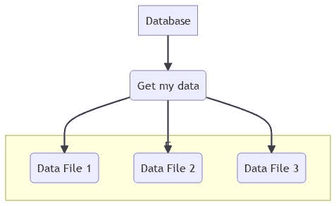
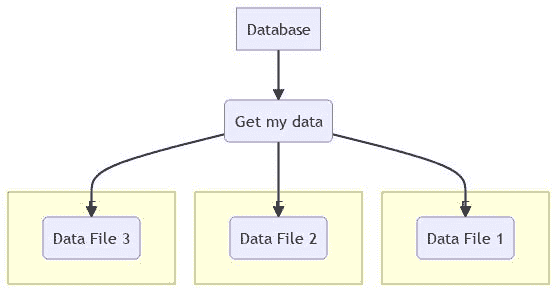
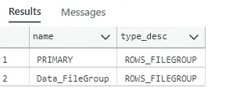

# 如何加速您的 SQL 数据库

> 原文：<https://betterprogramming.pub/how-to-speed-up-your-sql-database-233d298ff7f2>

## 让我们看看 SQL Server 中的文件组功能


由 [Unsplash](https://unsplash.com?utm_source=medium&utm_medium=referral) 上的 [CHUTTERSNAP](https://unsplash.com/@chuttersnap?utm_source=medium&utm_medium=referral) 拍摄

今天，是时候深入了解一下 SQL Server 中的文件组了。但是在我们开始之前，让我们先设置一下基础。

# 数据文件的定义

数据文件是 SQL server 中的特定文件。有三种类型的数据库文件

*   主要的
*   副手
*   原木

主文件包含您创建的数据库中的常规启动数据。这种类型总是数据库的一部分。它通常以. mdf 结尾。

辅助文件类型通常以. ndf 结尾。这些文件可以分布在多个磁盘上。为此，您可以将数据混合到不同类型的磁盘上。

日志文件类型包含允许恢复数据库的所有数据。每个数据库都有一个日志文件，其文件扩展名为. ldf。

# 什么是文件组

首先，什么是文件组？文件组是 SQL server 中的一个对象，它将一个或多个数据文件组合成一个“虚拟”数据文件，该文件可以分配给每个表、索引或键定义。这种组合只能由次要文件类型来完成，因为次要文件类型是唯一可以由多个文件类型组合的类型。

# 为什么使用多个数据文件？

当然，在普通的开发人员数据库中，这是不必要的。或者当你开始你的平台时，在开始时，这真的不重要。但是想想看，您的数据库在不久的将来会增长。数据库可能会变得很慢，你会失去客户，收入也是如此。好吧，这是一个激烈的故事，但它可能是事实。

但是让我们假设您的数据库非常大并且非常繁忙，可以使用多个文件来提高性能。下面是一个如何使用多个文件的例子。

假设您的数据库包含一个有 1000 万行被频繁查询的表。


如果表位于单个文件中(如上图所示)，例如单个数据库文件，那么 SQL Server 将只使用一个线程来读取表中的行。

现在让我们再添加两个文件，然后示意图将如下所示:



所以它现在分布在三个文件上，在这种情况下，SQL Server 将使用三个线程(每个物理文件一个)来读取表，这可能会更快。

因此，当使用这种物理并行技术时，您的数据库将获得巨大的速度。所以当你像这样分发文件时



如果每个文件都在自己单独的物理磁盘上，或者更好的是在磁盘阵列上，性能提升会更大。

# 如何用文件组扩展数据库

如果需要，可以使用自定义文件组扩展现有数据库。为此，您可以简单地添加文件组。但是要小心，不允许连接到数据库，因为您更改了一些数据库基础结构。用`use master`切换到主数据库即可。然后可以用`Alter Database MyDatabase Add Filegroup Data_FileGroup`添加文件组。在这种情况下，将名为`Data_FileGroup`的新文件组添加到数据库`MyDatabase`中。

现在您有了一个文件组，但是现在为它分配了磁盘空间。在这种状态下，不能将文件组分配给表。在这种情况下，让我们假设您的数据文件将位于目录`/var/opt/data`(在 Docker 映像中使用)中，然后您可以使用该脚本将一个数据文件分配给我们创建的文件组

```
ALTER DATABASE MyDatabase
Add FILE
(
 Name=DataFile_1,
 FILENAME='/var/opt/data/DataFile_1.ndf',
 Size=1MB,
 MaxSize = 100MB,
 FileGrowth=5%
)
TO FILEGROUP Data_FileGroup
```

现在在执行之后，您可以检查 Filegrpoup 是否用`Select name, type_desc from sys.Filegroups`分配给了数据库



# 将数据分配给文件组

创建文件组后，可以将这些文件组应用于特定的表或索引定义。您只能在您的定义后添加一个`ON Data_FileGroup`。例如，如果要创建一个表，可以使用下面的语法。

```
create table Customers(
id bigint,
name varchar(255),
firstname varchar(255)) on Data_FileGroup
```

如果您想要您的`Primary (Default)`文件组中的数据，并且只想要您的`Data_FileGroup`文件组中的索引数据，那么您可以得到更严格的限制，在这种情况下，您可以使用以下语法

```
create table Customers(
id bigint,
name varchar(255),
firstname varchar(255),
CONSTRAINT PK_Customers_id PRIMARY KEY (Id) on Data_FileGroup,) on [PRIMARY]
```

请注意 **[]** ，因为 Primary 是保留关键字。

# 文件组的经验法则

我不是数据库工程师或 DBA。但是我认为三个文件组足够了。

*   `Primary` —将被创建的默认选项
*   `Log` —这将通过数据库创建来创建
*   `INDEX` —该文件组应由每个开发人员创建。因为在这种情况下，您可以存储所有与索引相关的数据，从而提高查询效率。

当然你可以添加更多，我已经看到一些架构师创建了一个历史文件组，因为他们存储日志数据。那也是可能的，但是在第一次开始时，你可以创建这三个组。

# 将现有数据移动到新的文件组

不幸的是，没有简单的方法将数据“迁移”到另一个文件组。如您所知，数据被分配给一个物理文件。因此，您必须创建一个复制表来分配新的文件组，而不是简单的切换。然后您可以将数据复制到新创建的表中。然后，您必须删除旧表，并将关系设置到新表中。

```
**Want to Connect With the Author?**Say Hi on [LinkedIn](https://www.linkedin.com/in/sascha-peter-bajonczak-32a17a2a/)!
```