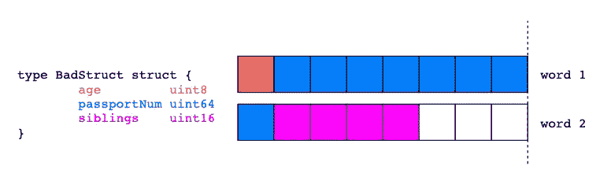
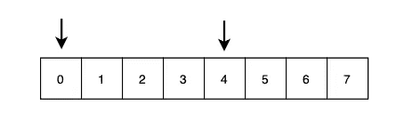
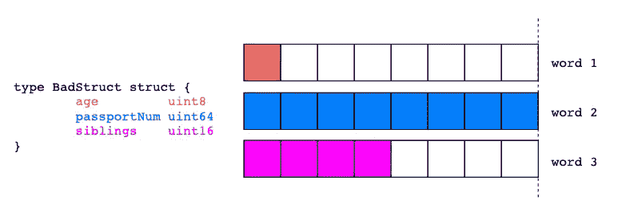
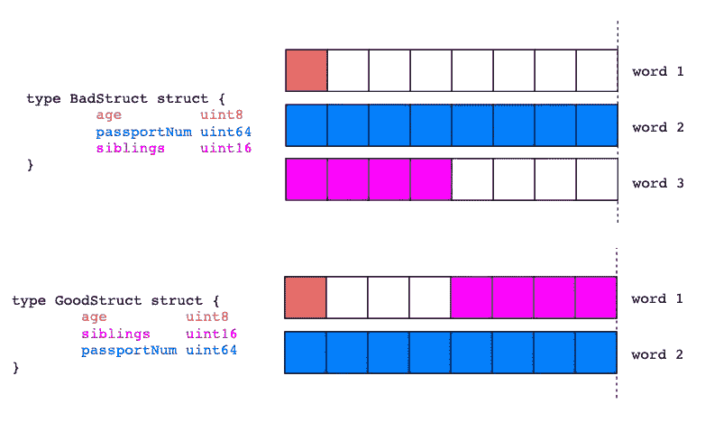
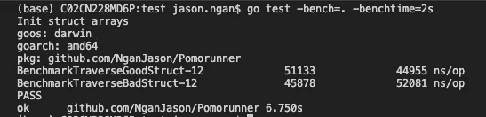

# 如何加快你的 Golang 结构

> 原文：<https://betterprogramming.pub/how-to-speed-up-your-struct-in-golang-76b846209587>

## 您应该知道的简单数据对齐技术


照片由[麦克](https://www.pexels.com/@mike-468229)在[像素](https://www.pexels.com/photo/depth-of-field-photography-of-file-arrangement-1181772/)上拍摄

如果您以前使用 Golang 编写过代码，那么您很可能已经见过并实现了该类型——struct。

您可能不知道的是，通过简单地重新排列结构中的字段，您可以极大地提高 Go 程序的速度和内存使用率！

好得难以置信？我们开门见山吧！

# 简单演示

```
type BadStruct struct {
	age         uint8
	passportNum uint64
	siblings    uint16
}

type GoodStruct struct {
	age         uint8
	siblings    uint16
	passportNum uint64
}
```

在上面的代码片段中，我们创建了两个具有相同**字段的结构。让我们写一个简单的程序来分别输出它们的内存使用情况。**

```
// Output
Bad struct is 24 bytes long
Good struct is 16 bytes long
```

可以看出，它们在内存使用方面有所不同。

发生了什么导致两个完全相似的结构消耗了不同数量的字节？

答案在于数据在计算机内存中是如何排列的。

简而言之，数据结构对齐。

# 数据结构对齐


照片由[在](https://www.pexels.com/@shvets-production)[像素](https://www.pexels.com/photo/young-couple-arranging-stack-of-boxes-after-relocation-7203783/)上拍摄生产

CPU 以字长而不是字节长读取数据。

64 位系统中的一个字是 8 字节，而 32 位系统中的一个字是 4 字节。

简而言之，CPU 以其字长的倍数读取地址。



想象一下使用 64 位系统。为了获取变量`passportNum`，我们的 CPU 需要两个周期而不是一个周期来访问数据。

第一个周期将获取内存 0 到 7，随后的周期将获取其余部分。

把它想象成一个笔记本，每页只能存储一个字长的数据，在本例中是 8 个字节。如果`passportNum`分散在两个页面上，那么需要两次翻转来检索完整的数据。

这是低效的。

因此，需要数据结构对齐——计算机存储数据的地址等于数据大小的倍数。



一个 4 字节的数据只能从存储器地址 0 或 4 开始

例如，2 字节数据可以存储在存储器 0、2 或 4 中，而 4 字节数据可以存储在存储器 0、4 或 8 中。



通过简单地排列数据，计算机可以确保在一个 CPU 周期内检索到变量`passportNum`。

# 数据结构填充


照片由[安吉拉·罗马](https://www.pexels.com/@angela-roma)在[像素](https://www.pexels.com/photo/white-empty-frames-hanging-on-wall-7319318/)上拍摄

填充是实现数据对齐的关键。

计算机在数据结构之间填充额外的字节来对齐数据。

这就是额外内存的来源！

让我们重温一下我们的`BadStruct`和`GoodStruct`。



`GoodStruct`消耗更少的内存，因为它拥有比`BadStruct`更好的结构字段顺序。

由于填充，两个 13 字节的数据结构分别变成了 16 字节和 24 字节。

因此，通过简单地对结构字段重新排序，可以节省额外的内存！

# 为什么重要？

百万美元的问题来了，你为什么要关心这个？

嗯，两个方面，速度和内存使用。

我们来做一个简单的基准来证明吧！

我们通过遍历一个数组并将一个 struct 字段添加到一个任意变量来对`GoodStruct`和`BadStruct`进行基准测试。



从结果可以看出，遍历`GoodStruct`确实比它的对应物花费更少的时间。

对结构字段进行重新排序可以提高应用程序的内存使用率和速度。

想象一下，维护一个拥有大量大型结构的大规模应用程序，这将是一个游戏改变者。

# 关闭

好了，这篇博文就讲到这里。让我们以一个简单的行动号召来结束这一切:

> **总是重新排序**你的结构字段！

就这样，下次见！

# 信用

特别感谢我的同事 Luan Phan 分享了这个简单而有用的技术来加速 Go 应用程序！