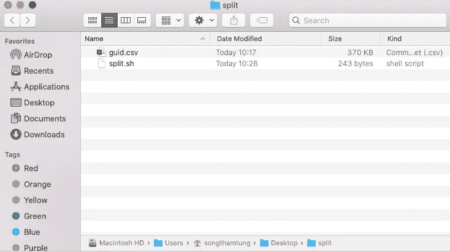
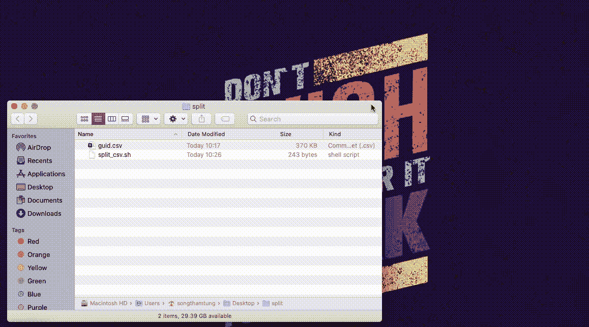
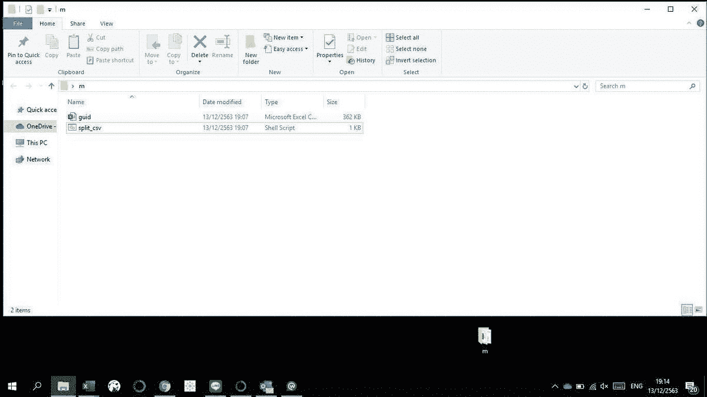

# 如何将一个大的 CSV 文件分割成多个较小的文件

> 原文：<https://betterprogramming.pub/how-to-split-a-large-excel-file-into-multiple-smaller-files-664f18f97900>

## 打破那块巨大的电子表格


照片由[劳伦提乌·约尔达切](https://unsplash.com/@jordachelr?utm_source=medium&utm_medium=referral)在 [Unsplash](https://unsplash.com?utm_source=medium&utm_medium=referral) 上拍摄

在本文中，我们将讨论如何将一个大的 Excel 文件分割成多个小文件。我们将使用的方法是 *shell 脚本。*

# 我们开始吧！

你首先需要一个扩展名为`.csv`的 Excel 文件。如果你还没有准备好，请随意使用我为本教程准备的 10，000 行的 [one](https://gist.github.com/songthamtung/d9ec3157b319329f78aa98ef64394673) 。

您需要的第二件事是带有`.sh`扩展名的 shell 脚本或文件，其中包含用于分割 Excel 表的逻辑。我在下面分享了 shell 脚本，您可以下载或者复制并粘贴到文本编辑器中。如果你选择后者，一定要保存为`split_csv.sh`。

这里有两件重要的事情需要注意:

*   第 2 行包含`FILENAME`，您可以根据自己的需求进行修改。
*   第 4 行包含要拆分的行数。在本例中，shell 脚本将把 Excel 文件分割成较小的文件，每个文件包含 1，000 条记录。

太好了！既然我们已经准备好了示例 Excel 文件和 shell 脚本，下一步就是执行。

# 死刑



创建一个新文件夹，并将 CSV 和 shell 文件移动到其中

我们将开始创建一个新文件夹，并将`.csv`和`.sh`文件移入其中。

## 苹果个人计算机

1.  开放终端。
2.  类型`CD`。
3.  将文件夹名称拖放到终端中。
4.  进入。
5.  类型`./split_csv.sh`。

需要视觉效果？我还在下面附上了一个 GIF 来帮助说明这些步骤。



## Windows 操作系统

1.  用`guid.csv`和`split_csv.sh`打开文件夹。
2.  双击`split_csv.sh`。

如果什么都没有发生，请确保您的计算机上安装了 bash。如果没有，下载 bash，然后再试一次，因为这是运行 shell 脚本所必需的。



# 拒绝许可？

授予您的文件超级用户访问权限。

## 苹果个人计算机

```
sudo chmod 755 'split_csv.sh'
```

## Windows 操作系统

```
chmod u+r+x split_csv.sh
```

# 瞧啊。

恭喜你。如果你做的一切都是正确的，你应该看到在同一个文件夹中被`PartN-filename`分开的文件。除了标题之外，每个都包含 1，000 条记录。

要将它应用到您自己的工作中，将您想要处理的文件移动到与`split_csv.sh`相同的文件夹中，修改 shell 脚本，并运行它。

感谢阅读！