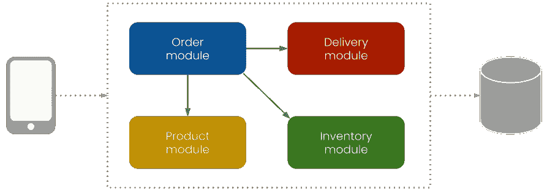
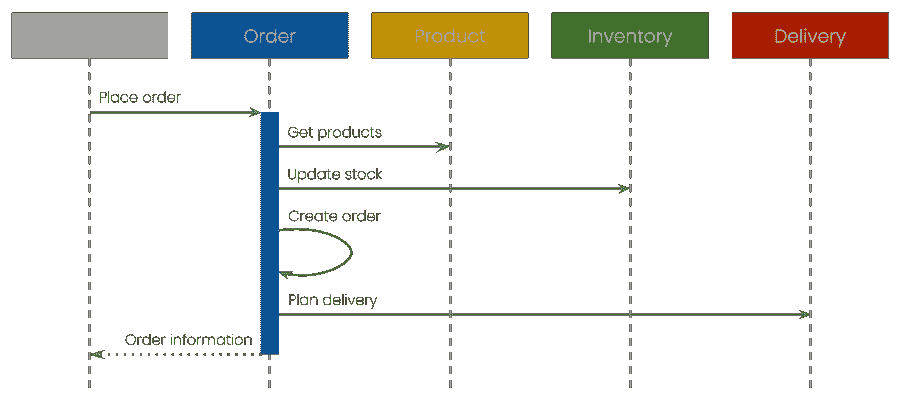
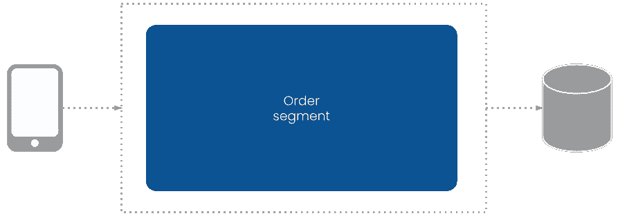
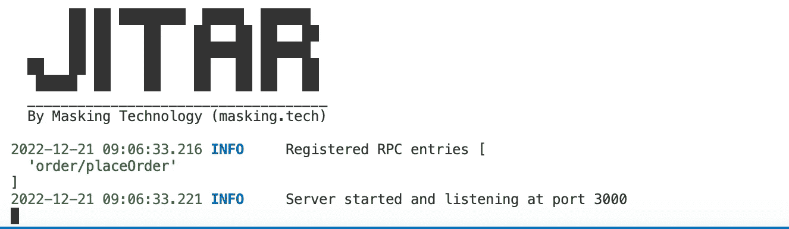
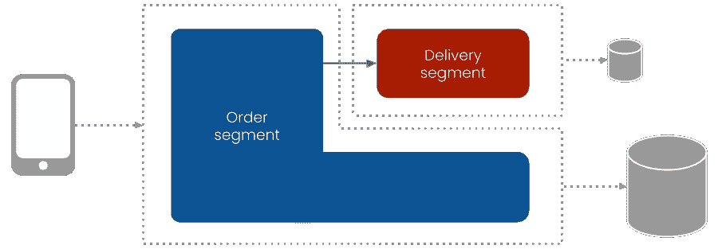
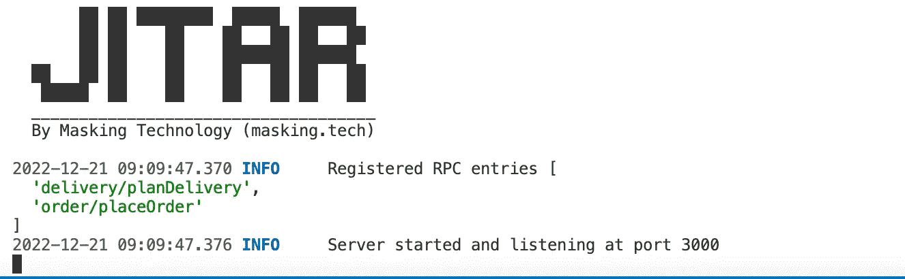
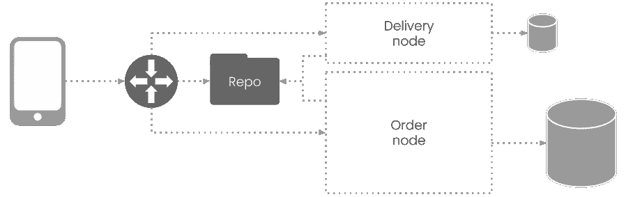
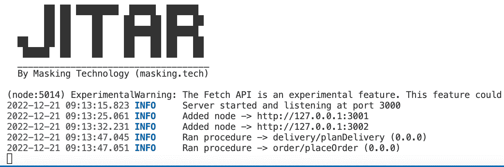

# 如何用 Jitar 将一个整体分割成微服务

> 原文：<https://betterprogramming.pub/how-to-split-a-monolith-into-microservices-with-jitar-95caf6f81e08>

## 了解如何使用 Jitar 运行时将整体转化为微服务，而无需重构


由 [SOULSANA](https://unsplash.com/@soulsana?utm_source=medium&utm_medium=referral) 在 [Unsplash](https://unsplash.com/?utm_source=medium&utm_medium=referral) 上拍摄的照片

在我的[上一篇文章](/how-i-split-a-monolith-into-microservices-without-refactoring-5d76924c34c2)中，我写了我迈向一种即时架构风格的旅程，这种风格使我能够在不重构的情况下将一个整体分割成微服务。我发现的关键解决方案是自动化 API 创建和灵活的细分策略的结合。这导致了 [Jitar](https://github.com/MaskingTechnology/jitar) 的产生，它是 JavaScript(和 TypeScript)应用程序的可分发运行时。

在本文中，我想深入构建一个可拆分的整体，并使用 Jitar 运行时将它拆分成微服务。我们将使用上一篇文章中的小型在线商店示例。如果你还没有读上一篇文章，我建议你读一读，但这不是必须的。应用程序和转换将一步一步地解释，这样您就可以跟上了。最终结果也可以在 [GitHub](https://github.com/petermasking/jitar-microservices) 上获得。

开始之前，确保您的机器上安装了[node . js](https://nodejs.org)18.7 版或更高版本。我喜欢类型安全，所以我将使用 TypeScript 作为示例。确保您安装了版本 4.4.2 或更高版本。我使用 [VS Code](https://code.visualstudio.com/) 作为编辑器，但是可以随意使用另一个。另外，我用的是 MacBook。本文中的命令适用于 Mac OS 和 Linux。准备，预备，开始！

# 步骤 1:设置应用程序

我们先仔细看看网店。店后面的公司虽然小，但是分四个部门。每个人都有自己独特的职责。


我们的应用程序将通过以下步骤自动执行订单下达流程:


我们需要创建一个新的 NPM 项目来设置应用程序。

```
mkdir jitar-microservices
cd jitar-microservices
npm init
```

我已经通过初始化进入我的方式使用默认设置。在这里，您可以随意做出其他选择。Jitar 非常依赖 ES 模块系统。Node 默认使用 CommonJS 模块系统，所以我们需要在`package.json`文件中通过将类型设置为`module`来改变这一点。

```
{
    "type": "module",
    /* name, version, description, etc. */
}
```

为了设置 TypeScript，我们需要添加一个配置文件。我们可以使用以下命令:

```
touch tsconfig.json
```

我使用以下配置:

```
{
    "compilerOptions":
    {
        "target": "esnext",
        "module": "es2022",
        "rootDir": "./src/",
        "moduleResolution": "node",
        "outDir": "./dist",
        "removeComments": true,
        "forceConsistentCasingInFileNames": true,
        "strict": true,
        "skipLibCheck": true
    },
    "exclude": ["cache", "dist", "node_modules"]
  }
```

注意，我们需要确保 ES 模块系统被编译器用作输出格式。

当然，我们还需要一个源代码文件夹来存放我们的代码文件。

```
mkdir src
```

现在我们已经准备好识别和设置应用程序模块了。为了简单起见，我们将使用业务能力的[分解](https://microservices.io/patterns/decomposition/decompose-by-business-capability.html)来识别模块。在这种情况下，我们可以将每个部门翻译成一个模块。



为了建立基本的应用程序结构，我们将在源文件夹中为每个模块创建一个单独的子文件夹。

```
cd src
mkdir order product inventory delivery
```

接下来，我们可以看看实现。我已经创建了一个序列图来可视化模块之间的交互。这对我翻译代码总是有帮助。



该图显示，订单模块控制着流程，这意味着它与其他模块有很强的关系。这对于较小的应用程序来说没什么问题，但是较大的应用程序可能会受益于一种更加解耦的方法。

构建应用程序的时间到了。我们将为每个组件创建一个单独的文件。这不是强制性的，但我认为这是很好的实践，因为它避免了在与多个开发人员合作时踩到对方的脚趾。我们需要两种类型的组件:功能组件和数据组件。让我们先创建文件。

```
touch order/placeOrder.ts product/getProducts.ts product/Product.ts inventory/updateStock.ts order/createOrder.ts order/Order.ts delivery/planDelivery.ts delivery/Delivery.ts
```

我们将从编写主要的功能组件开始，它实现了 place order 流程。我们将为实现创建一个调用其他模块中的函数的函数。

```
// src/order/placeOrder.ts
import { planDelivery } from '../delivery/planDelivery.js';
import { updateStock } from '../inventory/updateStock.js';
import { getProducts } from '../product/getProducts.js';
import { createOrder } from './createOrder.js';

export async function placeOrder(productIds: string[], address: string): Promise<string>
{
    const products = await getProducts(productIds);
    await updateStock(productIds);

    const order = await createOrder(products);
    const delivery = await planDelivery(address);

    return `Your order #${order.id} with ${order.productCount} products `
         + `will be delivered to "${delivery.address}" on ${delivery.dateString}`;
}
```

注意，这个函数和所有其他函数都是异步的。这是一个重要的附加功能，可以拆分应用程序。

接下来，我们将按照调用的顺序实现其他函数。代码如下:

```
// src/product/getProducts.ts
import { Product } from "./Product.js";

const products =
[
    new Product("1", "Product 1"),
    new Product("2", "Product 2"),
    new Product("3", "Product 3"),
    new Product("4", "Product 4"),
    new Product("5", "Product 5")
]

export async function getProducts(productIds: string[]): Promise<Product[]>
{
    return products.filter(product => productIds.includes(product.id));
}
```

为了简单起见，我用一个简单的静态产品列表代替了数据库。对于产品的实现，我们将创建一个数据组件。

```
// src/product/Product.ts
export class Product
{
    #id: string;
    #name: string;

    constructor(id: string, name: string)
    {
        this.#id = id;
        this.#name = name;
    }

    get id(): string { return this.#id; }

    get name(): string { return this.#name; }
}
```

注意，我使用了私有字段来封装数据。产品创建后不能更新，不可更改。在使用分布式系统时，这是一种常见的做法，在不进行重构的情况下分解和扩展应用程序时，这一点非常重要。

```
// src/inventory/updateStock.ts
export async function updateStock(productIds: string[]): Promise<void>
{
    // Update stock per product
    // Throw error if product is out of stock
}
```

出于演示的目的，我已经添加了更新股票函数，但还没有实现它来监视球。

```
// src/order/createOrder.ts
import { Product } from '../product/Product.js';
import { Order } from './Order.js';

export async function createOrder(products: Product[]): Promise<Order>
{
    const id = Math.floor(Math.random() * 1000);

    return new Order(id, products);
}
```

此外，这里有一个使用数据组件创建订单的简单实现:

```
// src/order/Order.ts
import { Product } from '../product/Product.js';

export class Order
{
    #id: number;
    #products: Product[];

    constructor(id: number, products: Product[])
    {
        this.#id = id;
        this.#products = products;
    }

    get id(): number { return this.#id; }

    get products(): Product[] { return this.#products; }

    get productCount(): number { return this.#products.length; }
}
```

请注意，当应用程序被拆分时，数据组件会自动通过网络传输。Jitar 可以序列化主要类型(数字、布尔值等)。)和复杂对象(地图、日期等。).它支持私有字段，只要该对象可以使用构造函数或 setter 来重构。这是我尝试过的其他(反)序列化器失败的地方。

```
// src/delivery/planDelivery.ts
import { Delivery } from './Delivery.js';

export async function planDelivery(address: string): Promise<Delivery>
{
    const today = new Date();
    const tomorrow = new Date();

    tomorrow.setDate(today.getDate() + 1);

    return new Delivery(address, tomorrow);
}
```

我们不想让顾客等太久，所以我们总是第二天送货:-)。

```
// src/delivery/Delivery.ts
export class Delivery
{
    #address: string;
    #date: Date;

    constructor(address: string, date: Date)
    {
        this.#address = address;
        this.#date = date;
    }

    get address(): string { return this.#address; }

    get date(): Date { return this.#date; }

    get dateString(): string { return this.#date.toDateString(); }
}
```

编码部分到此为止。我们拥有启动和运行应用程序所需的所有组件。

# 步骤 2:运行应用程序

为了使用 Jitar 作为运行时，我们添加了它的 Node.js 服务器作为依赖项。

```
cd ..
npm install jitar-nodejs-server
```

因为我们从一个整体开始，所以我们只需要一个包含所有四个模块的后端部分。订单模块是我们的主模块，所以我们可以从订单段开始。



`placeOrder`组件需要向外界公开，以启动流程。我们可以在[段配置](https://docs.jitar.dev/04_basic_features#segmentation)文件中进行配置。拆分应用程序时，我们将创建更多的段文件。因此，我们将首先为这些段创建一个单独的文件夹。该文件夹位于项目根文件夹中。

```
mkdir segments
```

现在我们可以创建第一个段文件。

```
touch segments/order.segment.json
```

并增加以下内容:

```
{
    "./order/placeOrder.js": { "placeOrder": { "access": "public" } }
}
```

段文件的结构与 JavaScript 模块系统非常相似。在这种情况下，我们从`./order/placeOrder.js`导入`placeOrder`。此外，我们将访问权限设置为 public(默认为 private)。

请注意，文件路径是相对于应用程序的源根目录的，它导入编译后的 JavaScript 文件(以。js)。在加载段文件时，Jitar 会将这个组件与其他组件一起导入。

要加载段文件，我们需要配置 Jitar。这是通过创建新的配置文件来完成的。但首先，我们将创建一个新文件夹，因为我们稍后将添加更多配置。

```
mkdir jitar
```

在这个文件夹中，我们将创建第一个配置文件。

```
touch jitar/standalone.json
```

并增加以下内容:

```
{
    "url": "http://127.0.0.1:3000",
    "standalone":
    {
        "source": "./dist",
        "cache": "./cache"
    }
}
```

这将配置一个独立的设置，意味着所有需要的运行时服务都被捆绑到一个 Jitar 服务器实例中。它还告诉 Jitar 从 dist 文件夹中读取编译后的 JavaScript，并将其缓存写入缓存文件夹。

要启动 Jitar，我们需要在源根文件夹中创建一个引导程序。下面是如何做到这一点:

```
touch src/jitar.ts
```

并增加以下内容:

```
import { startServer } from 'jitar-nodejs-server';

const moduleImporter = async (specifier: string) => import(specifier);

startServer(moduleImporter);
```

随着服务器的启动，我们需要提供一个模块导入器，它从本地应用程序上下文而不是 Jitar 上下文中导入节点依赖关系。虽然这背后的理论很有趣，但我现在将细节放在一边。

最后，我们需要向`package.json`文件添加构建和运行脚本。

```
{
    "scripts": {
        "build": "tsc",
        "standalone": "node --experimental-network-imports --experimental-fetch dist/jitar.js --config=jitar/standalone.json"
  },
}
```

我们都准备好了。我们可以使用以下命令测试这两个脚本:

```
npm run build
npm run standalone
```

启动 Jitar 后，您应该会看到类似这样的内容:



请注意，我们的组件已经成功注册为 RPC 条目。这意味着我们可以使用 Jitar 的 [PRC API](https://docs.jitar.dev/05_advanced_features#apis) 来调用它。我喜欢使用 HTTP 文件来创建和共享测试请求，所以我也将在这里创建一个。

```
touch request.http
```

并添加一个测试请求。

```
POST http://localhost:3000/rpc/order/placeOrder HTTP/1.1
content-type: application/json

{
 "productIds": [ "1", "3", "5" ],
 "address": "My Secret Lair"
}
```

这将使用 POST 请求调用组件，请求的主体是产品 id 和交付地址。为了执行，我对 VS 代码使用了 [REST 客户端](https://marketplace.visualstudio.com/items?itemName=humao.rest-client)插件，但是你可以随意使用任何你想要的 API 工具。

如果一切顺利，您应该会得到这样的响应:

```
Your order #952 with 3 products will be delivered to "My Secret Lair" 
on Thu Dec 22 2022
```

这就是设置 Jitar 和运行应用程序的全部内容。我们现在拥有了横向扩展所需的一切。

# 步骤 3:拆分应用程序

在上一篇文章中，我使用了跟踪和追踪特性的引入作为分离和负载平衡交付模块的示例理由(我不是唯一一个一直在刷新的人，对吗？).是时候将这一点付诸实践，将交付模块转变为微服务了。



如图所示，我们需要为交付创建一个单独的分段。像订单段一样，我们需要向 segments 文件夹添加一个段文件。

```
touch segments/delivery.segment.json
```

包含以下内容:

```
{
    "./delivery/planDelivery.js": { "planDelivery": { "access": "public" } }
}
```

当使用`npm run standalone`命令重启应用程序时，我们现在应该看到`planDelivery`组件也已经注册。



当作为独立服务器启动 Jitar 时，它会自动扫描和注册所有的`*.segment.json`文件，并作为一个整体运行应用程序。这在开发应用程序时非常有用，但是要在生产中分离它们，我们需要对 Jitar 进行不同的配置。

Jitar 附带了几个[运行时服务](https://docs.jitar.dev/03_runtime_services)，它们以独立模式组合在一起。要拆分应用程序，我们需要拆分运行时。对于本例，我们可以使用以下设置:



该设置使用三种不同的运行时服务:

1.  用于定位和负载平衡组件的网关
2.  保存和提供组件的存储库
3.  用于加载和运行段组件的两个节点

客户端使用网关作为应用程序的中央访问点。网关将把请求转发给适当的节点。如果你有一些微服务的经验，这应该看起来很熟悉。仓库是我们中间唯一的陌生人，但不要让它欺骗了你。它扮演着最重要的角色。

当一个节点(worker)启动时，它加载分配给它的段的组件。这些组件可以从不在此节点上运行的其他段导入。存储库是片段感知的，并且确切地知道何时提供远程实现而不是实际实现。

我们需要为每个服务添加一个单独的 Jitar 配置来创建这个设置。

```
touch jitar/repository.json jitar/gateway.json jitar/node-order.json jitar/node-delivery.json
```

我们将按照开始的顺序创建它们，从`repository.json`文件中的存储库开始。

```
{
    "url": "http://127.0.0.1:4000",
    "repository":
    {
        "source": "./dist",
        "cache": "./cache"
    }
}
```

这种设置看起来非常类似于独立配置。这是因为独立模式处理其他服务的配置。

接下来，我们将在`gateway.json`文件中配置网关。我们只需要设置存储库的位置，因为节点会在网关上注册自己。

```
{
    "url": "http://127.0.0.1:3000",
    "gateway":
    {
        "repository": "http://127.0.0.1:4000"
    }
}
```

因为我们有两个节点，所以需要分别配置它们。第一个将加载并运行在`node-order.json`文件中配置的订单段。

```
{
    "url": "http://127.0.0.1:3001",
    "node":
    {
        "repository": "http://127.0.0.1:4000",
        "gateway": "http://127.0.0.1:3000",
        "segments": [ "order" ]
    }
}
```

第二个节点将加载并运行交付段，并在`node-delivery.json`文件中进行配置。

```
{
    "url": "http://127.0.0.1:3002",
    "node":
    {
        "repository": "http://127.0.0.1:4000",
        "gateway": "http://127.0.0.1:3000",
        "segments": [ "delivery" ]
    }
}
```

请注意，每个配置在 URL 规范中使用不同的端口。这样，我们可以在同一台机器上运行服务，这对于现在来说很方便。

为了启动服务，我们需要在`package.json`文件中为它们添加脚本。总的来说，脚本部分如下所示:

```
{
    "scripts": {
        "build": "tsc",
        "standalone": "node --experimental-network-imports --experimental-fetch dist/jitar.js --config=jitar/standalone.json",
        "repository": "node --experimental-network-imports --experimental-fetch dist/jitar.js --config=jitar/repository.json",
        "gateway": "node --experimental-network-imports --experimental-fetch dist/jitar.js --config=jitar/gateway.json",
        "order": "node --experimental-network-imports --experimental-fetch dist/jitar.js --config=jitar/node-order.json",
        "delivery": "node --experimental-network-imports --experimental-fetch dist/jitar.js --config=jitar/node-delivery.json"
    },
}
```

测试时间到了。我们还没有接触应用程序，所以我们可以跳过构建步骤。我们需要按照以下顺序从单独的终端启动每个服务:

```
npm run repository
npm run gateway
npm run order
npm run delivery
```

从订单节点开始，我们应该看到它只注册了`placeOrder`组件。交付节点应该只注册`planDelivery`组件。如果是这种情况，那么分段是有效的。我们可以通过再次执行请求来检查这一点。网关应该告诉我们它已经分别运行了这两个组件。



恭喜你！您只是将一个模块转换成了一个服务，而没有进行重构。

从这里开始，很容易为交付服务设置负载平衡。我们只需要启动交付节点一秒钟，三分钟，…时间。这在您的本地机器上不起作用，因为端口已经被使用。但是我们可以将配置复制到一个新文件中。

```
cp jitar/node-delivery.json jitar/node-delivery2.json
```

并在`node-delivery2.json`文件的 URL 中增加端口号。

```
{
    "url": "http://127.0.0.1:3003",
    "node":
    {
        "repository": "http://127.0.0.1:4000",
        "gateway": "http://127.0.0.1:3000",
        "segments": [ "delivery" ]
    }
}
```

不要忘记给`package.json`文件添加一个脚本。

```
"delivery2": "node --experimental-network-imports --experimental-fetch dist/jitar.js --config=jitar/node-delivery2.json"
```

启动节点，看看多次执行请求时会发生什么。

```
npm run delivery2
```

网关现在应该将负载循环分配给两个传送节点。

在当前设置中，订单段包含订单、产品和库存模块。根据您的需要，可以为每个模块创建一个单独的段，并在同一个节点上运行它们。


这可以通过创建新的段文件并将段添加到节点配置中来完成。

```
{
    "url": "http://127.0.0.1:3001",
    "node":
    {
        "repository": "http://127.0.0.1:4000",
        "gateway": "http://127.0.0.1:3000",
        "segments": [ "order", "product", "inventory" ]
    }
}
```

效果与当前的设置相同，但是增加了可部署性的灵活性。如果您正在开发一个供多个客户使用的单租户应用程序，可以配置节点以始终满足当前(云)托管需求。尽可能长时间地在单个节点上运行数据段有助于降低运营成本。

# 结论

Jitar 使开发人员的生活变得更加轻松，因为它无需重构就可以拆分和分发应用程序。这并不意味着构建可分发的应用程序变得超级简单，但是它增加了很多我在别处没有发现的灵活性。例如，应用程序可以作为一个整体来开发，作为微服务来部署。

虽然本文关注的是后端，但是 Jitar 也允许拆分前端。在之前的一篇文章中，我写过如何用 Jitar 创建一个全栈应用程序。那篇文章使用了一个单独的片段，但是也可以像本文一样创建多个片段。

在我结束之前，我想感谢您阅读这篇文章。我总是乐于接受反馈，并乐意回答任何问题。在接下来的文章中，我想深入探讨一些细节，比如处理数据(数据库)、授权等。欢迎建议/请求。

[](/how-i-split-a-monolith-into-microservices-without-refactoring-5d76924c34c2) [## 我如何在不重构的情况下将一个整体分割成多个微服务

### 我通过即时架构风格变得更加敏捷的旅程

better 编程. pub](/how-i-split-a-monolith-into-microservices-without-refactoring-5d76924c34c2)