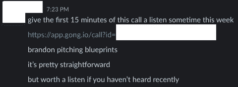
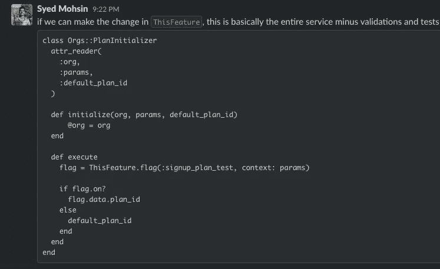
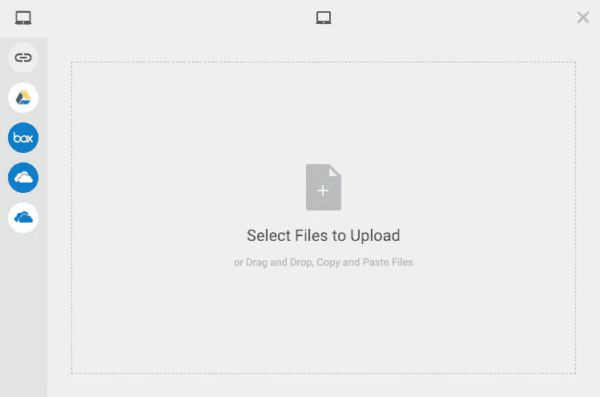
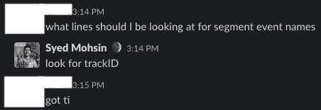
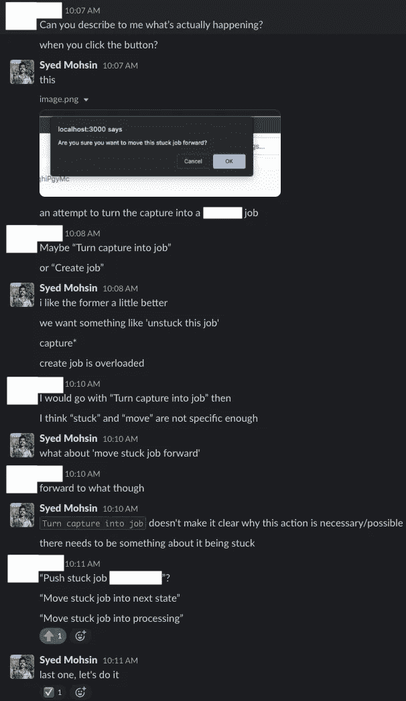

# 如何发现产品经理和工程师之间的良好合作关系

> 原文：<https://betterprogramming.pub/how-to-spot-a-great-product-manager-engineer-partnership-8445f35584e4>

## 我在两个了不起的创业公司的经历

克里斯蒂娜@ wocintechchat.com 在 [Unsplash](https://unsplash.com?utm_source=medium&utm_medium=referral) 上的照片

我很幸运地在两家初创公司和两位出色的产品经理一起工作。我注意到他们都很有创业精神，与我交流过多，并确保我完全投入到我们正在打造的东西中。

我与这些产品经理形影不离；我们一起构建了一些功能，这些功能在一半的时间内产生了数百万个功能，并且只需要资源充足的团队的一小部分人力。

在这篇文章中，我分享了一些让这些伙伴关系如此成功的经验。

# 我们沟通过度

我们分享一切。在我最成功的合作伙伴关系中，我与产品对应人员的交流比其他工程师多。

结果是，我们建立了一个“通用数据集”,使我们能够完全了解我们正在解决的问题，从而做出正确的决策。

从项目经理的角度来看，过度沟通是这样的:

*   来自数据分析的见解
*   为反馈提供不成熟的想法
*   分享客户反馈(电话、电子邮件、应用内调查)

示例:PM 共享业务上下文

从工程师的角度来看，它可以采取以下形式:

*   阐明解决方案的技术方法
*   共享关于数据结构和系统架构的上下文
*   经常分享对各种工作的评估，以帮助确定优先级

示例:工程师共享早期代码来验证评估

# 我们提出跨职能的问题

过度沟通只有在真正好奇和参与的情况下才有效。就彼此的工作提出问题有助于我们产生新的见解，而这是单独不可能实现的。

对于工程师来说，这意味着询问“什么”

对于项目经理来说，这意味着询问“如何”

示例:我正在从一个名为 Filestack 的服务(见下文)构建一个文件上传库的原型。我计划将它用于处理 PDF 上传的特定功能。我分享了该工具如何与我的项目经理一起工作的演示。

文件堆栈的文件选择器用户界面

他对 Filestack 的潜在用例很好奇，并问了许多关于它还能做什么的问题。因此，我们深入研究了 API 文档，发现图像转换和对象识别功能可以帮助我们解决其他业务问题。

虽然我们打算用这个解决方案来解决问题 A，但向我的项目经理展示这项技术使他能够思考如何解决问题 B、C 和 d。

# 我们模糊了角色之间的界限

有了足够的上下文共享和提问，项目经理和工程师就可以模糊他们角色之间的界限，并互相扮演对方的角色(在一定程度上)。

一个很好的例子是，当我的项目经理伙伴通过阅读我们的代码库主动寻找自己的答案。他需要知道现有追踪事件的名称，以构建要素的数据仪表板:

例如:PM 戴上“工程师”的帽子

这节省了我很多时间，因为我不再需要在代码中查找事件名称了！

另一方面，一个好的产品经理也在寻找一个工程师的思想伙伴，而不仅仅是一个可以执行他们愿景的人。只要有可能，我就努力戴上我的产品帽子，深入研究数据，讨论想法，至少提出问题。

在这里，我从工程的角度更深入地探讨了如何贡献产品创意:[如何在没有自我的情况下拥有好的创意](https://medium.com/@syedmohsin/how-to-have-good-ideas-without-an-ego-fc180be5e804)。

# 我们避免“因为我这么说”的决定

伟大的产品经理善于销售。他们知道，获得认同比说服工程师或做出行政决策更有成效。

和我一起工作过的最好的产品经理会以问题的形式提出建议，比如“你觉得 X 怎么样？”或者“做 Y 有意义吗？”

这让我感觉自己是规划过程的一部分，并让我能够影响路线图。当我们达成一个决定时，我做得更好，因为我投入到结果中，而不仅仅是代码。

获得认同不仅仅是项目经理的责任——工程师需要讲述正确的故事来说服产品合作伙伴，解决技术债务或基础设施改善是正确的优先事项。

例如，我们最近想重新想象一个重要的移动应用程序屏幕的 UI(见下面的截图)。不幸的是，屏幕是一个巨大的 3000 多行代码的 React 组件，在目前的条件下很难重构。

理想的基于选项卡的 UX:在实现之前需要认真的重构

然而，由于我们已经就各种代码库的质量和状态进行了过多的交流，因此对于项目经理来说，在我们做出重大改变之前，我们需要对这个屏幕进行重构。否则，我们将无法在最初发布后快速迭代，这让其他移动应用维护者的日子更加难过。

# 最终结果:极快的决策速度

有了以上所有的要素，你就有了加速反馈循环的方法，让你和你的伴侣做出快速和高质量的决定。

以下示例说明了这些行为，当您单击内部支持工具中的一个按钮时，我和我的项目经理试图消除围绕消息传递的混乱。

问题:修复内部用户的混淆警报

这次交流是我们如何做出决定的典型例子。在 3-4 分钟内，我们完成了以下工作:

1.  过度沟通—分享问题的背景，包括屏幕截图
2.  提问——问题是什么？我们可以尝试哪些变化？
3.  模糊角色之间的界限——我们都对正确的产品信息有自己的看法
4.  避免“因为我这么说”——通过提出选项和健康的辩论获得认同

通过这样的互动有了足够的实践，我们变得善于减少决策时间并做出许多决策。这些关键驱动因素使得我们的 PM <>工程师合作关系比更大或资源更多的团队产生更大的影响。