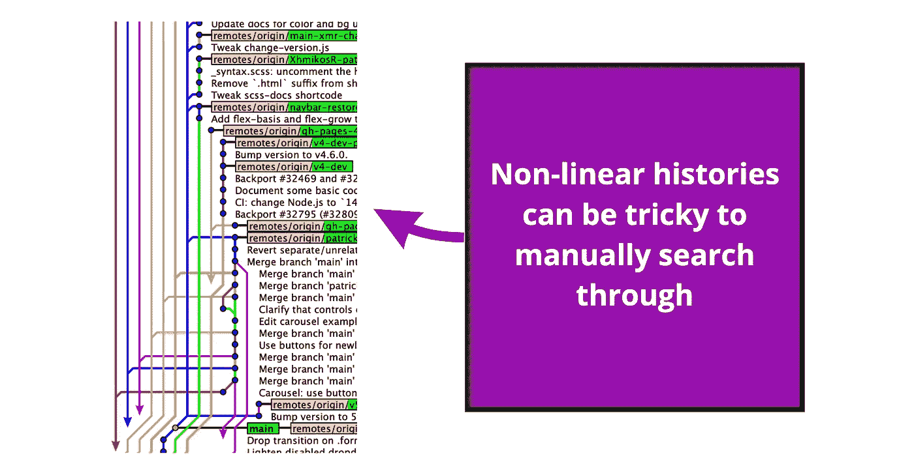
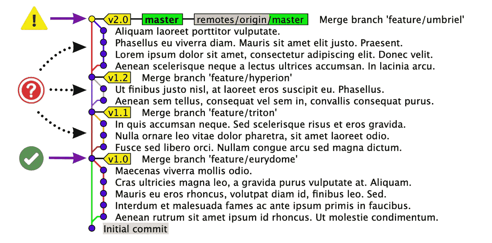
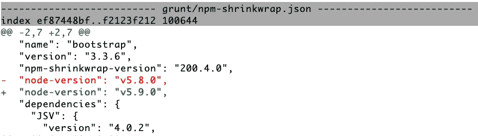
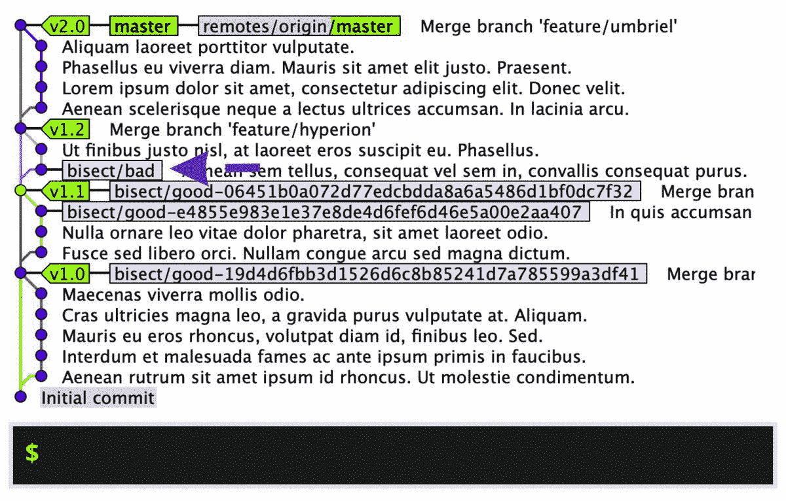
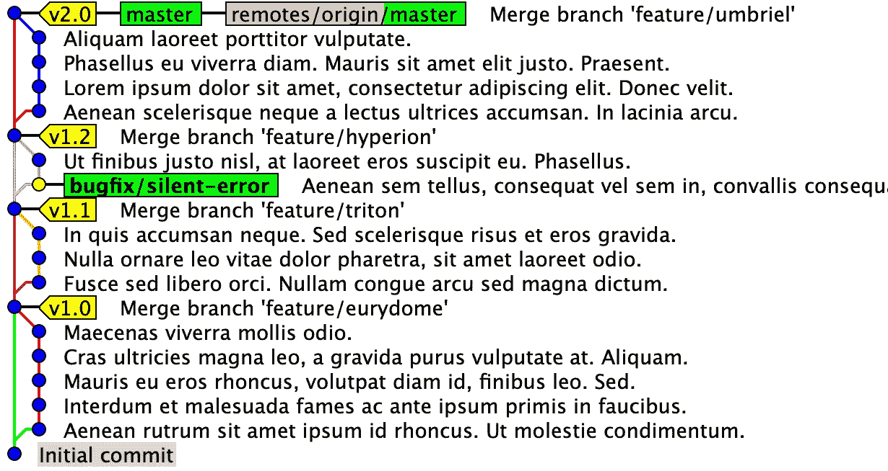
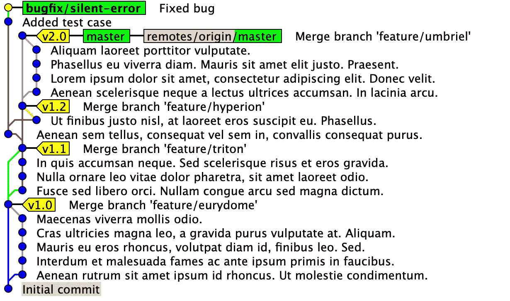
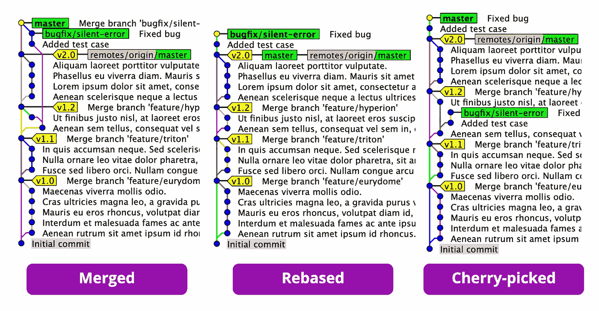

# 如何使用 Git 二分来消灭 bug

> 原文：<https://betterprogramming.pub/how-to-squash-bugs-using-git-bisect-304e1e200819>

## 夏洛克·福尔摩斯捕捉代码库中错误的方法

伊恩·杜利在 [Unsplash](https://unsplash.com/s/photos/pipe?utm_source=unsplash&utm_medium=referral&utm_content=creditCopyText) 上拍摄的照片。

对我来说，调试有两种不同的形式:要么是在常规开发期间完成的日常活动，要么是与解决生产问题相关的更高难度的工作。后者通常需要更多的夏洛克·福尔摩斯式的方法来识别和解决问题。毕竟，它已经生产出来了！

在本文中，我将展示一种久经考验的方法，它可以有效地识别和修复任何潜入代码库的无声错误(或其他问题)。一旦一切就绪，我将通过举例说明准备发布的三种不同方式来结束本文。

如果你已经在软件开发行业工作了一段时间，你就会知道发布完全没有错误的代码几乎是不可能的。这完全是关于权衡测试工作与生产事故潜在负面影响的关系。显然，生产问题的含义越高，就需要更严格的测试来确保它永远不会发生——反之亦然。因此，如果你发现自己处于这样一种情况，你需要识别并修复一个已经进入生产的 bug，这是我建议的福尔摩斯的方法。

在我们开始之前，给我讲一个简短的例子。假设你正在开发一个已经运行多年的 web 应用程序，几乎每天都有新的更新发布。突然，在一个隐蔽的地方发现了一只虫子。从我的经验来看，这些发现通常是由产品负责人做出的(通常是在度假时，他们应该考虑除了产品以外的任何事情)。对话是这样的:

*   PO:“嗨，我刚刚在用户设置部分发现了一个生产 bug。当我尝试更新电子邮件时，没有任何反应。就我记忆所及，三周前我最后一次用它的时候它还能用。能不能请你看一下？”
*   戴夫:“听起来很奇怪，我们已经很久没碰过那部分了。我会调查一下，然后给你答复。对了，你不是应该在休假吗？”
*   阿宝:“是啊，我知道…我就是无法把视线从我们这个可爱的应用上移开！”

如果你幸运的话，这个 bug 很容易被复制和修复。但是其他时候，根本原因是一个很难识别的无声错误——特别是如果问题已经存在了几周甚至几个月。根本原因可能是什么？是因为依赖关系更新吗？还是服务器协议变了？会不会是其他开发者做了一个改变，引起了连锁反应？

每当你不知道从哪里开始，这里有一个结构化和有效的过程来解决这些问题。在概念层面上，步骤如下:

1.  确定错误首次引入的时间(即提交的内容)。
2.  找出导致问题的原因。
3.  创建一个错误修复。
4.  准备释放。

好了，让我们看看行动的步骤！

# 1 .确定何时引入了 Bug(即提交了什么)

当我们只知道漏洞上次工作的大致时间时，我们如何找出漏洞第一次是在哪里被引入的？还记得 PO 上说的“三周前还有效”吗？我们唯一的问题是，从那时到现在，这个 bug 随时都有可能被引入。

这就是`git bisect`的用武之地！

`git bisect`基本上是应用“分而治之”方法的一种自动方式——或者更准确地说是一种[二分搜索法算法](https://en.wikipedia.org/wiki/Binary_search_algorithm)——来查找违规提交。理论上，您可以手动遵循相同的算法，只需在每次尝试时将剩余的提交减半，从工作提交开始向前移动，最终到达违规提交。

然而，如果您在一个具有非线性历史(我们大多数人都是这样)的存储库中工作，知道接下来要尝试哪个提交可能会非常棘手。`git bisect`甚至会为你打理这个流程。

像这样的非线性历史会使手动计算 bug 何时被引入成为一项乏味的任务。这个特定的快照取自[引导数据库](https://github.com/twbs/bootstrap)回购。

正如官方的 [Git 文档](https://git-scm.com/docs/git-bisect)所描述的，从识别存在 bug 的提交开始，注意散列或其他唯一的引用(比如分支名)。如果问题已经进入生产阶段，这很可能是你的主要分支的提示。其次，通过检查和尝试早期版本，找到 bug 不存在的时间点，直到找到工作版本。同样，记下散列(或任何其他引用，如标签)。

确定了两个提交，一个工作，一个中断，是时候开始一分为二，找出是哪个提交引入了问题。

现在，确定了两个提交，一个工作，一个中断，我们准备开始二分过程。检查完中断的提交后，运行`git bisect start`然后运行`git bisect bad`来告诉 Git 这个提交被验证为无效。然后通过运行`git bisect good v1.0`告诉 Git 正在工作的提交(这里，标签`v1.0` 用作参考)。

随着对分过程的开始，Git 将引导您浏览历史记录，并允许您测试尽可能少的提交来找到问题的根源。我们所要做的就是在每一站测试我们的应用程序，并根据结果键入`git bisect good`或`bad`。不要忘记清除所有的依赖项(比如`node_modules`)，并在每次迭代中重新安装它们，以避免可能干扰测试的不必要的副作用。

使用 git 二等分，Git 将引导您通过测试最少量的提交来找到有问题的提交。我们所要做的就是验证每一步的应用程序。

最终，将不再有需要检查的提交，Git 将提示您第一次识别的错误提交的描述。Git 甚至会留下一个名为`refs/bisect/bad`的惟一引用，指向违规提交。

# 2.找出导致问题的原因

现在，随着问题被隔离到单个提交，检查其差异以找出导致问题的原因通常不会花费太长时间。

通过仔细检查已识别提交的内容，您可能会意识到是依赖关系更新导致了问题，或者可能是其他一些具有连锁反应的变化。

一旦你找到了根本原因，运行`git bisect reset bisect/bad`来自动检查已识别的提交，并完全离开二分过程，因为它现在已经达到了目的。

确定了令人不快的提交和根本原因后，是时候离开二分法并解决问题了。

# 3.创建一个 Bug 修复(也许还有一个测试用例)

找到根本原因后，我们现在有两个选择:

1.  检查主分支的尖端并解决问题。
2.  直接从违规提交创建一个新的分支，并在问题第一次出现的地方修复问题。然后，将其纳入主枝的尖端。

这两种方法我都尝试过了，根据经验，我建议首先修复出现的问题。为什么？通过从中断的提交开始，我们已经隔离了一切，这使得修复 bug 变得简单明了。换一种方式做，我们又一次冒了不确定的风险，不知道后来发生的任何事情是否也能推断出来。

在通过检查有问题的提交结束了对分过程之后，是时候创建一个分支并修复问题了。

检查出一个新的分支(`bugfix/silent-error`)后，在开始修复问题之前，现在是创建一个利用已识别问题的测试用例的好时机。这样做有两个好处。首先，它避免了在将来的任何时候再次识别错误。其次，当 bug 被修复并合并回我们的主分支时，看到测试用例通过是确保一切按预期运行的一个好方法。

如果您还没有运行自动化测试，我建议您考虑实现一些自动化测试，因为这将在将来节省您的时间。

在实际修复问题之前添加一个测试用例是一种很好的保护方式，这样您就不必在将来的任何时候去寻找这个特定的错误。

有了新的测试案例和 bug 修正，我们就可以将所有东西整合到我们的主分支中，并为发布做准备了。

# 4.准备发布

好了，我们准备好进行最后一步了！根据所使用的发布和分支策略，这一步在不同的项目中可能会略有不同。您有三个主要选项(甚至更多)可供选择:

1.  直接将`bugfix/silent-error`并入`master`。
2.  将`bugfix/silent-error`重置到`master`上，然后合并。
3.  从`bugfix/silent-error`到`master`挑选提交，然后合并。

以上是完成后的三个选项。

完成后，拿起电话告诉您的 PO，该问题将在下一个版本中解决！

# 结论

如果您已经做到了这一步，我希望您现在已经很好地了解了如何使用`git bisect`有效地识别无声错误——即使您不知道错误最初是何时引入的。

这种技术甚至可以用来识别代码库发生的任何变化，比如性能改进。

感谢你的阅读，祝你好运，找到你夏洛克式的无声错误！