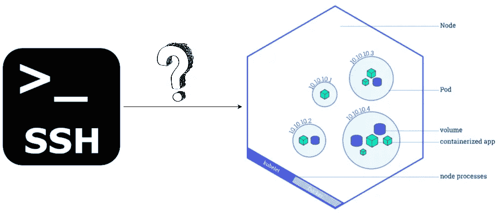
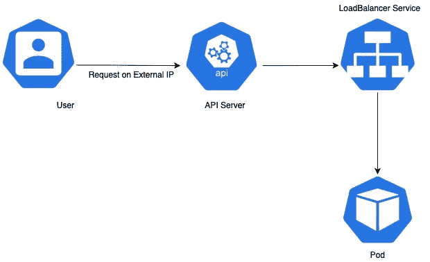

# 如何从集群外部 SSH 到 Kubernetes Pod

> 原文：<https://betterprogramming.pub/how-to-ssh-into-a-kubernetes-pod-from-outside-the-cluster-354b4056c42b>

## 根据定义，Pod 类似于虚拟机，因此我们可以 SSH 进入


照片由[奥尔洛娃·玛利亚](https://unsplash.com/@orlovamaria?utm_source=unsplash&utm_medium=referral&utm_content=creditCopyText)在 [Unsplash](https://unsplash.com/s/photos/go-inside?utm_source=unsplash&utm_medium=referral&utm_content=creditCopyText) 上拍摄

*安全套接字协议层(SSH)* 是一种基于 UNIX 的协议，用于访问远程机器或虚拟机(VM)。

*根据定义，*Pod 类似于 VM，因为它允许容器的行为就像它们在独立的 VM 上运行一样。如果您在集群内部——最简单的方法是使用 kubectl exec 命令

但是，有可能从集群外部通过 SSH 连接到 K8 Pod 吗？



从集群外部 SSH 到 Kubernetes Pod

是的。有可能！—但只有在逐步回答以下问题后…

# 如何可靠地访问 K8 吊舱？

根据定义，pod 本质上是短暂的，服务是一组 pod 的稳定抽象点。因此，可以通过*服务可靠地访问 K8 Pod。*

## **从 Kubernetes 集群外部访问 pod 的合适服务类型是什么？**

`ClusterIP`、`NodePort`和`LoadBalancer`是三种可能的服务类型。

然而，从集群外部永远无法访问`ClusterIP`服务，因此它不是一个选项。

`NodePort`服务提供了一个可以通过集群节点访问的集群范围的端口。但是考虑到节点本质上也是短暂的，`NodePort`不是访问 Pod 的稳定方式。

`LoadBalancer`服务是*唯一适合从 Kubernetes 集群外部访问 Pod 的*服务类型，因为这种服务类型提供了一个外部 IP 地址，可以绑定到一个公共负载平衡器，如 Google 的 HTTPS 负载平衡器。



从外部 IP 到服务于 pod 的负载平衡器服务器的请求

下面是打开 SSH 端口进行通信的`LoadBalancer`服务的片段。

# 如何启用一个 Pod 作为 SSH 服务器？

为了 SSH 到 Pod，Pod 应该安装了 *SSH 服务器*。这可以通过安装 [OpenSSH 服务器](https://help.ubuntu.com/lts/serverguide/openssh-server.html)作为绑定到 Pod 的 Docker 镜像的一部分来提供。

以下命令应包含在与绑定到 Pod 的集装箱相关联的 Dockerfile 文件中。

因此，即使 Pod 是短暂的，它在每次重新创建时都将拥有`openssh-server`功能，并且配置了 SSH 的默认用户。

最后…

# 我们如何从 Kubernetes 集群外部 SSH 到 K8 Pod？

假设 Pod 可以通过服务访问，并且可以通过由公共负载平衡器服务的`LoadBalancer`服务到达；用户可以从 Kubernetes 集群外部通过 SSH 进入 K8 Pod，方法是执行下面的经典`ssh`命令:

```
#Example 
ssh -f testuser@<external-load-balancer-ip-address>(Enter password on prompt to establish the SSH connection)
```

## **替代方法——SSH 密钥代替用户凭证**

如果 SSH 密钥需要用作身份验证机制，那么客户机的公共 SSH 密钥可以作为一个秘密安装到 Pod 上。

这将确保客户端的公钥在 Pod 中作为授权密钥可用，随后，客户端可以通过用客户端的私钥验证 Pod 上的授权密钥来进行连接。