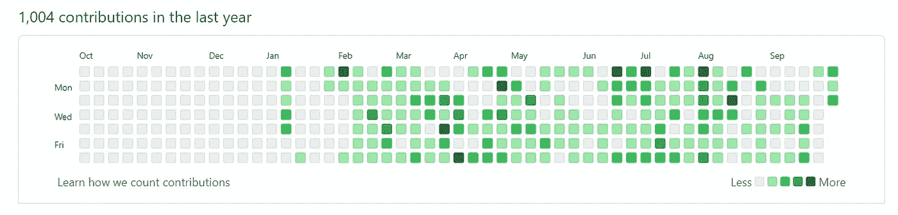

# 如何作为一名计算机专业应届毕业生脱颖而出

> 原文：<https://betterprogramming.pub/how-to-stand-out-as-a-fresh-computer-science-graduate-c376d0218cae>

## 让他们想要你，而不是你需要他们

贝拉·巴克在 [Unsplash](https://unsplash.com?utm_source=medium&utm_medium=referral) 上拍摄的照片

我在各种公司活动中担任过一些软件开发人员职位的招聘经理。我见过“几份”简历出现在我的办公桌上。我遇到过无数渴望竞争初级和高级职位的候选人，尽管他们只有极其缺乏的简历和大学成绩单。

为什么 HR 连成绩单都要，我也不太清楚。我不看他们。在企业界，它们的价值通常非常有限。你的数据结构和算法课程得了 A+对我来说并不重要。为什么？在 Big Data & More，Inc，我们使用库——我们永远不会从头开始编写链表实现。

另一方面，你在操作系统课上得的 C 也不会影响我。为什么？我们是一家数据商店——我们做分析、人工智能和人工智能。

回到简历，大多数计算机科学专业的应届毕业生只有学校作业和小型项目可以炫耀。谢谢你给我看你用 WebGL 做的那个小行星游戏。它是…可爱的。它看起来和今天早上另一个申请人给我看的很相似。哦，你认识她？她是你的队员？大部分工作都是她做的吗？你们两个看起来都不确定，但是你让她领先了。

显然，人力资源部门在最初的审查中可以做得更好。但那是以后的事了。

在学校的时候，我知道你在平衡社交生活、家庭危机、零售工作和堆积在你身上的所有学校工作。如果你想在毕业后的第一天就立即投入工作，你必须做出一些牺牲和有目的的努力，立即开始你的职业生涯。

不要一毕业就开始做这些。甚至不要在走路前几周或几个月就开始。在你大一的时候开始破解这些吧！马上！马上。

# 0)提高你的沟通技巧

*   交谈时看着对方的眼睛
*   微笑
*   先听后说
*   如果你没有抓住或理解信息，要求澄清或重复
*   要真诚，不要自夸
*   简洁地回答问题。不要添加太多的绒毛
*   不要害怕问自己的问题

好吧，你可能已经听过以上所有内容了。这些经典的观点适用于每个人。

# 真正的名单从这里开始

现在，继续列出让你——绿色计算机科学毕业生——脱颖而出的真实名单，甚至可能超过几年前的候选人。

最重要的是，你需要了解你的手艺。我需要相信:

*   你可以编码… *显然*
*   你可以解决编码问题
*   你竟然*喜欢*编码

以下是一些额外的想法，你可以，也应该，用来让你成为毕业班里的长颈鹿。

# 1)构建一个应用程序

它不一定是 iOS 应用商店或 Google Play 上的已发布应用。创建它，构建它，并安装在您的手机上。面试的时候你会带着手机，对吧？花点时间展示一两个应用程序。

这和你们班的 WebGL 小行星游戏有什么区别？你被*要求*制作那个游戏。

我倾向于认为你开发手机应用程序是因为你喜欢这个过程，并且想自己学习。这让我知道，你愿意学习超出你需要知道的最低要求的东西，以通过一门课并获得一个分数。

你建什么 app？尝试一些类型，创建一些使用公共 API 的休闲游戏或应用程序。例如，[谷歌制造了大量的 API](https://developers.google.com/apis-explorer)(地图、地点、位置等)。)可用。一旦你开始探索可能性，你会意识到选择是丰富的。见鬼，还有高中生[在 Roblox](https://www.cnbc.com/2019/09/23/college-student-video-game-creator-made-millions-from-jailbreak.html) 上构建应用！

# 2)制作仿制品

创建 Instagram 克隆。或者 Snapchat 克隆版。创建一个热门应用程序、网站或服务的仿冒品。

它不一定是一个精确的克隆。它不需要做真正产品做的所有事情。尽可能地复制和模拟真实的东西。展示你构建熟悉产品的技能。

《好声音》或类似节目的参赛者通常擅长表演流行歌曲，而不是原创歌曲。原创歌曲必须出色才能让评委兴奋。同样的想法也适用于此。

这是否侵犯了版权和商标？不，因为你创造它不是为了利润或个人利益。好吧，也许有点私利。

如果你模仿你希望找到工作的公司的一个应用程序或网站，就像菲利普·杜博斯创造的[一样，你会得到巨大的加分和勇气。](https://phildub.com/#)

# 3)为开源项目做贡献

编程的哪个领域让你着迷？Web 开发？密码学？人工智能？

我保证无论你关注什么，你都能在 GitHub 上找到一个开源项目。去创建一个帐户，研究项目，并开始贡献和提交拉请求！*等等，你连拉取请求是什么都不知道？*面试的时候不要这么说。

在面试时，*想办法掩饰自己对公众的贡献。给他们看绿色活动图！*

不是我的活动图表

# 4)回答关于堆栈溢出的问题

栈溢出和开发者走在一起就像鱼和水一样。我们这些程序员中有谁没有在堆栈溢出的绿色勾号旁边用 Ctrl+C 找到解决方案？

你有没有停下来想一想是谁在提供所有这些答案？有些人是行业专家，有些人是流行库的创建者，但大多数人只是行业专业人士和喜欢帮助他人解决编码问题的人。他们的经历从几个月到几十年不等。

**在堆栈溢出时创建一个帐户**。开始寻找你能回答的简单问题。然后，用更难的问题来挑战自己，迫使你研究和试验解决方案。在为网站做贡献的过程中，你会获得知识、[恶名和一堆 rep 点](https://meta.stackexchange.com/questions/9134/jon-skeet-facts)。反复得到那个绿色的勾号会让人产生冲动并养成习惯。

当面试官问你的工作经历，而你只列出了你在加油站熟食店的工作经历时，你可以用 Stack Overflow 上的 25，000 点来代替——标签 humblebrag。我保证会有人注意到的。

# 5)了解基本硬件

实际上，我看到新聘用的开发人员惊讶于 HDMI 可以用在显示器上，而不仅仅是电视上。这太令人震惊了，我不得不询问这是怎么发生的。原来他们所有的编码都是在学校的电脑上完成的，那里所有的东西都已经预先连接好了…但是仍然…！

我听说过一些开发人员不知道他们工作中的以太网电缆有什么用，因为他们太习惯使用 Wi-Fi 了。真的吗？！加油！

还有一些人无法真正解释蓝牙、Wi-Fi 和蜂窝数据之间的区别。

现在，这些知识真的是编码所需要的吗？不是直接的。但是我非常大胆地宣称，这些是一个新培养的软件工程师*应该*了解的基本技术。

# 获得某方面的认证

从了解基础知识开始下一步，提升到实际获得行业认可的认证。

几乎所有的东西都有 CompTIA A+。此外，还有大量的 [AWS](https://aws.amazon.com/certification/) 和 [Azure](https://docs.microsoft.com/en-us/learn/certifications/browse/) 认证可以添加到您的腰带上。数据科学领域有自己的收藏品。问问你自己，我感兴趣的领域是什么？我能在我感兴趣的领域获得认证吗？

当然，积累证书并不能保证找到工作。把它们想象成残酷的生活游戏中的徽章——你越有天赋，就越能脱颖而出。

# 7)了解项目管理

大学和学院很少深入研究项目管理的复杂性，尤其是在计算机科学领域。“真实世界”中的软件开发团队不仅仅需要知道如何编码和制作软件；他们通常也参与业务和项目单元。

如果你能使用各种方法，比如瀑布、敏捷、 [Scrum](https://www.scrumalliance.org/) 、看板、Scrumban 等等。，并对他们的相关工具和软件有所了解，你会立即增加你的感知价值。

通常，公司明白大多数大学毕业生将不得不在工作中学习这些概念，但如果这一步可以避免，对他们和你来说都少了一个障碍。

# 8)理解创建软件不仅仅是代码

不仅仅是写代码。还有需求的收集和审查。有功能测试和非功能测试。有部署。有代码审查。有源代码控制。

还有更多。

现在，你不必确切地知道所有这些是如何工作的，特别是因为大多数公司对这些是如何实际完成的会有不同的解释。

你的责任是，在进入面试之前，至少知道高层还涉及到什么，并且你可以围绕这些话题进行一些有意义的对话。

# 9)撰写指导性文章

你应该撰写并自行发表你自己的技术文章，或者通过媒体上的众多出版物发表它们。

下面是一些热门目的地:[扑](https://medium.com/flutter)， [JavaScript in Plain English](https://javascript.plainenglish.io/) ，[更好的编程](https://betterprogramming.pub/)， [Level Up 编码](https://levelup.gitconnected.com/)。还有许多其他的。

你可以写如何在 Flutter 中从头开始构建一个应用程序。你可以写一篇关于 Visual Studio 扩展的评论。你可以通过键盘快捷键来阐述如何使用 VS 代码。

你可以写关于创建一个 Chrome 扩展。如果你实际上不知道如何编写一个 Chrome 插件，但一直想这么做，那么还有什么比写一写更好的学习方法呢？通过教学来学习！如果你的插件变得高评价和受欢迎，这给了你巨大的影响力——想象一下如果你的面试官实际上已经在使用你的插件！

如果你能让面试小组看到一系列精心设计、广受好评的技术文章，你就展示了你的技术能力、沟通技巧以及你在行业中的参与度……所有这些都是面试中的制胜点！

# 10)获得实习机会

如今，被一个实习项目录取往往和获得一份真正的工作一样具有挑战性。最主要的区别在于，人们有一种固有的理解，认为实习生缺乏求职者的许多标准期望。

如果以上九点对获得实习机会有所帮助，那么成功地获得实习生的角色将进一步帮助你获得“真正的”工作。

# 让他们想要你，而不是你需要他们

让自己脱颖而出，这样你就能获得多家公司的聘用。立即掌控你的职业生涯，做你想要的工作，而不是你需要的工作。

就像获得多所大学的录取在很大程度上取决于你在高中的表现和活动一样，你希望这些大学为你的录取而努力，而不是相反。

仅仅在学业上出类拔萃、完成大学教育并期待梦想中的工作会降临到你头上是远远不够的。自己承担责任，按照上面的一些或全部建议去做。在毕业前做好这些，当毕业典礼上的五彩纸屑落地时，你将会取得巨大的进步。

请记住，编写代码的能力是你从大学里学到的很大一部分，但它只是成为备受追捧的软件开发人员的一小部分。