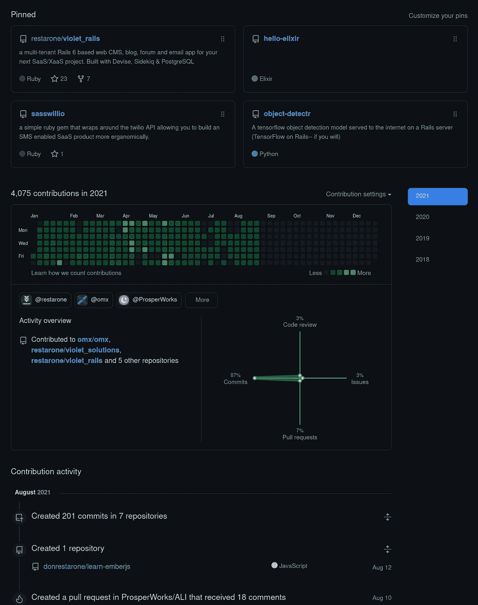
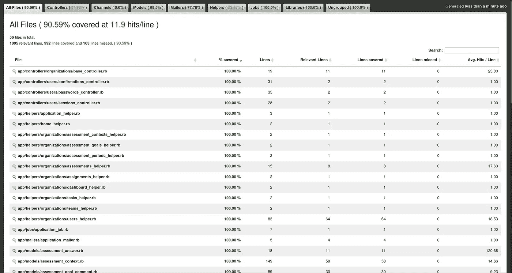

# 作为一个新的开发者如何脱颖而出

> 原文：<https://betterprogramming.pub/how-to-stand-out-from-the-crowd-as-a-new-developer-843f4e9fdeb7>

## 确保你在软件工程领域第一份工作的指南

图片来自[鲁珀特·布里顿](https://unsplash.com/@rupert_britton)

最近，我受邀担任[大会加拿大](https://generalassemb.ly)首届黑客马拉松的评委，并有幸与一些新开发人员交流。

在看到最近毕业的团队制作的产品后，我对三个月的项目浓缩了多少知识印象深刻。开发人员对 MERN (MongoDB、Express.js、React 和 Node.js)堆栈有了工作上的理解，并能够与 UI/UX 设计人员合作，将产品带入生活。

从我的角度来看，要找到工作并开始他们的职业生涯，这些开发人员所要做的就是让合适的人相信他们的能力，他们的才能会得到工作机会的认可。

带着这种想法，我在黑客马拉松之后有机会与开发人员进行一些一对一的交流。在对他们的项目给出个性化反馈后，讨论转向了房间里的大象:被雇用。根据他们的问题，当我将他们的问题和顾虑与我自己的开发历程进行比较时，我注意到了一些让我产生共鸣的事情:

1.  人们普遍认为[式的面试问题/编码挑战](https://hackernoon.com/50-data-structure-and-algorithms-interview-questions-for-programmers-b4b1ac61f5b0)很难，会降低你获得工作的机会。
2.  展示开发运营和系统管理员相关的技能并不简单。
3.  三个月的强化课程是学不完所有东西的，所以毕业后继续高效结构化的学习之旅至关重要。
4.  求职和学习新技能之间的时间管理会让你精力过于分散。

以下是我给他们的建议，排名不分先后:

# 1.创作直观的 GitHub 库

请务必锁定您认为值得展示的存储库(图片由作者提供)

当你希望在专业水平上做出贡献时，代码作者身份是很重要的。删除任何没有工作演示的 GitHub 库，或者包含演示实现的详细 GIFs 图片。这里有一个好的[库的例子，大多数人可以看一看并理解](https://github.com/donrestarone/object-detectr)和[这里有一个次优的](https://github.com/donrestarone/hello-elixir/tree/master/cards)。

要使一个好的存储库变得伟大，请确保包含以下内容:

1.  目录
2.  安装说明
3.  现场演示
4.  明确命名的功能分支和干净的代码
5.  测试套件

一个直观的 GitHub 简介将向潜在雇主表明，你是一个注重细节的代码保管人，对未来的开发人员感同身受。

# 2.进行更好的技术对话

图片由 [**莱昂**提供](https://unsplash.com/@myleon)

> "问题说得好，就解决了一半."—查尔斯·凯特林

作为一名新的开发人员，你周围的很多东西都是新的。驾驭这个新世界的最佳方式是提出正确的问题，而要做到这一点，你需要使用正确的术语进行有效的沟通。

例如，引用应用程序数据库结构的可视化表示的一个更好的方法是将其称为实体关系图(ERD ),而不是数据库图。

一旦你开始使用正确的术语，进行良好的技术对话就成了一种平衡行为。留意听众，为最大的可及性定制语言。如果上下文是功能性的(早期的面试就是一个很好的例子)而不是技术性的，避免使用技术术语或“深入杂草”。你不希望你的观众的眼睛变得呆滞，仅仅因为你渴望在一个新框架的某个晦涩的部分展示你的领域知识。

# 3.学会测试并遵循测试驱动的开发

由 [SimpleCov](https://github.com/simplecov-ruby/simplecov) 生成的测试覆盖报告(图片由作者提供)

我注意到新毕业生(bootcamp 和 comp-sci)交付的实现中的一个差距是测试很差，甚至是未经测试的代码。我评估了一些有经验的开发人员的编码挑战，他们忽略了在他们的解决方案中包含自动化测试。这种情况为一个未经雕琢的新开发人员提供了一个在竞争中领先的机会。

提高语言或框架熟练程度的一个好方法是通过编程来验证您的实现。在你知道如何为它编写测试之前，不要把这个闪亮的新工具添加到你的简历中。

雇主会理解这一点，主要有三个原因。首先，手动质量保证(QA)既昂贵又耗时，所以从中长期来看，无论你能自动化什么都要便宜得多。第二，测试允许代码自我文档化。在大型团队中，这通常是新开发人员熟悉环境的一种方式。最后，一个好的测试套件有助于代码重构，它为你提供了一个紧密的反馈环，并带有检测破坏和回归的防护栏。随着系统的成熟和用户的增多，优化性能成为关键。在没有足够的测试覆盖率的情况下这样做是徒劳的。

关于测试驱动开发(TDD)的初级读本[请看这里](https://www.freecodecamp.org/news/test-driven-development-what-it-is-and-what-it-is-not-41fa6bca02a2/)。

# 4.利用你的经验，学会用它来讲故事

图片来自 [**达留什·桑科夫斯基**](https://unsplash.com/@dariuszsankowski)

我印象深刻的是，我曾经交谈过的一个开发人员对 Linux 主机和 sysadmin 相关的任务非常熟悉。他已经将自己的 portfolio 站点部署到 Linode 上的一个准系统 Linux 盒子上，并手工连接 Nginx 和 SSL 如果你问我，我会说这对于一个新开发人员来说是一个不小的壮举。

令我惊讶的是，他没有考虑过如何以一种看得见摸得着的方式向雇主表达这些技能。我建议获得 AWS 认证，因为他已经熟悉了网络和命令行。但是我认为有更简单的方法来为你的开发者之旅创造一个引人入胜的故事。

如果你向不在同一领域的人描述，像 dev-ops 这样的东西是非常抽象的。但是如果你能够用延时录像或截屏展示它，那么它就变得更容易理解。即使是一篇简单的关于你做了什么和学了什么的博客帖子也能大大证明你的技能。

记录你的旅程，如果它没有任何作用，它至少可以作为你未来自我的参考。

# 5.了解你想要达到的结果需要什么

图片由 [**Element5 Digital**](https://unsplash.com/@element5digital) 提供

一天就那么几个小时；努力学习那些教你广泛适用的设计模式和技巧的技术。

弄清楚你想从事的领域(前端、全栈、数据科学等)。)，展示您在该领域技能的项目类型，以及您实际构建和部署这些项目所需的概念和模式。

有些概念经受住了时间的考验，在未来的许多年里会很好地为你服务。面向对象编程(用 Ruby 或 JavaScript)和关系数据库(PostgreSQL)就是例子。像 data-down actions-up (React)和 flux (Redux)这样的模式可能会存在很长一段时间，并有助于为构建应用程序的未来框架和方法奠定基础。

缩小范围，如果找到一份工作是你的最终目标，那么我会简单地每天申请工作，记录结果，看看你在招聘过程中的不足之处。如果你没有接到面试的电话，你的简历需要改进——如果你在面试后被“捉鬼”,你需要努力把你的故事讲得更好(或者用一种更吸引人、更有说服力的方式)。如果你在技术轮次后没有得到提升，那么你需要注意你在知识上的差距并填补它们。我推荐使用[这样的电子表格](https://docs.google.com/spreadsheets/d/1GTRo4TPzevpjHjIuUbiCesgroDP78La11SgEgfc3yE8/edit?usp=sharing)来跟踪你的进展和成果。

# 6.为自己量身定做一个工作流程，享受其中的艰辛

图片由[贾斯汀·维内玛 提供](https://unsplash.com/@justinveenema)

软件开发围绕着过程，无论是 Git 工作流还是滚动部署。这些过程是为了组织混乱和最大化你成功的机会。

这同样适用于寻求打入市场的新开发商。他们需要开发与他们的优势、他们是谁以及他们的个人情况相适应的流程。

在我旅程的早期，我意识到我喜欢建造东西的刺激感——但讲述我的故事会让我感到不舒服。因此，我遵循的流程是在电子表格上密切跟踪我的工作申请，每天花 2-3 个小时来构建展示我技能的小项目。这个工作流程让我很忙，让我觉得自己有一份全职工作。因为我每天都在做东西，所以它成了我当时忙于面试或求职时的谈资。

拥有一个好的流程只是成功的一半。开发人员的一项经常被忽视的技能是将问题分解成更小部分的能力。一旦你将你的过程(不管是什么)应用于一个更大的问题(例如，被雇用)，你必须有更小的、可实现的里程碑，这样你才能达到你更大的目标。

例如，我在求职过程中的里程碑是获得一次电话面试，然后是一轮技术面试，等等。往往我们设定的目标太抽象，错过了森林找树。通过设定小的、可达到的目标，我们能够看到我们已经达到了什么程度，以及为了前进我们下一步需要做什么。

# 7.无所畏惧，毫无歉意

图片由 [**道格·图尼森**提供](https://unsplash.com/@detea)

正如我之前提到的，在我找工作的早期，我对讲述自己的经历感到不自在，甚至不太擅长。但是随着时间的推移，随着更多的采访，事情开始变得明朗起来。

这方面的转折点是我不害怕失败的结果。拥有成功的机会变得比成功本身更重要。这种无所畏惧的表现形式是，我没有给自己贴上初级软件开发人员/工程师的标签。相反，我会简单地介绍自己是一名全栈开发人员/工程师(取决于招聘启事中使用的术语)。

去掉‘初级’**的标签意味着我可以申请更广泛的工作，消除任何关于成为一名新工程师的先入为主的观念。这个策略很好地保证了我作为首席开发人员的第一份工作。**

**我相信有一些标签对于可见性是很重要的，例如，React Developer、Elixir Developer 等。，但尽量避免给自己贴上大三的标签。**

**我希望这对你的旅程有所帮助，如果我错过了什么，我很想听听你的观点。下次见。**

**Shashike 是一名来自多伦多的软件工程师，也是 Restarone 公司的创始人。当他不开发软件的时候，他在 Lighthouse Labs 指导新开发人员，或者在 Medium 和 YouTube 上创建内容，帮助人们过渡到技术领域。**