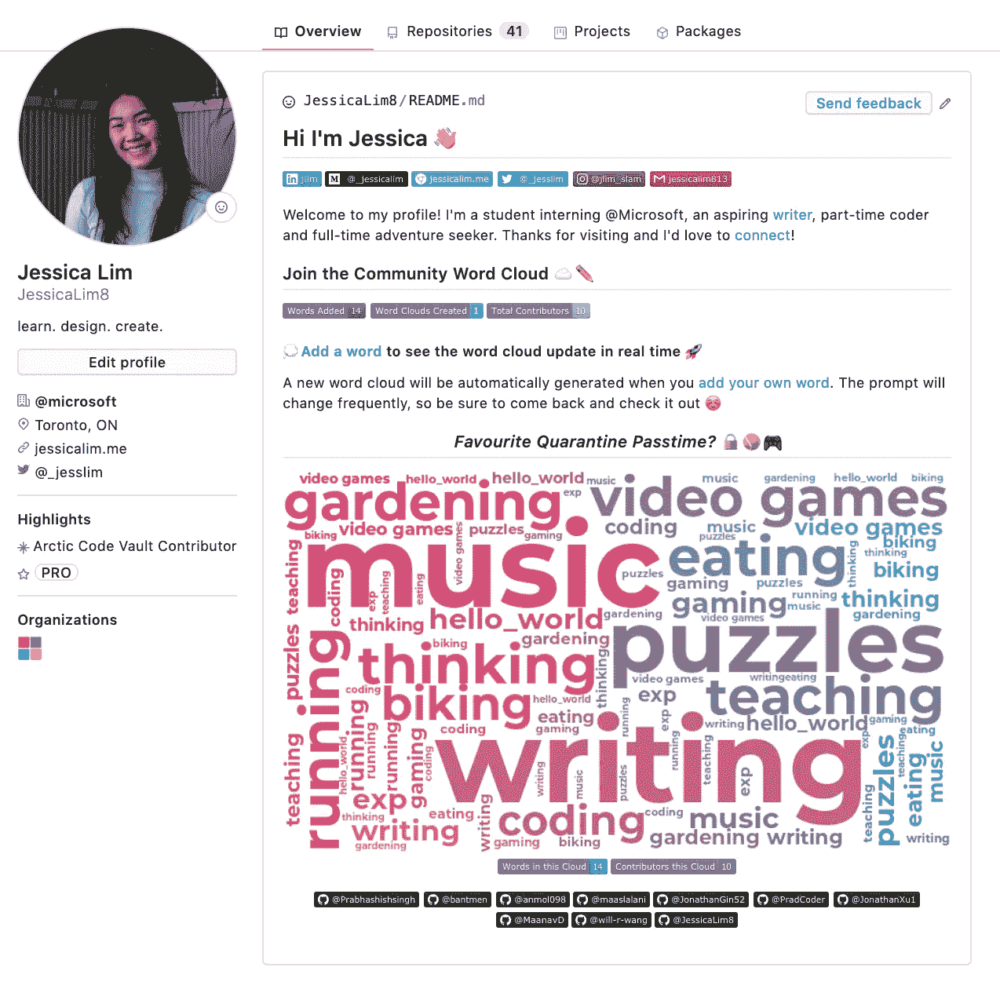
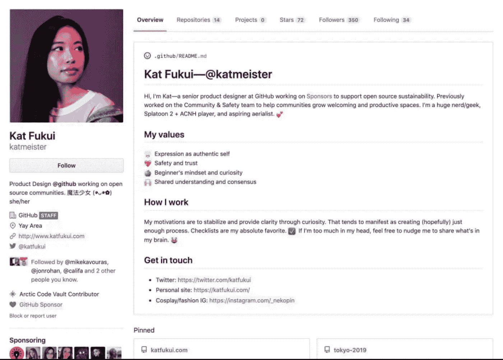

# 如何使用个人资料在 GitHub 上脱颖而出

> 原文：<https://betterprogramming.pub/how-to-stand-out-on-github-with-profile-readmes-dfd2102a3490>

## 把它想象成你的个人网站——除了更容易访问和创建。

Github | [Kinsta](https://kinsta.com/knowledgebase/git-vs-github/)

E 每个程序员都知道 GitHub 是版本控制、辅助项目、开源项目以及其他任何与代码相关的真正的行业标准。

随着 Profile READMEs 的推出，Github 现在是一个一站式商店，不仅可以展示你的技术技能和编程能力，还可以展示你想分享的任何其他关于你自己的东西。

把它想象成一个集创意作品集、个人网站和表现力画布于一身的作品。另外，您的所有代码也在那里！

如果您使用 Github impress 招聘人员、朋友或任何其他接触 Github 个人资料的人，创建个人资料自述文件是脱颖而出的最佳方式！

# 但是首先，什么是自述文件？

自述文件非常简单明了…它是人们在存储库中看到的第一张画布。作为 Github 多年来的一个主要内容，READMEs 会自动呈现在所有代码库的第一页，作为一个页面来总结您的项目，解释任何设置步骤，提供如何贡献的说明等。

个人资料阅读的工作方式是一样的，只是当有人导航到您的 Github 个人资料时，它们不是存储库的第一页，而是突出显示在前面和中心。

> **有趣的事实#1:** Github 个人资料在一天之内就完成了。

# 使用 Github 个人资料阅读器脱颖而出

想象一个个人网站…除了更容易访问，坦白说，更容易创建。

## 展现你的个性

是的，你是一个(伟大的)程序员，但你是一个更伟大的人！

使用您的个人资料自述来展示您的爱好，(也许)您的幽默感，以及许多令人敬畏的个性特征。这是从 Github 社区中脱颖而出的最佳方式！

## 轻松访问您所有的 Github 贡献

曾几何时，Github 档案只是包含在我们网站和简历中的链接。现在，你的代码和个人资料可以放在同一个地方，让招聘人员、朋友和同事更容易了解你的技能和个性。

## 美学上令人愉悦

创建一个非常美观的自述文件是非常容易的。

与个人网站不同，你不需要成为 CSS 的明星来创建一个漂亮的自述文件。对 Markdown(坦白地说，这非常容易)和一些表情符号有了基本的了解，你就可以创建一个你引以为豪的自述文件了。

## 超级灵活

希望创建一份有创意的个人资料/简历？这很简单。有很多很棒的工具可以帮助你让你的个人资料流行起来。想要自动链接您的 Twitter、Medium 或博客更新吗？写个快速脚本就行了。

希望让 Github 社区参与进来？ [Github actions](https://github.com/features/actions) 让你的自述文件变得比以往任何时候都更容易互动。(请参阅下面有关创意自述的更多信息。)

> **酷提示#2:** 如果你在你的个人资料自述文件(或任何回购)中的 Insights > Traffic 下，你可以看到统计数据，如个人资料(或回购)访问者的数量。

[互动简介自述文件](https://github.com/JessicaLim8)使用 Github 动作

# 如何制作个人资料自述文件

**第一步:创建一个与您的 Github 用户名**完全匹配的新存储库(即我的存储库名为 [JessicaLim8](https://github.com/JessicaLim8/JessicaLim8) )。

就是这样！Github 会为您完成剩下的工作！README.md 将在这个特殊的存储库中自动生成。Github 将该文件呈现在 Github 配置文件的顶部，在您固定的存储库和活动的上方。

换句话说，只要疯狂阅读那个自述文件，Github 就会完成剩下的工作，确保它是任何人看到的第一件东西。

> **酷提示#3:** 你可以在 Markdown(。md)文件，因此您可以创建一些非常酷的组件。

# 让您的自述文件更有创意

就像个人网站一样，个人资料基本上是你是谁的快照。选择是无穷无尽的。从创意档案到互动游戏，你可以随心所欲地展现自己！

## 描述性介绍

还记得那时每个人的简历都很无聊吗？个人资料是展示你最自豪的成就的绝佳场所。额外的好处是，由于 READMEs 是一个非正式的创意画布，你可以通过添加有趣的事实、表情符号或任何你内心渴望的东西来展示你的个性。

[描述性个人资料自述文件](https://github.com/katmeister)

## 交互式读物

使用 Github 动作和一点代码，你可以制作一些非常酷的交互式读物。例如，我的个人资料包括一个单词云，允许访问者[添加他们自己的单词](https://github.com/JessicaLim8)并实时更新云。

## 社区游戏

思念好友和桌游咖啡馆？玩一些互动游戏，比如[连接四个](https://github.com/JonathanGin52)和[象棋](https://github.com/timburgan/timburgan)，直接在这些个人资料 READMEs 上与 Github 社区中的其他人对战。

[社区游戏简介自述](https://github.com/JonathanGin52)

## Github 统计

想让所有人都知道你有多少回复？你对你的承诺历史或你的 PRs 感到自豪吗？使用您的 Github 自述文件实时动态突出显示您的统计数据[！](https://github.com/anuraghazra/github-readme-stats)

## 有趣又简单

从令人惊叹的照片到酷酷的 gif，再到 Spotify 的“正在播放”徽章……几乎什么都有。不一定要疯狂或复杂。一些最酷的简介非常简单。

这些只是我看到的一些创造性的想法…世界是你的牡蛎。利用简介展示你的个性。

需要更多灵感？看看这个棒极了的 [Github Repo](https://github.com/abhisheknaiidu/awesome-github-profile-readme) ，里面有一堆很酷的读物。

欢迎来到 Profile READMEs:向下一个无意中看到你的 Github 个人资料的人展示你的个性和技能的完美空白画布。

现在准备好你的键盘，开始画画布！

# 资源

*   减价的基本指南:[减价备忘单](https://guides.github.com/features/mastering-markdown/)
*   让你的自述更有趣的表情符号:[表情符号指南](https://gist.github.com/rxaviers/7360908)
*   简单且可定制的徽章: [Shields.io](https://shields.io/)
*   动态概要文件的资源: [Github 动作](https://github.com/features/actions)
*   一些很酷的简介读物:[很棒的读物](https://github.com/abhisheknaiidu/awesome-github-profile-readme)

如果你对 github.com/JessicaLim8 感兴趣，请查看我的个人资料。