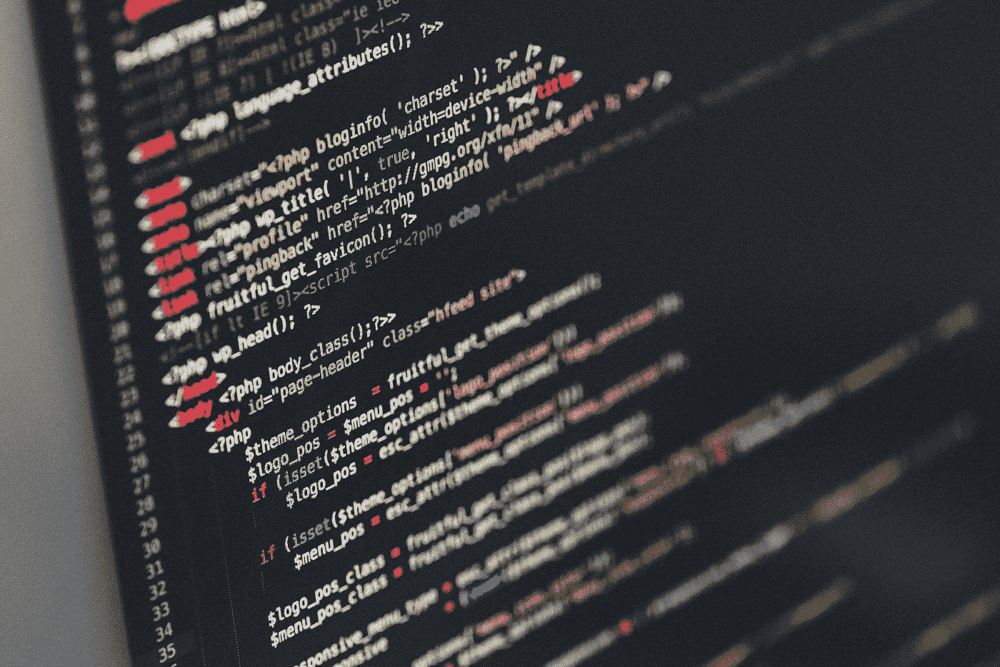

# 2019 年如何开始编程

> 原文：<https://betterprogramming.pub/how-to-start-programming-in-2019-cb1c12b14e0d>

## 克服你的恐惧，开始吧！

图片来自 [Pixabay](https://pixabay.com/?utm_source=link-attribution&amp;utm_medium=referral&amp;utm_campaign=image&amp;utm_content=1839406) 的[像素](https://pixabay.com/users/Pexels-2286921/?utm_source=link-attribution&amp;utm_medium=referral&amp;utm_campaign=image&amp;utm_content=1839406)

好的，所以你读了我的关于[你不需要成为天才来编码](https://medium.com/swlh/you-dont-have-to-be-a-genius-to-code-b1c895800cb5)的帖子。你也读过我的帖子，关于[你还不至于太老而不能开始编程](https://medium.com/javascript-in-plain-english/are-you-too-old-to-code-c8fa5761658)。你甚至读过我的关于[编程语言不重要](https://medium.com/swlh/programming-languages-dont-matter-fa9fd0ecfa4f)的帖子。

我已经成功地说服你参与未来，你已经准备好开始了，但是怎么做呢？

2019 年是一个开始你编程之旅的怪异时间。这是一个有趣的二元世界，你们都比历史上任何时候都拥有更多的可用资源，矛盾的是，所提供的信息的绝对数量可以完全压倒一切。

随着我们开始将不同的编码角色划分到狭窄的筒仓中，情况变得更加复杂。前端、后端、UX 设计师、UI 开发人员、全能的“全栈”开发人员、数据库管理员、本地开发人员、移动开发人员等。—足以把任何一个新人冻在原地。

让我们从一开始就马上解决所有这些问题。事实是，几乎所有这些角色都比看起来有更多的共同点。它们都涉及到编程，只是当你决定了作为一名开发人员什么最让你兴奋时，你可以选择进入的专门子集。

在发展技能之前，你不必决定你要用你的技能做什么，尽管一些途径会更容易通向其他途径，正如我们将看到的那样。

# 从基础开始

一些核心原则存在于每一种编程语言或角色中。逻辑、流控制、比较、变量、数据结构等等都是通用的概念，在任何编码环境中你都需要知道和理解。

好消息是，尽管它们的名字可能令人生畏，但这些想法都不难理解。

花时间去理解编程语言的基本构件将会让你以你希望的任何方式编码。您如何开始使用这些工具？

我最常指引新来的人去 FreeCodeCamp.org。( [freeCodeCamp](https://medium.com/u/8b318225c16a?source=post_page-----cb1c12b14e0d--------------------------------) )除了是他们所做的事情的超级粉丝之外，我和他们没有任何关系。

他们提供了数以千计的教程，涵盖了非常基本的概念，一直到更高级的算法挑战，这些挑战将被翻译成如此多的语言。

通过他们的一些教程和编码挑战，你将走上一条很好的道路，开始选择你的编程生涯或爱好的方向。

# 决定什么让你兴奋

一旦你开始掌握一些编程技巧，你就需要问自己:“编码让你兴奋的是什么？你喜欢制作非常酷和有趣的网站吗？”

或者，也许您对构建让用户做事情的应用程序更感兴趣。你认为这些是 web 应用程序还是你想为 Windows/macOS/Linux 编写？

也许你真的被为物联网编写代码的想法所吸引，这是一个正在爆炸的行业。

有这么多途径可供选择，但最终让你兴奋的是激励你开始认真学习 it 所需的所有更加深奥和专业的编程类型的途径。

也许所有这些途径都让你兴奋，在这种情况下，你有很多东西要学，但你会爱上其中的每一分钟！

让你的兴奋引导你。它不会误导你。这种兴奋会让学习过程保持新鲜和鼓舞人心，而不是感觉像一件你必须完成的苦差事。

# 找一个导师

一旦你认为你已经掌握了你想把你的职业/爱好带向何处，就在那个领域找一个合格的导师。对许多人来说，这可能是一个令人生畏的步骤，但我向你保证，没有什么比一个好的导师更能帮助你快速前进。

你的导师不一定是本地人。现在，许多编码应用程序都内置了对等编程，你可以在网络论坛、Stack Overflow、脸书小组、Twitter 等网站上找到某人，请他们每周花一点时间帮助你理解困扰你的事情。

一直问人，直到找到人。外面有很多人会帮助你，你只需要找到他们！

当然，你可以自己做，但是你为什么要做呢？我不知道有多少次，我花了几天的时间阅读和阅读一些概念，但仍然没有理解它，只是为了让别人在五分钟内用一种让我明白的方式给我解释。

利用这些机会。你的时间花在下一件事情上比不理解你当前的事情而去撞墙要好得多。

导师可以是你保持前进动力的捷径！

# 建造一些东西

一旦你学会了一些基本原则，决定了什么让你兴奋，并找到了一位导师来帮助你前进，是时候建立你的第一件事了！你可能觉得还没有准备好，这可能是一个可怕的步骤，但选择一些小的东西，并建立它。

在这一点上，你所构建的东西的最终用途或复杂性是无关紧要的。这一步是关于你的第一个项目。没有什么比看到你的第一个项目从头到尾完成更好的了。

这可以是像无处不在的“待办应用程序”一样简单的东西，一个关于你奶奶的饼干的网站，或者只是让一个 Arduino 上的 LED 闪烁。

对于一个新的开发者来说，学习从想法到工作项目的步骤是非常宝贵的。它可以建立如此多的信心和动力，作为一个新的程序员，这些将使你继续前进和成长！

# 结论和资源

在我结束这篇文章之前，我想为新程序员列举一些其他资源。网络上有成千上万的开发者博客，媒体上的文章可以帮助你提高技能。

YouTube 有数千名出色的开发人员，他们花时间构建了令人惊叹的教程系列，可以带你完成学习某种语言或框架所需的步骤。

利用所有这些免费资源来充实你的技能，并学习程序员反复面临的问题的久经考验的解决方案，这样你就不会发现自己在重复发明轮子。

2019 年可以学编程。不要让信息超载吓跑你！

有了一些坚实的基础和一位导师来引导你的激情，你可以建立一个令人难以置信的职业生涯或非常令人满意的爱好编程；你只需要迈出第一步！