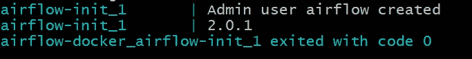
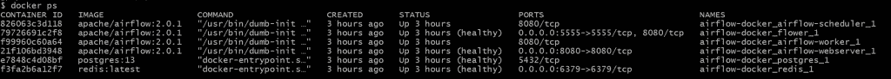
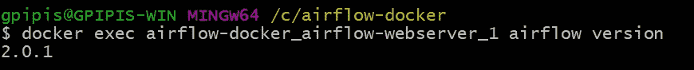
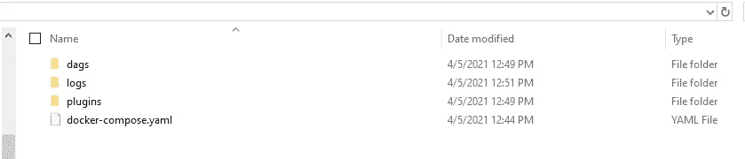

# 如何在 Docker 中开始运行 Apache Airflow

> 原文：<https://betterprogramming.pub/how-to-start-running-apache-airflow-in-docker-6567d8165653>

## 5 分钟后开始在 Docker 中运行气流


阿诺德·弗朗西斯卡在 [Unsplash](https://unsplash.com?utm_source=medium&utm_medium=referral) 上拍摄的照片

[](https://jorgepit-14189.medium.com/membership) [## 用我的推荐链接加入媒体-乔治皮皮斯

### 阅读乔治·皮皮斯(以及媒体上成千上万的其他作家)的每一个故事。您的会员费直接支持…

jorgepit-14189.medium.com](https://jorgepit-14189.medium.com/membership) 

启动 Airflow 最简单快捷的方法就是在 Docker 中用`[CeleryExecutor](https://airflow.apache.org/docs/apache-airflow/stable/executor/celery.html)`运行它。我们假设您对 Docker 有基本的了解，并且已经在您的计算机上安装了 [Docker 社区版(CE)](https://docs.docker.com/engine/installation/) 。

# 创建气流文件夹

创建一个 Airflow 目录很方便，你可以在里面放你的文件夹(比如`dags`等等)。).因此，打开您的终端，运行:

```
mkdir airflow-docker cd airflow-docker
```

我创建了一个名为`airflow-docker`的文件夹。

# 下载 docker-compose.yaml 文件

要在 Docker Compose 上部署 Airflow，您应该获取`[docker-compose.yaml](https://airflow.apache.org/docs/apache-airflow/stable/docker-compose.yaml)` 文件。所以让我们用`curl`命令下载它。

```
curl -LfO 'https://airflow.apache.org/docs/apache-airflow/2.0.1/docker-compose.yaml'
```

容器中的一些目录是挂载的，这意味着它们的内容在您的计算机和容器之间是同步的。

*   你可以把你的 DAG 文件放在这里
*   `./logs`:包含任务执行和调度程序的日志
*   `./plugins`:你可以在这里放置你的[自定义插件](https://airflow.apache.org/docs/apache-airflow/stable/plugins.html)

该文件包含几个服务定义:

*   `airflow-scheduler`:[调度器](https://airflow.apache.org/docs/apache-airflow/stable/scheduler.html)监控所有任务和 Dag，一旦它们的依赖关系完成，就触发任务实例
*   `airflow-webserver`:在`[http://localhost:8080](http://localhost:8080.)`可用的网络服务器
*   `airflow-worker`:执行调度程序给定任务的工作者
*   `airflow-init`:初始化服务
*   `flower` : [用于监测环境的花卉 app](https://flower.readthedocs.io/en/latest/) 。`[http://localhost:8080](http://localhost:8080.)` [有。](http://localhost:8080.)
*   `postgres`:数据库
*   `redis`:[Redis](https://redis.io/)代理，它将消息从调度器转发到工作器

# 初始化环境

要初始化环境，请运行以下命令:

```
docker-compose up airflow-init
```

初始化完成后，您应该会看到类似下面的消息:



# 运行气流

您可以通过运行以下命令开始运行 Airflow:

```
docker-compose up
```

如果您想确保容器正在运行，您应该打开一个新的终端并运行:

```
$ docker ps
```



# 访问 Web 界面

一旦集群启动，您就可以登录到 web 界面并尝试运行一些任务。网络服务器在`http://localhost:8080`可用。默认账户有登录名和密码`airflow`。


# 如何与 Airflow 命令行交互

在运行命令`docker ps`之后，我们获得了正在运行的容器的名称和 id。如果我们想与一个特定的容器交互，我们可以运行`docker exec <container_name> <command>`。让我们来看看气流版本:

```
docker exec airflow-docker_airflow-webserver_1 airflow version
```



请注意，在您的`airflow-docker`文件夹中，您应该会找到以下文件和文件夹。



# 清理

要停止和删除容器、删除包含数据库数据的卷以及下载映像，请运行:

```
docker-compose down --volumes --rmi all
```

# 你准备好运行你的第一个 DAG 了吗？

如果你觉得已经准备好运行你的第一个 DAG 了，你可以看看我们的演练教程。

# 参考

[1] [阿帕奇气流](https://airflow.apache.org/docs/apache-airflow/stable/start/docker.html)

[](https://jorgepit-14189.medium.com/membership) [## 用我的推荐链接加入媒体-乔治皮皮斯

### 作为一个媒体会员，你的会员费的一部分会给你阅读的作家，你可以完全接触到每一个故事…

jorgepit-14189.medium.com](https://jorgepit-14189.medium.com/membership) 

*最初发表于*[*【https://predictivehacks.com】*](https://predictivehacks.com/how-to-start-running-apache-airflow-in-docker/)*。*