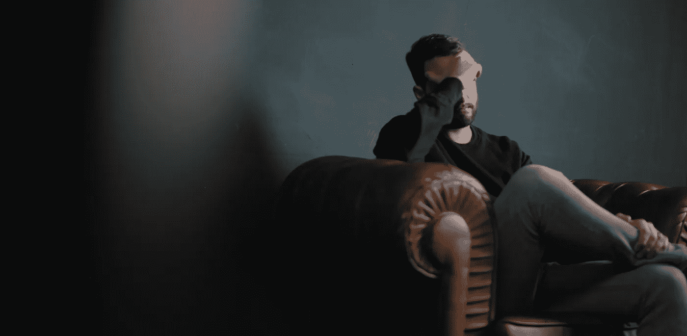

# 如何与在家工作的同事相处愉快

> 原文：<https://betterprogramming.pub/how-to-stay-happy-working-from-home-in-an-outbreak-f0257fca7c34>

## 出去逛逛，远程聊天

Nik Shuliahin 在 [Unsplash](https://unsplash.com/s/photos/sad?utm_source=unsplash&utm_medium=referral&utm_content=creditCopyText) 上拍摄的照片。

“尽管如此，我们要求你们所有人都呆在家里，远程工作。”

抛开对这次爆发的恐惧，你是幸福的。偶尔在家工作很有趣。你不必与交通作斗争，也不必站在拥挤的火车上。

第一天来了，你穿着运动裤打开电脑。你带着你的早餐和你的狗。你今天收获颇丰！你没有嘈杂的办公室或一堆会议。

但是到了周末，在家工作的光辉就黯淡了。你唯一的人际接触是你的会议，那是会议。你不能谈论你的一天过得怎么样，天气或者体育赛事。不要谈论饮水机。而且世界上什么事都没有！

这不正常，也不健康。我们需要[水冷器对话](https://careerbuzz.prosky.co/articles/the-importance-of-water-cooler-talk)。社交是健康的。好消息是:

我们有技术。

如果你在远程工作，你有视频聊天的技术——可以通过 Zoom(我们最喜欢的)、Google Meet/Hangouts 或 Slack 视频聊天。但是你有没有在工作的时候和人一对一的打电话只是为了聊天？大概不会。我没有。

现在是时候了。以下是我和我的公司在这些压力非常大的时候用来保持社交和快乐在家工作的一些技巧。

# 有问题吗？进行视频通话

让我们从一个简单的开始。如果你像我一样是一名软件开发人员(这应该仍然适用于许多其他工作)，你会遇到问题并向同事寻求帮助。你要么滚向他们的办公桌，要么给他们发信息。

如果你在家工作，你将从一个松弛的消息开始。但现在是时候放开手脚加入视频通话了。一旦你来回看了十条信息，就赶紧打电话吧！你不仅会更快地解决问题，而且你还有一个偷懒的好机会！这对你有好处。我保证。

# 虚拟午餐约会？

我真的很怀念和同事一起吃午饭的日子。只是聊天和吃饭是一天中很好的休息。在家工作时，可能很容易将一整天混在一起。也许你不会停下来吃午饭。

但是[你应该](https://www.lvb.com/give-break-studies-show-workers-stop-lunch-energy-productive/)。你也应该聊聊天！如果你有一个固定的午餐小组，在吃饭的时候给他们发一个虚拟邀请和视频聊天。收回你的午休时间！

或者，如果你真的很喜欢社交，并试图营造一种“开放式午餐室”的氛围，向每个人发出邀请，一起吃一顿虚拟午餐。让人们来去自由——就像在现实生活中一样。

# 站起来…在一天结束的时候？

在大多数日子结束时，我只是和我的同事聊天，这是不会发生的事情。

所以我的团队开始采用我们称之为“结束”的方法，这与以站立开始你的一天正好相反。基本上，在结束一天的时候，聊聊工作进展如何之类的。关键是你的团队或任何一群人进行视频通话时都没有议程。

我曾经花了整整一天时间摆弄 [Zoom 的虚拟背景](https://support.zoom.us/hc/en-us/articles/210707503-Virtual-Background)功能。

# 无缘无故就视频聊天

给某人发短信，看看他们是否只是觉得无聊。也许在下午 4 点或 5 点，和你聊天最多的人。谈谈你在隔离期间玩什么电子游戏或棋盘游戏来打发时间。你可能只是笑一笑。

# 结论

所以也许你读了其中的一些，有些焦虑。这可以理解。也许你以前从未远程工作过。也许你从来没有视频聊天的乐趣。

视频通话本质上不同于对话。跟人视频通话感觉是件大事！你会觉得你可能在浪费工作时间，我认为这种感觉在家里被放大了。

但是在视频通话中进行一次有趣的对话应该没什么大不了的。这不是浪费时间。你的公司投资于你的幸福(嗯，他们应该这样)，人际交往是这个等式的一部分！

放下焦虑，不要和你的同事失去联系。

感谢您的阅读，并在这些艰难的时刻保持安全！