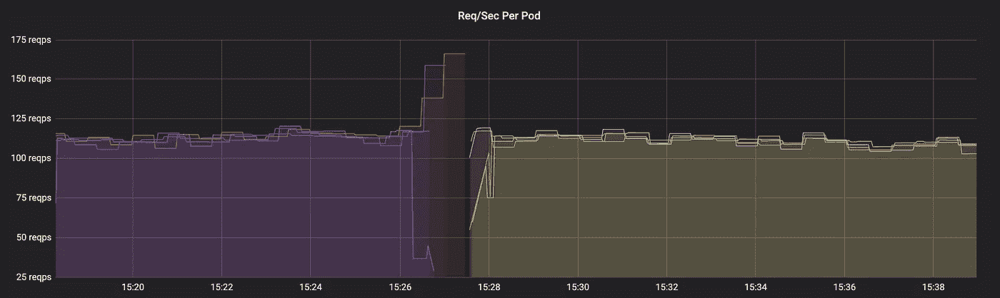
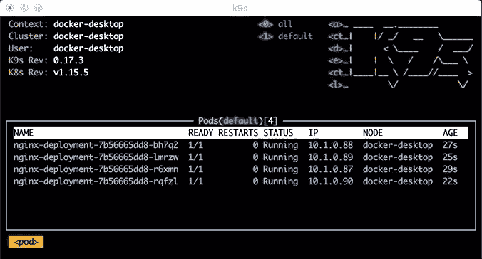
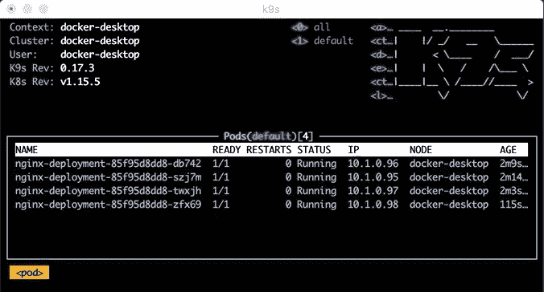

# 如何在部署期间阻止 Kubenetes 给应用程序添加剂量

> 原文：<https://betterprogramming.pub/how-to-stop-kubenetes-from-dosing-your-application-during-deployment-42672b4dfa42>

## 深入了解 K8s 部署

没有正确的上下文，图表可能会很吓人。上图显示了特定应用程序每秒发送到 Pods 的请求数。

可怕的是，这个应用程序每秒只能接收大约 120 个请求。红线最大值是 166，紫色的也不远了。实际上，这是对这些应用程序的拒绝服务。

本文探讨了 Kubernetes 为什么这样做，以及如何防止这种情况。

*   DOS —拒绝服务，一种使资源不可用的网络攻击，通常通过向系统发送大量请求来实现。参见[维基百科](https://en.wikipedia.org/wiki/Denial-of-service_attack)了解更多信息。

# 那么，这是怎么回事？

该图的时间范围大约是这个应用程序发布的时间，一个新版本被部署到 Kubernetes (K8s)集群。它是使用 K8s `deployment`部署的，该 K8s`deployment`处理优雅的卷展，但是如本例中的图表所示，它并不优雅。

每个吊舱在图上是一条不同的彩色线，在 15:28 之前，你可以看到新的彩色线出现。这是新版本的应用程序带来了新的 Pods。

在发布之前和之后，每个 Pod 的每秒请求数是稳定的，Pod 收到的请求数大致相同。

可悲的是，就在发布之前，一个 Pod 显示它的流量少得多，而另外两个 Pod 看起来流量大得多。这与 K8s 默认部署方式有关。

# Kubernetes 部署策略

K8s 有两种方法对部署进行更改。他们是*滚动更新*和*再造*部署。

重新创建部署会删除所有现有单元，然后创建包含更新的新单元。如果您想要零停机部署，这是不合适的，因为客户可能会在新 pod 等待变得健康时收到错误。

另一种选择，滚动更新，缓慢地引入和移除吊舱，保持一些健康的吊舱在服务中。滚动更新策略是默认策略，有关更多信息，请查看[文档](https://kubernetes.io/docs/concepts/workloads/controllers/deployment/#strategy)。

# 听起来不错。有什么问题？

这个特定的应用程序使用 K8s 自动缩放。因此，当服务接收到更多的流量时，就会创建更多的实例来处理负载。这意味着，如果不进行扩展，它就没有足够的容量来处理更多的请求。

这个问题的关键是`maxUnavailable`部署属性，这是部署期间可以移除的单元数量或单元百分比。

默认情况下，这是 25%。这意味着，一旦部署开始，在引入任何新的应用单元之前，25%的应用单元将被删除。由于自动伸缩，服务接近饱和，我们的服务在部署过程中会过载。

解决方案相当简单，在您的部署中设置`maxUnavailabe`到`0`，这将在移除旧的 pod 之前引入新的 pod，为请求数量保留足够的容量。

# 演示时间

上面的 K8s 配置创建了一个有四个 pod 的 NGINX 部署，策略设置为滚动更新，`maxUnavailable`设置为`0`。

复制该文件并将其保存在本地，K8s 集群通过 [Docker](https://docs.docker.com/install/) 或 [Minikube](https://kubernetes.io/docs/tasks/tools/install-minikube/) 在本地运行。运行 kubectl 的`apply -f [rolling-update-example.yaml](https://gist.github.com/HarryEMartland/87f66b09b0460c2ebd86e50d97439018#file-rolling-update-example-yaml)`，这将创建部署。

为了监控部署的行为，我建议使用 [K9s](https://github.com/derailed/k9s) ，因为它会自我更新并给你一个漂亮的 UI。运行`k9s`，您应该会看到一个基于文本的 UI，显示了四个窗格。

现在是时候更新应用程序了，将`image`改为`nginx:1.17.9` ，然后重新应用文件。当`maxUnavailable`设置为`0`时，您应该会看到在删除任何旧的 Pod 之前创建了一个新的 Pod。

然后，当新的吊舱变得健康时，旧的吊舱被删除，循环重复，保持四个吊舱随时准备就绪。

K9s 显示部署

如果我们删除配置中的整个策略部分(包括第 6-9 行)，将 NGINX 映像改回`nginx:1.17.8`，并重新应用该文件，我们将看到不同的行为。

这一次，我们看到一个现有的 Pod 被直接删除，同时新的 Pod 被创建。在整个部署过程中，只有三个 pod 准备就绪，为流量提供服务。

# 结论

部署时，留意它的行为是很重要的。注意不均衡的负载和比预期流量多或少的实例。

如果您使用 Kubernetes 和自动缩放，您可能希望将`maxUnavailable`设置为`0`。有关这方面的更多信息，请参见 [K8s 文档](https://kubernetes.io/docs/concepts/workloads/controllers/deployment/#strategy)。