# 如何在数据存储中以替代格式存储日期

> 原文：<https://betterprogramming.pub/how-to-store-dates-in-alternative-formats-inside-data-stores-fcacd1e4621e>

马纳维塔的照片在 [Unsplash](https://unsplash.com/?utm_source=unsplash&utm_medium=referral&utm_content=creditCopyText)

**场景:**从 Airtable 中检索信息，并将其存储在数据存储中。这个场景监视 Airtable 帐户中的一个表，并在添加新记录时被触发。

**难度等级:**中级

**实施时间:**大约 15 分钟

**先决条件:**设置场景需要以下内容:

1.一个 Airtable 帐户，其表格包含带有数据的字段

2.数据存储和数据结构

如果您不熟悉数据存储，Integromat 的内置数据库特性可以让您轻松存储和检索关键数据。

创建在数据存储中使用的数据结构非常容易，但是您可能会发现默认的日期格式可能不适合您的需要。好消息是对此有一个解决方案。让我们向您展示如何在数据存储中以特定的格式存储日期。

这里我们有一个场景，它从一个 Airtable > Watch records 模块开始，该模块监视新记录。每条记录由一项活动、电子邮件地址、截止日期和时间组成。当执行该场景时，来自 Airtable 模块的新数据将通过 Add/replace a record 模块发送并存储在数据存储中。

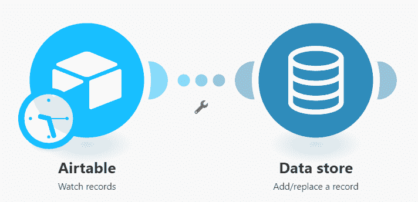

## 数据结构配置

首先，我们来看看数据结构。到期日和提醒日期和时间都是日期类型的字段。在数据存储中，日期字段使用 ISO 8601 表示法。默认情况下，日期字段中的数据以下列格式显示:MMMM D，YYYY h:mm A

Integromat 上的所有日期和时间格式标记都可以在这里找到[。](https://support.integromat.com/hc/en-us/articles/360005772013-Tokens-for-date-time-formatting)

如果您希望使用不同的格式，您需要使用文本字段而不是日期字段。

我们将首先使用日期字段来显示日期在数据存储中的存储方式，然后选择文本字段来格式化日期:

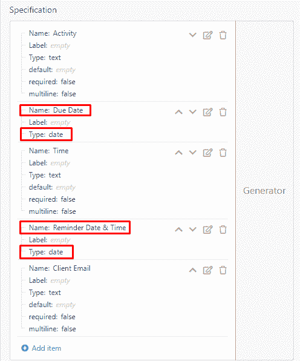

## 构建和执行场景

接下来，让我们回到场景构建器。下面是 Airtable 模块配置的快速浏览。将添加连接，并相应选择所有相关字段:

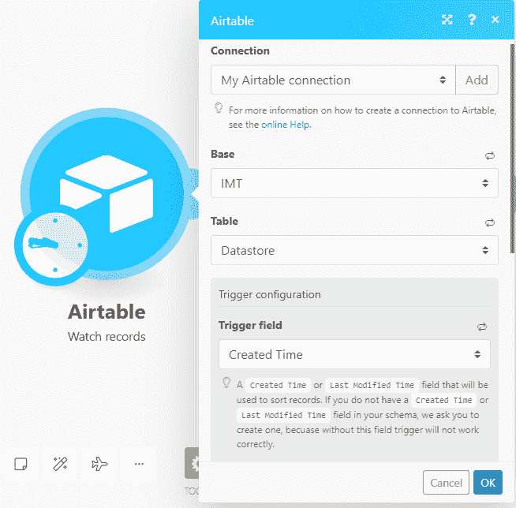

现在让我们看看数据存储模块的配置。具有前面显示的数据结构的数据存储被选择，并且元素被简单地映射到模块中的相应字段:

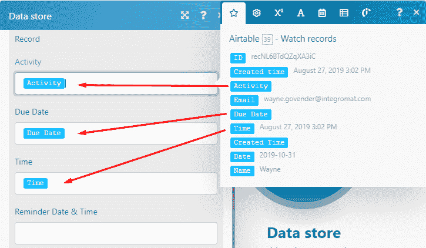

对于提醒日期和时间字段，提醒将被设置为到期日期前 1 天。要正确设置，需要应用 addDays 函数。为此，单击日期和时间选项卡并选择添加日期函数:

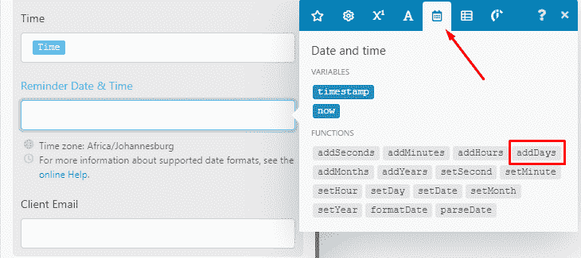

接下来，映射 Due Date 元素，后跟加法运算符，该运算符位于 Math functions 选项卡下:

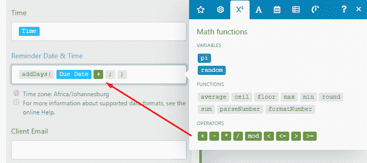

最后，将 Time 元素映射到加法运算符后，并在分号后输入-1，这将从到期日减去 1 天:

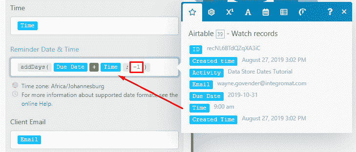

这个场景执行了一次，数据从 Airtable 模块发送过来并输入到数据存储中。数据存储中的到期日期和提醒日期和时间都是日期字段，因此，它们采用默认格式。提醒日期和时间包含正确的时间，因为时间元素被映射到数据存储模块中的此字段。到期日期包含默认时间，因为为该时间创建了单独的列:

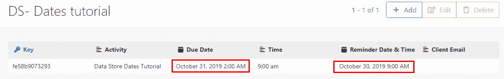

## 选择文本字段并格式化日期

现在，让我们假设您希望日期以不同的格式存储。比如 DD-MM-YYYY。如前所述，需要选择文本字段来格式化日期。让我们将到期日期更改为文本字段，并将提醒日期和时间保留为日期字段，以便在下一个场景执行后进行比较:

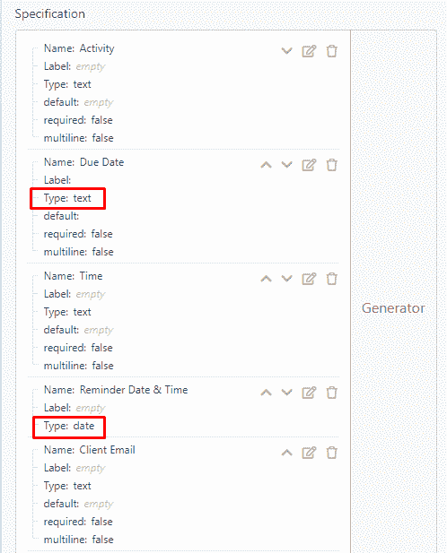

让我们回到场景构建器中的数据存储模块。要格式化日期，需要在到期日期字段中使用 formatDate 函数。再次单击日期和时间选项卡，但这次选择格式化日期函数:

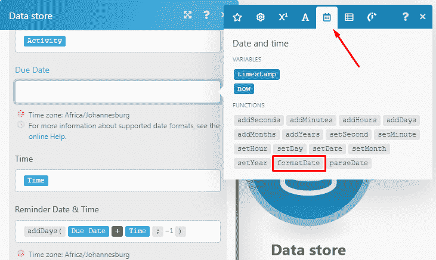

接下来，映射到期日期元素，后跟分号后的日期格式:

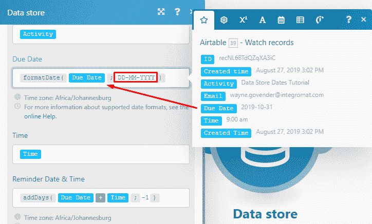

该场景再次执行，数据已经输入到数据存储中。在“到期日期”列中，日期的格式为 DD-MM-YYYY，而“提醒日期和时间”列包含原始格式:

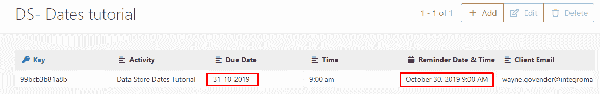

所以你走吧！

现在您知道了如何在数据存储中以替代格式存储日期。

自动化快乐！🙌