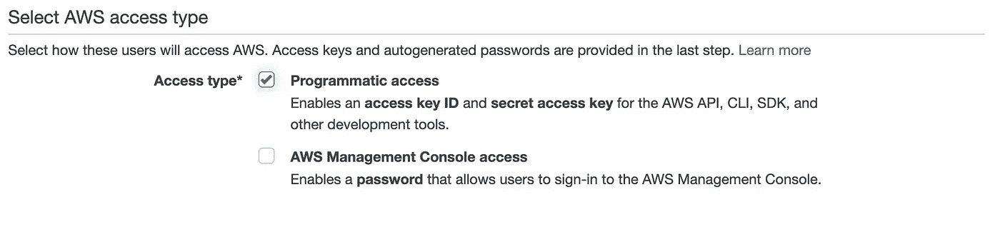
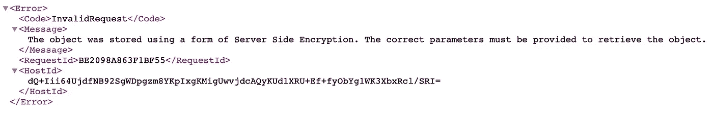

# 如何在 AWS S3 上存储加密文件

> 原文：<https://betterprogramming.pub/how-to-store-encrypted-files-on-aws-s3-4669d3e69939>

## 使用用户定义的私钥


照片由[克里斯·巴巴利斯](https://unsplash.com/@cbarbalis?utm_source=medium&utm_medium=referral)在 [Unsplash](https://unsplash.com?utm_source=medium&utm_medium=referral) 上拍摄

AWS S3 存储提供四种服务器端数据加密方式:

*   SSE-S3，加密密钥由 AWS 管理。
*   SSE-KMS，加密密钥由 [AWS KMS](https://aws.amazon.com/kms/) 管理，提供对密钥轮换策略的控制。
*   SSE-C，用户/上传者提供加密密钥。
*   客户端加密，使用 S3 加密客户端。

假设我们正在构建一个 web 应用程序，它将在 S3 上存储数据，并且应该使用只有应用程序知道的私钥对数据进行加密。

在这个场景中，我们将利用`SSE-C`数据加密，其中应用程序负责创建和维护用于数据加密的私钥，存储在 S3 上的对象使用应用程序提供的密钥进行加密。

如果没有用于加密的原始密钥，任何其他应用程序都不被允许访问加密文件。这样，只有加密密钥的所有者才能检索文件。

SSE-C 加密工作流程非常简单，我将尝试用一些步骤来解释它:

1.  应用程序创建并存储一个私钥——这可能是一个随机的 32 字节字符串。
2.  通过向存储对象的`PUT`请求提供私钥，应用程序可以使用选择的 SDK 在 S3 上存储加密的对象。注意，这个请求*必须*通过 HTTPS 执行，因为您的应用程序正在传输敏感数据。
3.  S3 存储桶接收要存储的对象和加密密钥。它使用密钥加密数据，然后删除密钥。现在加密数据存储在 S3 上。
4.  为了检索数据，应用程序必须提供最初用于加密的私钥。如果不提供相同的密钥，则无法检索加密的数据。

让我们设置一个快速演示来演示这个工作流程。

首先，我将使用 [OpenSSL](https://www.openssl.org/) 生成一个`AES256`加密密钥。以下命令生成一个加密密钥以及从提供的密码中导出的[初始化向量](https://en.wikipedia.org/wiki/Initialization_vector) (IV)。

```
openssl enc -nosalt -aes-256-cbc -k mypassword -P**Output:**key=89E01536AC207279409D4DE1E5253E01F4A1769E696DB0D6062CA9B8F56767C8iv =EE99333010B23C01E6364E035E97275C
```

为了快速演示加密/解密过程，我将创建一个名为`simple_file.txt`的测试文件，其中包含以下内容:

```
This is the original data for the simple file
```

然后，我将通过使用以下命令，尝试使用生成的密钥和 IV 对其进行加密:

```
openssl enc -nosalt
-aes-256-cbc
-in simple_file.txt
-out simple_file.txt.enc
-base64
-K 89E01536AC207279409D4DE1E5253E01F4A1769E696DB0D6062CA9B8F56767C8
-iv EE99333010B23C01E6364E035E97275C
```

加密的内容应该如下所示。当这个文件和一个加密密钥一起被上传到 S3 上时，它将以这样一种加密的形式存储。

```
tqcd/5VEOzAVd0Cqi6FN7aGXronMdy2Zf7MPOUr5nNDGA3adPlP8reBDjf3iacja
```

为此，我将只使用生成的 IV，因为在将对象上传到 S3 时，需要一个 32 字节的字符串作为私钥头。

您可以使用自己选择的 SDK 在本例中，我将使用 [Boto 3](https://boto3.readthedocs.io/) Python 库演示与 AWS 服务交互的工作流。

首先你需要安装 AWS CLI(按照[这个链接](https://docs.aws.amazon.com/cli/latest/userguide/install-cliv2.html)中的说明就可以使用最新版本 v2)。

安装 CLI 后，您需要创建一个具有编程访问权限的 IAM 用户，如下图所示，以获取访问密钥 ID 和秘密访问密钥。



访问密钥 ID 和秘密密钥将用于使用`aws configure`命令在您的终端中配置 AWS CLI，这将要求您输入获得的密钥。

配置完 CLI 后，您就可以使用 Boto 3 库与新创建的用户可以访问的服务进行交互了。

下面的代码片段展示了如何通过执行一个`PUT`请求和之前生成的私钥，将一个本地文件(在我的例子中是`simple_file.txt`上传到一个 S3 存储桶:

`SSE-C`请求中需要包含的标题如下:

*   `x-amz-server-side​-encryption​-customer-algorithm`，用于指定加密算法。在我们的例子中，它是 AES256。
*   `x-amz-server-side​-encryption​-customer-key`，用于指定将用于加密的私钥。

在 Boto 3 库中，我们可以分别使用键`SSECustomerAlgorithm`和`SSECustomerKey`在`PUT`请求中指定这些头。

脚本执行后，文件被上传到 S3 存储桶，如果我尝试直接从 AWS UI 打开它，我将无法读取其内容，因为我没有提供用于加密的原始密钥。



如果我尝试通过 CLI 检索该对象，也是在没有指定原始加密密钥的情况下，我也会收到一条错误消息。

```
aws s3api get-object --bucket secure-cc --key encrypted.txt encrypted_downloaded.txt**Output:**An error occurred (InvalidRequest) when calling the GetObject operation: The object was stored using a form of Server Side Encryption. The correct parameters must be provided to retrieve the object.
```

获得加密文件的唯一方法是在头`--sse-customer-key`中为请求提供原始的加密密钥，如下面的代码片段所示:

```
aws s3api get-object --bucket secure-cc --sse-customer-algorithm AES256 --sse-customer-key EE99333010B23C01E6364E035E97275C --key encrypted.txt encrypted_downloaded.txt**Output:**{
"AcceptRanges": "bytes",
"LastModified": "2020-03-01T00:16:38+00:00",
"ContentLength": 46,
"ETag": "\"3120cb523320824e1f665f7698ea3e73\"",
"ContentType": "binary/octet-stream",
"Metadata": {},
"SSECustomerAlgorithm": "AES256",
"SSECustomerKeyMD5": "5UTC1gbVVUKFd6J/MClx9Q=="
}
```

感谢您的阅读。我希望你会对这篇文章感兴趣，并对 AWS S3 未来的数据加密项目有所帮助。

保重。

# 资源

[服务器端加密客户密钥](https://docs.aws.amazon.com/AmazonS3/latest/dev/ServerSideEncryptionCustomerKeys.html) — AWS