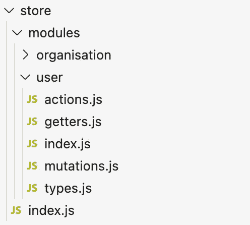

# 如何为生产应用构建大规模 Vuex 商店

> 原文：<https://betterprogramming.pub/how-to-structure-a-massive-vuex-store-for-a-production-app-f4bf84018409>

## 深入了解一家拥有 1000 多家酒店的商店

[伊恩·泰勒](https://unsplash.com/@carrier_lost?utm_source=unsplash&utm_medium=referral&utm_content=creditCopyText)在 [Unsplash](https://unsplash.com/s/photos/cargo?utm_source=unsplash&utm_medium=referral&utm_content=creditCopyText) 上拍照

在看 Vuex 教程的时候，你可以看到大部分都很简单。

逻辑解释得很好，但是可伸缩性受到影响。这将如何在我的生产应用中发挥作用？

这里有一个来自 [Vuex 官方文档](https://vuex.vuejs.org/guide/#the-simplest-store)的简单商店示例:

简单的商店

这个没必要解释。我假设你在这篇文章之前已经有一些关于 [Vue](https://vuejs.org/) 和 [Vuex](https://vuex.vuejs.org/#what-is-a-state-management-pattern) 的知识。

我的目标不是解释什么是存储、状态或突变。

相反，我想向您展示一个拥有 1000 多个状态属性、变异、动作和获取器的大型存储库。

我想教你如何构建存储，以获得最佳的可维护性、可读性和可重用性。

它可以有 100，000+个属性。它仍然是清楚的。

让我们开始吧。

# 会议模块

正如我们已经说过的，将所有内容保存在一个文件中会造成混乱。你不想要 50，000+ LOC 文件。这和把你的应用放在一个组件里是一样的。

Vuex 通过将商店分成模块来帮助我们。

对于这个例子，我将创建一个包含两个模块的商店。注意，对于 100 多个模块，以及每个模块中的 100 多个动作、获取器和变异，过程是相同的。

更新的商店

属性在这里非常重要。如果没有它，动作、变异和 getters 仍然会在全局名称空间中注册。

通过将`namespaced`属性设置为 true，我们也将动作、突变和获取器划分到模块中。

如果您有两个同名的动作，这真的很有帮助。将它们放在全局名称空间中会产生冲突。

命名空间模块

如您所见，该模块现在完全是“本地”的。我们只能通过状态上的用户对象来访问它。

这正是我们大规模应用程序所需要的。

酷，现在我们有一个分成模块的商店了！

然而，我不喜欢硬编码的动作字符串。肯定不可维护。让我们来解决这个问题。

# 让你远离头痛的类型

我们不只是想访问每个文件中每个模块的每个属性。那句话听起来像地狱。

我们想先导入它们。使用`mapGetters`、`mapActions`或`mapMutations`来实现。

使用 mapActions 访问操作

这让您可以清楚地看到 Vue 文件使用的商店属性。

但这还不够。一切都还在一个文件里。让我们看看我们能做些什么来适当地扩展它。

# 文件夹结构

理想情况下，我们希望将模块拆分到不同的文件夹中。在这些模块中，我们希望将它们的突变、动作、getters、状态属性和类型划分到不同的文件中。

所需的文件夹结构

文件夹`store`将被创建在我们项目的根文件夹中。

它将包含两件事:

1.  `index.js`文件
2.  `modules`文件夹

在解释`index.js`文件之前，我们先来看看如何划分单个模块。让我们检查一下`user`模块。

它的所有动作、变异和获取器都应该列在`types.js`文件中。大概是这样的:

商店/模块/用户/类型. js

每当我们想要使用这些常量时，通过导入它们，我们将有一个清晰的视图。

让我们看看现在的行动。我们想把它们移到`actions.js`文件中。

为此，我们只需要复制模块中的`actions`对象和`export default`对象，同时导入类型:

商店/模块/用户/操作. js

我们将对突变和 getters 做同样的事情。状态属性将保留在`index.js`(用户模块文件夹内):

商店/模块/用户/索引. js

现在我们已经把所有的模块分成了多个文件。

剩下的一件事就是链接`store`文件夹中`index.js`文件中的所有模块:

商店/索引. js

# 结论

通过使用这种架构，我们在大规模生产应用程序中的可伸缩性没有任何问题。

一切都很容易找到。

我们确切地知道所有的动作是在哪里触发的。

该系统具有高度的可维护性。

如果你有任何改进的建议，请告诉我。我很想听听你的意见。