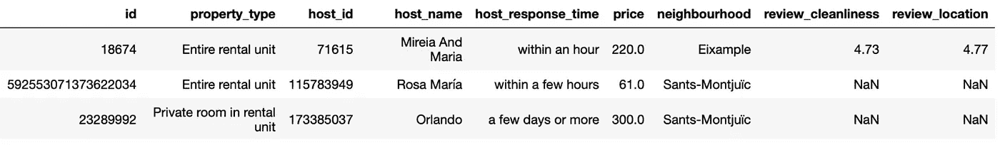
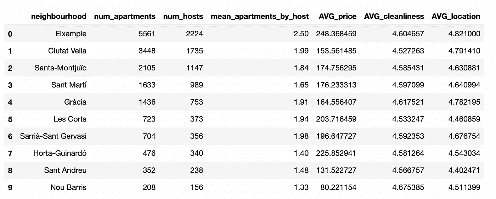
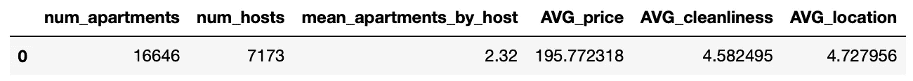
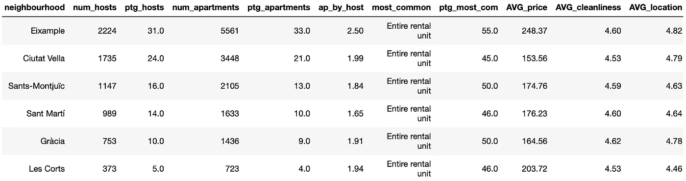

# 如何构造可读和可重用的 SQL 查询

> 原文：<https://betterprogramming.pub/how-to-structure-readable-and-reusable-sql-queries-623485ac4a36>

## 模块化的重要性

图片由 [Vlado Paunovi](https://unsplash.com/es/@vlado) 在 Unsplash 上提供。自我修改的图片。

我的数据职业之旅首先涉及 Matlab 和 R，然后是 Python，现在是 SQL。

SQL 一开始完全是一门外语，但后来证明非常简单和重要。[如今，SQL 是处理数据需求最大的编程语言之一。](https://www.dataquest.io/blog/why-learn-sql/)

这让我意识到，对于任何数据领域的工作者来说，掌握数据库和 SQL 的工作知识是必须的。

# 什么是 SQL？

SQL(结构化查询语言)是一种特定于领域的语言，允许程序员与数据库通信、编辑和提取数据。该语言基于查询。

我敢打赌，如果您使用 SQL——尤其是如果您每天都使用它——您可能会厌倦编写数百个查询和重复完全相同的计算。

*每隔*

*单个*

*时间。*

我的 SQL 代码经常变成一长串复杂的嵌套连接和许多难以编写和调试的代码行。相比之下，在 Java 或 Python 等其他语言中，人们会将离散的元素作为单独的函数，通过名称来调用。

这就是为什么我首先要做的事情之一是想知道:*有没有一种方法可以将 SQL 代码模块化，从而更具可读性和可测试性？*

当然，是有的！

这就是为什么我把我的一些编程最佳实践带到了 SQL 中。

我发现`with`陈述会成为我最好的盟友。创建可读、可重用和优化的查询非常有用。让我们一起来看看如何写出优秀的查询！

我就用一个公开的[巴塞罗那公开的 Airbnb 数据](http://insideairbnb.com/barcelona)来演示。比方说，我们想知道巴塞罗那附近有多少公寓和主机，以及它们对应的平均价格是多少。

我们的起始表包含所有可用的公寓，包含以下字段:

*   `id`
*   `property_type`
*   `host_id`
*   `host_name`
*   `host_response_time`
*   `price`
*   `neighborhood`
*   `review_cleanliness`
*   `review_location`

自制截图。包含巴塞罗那所有可用机场的表格。

我希望最后有一个简单的表格，列出所有社区的可用公寓数量、活跃的房东、平均价格，并与所有巴塞罗那的全球数据进行比较。

这就是为什么我将执行两个不同的查询:

# 1.获取每个邻域的数据

用 SQL 执行这样的查询非常简单。我们可以使用两个 id 变量计算所有不同的主机和公寓，并计算价格和评论的平均值。

该查询如下所示:

我们可以检查前一个查询的输出。这正是我们一直在寻找的。

自制截图。我的第一个查询的输出。

# 2.我们获得所有巴塞罗那的全球数据

现在，我想将每个街区的数据与整个城市进行比较。为此，我们像以前一样重复相同的查询，但不按街区分组。

相应的输出如下所示。我们又一次得到了我们所期望的。

自制截图。我的第二个查询的输出。

# 3.我们合并两个表进行比较

现在，我们需要合并两个查询并创建一个包含所有信息的表。为此，最直接的方法是创建一个包含两个子查询的新查询，并将所有数据合并到一个表中。

下面附上相应的代码:

但是，前面这段代码相当乱。这样做有几个原因:

*   没有明确的结构。
*   很难理解正在做什么。我们完全不知道数据从何而来。
*   如果我们继续从其他表中添加更多的信息，我们将会有一个庞大的查询，阅读和编辑起来会非常混乱。很难添加更多的信息。它不可扩展。

# 使用“with”子句会更好

这就是`with`子句发挥关键作用的地方。我们可以将查询分成不同的时态表，每个表都包含特定的操作。这使我们能够始终遵循任何查询中的逻辑:

1.  我们首先定义输出表的期望结构。
2.  然后在不同的时态表或模块中计算我们需要的所有信息。
3.  我们最终得到一个最终查询，它将所有数据合并成一个数据，并在输出表中给出一个结果。

⚠️ *关于在开始时定义结构的评论，即使在这种情况下没有必要，因为查询非常简单，但当我们处理更复杂的查询时，它是有用的，我们希望确保我们的最终表是结构化的。*

前面查询的模块化版本如下所示:

正如您在第二个版本中看到的，有一些改进:

*   有一个清晰的遵循逻辑的结构。
*   没有子查询。我通常避免子查询或者限制自己每个时态表只使用一个子查询。
*   我们将指令分组为小而容易理解的单元，即时间表。这使得代码可重用，并提高了可读性。

现在，假设我想进一步将我们的查询分成四个不同的模块:

*   包含有关主机的所有信息的模块。
*   包含所有平均值的模块。
*   一个包含巴塞罗那全球信息的模块。
*   我将添加一个额外的模块来计算最常见的公寓面积。

最终的查询如下所示:

这个最后的查询遵循我之前描述过的相同的模块化逻辑。这使得它易于编辑和直观的理解。

正如您所观察到的，添加两个时态表来计算最常见的公寓面积非常容易。如果您阅读该查询，您会意识到知道数据来自哪里真的很容易。

最终输出如下所示:

自制截图。最终查询的输出。

你可以在下面的[链接](https://github.com/rfeers/Medium/tree/main/Modular%20SQL)中找到我的整个 Jupyter 笔记本。希望你觉得它很容易复制:)

数据总是有更好的主意——相信它。