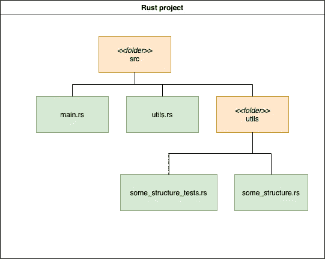
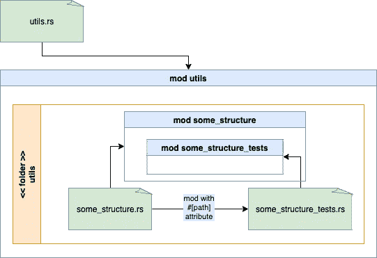

# 如何在 Rust 中构建单元测试

> 原文：<https://betterprogramming.pub/how-to-structure-unit-tests-in-rust-cc4945536a32>

## 一个模块一个模块地揭示技术

尼克·西格雷夫在 [Unsplash](https://unsplash.com/s/photos/map?utm_source=unsplash&utm_medium=referral&utm_content=creditCopyText) 上的照片。

你可能有另一种编程语言的背景。一开始，使用 Rust 进行实验和工作可能会令人困惑——尤其是在涉及到模块以及如何组织它们的时候。单元测试也被构造成模块。因此，有一两件事需要了解，以避免可能导致纯粹沮丧的摩擦。毕竟，你只是想把一个单元测试放在对你的项目结构最有意义的地方，但是 Rust 开始让你面对错误，说它不能解析符号。

在这篇文章中，我们想要探究是什么导致了这种摩擦，以及如何告诉 Rust 您想要如何组织您的测试！

# 重述:模块代替文件路径

您可能已经知道，您将项目的各个部分安排在模块中。当然，您在文件中组织您的源代码，但是与其他语言(例如 C#、C++或 Dart)不同，您不编写由文件路径组成的导入语句。相反，您用关键字`use`引用另一个模块。同样的组织也适用于单元测试。

我写了一篇关于如何用模块构建你的项目的文章，如果你想了解更多，你应该去看看。

# 简单的单元测试

下面，你会看到一个用 Rust 编写的典型单元测试:

通过声明`#[cfg(test)]`，如果您使用命令`cargo test`运行项目，我们将 Rust 限制为编译以下代码。换句话说，当您编译并运行项目进行调试或发布时，Rust 会忽略这些行，从而缩短编译时间！`#[test]`属性为 Rust 的测试执行标记以下拾取功能。

下一部分是模块`mod tests`,包含您想要以这个名字构建的测试。正如您可能已经猜到的，该模块仅仅作为一种分组机制。但是，您也可以将测试放在模块之外，并在一个组中编写多个测试:

当在您的项目上运行`cargo test`时，所有将运行通过！

# 在目录和文件中构建测试

*Rust Book* [告诉我们](https://doc.rust-lang.org/book/ch11-03-test-organization.html)应该将单元测试放在与待测试代码相同的文件中。这个位置可能在产品代码的下面，甚至在上面。不利的一面是，您失去了一个概览，以及产品和测试代码之间的清晰分离。此外，文件可能会变得很大，同时包含两者！

但是，您可以将测试放在一个文件中，将生产代码放在另一个文件中。为此，您必须使用模块系统。一旦你理解了这一点，构建你的文件或模块的过程将需要更少的努力。

# 演练:要测试的模块

假设我们想出了一个实现一个私有方法的小结构。我们将`SomeStructure`放在一个名为`utils`的模块中。文件系统中的结构如下:

图 1:项目结构

您会注意到我们将测试放在`some_structure_tests.rs`中，而不是放在产品代码旁边。但是首先，我们应该看一下代码本身。所以这里是`some_structure.rs`的内容:

还有`some_structure_tests.rs`:

正如您在上面的*图 1* 中所看到的，我们将这些文件放在与我们的`utils`模块相对应的`utils`文件夹下(参见模块概述)。这里我们介绍两个模块，`some_structure`和`some_structure_tests`，正如我们将它们定义为`utils`文件夹下的文件一样:

但是，在构建时，我们会看到这些错误消息:

Rust 告诉我们，在编译测试代码*时，它无法解析`some_structure`模块的私有元素。所以我们必须解决一个额外的问题！*

如果在与关联的生产代码相同的模块中编写，单元测试可以访问私有方法和函数。不幸的是，当我们将测试转移到另一个文件时，我们切断了这种关系，现在我们必须重新建立这种关系。为此，我们使用 Rust 为子模块提供的特性，子模块可以访问其超级模块的私有部分。为了将`some_structure_tests.rs`中的`some_structure_tests`模块定义为`some_structure`的子模块，我们在`some_structure.rs` 中引入，而不是在`utils.rs`中。首先，我们调整`utils.rs`并移除`some_structure_tests`的线条:

然后，我们将删除的两行添加到`some_structure`，使其成为子模块:

现在模块的层次结构已经改变。变更前，`some_structure_tests`是`utils` *的子模块。*现在我们把它作为`some_structure`的一个子模块来介绍。为了反映层次结构的变化，我们必须调整解决单元测试中`some_structure`依赖的`use`路径:

在构建项目时，Rust 抱怨它找不到我们定义`some_structure_tests`模块的文件:

Rust 寻找一个`some_structure_tests`文件夹，确切地说是它如何将`utils.rs`中的`utils`模块与`utils`文件夹连接起来。为了正确显示 Rust，我们明确指出了位置。为此，我们使用`#[path]`属性并再次调整`some_structure.rs`文件:

好了，一切都准备好了！我们在项目中执行`cargo test`并检查结果。现在已经通了，所有测试都是绿色的！

# 结论

*图 2* 展示了我们在本文中使用的模块和文件之间的关系，它们的最终关系如下:

图 2:超级模块和子模块的结构

每当我们想要将单元测试从产品代码(`some_structure`)中分离出来时，我们在 Rust 文件中引入一个子模块(`some_structure_tests`)，待测试的模块就在这个文件中(`some_structure.rs`)。这个子模块可以用`#[path]`属性指向它的相关文件(`some_structure_tests.rs`)。这种技术保留了访问模块私有元素的能力，同时也使我们能够按照自己的意愿在文件中组织我们的测试。

如果您来自其他编程语言，并且习惯于将测试放在专用文件中，Rust 初看起来可能很难——特别是因为 *Rust Book* 没有提到如何以不同于同一文件的另一种方式构建测试和生产代码。对我来说，这意味着我要花些时间去琢磨，直到有了概念。最后，我可以用对我来说更自然的方式编写我的测试。

我希望我在本文中的发现可以加快您对 Rust 中处理单元测试的理解。

# 资源

*   [https://doc . rust-lang . org/book/ch11-03-test-organization . html](https://doc.rust-lang.org/book/ch11-03-test-organization.html)