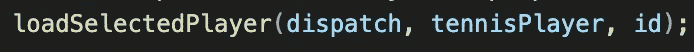
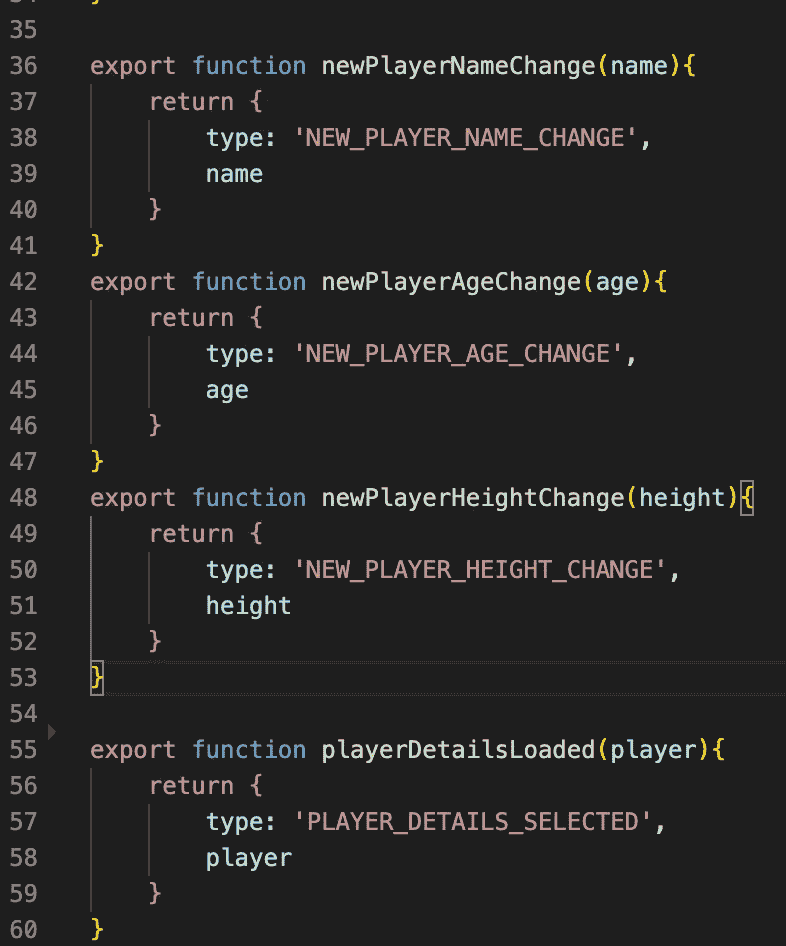
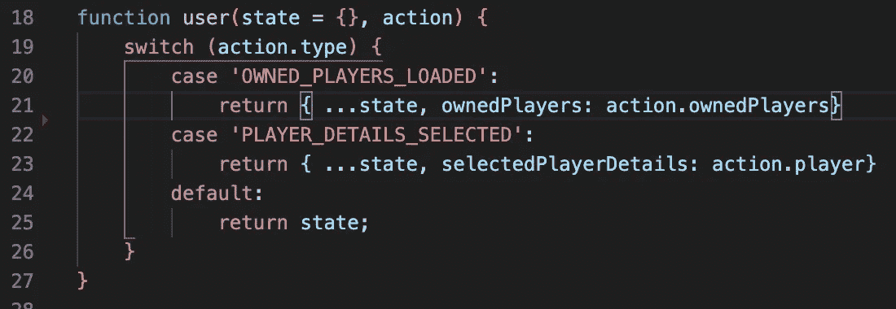
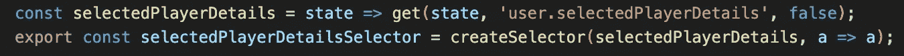
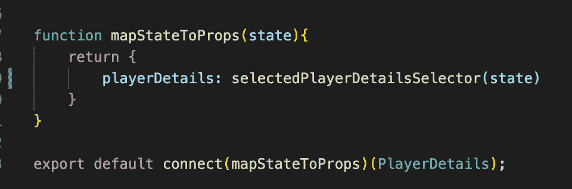

# 如何用 React 和 Redux 构建代码

> 原文：<https://betterprogramming.pub/how-to-structure-your-code-with-react-and-redux-948d0a2bd55e>

## 保持代码库和文件整洁的设计

照片由[费伦茨·阿尔马西](https://unsplash.com/@flowforfrank?utm_source=unsplash&utm_medium=referral&utm_content=creditCopyText)在 [Unsplash](https://unsplash.com/s/photos/react?utm_source=unsplash&utm_medium=referral&utm_content=creditCopyText) 上拍摄

当从零开始构建一个应用程序时，技术债务会迅速增加。像 React 和 Redux 这样的框架提供了很好的模式来以模块化的方式构建代码。

我们生活在一个完美的世界，所以这就是我们所需要的！

当然，*我们不*除外，*也不是。*

当使用 React 和 Redux 时，我总是在后退一步时想到“哇，什么时候变得这么乱了？”这引发了一次洗牌，在解决了所有的错误后，我终于满意了。

直到几个星期后，它再次发生。

像这样的代码需要持续的关注。它需要爱和感情。驯服野兽的同时让它变得更强大。构建难以驾驭的代码需要一个总体策略。

对于 React 和 Redux，我使用我喜欢称之为 IARS。

你爱怎么说就怎么说，IARS 代表互动、行动、减少者、选择者。

这里有一个细目分类。

## 相互作用

这是完成繁重工作的地方，由用户活动触发。保存新的东西？将功能放在这里并导出，以便前端组件可以访问它。

应用程序中的任何更改都应该从这里开始。

示例:我开发了很多区块链应用程序，所以图 1 是 interactions.js 中的一个函数示例，它从我创建的游戏中加载一个玩家。

图 interactions.js 的片段

这里唯一的外部依赖是 actions.js 中的`playerDetailsLoaded`。

`tennisPlayer`是区块链上的一个智能合约实例。它存储一个玩家列表，并公开一个公共的`players`数组，用`id`调用该数组来检索单个玩家。

图 2 显示了如何从组件中调用它:

图 2

## 行动

动作是调度程序用来与缩减器交互的东西。过一会儿，您的 actions.js 文件将看起来如图 3 所示:

图 3: actions.js

第 55 行显示了从 interactions.js 中的调度程序调用的`playerDetailsLoaded`函数。

这个文件会很快变大，所以明智的做法是将 actions.js 转换成一个 actions 目录，并在逻辑上分离这些操作。稍后会详细介绍。

## 还原剂

Redux 存储中的数据是由 Redux 改变的。如果你以前用过 Redux，你就会知道这些是什么样子的。图 4 显示了我们的`PLAYER_DETAILS_SELECTED`减速器在第 22 行的例子。

图 4: reducers.js

## 选择器

选择器是组件用来访问 redux 存储中的数据的。我在 selectors.js 中使用了 [lodash](https://lodash.com/) 和 [reselect](https://github.com/reduxjs/reselect) 的组合。

图 5:选择器. js

图 6 展示了如何从组件中调用它。

图 6:在组件代码中选择 playerDetails

我们做到了！从组件到交互，到动作，到缩减器，到选择器，再回到组件。

这种模式的伟大之处在于，每个组件只需要知道一些交互和一些选择器，从而保持组件代码的整洁。

# 扩大

从一个包含以下文件的`redux/`文件夹开始:

*   `interactions.js`
*   `actions.js`
*   `reducers.js`
*   `selectors.js`

随着应用程序的增长，当您觉得文件变得太大(可能每个文件都超过了几百行)时，请重新构建 Redux 文件夹，为每个文件创建一个文件夹。在每个文件夹中，将代码分成逻辑文件。

# 进一步阅读

如果你对区块链开发感兴趣，我会写一些教程、演练、提示以及如何开始和建立投资组合的技巧。

查看以下资源:

 [## 区块链开发资源马上跟进

### 学习区块链、以太坊和 DApp 开发的资源列表

medium.com](https://medium.com/blockcentric/blockchain-development-resources-b44b752f3248)