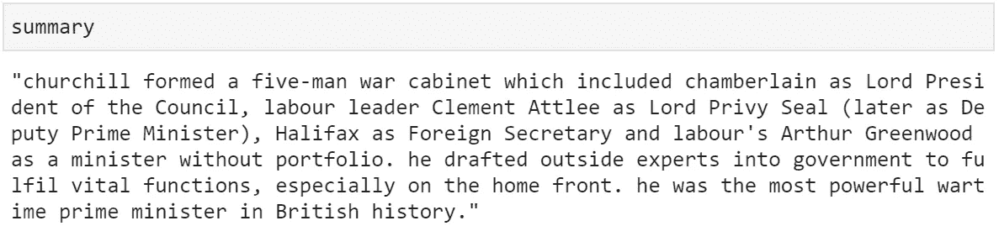

# 如何用谷歌的 T5 概括文本

> 原文：<https://betterprogramming.pub/how-to-summarize-text-with-googles-t5-4dd1ae6238b6>

## 如何在文本摘要中使用前沿的自然语言处理技术


[米切尔·罗](https://unsplash.com/@mitchel3uo?utm_source=medium&utm_medium=referral)在 [Unsplash](https://unsplash.com?utm_source=medium&utm_medium=referral) 上的照片

自动文本摘要允许我们将长的文本片段缩短成易于阅读的短片段，这些片段仍然传达了原始文本中最重要和最相关的信息。

在本文中，我们将使用 Google 的 T5 构建一个简单但功能强大的文本摘要器。我们将使用 PyTorch 和拥抱脸的变形金刚框架。

这分为三个部分:

```
1\. [Import and Initialization](#2d88)
2\. [Data and Tokenization](#6976)
3\. [Summary Generation](#47b0)
```

点击这里查看本文的视频版本:

# 导入和初始化

我们需要从 Transformers 库中导入 PyTorch 和`AutoTokenizer`和`AutoModelWIthLMHead`对象:

```
import torch
from transformers import AutoTokenizer, AutoModelWithLMHead
```

PyTorch 可以按照这里的说明安装，变压器可以使用`pip install transformers`安装。如果你需要在 Python 中设置 ML 环境的帮助，请查看本文。

一旦导入了所有内容，我们就可以初始化记号赋予器和模型:

```
tokenizer = AutoTokenizer.from_pretrained('t5-base')
model = AutoModelWithLMHead.from_pretrained('t5-base', return_dict=True)
```

我们开始处理一些文本数据！

# 数据和令牌化

这里使用的数据是温斯顿·丘吉尔的维基百科页面上的一段文字。当然，你可以用任何你喜欢的东西！但是，如果您想了解相同的数据，可以从这里复制:

一旦我们有了数据，我们需要使用我们的`tokenizer`来标记它。这将获取每个单词或标点符号，并将其转换为数字 id，T5 模型将读取这些数字 id 并将其映射到预训练的单词嵌入。

标记化非常容易。我们只是在我们的输入数据上调用`tokenizer.encode`:

```
inputs = tokenizer.encode("summarize: " + text,
                          return_tensors='pt',
                          max_length=512,
                          truncation=True)
```

# 汇总生成

我们通过调用`model.generate`来总结使用 T5 的标记化数据，如下所示:

```
summary_ids = model.generate(inputs, max_length=150, min_length=80, length_penalty=5., num_beams=2)
```

*   `max_length`定义我们希望在摘要中包含的最大令牌数
*   `min_length`定义我们想要的最小令牌数
*   `length_penalty`允许我们对生成低于/高于我们定义的最小/最大阈值的汇总的模型进行或多或少的惩罚
*   `num_beams`设置探索最有希望预测的潜在表征的波束数量[1]

一旦我们有了摘要标记，我们就可以使用`tokenizer.decode`将它们解码成人类可读的语言:

```
summary = tokenizer.decode(summary_ids[0])
```



我们 T5 生成的维基百科文本摘要

就这样，我们用 Google 的 T5 构建了一个文本摘要器！

# 结论

这真的是所有的事情。总共七行代码，开始使用谷歌最先进的机器学习算法之一处理复杂的自然语言问题。

我发现把这样的东西放在一起是如此容易，这令人吃惊，我希望这篇简短的教程已经证明了 NLP 可以(有时)多么容易理解——也许还解决了一些问题。

我希望你喜欢这篇文章。感谢阅读！

# 参考

[1] [光束搜索](https://en.wikipedia.org/wiki/Beam_search)，维基百科

[🤖NLP 与变形金刚课程](https://bit.ly/nlp-transformers)