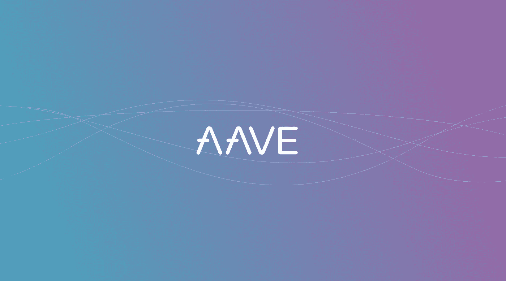

# 如何以编程方式向 Aave 协议提供资产

> 原文：<https://betterprogramming.pub/how-to-supply-assets-to-the-aave-protocol-programmatically-acfb0875a2f0>

## 对使用 Aave 协议感兴趣:JavaScript 教程

[AAVE](https://aave.com/)

*编者按:本文仅供娱乐和教育之用，并非理财建议。与本文相关或引用本文的任何投资行为完全是您自己的行为，如果您继续阅读本文，则意味着您同意这些条款。*

*先决条件:本演练假设您对 JavaScript、Web3 和以太坊智能合约有基本的了解。最后，您将能够编写一个 DApp，使用户能够将资产存入 Aave 协议，在此过程中获得利息，并随后在任何时候赎回资产。*

在撰写本文时，DeFi 协议锁定的价值超过 20 亿美元。这是不到一个月前，我写了关于如何向复合融资提供资产的文章时锁定金额的两倍。

第五大 DeFi 平台被称为 [Aave](https://aave.com/) 。他们最近成为第一个提供快速贷款的 DeFi 平台，这种贷款必须在他们被取走的同一笔交易中偿还。

在这里，我们将介绍如何向 Aave 协议提供资产，以便用户可以存放他们的加密资产并从中赚取利息。

# Aave 是如何工作的？

Aave 目前在十七个市场运营:瑞士联邦理工学院、戴、、、、、英美烟草、KNC、LEND、LINK、MANA、MKR、REP、SNX、WBTC 和 ZRX。

让我们以 LINK 为例。通过提供 Aave 协议的链接，您同意它可以借出该价值，从而获得利息。你可以随时提取你的股份。把它想象成一个储蓄账户。

一旦它在那里，你可以检查有多少链接在锅里，找出当前利率是多少，借用其他资产，等等。

## 让我们来谈谈技术

从技术角度来看，这个过程是什么样的？与复合融资相比，这一过程稍微复杂一些，但并不难以管理。

Aave 维护着名为`LendingPool` s 的合约，它是主要的切入点。从`LendingPool`开始，可以使用`deposit`功能提供资产。我们还可以检索协议数据，如用户的流动性、当前利率、总流动性等等。

在 Aave 的协议中,`LendingPool`合同是不可升级的。这意味着他们的地址将来可能会改变。为了防止像我们这样的第三方 DApps 落后，Aave 提供了一个永远不会升级的`LendingPoolAddressesProvider`合同。这是用来检索最新的`LendingPool`。一旦我们有了最新的`LendingPool`，我们就可以开始存款了。

然而，我们不能从`LendingPool`赎回资产。为此，我们需要了解另一组契约，称为`aTokens`。这些是符合 ERC-20 协议的合同，是为了交换基础资产而发行的。比如存款 LINK，我们根据当前汇率接收`aLINK`。`redeem`功能存在于`aLINK` *，*不存在于`LendingPool`。

总而言之，这就是我们需要做的存放资产，然后赎回它:

1.  从`LendingPoolAddressesProvider`获取最新的`LendingPool`。
2.  存入`LendingPool`。
3.  从`aToken`赎回。

总的来说，这使得将资产存入资产证券化比复合融资更复杂，因为你的 DApp 需要跟踪更多的合同和资产证券化。

# 给我看看代码！

*先决条件:本演练假设您对 JavaScript、Web3 和以太坊智能合约有基本的了解。*

## 沉积

在这里，我们将通过以下步骤，介绍如何将 ETH 存入和取出 Aave 贷款池:

1.  加载`LendingPoolAddressesProvider`合同。
2.  检索`LendingPool`地址。
3.  加载`LendingPool` *。*
4.  `LendingPool`存 ETH 到*。*

**步骤一。加载** `**LendingPoolAddressesProvider**` **。**

我们需要的第一台 ABI 是用于合同的。供应商的地址可在 [Aave 文档](https://docs.aave.com/developers/deployed-contracts/deployed-contract-instances)中找到，对于 mainnet，它是`0x24a42fD28C976A61Df5D00D0599C34c4f90748c8`。图 1 显示了如何加载提供者契约

图一。加载提供程序

**步骤二。检索**`**LendingPool**`T22 的地址。

提供者契约有一个名为`getLendingPool()`的函数，它返回相关`LendingPool`契约的地址。图 2 显示了如何调用这个函数。

图二。获取贷款池地址

**第三步。加载** `**LendingPool**` **实例。**

`[LendingPool](https://github.com/aave/aave-protocol/blob/master/abi/LendingPool.json)`是我们需要存储的下一个 ABI。图 3 显示了使用`LendingPoolAddressesProvider`提供的地址加载`LendingPool` 。

图 3。加载贷款池

**步骤四。存款 ETH。**

存款时，我们需要告诉 `*LendingPool*`我们要将哪项资产以及金额发送出去。这是通过传入底层资产的`reserve`地址来完成的，该地址在 Aave 文档中[发布。](https://docs.aave.com/developers/deployed-contracts/deployed-contract-instances)

对于 ETH，保留地址为`0xEeeeeEeeeEeEeeEeEeEeeEEEeeeeEeeeeeeeEEeE`。图 4 显示了如何将 ETH 存放到`LendingPool`。

图 4。存放 ETH

`supplyValue`是存放在 WEI 中的 ETH 的数量。

图 5 显示了此时我们代码的完整状态。

图 5。全额存款代码

瞧，ETH 已经存到了 Aave，现在正在赚取利息！

## 补偿的

为了赎回，我们需要知道正确的`aToken`来调用，然后调用`redeem()`函数来接收我们的 ETH 返回。我们按照以下步骤进行:

1.  从`LendingPool`获取储备数据*。*
2.  使用储备数据加载`aToken`。
3.  赎回 ETH。

**第一步:获取储备数据。**

准备金数据为我们提供了有关存款资产的信息，如总流动性和当前利率。我们用它来检索`aToken`T11 的地址。图 6 显示了如何做到这一点。

图 6。获取一个地址。

**第二步。载入** `**aToken**` **。**

`[aToken](https://github.com/aave/aave-protocol/blob/master/abi/AToken.json)`是我们需要存放在 DApp 的第三个也是最后一个 ABI。图 7 显示了如何加载`aToken`。

图 7:加载 aToken

**第三步。赎回。**

最后，图 8 显示了如何赎回基础资产。

图 8:赎回资产。

`withdrawAmount`表示从协议中赎回的 ETH 的金额(单位为魏)。

图 9 显示了完整的赎回代码。

图 9。完全兑换代码

# 结论

随着 DeFi 变得越来越容易使用并被如此多的人采用，学习如何与这些协议交互是任何开发人员工具箱中的一个有价值的工具。

## 进一步阅读

如果你对区块链开发感兴趣，我会写一些教程、演练、提示以及如何开始和建立投资组合的技巧。查看以下资源:

 [## Medium 上最好的区块链开发资源

### 学习区块链、以太坊和 DApp 开发的资源列表

medium.com](https://medium.com/blockcentric/blockchain-development-resources-b44b752f3248)