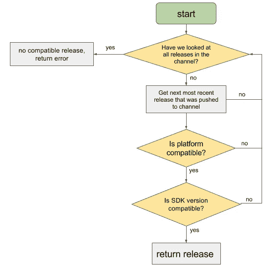

# 如何并行支持多个 Expo SDKs 的空中更新

> 原文：<https://betterprogramming.pub/how-to-support-over-the-air-updates-on-multiple-expo-sdks-in-parallel-3bd65c62d230>

## 更新 Expo SDKs 时要记住一件事


[基特·苏曼](https://unsplash.com/@cobblepot?utm_source=medium&utm_medium=referral)在 [Unsplash](https://unsplash.com?utm_source=medium&utm_medium=referral) 拍摄的照片

世博会太棒了。它帮助您从相同的代码库开发、构建和部署 iOS、Android 和 web 应用程序。

它在其服务器上为 Android 和 iOS 构建二进制文件，并为发布渠道和空中下载(OTA)更新提供支持。

# OTA 更新

OTA 更新适用于 JS 包的任何已发布的更改。您将新功能添加到应用程序中，运行 Expo build，然后发布。仅此而已。用户可以在他们的设备上立即获得更新——在后台，无需更新本机应用程序。到目前为止一切看起来都很好！

## 升级 Expo SDK

当你决定升级 Expo SDK 时，有一点你必须记住:SDK 升级需要在应用商店(App Store，Google Play)上更新原生应用。

要通过 OTA 更新获得新的捆绑包，已安装应用程序上的 SDK 必须与发布的 SDK 相匹配。但不能保证所有用户都能立即安装更新。这就是问题所在。

这是描述 Expo 如何确定向用户返回哪个版本的流程图:



通过[世博文件](https://docs.expo.io/workflow/publishing/)进行说明

你可以在这里找到关于发布过程[的更多细节。](https://docs.expo.io/workflow/publishing/)

情况是，在用户更新原生应用程序之前，使用旧 SDK 构建的原生应用程序不会收到任何后续 SDK 版本的任何 OTA 更新。

是的，我明白。你可能只是想告诉用户应该更新应用程序——在旧版本上部署一个微妙的“请更新应用程序”横幅，然后忘记这件事。

很公平。这在大多数情况下是可以的。

但是，在内心深处，您可能会意识到，您真正想要的是能够为旧版本发布任何安全和稳定性补丁。您可能还希望能够添加一些紧急功能，为您添加的新服务显示 CTA 按钮，比方说，因为疫情。

# 方法

你可以假设你只支持最新的版本。

我建议你查看一下申请统计数据。指定您希望更新覆盖的用户的百分比阈值。在此基础上，定义您必须支持的确切 SDK 版本。

## 贮藏室ˌ仓库

就在 SDK 升级之前，从`[main](https://github.com/github/renaming)`创建一个分支。如果太晚，使用升级前的最后一次提交。

比如`$ git switch main; git switch -c main-expo-sdk-36`。

照常将任何特征分支合并到`main`。此外，将该特性也应用到其他 SDK 分支。假设你想从`feature/cta-button`分支中合并 CTA 按钮功能。

```
(main) $ git merge feature/cta-button
(main) $ git push
(main) $ git switch main-expo-sdk36
(main-expo-sdk-36) $ git merge feature/cta-button
(main-expo-sdk-36) $ git push
```

## 部署

流程保持不变，除了您必须对每个`main-expo-sdk-*`分支做同样的事情。它可以被部署到同一个发布通道(见上图)。

## 地方发展

使用相同的源文件夹非常耗时。

在 SDK 版本之间切换时，您必须重新安装节点模块。如果您想要执行多次更新，这可能会很麻烦。

解决方案是创建多个项目实例，每个实例对应您将支持的 SDK 的一个版本。这将在下一节中解释。

将回购克隆到不同的文件夹，并在那里的`main-expo-sdk-*`分支上工作。假设你有一个`my-app` app，你想支持 SDK 36。

```
# clone the same repository to my-app-sdk-36
$ git clone git@server:my-app.git ~/repos/my-app-sdk-36;# it should be a new folder here
$ ls ~/repos;
my-app
my-app-expo-sdk-36# enter the new folder and switch the branch to the SDK 
$ cd my-app-expo-36;
$ git switch main-expo-sdk-36; 
```

# 摘要

这种解决方案可以让大多数用户获得*紧急*更新。

当您升级 Expo SDK 时，这并不意味着每个设备都立即获得了更新。后续的 OTA 更新不适用于带有旧 SDK 的设备。

这对于大多数情况来说是可以的，但是现在您也为其他场景做好了准备。