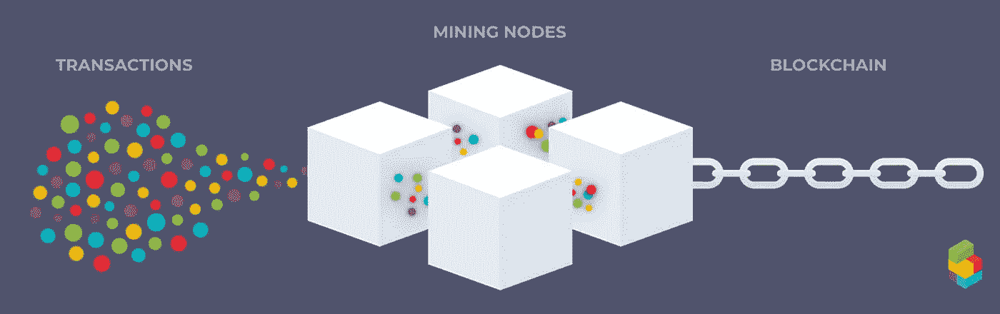
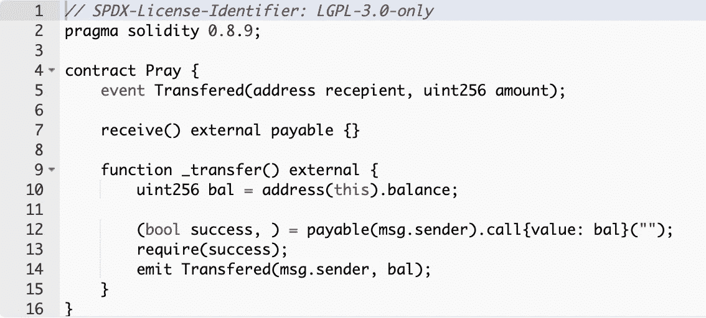
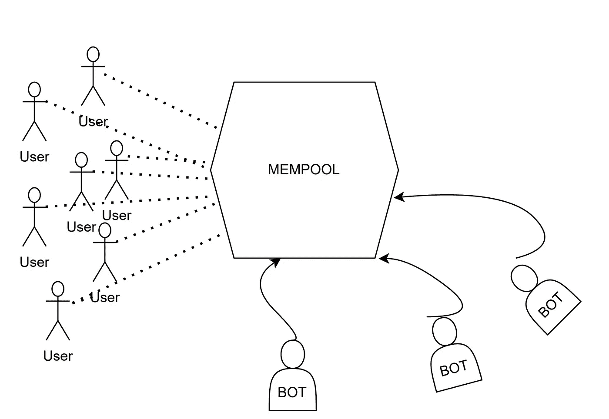
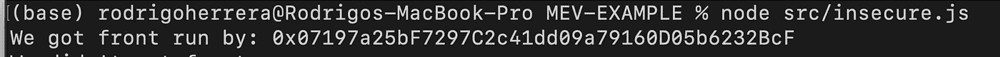
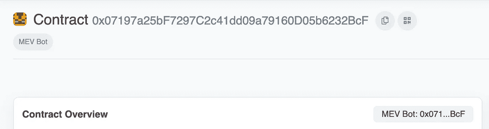
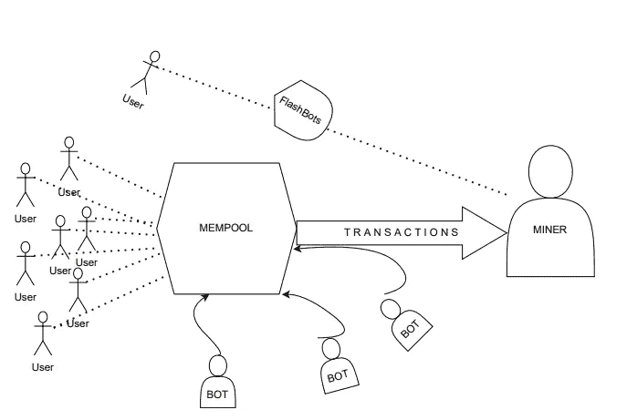
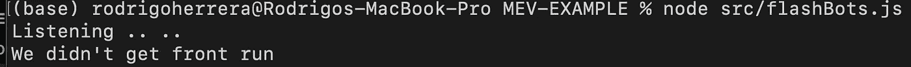

# 如何在以太坊黑暗森林中生存

> 原文：<https://betterprogramming.pub/how-to-survive-in-the-ethereum-dark-forest-f21c9eca4bfe>

## 避免跑在前面的机器人吃掉你


谷歌图片

[以太坊是黑暗森林](https://www.paradigm.xyz/2020/08/ethereum-is-a-dark-forest)是 paradigm 的丹和圣乔治在 crypto 中推广的一个术语(如果你没有看过帖子，我强烈推荐)。

但是《黑暗森林》[实际上是一本科幻小说](https://en.wikipedia.org/wiki/The_Dark_Forest)，它带来了黑暗森林的概念。这个概念基本上意味着，如果你被发现，掠食者会杀了你。

## **好的，那么这和以太坊有什么关系呢？**

更准确地说，这个问题适用于几乎所有的连锁店，但我们将重点放在以太坊[上，因为它是迄今为止 TVL 最大的连锁店。](https://defillama.com/chains)

按照黑暗森林的类比，掠食者是寻找任何机会为自己谋利的机器人。请记住，很多时候(不总是)他们的利润是以牺牲用户为代价的。

这篇文章的目的是在高层次上理解这个捕食者机器人是如何操作的，以及如何避免它们。为了真正理解发生了什么，我们将采用第一性原理的方法，在以太坊主网上与其中一个掠夺者进行实际互动。

## ***先决条件***

如果你掌握了以下技能，你将完全掌握一切，但如果你没有，你也可以理解整体思想:

1.  对 EVM 工作原理的一般理解。
2.  坚固性/ JS。

在开始我们的旅程之前，我们需要理解几个概念。

# **M.E.V**

MEV 以前被称为 ***矿工可开采价值*** ，最近被称为 [***最大可开采价值***](https://ethereum.org/en/developers/docs/mev/#top) 是指通过包括、排除和改变区块中的交易顺序，可以从区块生产中提取的超过标准区块奖励和天然气费的最大价值。

不必深入太多细节，MEV 的意思是某个实体(采矿者、搜索者等)通过改变交易顺序可以提取的金额。

在我们与捕食者互动后，这个概念会变得完全清晰。

# **内存池**

[Mempool 是指以太坊节点内部的一组内存数据结构，在候选事务被挖掘之前存储它们。](https://www.blocknative.com/blog/mempool-intro)

这是什么意思？

想一想当你发送一个事务时，在幕后发生了什么。钱包里按发送会怎么样？

简短的回答是，你正在进入黑暗森林。

当你发送一个事务时，你是在签署一堆数据，通常是一个看起来像这样的对象:
**比显示的对象有更多的字段，这只是为了使它简单..*

```
{
 to: "0x123.....,
 value: 1000....., 
 data: "0x123...,
 gasPrice: 100....}
```

当你按下“发送”时，你就签署了交易意向，你的钱包提供商就把它转发给一个节点(通常运行 go-Ethereum)。

这样做的问题在于，你的交易并不是直接在区块链(又名“安全区”)内，而是在`PUBLIC` Mempool 上。



[https://www.blocknative.com/blog/mempool-intro](https://www.blocknative.com/blog/mempool-intro)

没错，每个人都可以看到所有未决事务*。这有着巨大的影响(我们将会看到)。

为了让您有个概念，在任何给定的时间，以太坊(等待内存池)上大约有[180，000 个未决事务，一个块通常包含大约 180 个事务。](https://etherscan.io/txsPending)

除非我们使用像 FlashBots 这样的服务(就像我们将要做的那样)。

# **捕食者**

好了，现在我们已经对 MEV 和 Mempool 有了一个大致的了解，让我们来看看所有的实际操作。

警告:你不应该这样做，除非你真的知道你在做什么！！！

为了便于研究，我们将向捕食者释放一些 ETH。

开始吧！

**注:**完整的回购及所有文件可在此处找到:[https://github.com/rodrigoherrerai/MEV-EXAMPLE](https://github.com/rodrigoherrerai/MEV-EXAMPLE)

因此，我们要做的第一件事是部署一个超级简单的智能合约:

这个契约可以做 3 件基本的事情:

1.  接受 ETH。
2.  将合同的余额传递给调用该函数的人。
3.  当有人调用 _transfer 函数时发出事件。

我将着手部署合同。[这里是交易的 hash](https://etherscan.io/tx/0x8e3c0b38c58d92415ecdb1ec4f6e3ebd012eb8005d566fe5414f9a6d6413e47a) ，这里是合同[。](https://etherscan.io/address/0xD4D6112c07420f413bdDE19b80E350CA013379c5#code)

现在我们已经在 Mainnet 上启动并运行了合同，我们将向它发送一些 ETH，[这里是 0.01 ETH 的事务哈希](https://etherscan.io/tx/0xc50ed258bba75a4d31a46b70bff20359a6be0c07a3308ca4e63b7835e16dd53e)。

为了更好地理解接下来将要发生的事情，假设您正在搜索不同的契约，并且您遇到了我们刚刚部署的契约。

在检查以太扫描上的代码时，你花了 2 秒钟才意识到合同是完全易受攻击的。你只需要调用`_transfer()`函数，它就会把所有的资金发给你，对吗？？



Etherscan 上的源代码

令你吃惊的是，这份合同有一些条款！

好吧，坏消息是，如果你没有很好地意识到我们刚刚谈到的一切，你就掉进了一个陷阱。

的确，无论是谁调用了`_transfer()`函数，都会收到契约的余额。问题是要确保你是第一个打电话的人。我的意思并不是要赶时间，而是尽可能快地调用函数。

## **那么，问题是什么？**

正如您在前面的解释中所记得的，在事务进入实际的块之前，它会经过公共内存池。

## 你准备好听真话了吗？

每次用户向公共内存池发送交易时，交易都会受到成千上万*机器人的检查，看它们是否能从中获利。[有不同类型的攻击](https://ethereum.org/en/developers/docs/mev/#top)，讨论每一种攻击超出了本文的范围。对于我们的特殊情况，我们将重点放在广义的领先者。
**可以多，可以少，但是数量大。*

广义的领跑者基本上是机器人，它们观察内存池，模拟每个事务，复制潜在有利可图的事务的代码，用领跑者的地址替换地址，并运行事务。



**注意:**这个图可能有点误导，实际上，没有一个 mempool，但是每个节点都有自己的挂起事务。总体观点保持不变。

# **准备，设置，开始**

是时候面对现实了。

我们将尝试从我们部署的智能契约中调用`_transfer()`函数。如果你已经注意到了，你现在应该知道了(至少在理论上)，这个交易将会被一个机器人抢先运行。

## 你准备好了吗？

该脚本将基本上监听合同的“已转移”事件，无论何时调用，它都会让我们知道。就在我们触发监听器之后，我们将调用`_transfer()`函数。



[这里是交易的哈希。](https://etherscan.io/tx/0xecf142c95ed695e98b146de05b0a56f57b9d22661d0cfe8b8d992b3fb16d0583)

有趣的是，这是跑在我们前面的机器人的名字:



## **这到底是怎么回事？**

嗯，很简单。机器人在`mempool`上模拟我们的交易，看到它是有利可图的，然后在我们之前执行它。

# **解决方案**

希望现在你已经明白了这件事的严重性。

好消息是有一个解决方案。

[解决方案是 FlashBots](https://docs.flashbots.net/) 。FlashBots 有不同的工具和服务，但对于我们的特定用例，我们将专注于 [FlashBots 拍卖。](https://docs.flashbots.net/flashbots-auction/searchers/quick-start)

FlashBots 拍卖所做的是，它允许我们向矿工发送私人交易。这意味着，我们的交易将不会通过公众`mempool`。因此，食肉动物不会吃我们。



脚本:



[这里是交易的‘hash](https://etherscan.io/tx/0xcba58d75c1abf9667f5ed69bdd77d56d657e4557a93dcbd725a8fc0bd888816b)。

这次机器人没有拧我们的原因，是因为机器人不知道我们的交易的存在。

# **关键要点**

目前，基础层具有非常不利的环境。减轻这种情况的唯一方法是开发安全系统和像 FlashBots 这样的开源项目。

作为用户，你需要非常小心，不要落入陷阱。但更重要的是，责任真的落在了 dapp 和系统开发者身上。

祝你好运！