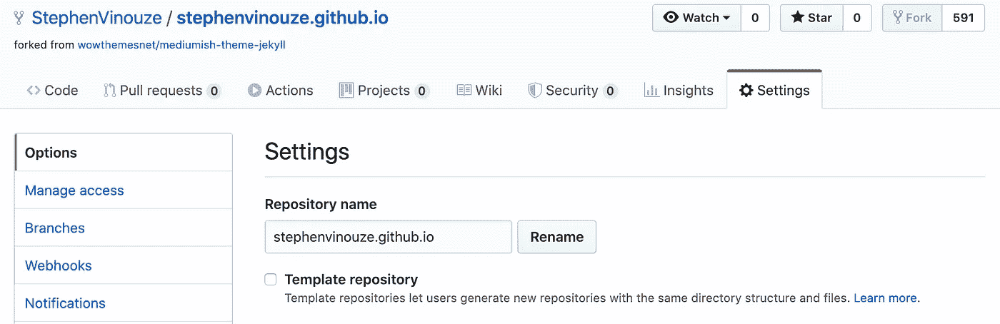
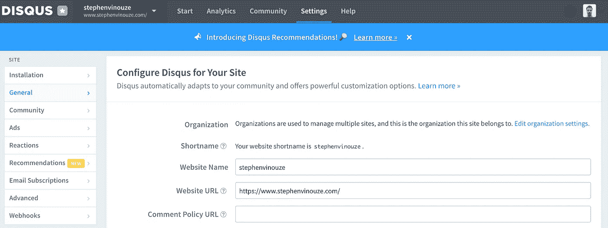
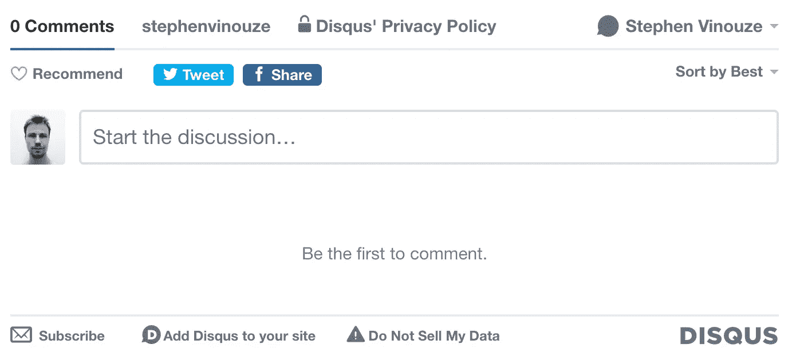
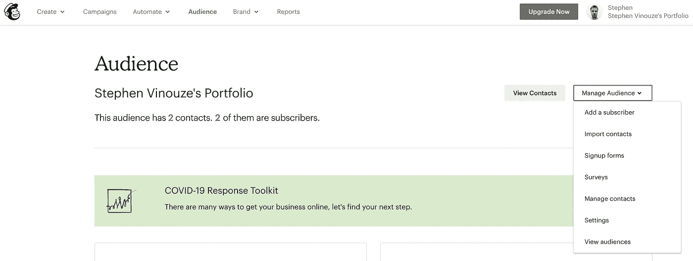
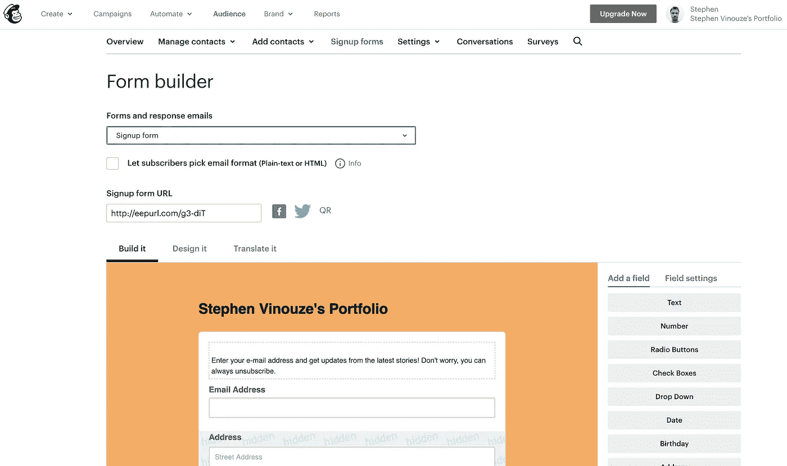
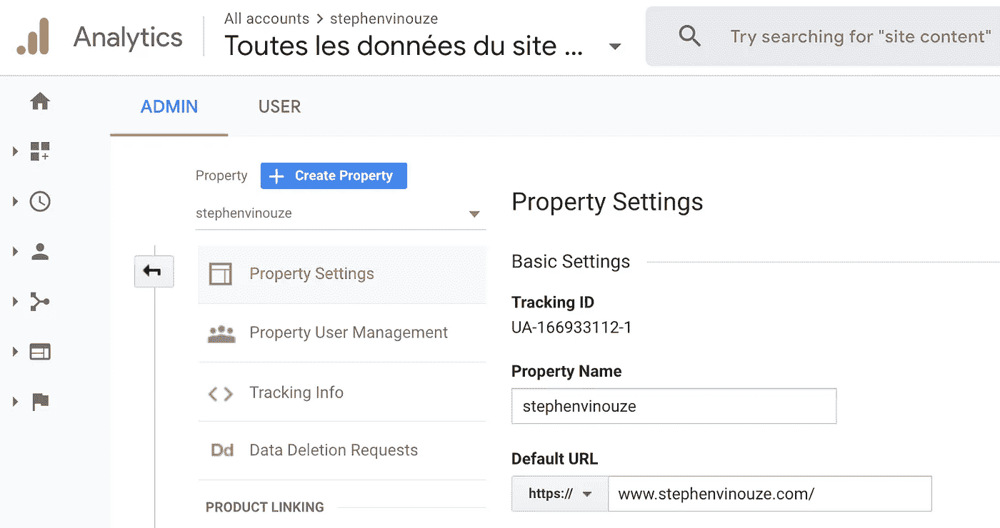
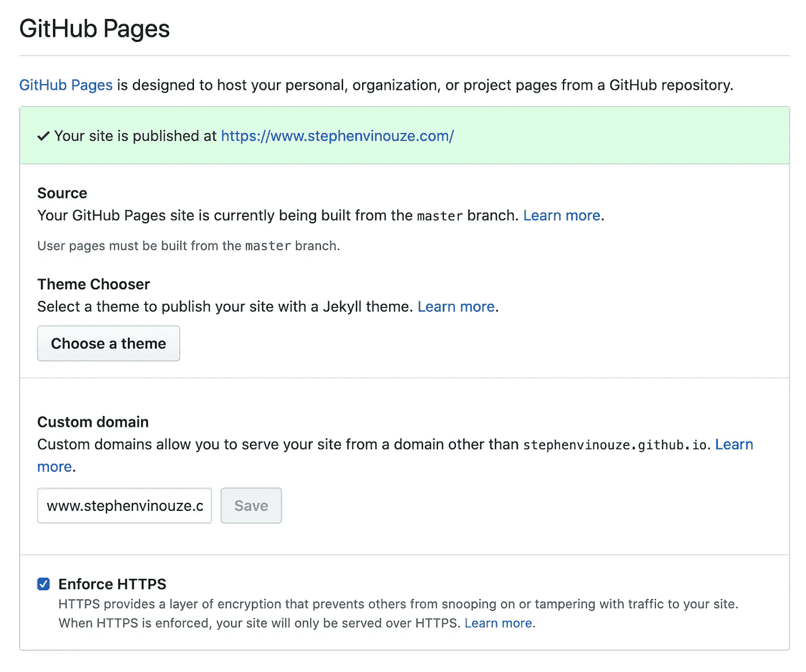
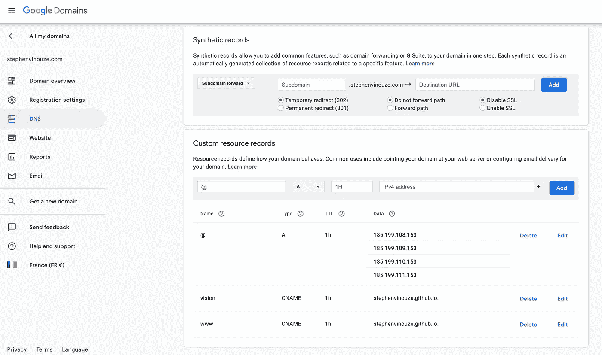

# 如何快速推出带有 GitHub 页面的免费网站

> 原文：<https://betterprogramming.pub/how-to-swiftly-launch-a-free-website-with-github-pages-9be6441fce61>

## 不涉及编程或成本！选择一个主题，配置它，然后注入你的内容！


你好，我是尼克🎞开[退溅](https://unsplash.com?utm_source=medium&utm_medium=referral)。

创建一个网站看起来很难。即使有编程背景，你也可能会迷失在网络上，不知从何下手。

所以这是我对你的承诺。在文章的最后，你会得到:

*   一个免费部署的优雅网站，甚至不需要托管。
*   一个评论区，让你的读者关注你的文章。
*   邮件订阅列表，通知访问者您发布的新内容。
*   跟踪读者行为的分析工具。
*   更多取决于你的主题有多高级。

我用[我最近推出的网站](https://www.stephenvinouze.com/)来逗你。看起来很酷，对吧？

想出这个方法需要一些时间和研究。你会发现很多文章都是关于静态站点生成器的，比如 Jekyll 或者 Hugo。我大部分时间都在四处搜集信息。我需要一本完整的指南。所以我决定将所有这些知识都集中在一篇核心文章中。

有了这个汇编，你应该在几个小时内完成！相信我，你会花大部分时间决定正确的主题。

还在船上吗？我们开始吧！

# 先决条件

我之前提到过，你的网站不会花你一分钱。这要感谢 [GitHub 页面](https://pages.github.com/)。

你只需要创建一个 GitHub 账户，在那里你可以免费托管你的网站。GitHub 处理版本控制和部署。多方便啊！

你甚至不需要了解 HTML/CSS——尽管这是一个优势。GitHub Pages 使用 [Jekyll](https://jekyllrb.com/) 将你的 Markdown 文件转换成 HTML，让你专注于你的内容。

所以先决条件是:

1.  有一个 [GitHub](https://github.com/) 账号。
2.  对 Git 有基本的了解。你不需要成为专业人士。您甚至可以从 GitHub web 界面上完成。
3.  知道如何使用 Markdown——有了[官方备忘单](https://github.com/adam-p/markdown-here/wiki/Markdown-Cheatsheet)，这是显而易见的。

如果你没问题，让我们进入激动人心的部分！

# 选择你的主题

本指南最重要的部分！花时间选择一个符合您需求的优雅模板。

你可以找到大量的免费主题。它们有很好的文档记录，可以处理许多用例，无论你是想建立一个博客还是一个作品集。没有什么能阻止你投资一个优质主题。到目前为止，我仍然觉得我在兑现我的承诺。

你应该在这里找到适合你的:

[](https://jekyll-themes.com/free/) [## 免费主题|哲基尔主题

### 一些最好的 Jekyll 主题和模板的集合，可以免费下载(2018)。

jekyll-themes.com](https://jekyll-themes.com/free/) 

例如，我为我的博客选择了 [Mediumish 主题](https://jekyll-themes.com/mediumish/)。所有的荣誉都归于 [WowThemes](https://www.wowthemes.net/) 免费创造了这个神奇的模板。

浏览列表。点击“现场演示”按钮一睹为快。然后挑出你想要的！

# 部署您的网站

让我们假设您已经创建了一个 GitHub 帐户。如果您看了一下 [GitHub Pages 文档](https://pages.github.com/)，您可以创建一个名为`your_username.github.io`的 Git 存储库。

相反，让我们快进并跳过所有设置过程。毕竟，这就是你选主题的原因。你不想花几天时间来布置一切。

从您选择的模板派生 Git 存储库。你应该在模板的页面上有一个链接。这将创建一个 Git 存储库的副本，您可以在其中插入您的内容。

一旦分叉，您将需要更改您的存储库的名称以匹配`your_username.github.io`。前往“设置”，然后重命名您的储存库。



我将我的分叉库的名称编辑为`stephenvinouze.github.io.`

试试吧！你的网站已经在等你了！在你的浏览器中打开一个标签，输入网址[http://your _ username . github . io](https://your_username.github.io)/(在这里你将把`your_username`替换成你的)。

如果你在任何时候感到失落，不要犹豫，把你的知识库和我的进行比较。

[](https://github.com/StephenVinouze/stephenvinouze.github.io) [## Stephen winouze/Stephen winouze . github . io

### 现场演示|下载|文档|给我买杯咖啡版权所有 2019 萨尔，https://www.wowthemes.net·梅迪米西为…

github.com](https://github.com/StephenVinouze/stephenvinouze.github.io) 

# 准备您的版本

GitHub 从你的`master`分支部署你的网站。要明白你在`master`上推动的每一个改变都会重新部署它。

所以在开始任何事情之前，我敦促你创建一个`develop`分支。在将`develop`合并到`master`之前，您的所有更改都不会影响您的网站。

通过使用一个`develop`分支，你可以开始试验，而不用担心破坏你的网站。

# 测试您的更改

在从`develop`分支进行配置时，您仍然希望看到您的网站的行为。要在本地部署它，请在终端中打开一个新选项卡。从您克隆 Git 存储库的地方使用以下命令:

```
$ bundle exec jekyll serve — watch
```

然后在这个地址打开你的浏览器: [http://localhost:4000/](http://localhost:4000/) 。

您可以将此终端选项卡放在一边。您的网站将在您的计算机上运行，直到您停止此过程。

# 配置您的网站

目前，您的网站仍然是一个空壳，里面装满了模板的内容。让我们用您的数据来配置它。

*注意:我建议以此为指导。并非所有主题都具有相同的配置。如果你选择了与我不同的主题，我所写的可能不适用于你。总是仔细检查主题的文档。*

首先，看看`_config.yml`文件内部。这就是奇迹发生的地方。您会发现需要用自己的参数更新几个参数。

您已经可以自己配置一些东西，例如:

*   联系信息
*   电影《阿凡达》
*   社交网络链接

重新启动你的 Jekyll 进程，然后刷新你的页面来查看变化。

作为提醒，当您更改`_config.yml`文件时，您必须重新启动之前启动的 Jekyll 进程。对于所有其他更改，仅刷新您的页面。

# 发表你的文章

是时候用你的文章替换模板的文章了。

在此之前，请理解命名约定驱动着 Jekyll。在这方面，所有条款:

1.  存储在`_posts`文件夹中。
2.  都是用`yyyy-mm-dd-name-of-your-post.md`语法命名的。
3.  必须用 Markdown 语言编写(因此有了`.md`文件扩展名)。

试试吧！在`_posts`文件夹中创建一个具有适当名称的文件。最后，刷新并看到你的文章显示在你的网站上。

"如果我已经有一个中等的文章，我想把它转换成降价？"

可以找到几个解决办法。我推荐[这款易于使用的转换器](https://medium-to-markdown.now.sh/)。

作为旁注，它不处理 Gist。你需要手动提取它。不过，没什么复杂的。右键点击你的媒体要点，复制包含链接的`<script>`标签。

要了解更多信息，您应该查看这篇解释清楚的文章。

[](https://towardsdatascience.com/converting-medium-posts-to-markdown-for-your-blog-5d6830408467) [## 将中型文章转换为博客的降价文章

### 如何快速导出中型文章到你的博客

towardsdatascience.com](https://towardsdatascience.com/converting-medium-posts-to-markdown-for-your-blog-5d6830408467) 

# 与你的读者互动

如果你已经决定创建一个博客，你应该考虑显示一个评论区。你想让你的读者关注你的文章。

很多主题支持 [Disqus](https://disqus.com/) 。它会在你想要的地方嵌入一个评论部分。要配置它，您必须:

1.  创建一个 [Disqus](https://disqus.com/) 账户——你可以从免费计划开始。
2.  选择网站名称作为唯一 ID，并输入您网站的 URL。
3.  用您的 Disqus 网站名称替换`_config.yml`文件中的 Disqus 值。

在下面的截图中，你可以看到我的网站的 Disqus 配置。在我的`_config.yml`文件中，我已经将我的 Disqus 值编辑为`stephenvinouze`:



你可能注意到我的网址不是 https://stephenvinouze.github.io/的。我将在本文后面解释原因。现在，您应该使用您的 GitHub URL。

此外，你应该知道 Disqus 永远不会在你的机器上工作，因为你已经在上面指明了你的生产 URL。

记住，你一直在做`develop`分支。如果你已经提交并推送了你到目前为止所做的事情——这是你应该做的——你的生产网站将不会被重新部署。如果你想确保 Disqus 正常工作，你必须将`develop`合并到`master`。然后，您可以检查您的生产 URL(部署您的网站可能需要一些时间)。

您应该会看到如下所示的注释块:



# 吸引你的访客

留住人才应该是你的首要任务之一。你将与整个互联网竞争，试图让人群听到你的声音。是什么让别人访问你的网站？更好的是，他们为什么要留下来并回来？

你可能听说过 SEO。可惜我没资格帮你做这个题目。请放心，你会发现许多文章给你一个升降机。几个模板据说是 SEO 优化的。我对此不抱太大希望。

除了 SEO，你还可以邀请访问者关注你即将发布的文章。您会发现实现这一点的几种机制。一个流行的叫 [Mailchimp](https://us18.admin.mailchimp.com/) 。就像 Disqus 一样，您可以嵌入一个 HTML 表单，在您发布文章时通知您的用户。许多主题已经包含了 Mailchimp。很可爱，对吧？

遗憾的是，配置 Mailchimp 并不简单。我花了相当多的时间在他们的仪表板里闲逛。

我的主题要求我从 Mailchimp 添加一个订阅列表链接。我假设你有同样的要求。我将指导您完成配置步骤。

像 Disqus 一样，创建一个帐户，选择免费计划，然后回答问题。

现在，选择“观众”您会在右侧找到一个名为“管理观众”的面板切换它，然后按“注册表单”



选择名为“表单生成器”的第一项您已经到达可以构思订阅表单的地方。当你的用户点击你网站的“订阅”按钮时，他们会看到这个页面。你会想给它添加个人风格。

Mailchimp 允许您更改表单的布局以及希望用户填写的字段。如果你不想吓跑他们，那就尽量轻一点。一个电子邮件字段就足以吸引他们。

要将您的表单连接到您的网站，请复制“注册表单 URL”中显示的短链接在浏览器中打开它，查看表单的外观。您可以将完整的 URL 复制粘贴到您的项目中来完成这一部分。



如果你想更进一步，你可以自定义你的其他表格。在同一页面上，找到复选框上方顶部“注册表单”面板。这个下拉列表显示了你的访问者在与你的邮件列表交互时会看到的所有表单。

我会留给你的创造力。现在，您应该已经有了订阅邮件列表。记得将您的修改推送到`master`分支，以应用您的更改。

# 跟踪您的用户

跟踪是你的用户永远看不到的一个方面。但是你忽视它是错误的。

[谷歌分析](https://marketingplatform.google.com/about/analytics/?hl=fr)可以帮助你分析用户的行为。你会想知道你的用户如何浏览你的网站，哪些文章表现良好。

大多数模板已经集成了谷歌分析来跟踪页面浏览量。如果你的没有，下面的指南会告诉你怎么做:

 [## Jekyll 的谷歌分析

### 了解如何添加谷歌分析跟踪代码到您的 Jekyll 静态网站。谷歌分析是一个免费的网络分析…

desiredpersona.com](https://desiredpersona.com/google-analytics-jekyll/) 

您需要指明 Google Analytics ID。这可能看起来很乏味，但是我们将重复我们为 Disqus 和 Mailchimp 所做的相同过程。您将被重定向到此页面，在此您可以找到您的跟踪 ID。下面截图上，我的是`UA-166933112–1`。将你的拷贝到你的`_config.yml`文件中，你就万事俱备了。



再次提醒，记得将`develop`合并为`master`。重新部署后，从一篇文章导航到另一篇文章。您应该会在 Google Analytics 实时仪表盘中看到点击量上升。

# 奖励:自定义您的域名

至此，你的网站完成了。是时候结束一切了。

您可以通过[http://your _ username . github . io/](http://your_username.github.io/)访问您的网站。给它起一个更友好的域名不是很甜蜜吗？

GitHub Pages 允许您将您的域与子域相关联。所以，对我来说，所有在 http://Stephen winouze . github . io/浏览的访问者都会被重定向到 https://www.stephenvinouze.com/的。你自己去看看吧。点击上面我的 GitHub 链接。

尽管我已经兑现了免费提供网站的承诺，但这个操作并不是免费的。你需要购买一个子域。

不想花钱的话可以跳过这部分。然而，拥有你的私人域名将有助于你的访问者找到你。它给你的网站一个品牌。

如果你愿意做这个额外的步骤，你需要一个 DNS 提供商。我选择了[谷歌域名](https://domains.google/intl/fr_fr/?gclid=Cj0KCQjwn7j2BRDrARIsAHJkxmx_QBUisWsgmIoNHFuPhmPHtLLf3ImOZXnoOMNDkk-N2R2o_gIdvZsaAsCMEALw_wcB)，因为它是:

*   易于配置。
*   可靠。
*   便宜(每年十几欧)。

一旦购买，您需要将您的自定义域名与您的 GitHub 帐户相关联。在本文开头编辑 Git 存储库名称的同一页面上，向下滚动，直到看到这一部分:



用您购买的域名填写“自定义域名”字段。我建议也加强 HTTPS。

保存这些更改，然后转到您的 Google 域的控制台。在“DNS”部分下，用您的记录替换自定义资源记录。这篇[文章](https://medium.com/@hossainkhan/using-custom-domain-for-github-pages-86b303d3918a)会帮你配置。



我的 DNS 设置

一切就绪！尝试从新的 URL 访问您的网站。

请注意，购买新域名后，可能需要一天时间才能到达。我花了大约一个小时才拿到我的。

# 反馈

恭喜你，你成功了！

我很惊讶 GitHub Pages 是如何让网站建设变得荒谬琐碎的。出于版本控制的原因，由 Git 备份对我来说更有吸引力。我喜欢控制我的更改，并且知道它们被安全地保存在某个地方。

但是我们不能忘记社区正在开发预配置的、包罗万象的模板。为了感谢他们，请在你的网站中保留这些致谢——尤其是如果你喜欢免费主题的话。这是支持他们努力的一点心意。

现在我很想看看你想出了什么！你花了多长时间？

如果你对某些部分感到困惑，或者你认为某些方面应该更加明确，请不要犹豫发表评论。

麦克风是你的！