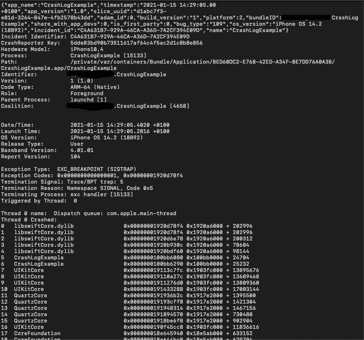
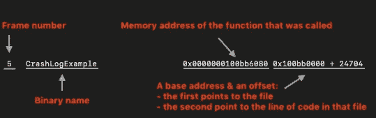
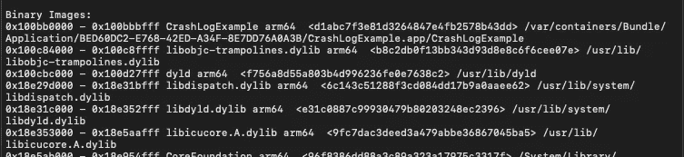

# 如何在 iOS 中标记崩溃日志

> 原文：<https://betterprogramming.pub/how-to-symbolicate-crash-logs-in-ios-b05637591364>

## 在为时已晚之前修复错误


马库斯·斯皮斯克在 [Unsplash](https://unsplash.com?utm_source=medium&utm_medium=referral) 上的照片。

我们都希望我们的应用程序稳定可靠地运行在客户的所有设备上。然而，由于大多数软件固有的复杂性，我们永远无法保证即使是生产代码也会 100%没有 bug。无论是程序员的错误、操作系统的缺陷还是第三方库中的错误，崩溃都不可避免地会不时出现。

当这种情况发生时，我们作为软件工程师的工作就是迅速找到解决方案。这就是崩溃日志派上用场的地方。

# 什么是崩溃日志？

当一个应用程序在 iOS 设备上崩溃时，系统会生成崩溃报告或崩溃日志**T5，并保存在设备上。这包含了对我们的调查非常有用的大量信息。最重要的是，它包含一个完整的堆栈跟踪，向您显示崩溃时每个正在执行的线程正在做什么。**

这些信息是以十六进制地址的形式报告的，对人类观察者来说没有太大的帮助，所以我们必须通过一个叫做*符号化*的过程将它们翻译成可读的函数名和行号。

# 如何获取崩溃日志

如果你的应用已经发布在 App Store 上或者正在试飞中，那么获得一份坠毁报告是相当简单的:

> “TestFlight 和 App Store 为你提交的每一个应用版本收集崩溃报告。
> 
> …
> 
> 来自发送诊断和使用信息的客户的崩溃报告显示在崩溃管理器中。
> 
> …
> 
> 无论共享诊断和使用数据的设备设置如何，应用程序的 TestFlight 用户都会自动与您共享崩溃报告。“— [苹果开发者](https://developer.apple.com/documentation/xcode/diagnosing_issues_using_crash_reports_and_device_logs/acquiring_crash_reports_and_diagnostic_logs)

如果在 Xcode 的崩溃管理器中找不到崩溃日志，最简单的方法是这样。

在应用崩溃的设备上，进入设置->隐私->分析和改进->分析数据。在这里，你会发现一堆文件来自你设备上的所有应用程序。开始在顶部的搜索栏中输入你的应用程序的名称，瞧:你已经有了这个应用程序生成的所有崩溃日志。打开报告后，您可以将它传输到您的计算机上，或者让报告崩溃的用户通过电子邮件将其发送给您。

# 如何处理崩溃日志

如果你以前从未看过事故报告，以下是第一眼看上去的样子:



在顶部，您可以看到进程信息，如*事件标识符*(唯一标识崩溃)、*崩溃报告器键*(映射到设备 ID 的唯一键)、*硬件型号*和*进程*，这是应用程序的名称(我非常有创意地将此示例命名为应用程序崩溃示例)。

然后，我们有像发布时间和操作系统版本的东西。在那下面，有一些关于异常类型的细节，我们也可以看到是什么线程导致了崩溃。

在所有这些之后是有趣的部分，我们称之为*线程回溯*。这将提供崩溃发生时所有活动帧的列表。

如果一开始看起来难以理解，我可以理解，但让我们看看每段文字代表了什么:



图片由作者提供。

现在，至少我们有了导致应用程序崩溃的函数的十六进制地址。不过，这仍然没有多大意义，所以是时候卷起袖子，象征性地完成这份报告了。

首先，你应该尝试通过 Xcode 符号化你的崩溃日志。这很简单。按照[这个栈溢出答案](https://stackoverflow.com/a/25927122/10706839)中的步骤就可以了。如果在这之后，你看到内存地址旁边的函数名和行号，那么万岁！您有一个符号化的崩溃报告，可以继续进行调试。

如果您没有看到任何变化，那么请继续阅读，因为我将向您展示如何手动符号化它。

# 找到正确的 dSYM 文件

要开始符号化过程，您需要找到相关的 dSYM 文件。

如果您的应用程序在 App Store 上发布或在 TestFlight 上可用，您可以通过 App Store Connect 获得 dSYMs。选择你的应用程序，进入 TestFlight，选择构建版本，进入“构建元数据”，在“一般信息”下，你会发现一个“包括符号”选项，你可以在那里下载 dSYM 文件。

如果上述方法不管用，您可以从您的构建档案中获得 dSYMs。为此，在 Finder 中导航到相关的构建(除非您更改了它，否则归档保存在~/Library/Developer/Xcode/Archives)，右键单击`.xcarchive`文件，然后选择“显示包内容”

现在你面前有一堆 dSYM 文件。你到底需要哪一个？其标题与您想要象征的二进制文件的编译 UUID 相匹配的那个。

你觉得怎么样？最简单的方法是打开你的崩溃日志，搜索`slice_uuid`。这将放在报告的开头。

在我的例子中，它看起来像这样:

```
“slice_uuid”:”d1abc7f3-e81d-3264–847e-4fb2578b43dd”
```

最后，您必须找到具有匹配标题的 dSYM。例如，我必须搜索`d1abc7f3-e81d-3264–847e-4fb2578b43dd.dSYM`。

# 做实际的象征

我们已经完成了所有的前期工作，所以我们可以开始实际工作了。为此，我们使用我们值得信赖的老朋友——命令行。我们有一个专门为此目的制定的命令。它被称为`atos`，它将十六进制地址转换成函数名和行号。

通过在命令行中键入以下命令，让我们看看如何使用它以及可以传入哪些参数:

```
atos -h
```

我们得到以下信息:

```
Usage: atos [-p pid] [-o executable] [-f file] [-s slide | -l loadAddress] [-arch architecture] [-printHeader] [-fullPath] [address …]
```

在所有这些可能的参数中，我们将只输入以下四个:`architecture`、`executable`、`load address`和`address`。

先说`architecture`。在您的崩溃日志中，向下滚动到“二进制映像”部分。



iOS 崩溃报告:二进制映像部分

我们在二进制映像名称旁边找到了二进制架构。在我们这里是 [arm64](https://en.wikipedia.org/wiki/AArch64) 。

对于`executable`，我们通过以下路径:

```
<PathToDSYMFile>/Contents/Resources/DWARF/<BinaryName>
```

我们在我们象征的二进制图像的开头找到了`load address`。上图可以看到，对我来说，是`0x100bb0000`。

最后一个参数是`address`，它是帧的内存地址。如果您返回到我谈到线程回溯中的帧的部分，您可以在本文的第二幅图像中看到这一点。例如，对于帧#5，`address`是`0x0000000100bb6080`。

如果要对多个帧进行符号化，则不必多次调用该命令。只需输入用逗号分隔的所有地址。

这是我们完整的神奇配方:

```
atos -arch <Binary Architecture> -o <Path to dSYM file>/Contents/Resources/DWARF/<binary image name> -l <load address> <address to symbolicate>
```

以及我们当前示例的实际实现:

```
atos -arch arm64 -o dSYMs/D1ABC7F3-E81D-3264–847E-4FB2578B43DD.dSYM/Contents/Resources/DWARF/CrashLogExample -l 0x100bb0000 0x0000000100bb6080
```

现在，您有望在控制台中看到函数名和行号。如果是这样，这里的工作就完成了，您可以继续调试了。另一方面，如果您在控制台输出中看到类似于`_hidden#710_`的内容，那么请继续阅读。

这是因为当您从存档中导出`.ipa`文件进行分发时，您启用了位代码。然而，没有必要担心，因为我们只需要一个额外的步骤就可以从我们的崩溃日志中获得一些有用的信息。

这个拼图的最后一块被称为*符号图*，这是 Xcode 在归档应用程序的过程中生成的一个附加文件。在符号映射的帮助下，我们能够恢复混淆的 dSYM 文件。

我们为此需要的命令叫做`dsymutil`。如果我们检查它在终端中做了什么，我们会看到:

```
OVERVIEW: manipulate archived DWARF debug symbol files. dsymutil links the DWARF debug information found in the object files for the executable <input file> by using debug symbols information contained in its symbol table.
```

我们使用该命令的方式是:

```
dsymutil -symbol-map <path to BCSymbolMaps> <path to dSYM file>
```

将它应用到我们当前的例子中:

```
dsymutil -symbol-map CrashLogExample.xcarchive/BCSymbolMaps dSYMs/D1ABC7F3-E81D-3264–847E-4FB2578B43DD.dSYM
```

如果您再次运行`atos`命令，您应该最终在控制台中看到相关的函数名和行号。

# 结论

程序员通常不喜欢调试和符号化崩溃报告。很明显，它无法与无中生有这种创造性的、或许更能激发智力的练习相比。然而，如果我们希望某个东西可靠地运行和工作，这只是我们必须做的一项工作。

我希望你现在知道下一次如何处理崩溃报告。

感谢您花时间阅读这篇文章。如果你有任何想法、建议或问题，请在下面的评论中留下。