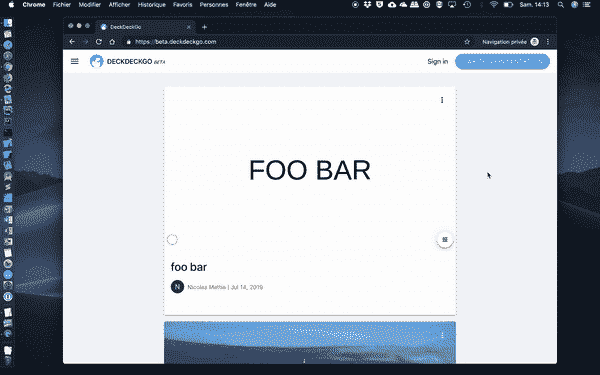

# 如何在云端截屏一个网站

> 原文：<https://betterprogramming.pub/how-to-take-a-screenshot-of-a-website-in-the-cloud-27f08dcbe9c1>

## 为 Firebase 函数写一个 Google 函数


在 [Unsplash](https://unsplash.com/?utm_source=unsplash&utm_medium=referral&utm_content=creditCopyText) 上由 [samsommer](https://unsplash.com/@samsomfotos?utm_source=unsplash&utm_medium=referral&utm_content=creditCopyText) 拍摄的照片

我们目前正在[开发一个叫做](https://medium.com/hackernoon/we-are-developing-an-open-source-editor-for-presentations-9cfc69571133) [DeckDeckGo](https://deckdeckgo.com) 的用于演示的开源网页编辑器，我们希望能在夏天结束时发布 beta 版。

为什么我允许自己在开场白中如此大胆？好了，我们开始吧:我很高兴地正式宣布，它不仅是一个编辑器，还是一个在线平台，一个可以分享演示文稿的地方，最终，如果我让自己梦想一下未来，它会根据你的兴趣被索引，甚至可以被讨论。

在我们拥有这样的应用和社区之前，我们还有很长的路要走——但这并不意味着我们不能有一点梦想，尤其是因为这是一个兼职项目；为了好玩，我们在晚上和周末实施。

所以，我们决定在测试版中实现这个想法的第一部分。主屏幕，我称之为“feed ”,将显示所有将要用我们的工具编辑和发布(作为独立的渐进式 Web 应用程序……但那是另一个故事)。为此，就像他们的社交卡片一样，我们决定在云端捕捉这些卡片的第一张幻灯片的截图。

在这篇博客文章中，我将展示如何为 Firebase 创建一个 [Google 函数来抓取云中的一个网站的截图。](https://firebase.google.com/docs/functions)



先睹为快，看看我们的测试演示

# 解决方案介绍

对于这个解决方案，我们将为 Firebase 编写一个新的 Google 函数，以便在云中运行我们的流程。我们将使用[木偶师](https://github.com/GoogleChrome/puppeteer)运行一个无头 Chrome，在那里我们将加载网站，并截取屏幕截图。最后，我们将把结果写入 [Google Firebase 存储](https://firebase.google.com/docs/storage)。

# 开始之前

诚然，谷歌在 2018 年 8 月发表了一篇很好的文章，介绍了云功能中的 [headless Chrome 支持和应用引擎](https://cloud.google.com/blog/products/gcp/introducing-headless-chrome-support-in-cloud-functions-and-app-engine)，并精确描述了如何截图。然而，我的帖子介绍了存储，但也改进了截图的方法。所以，我希望你仍然认为这个作品值得你花时间！

*在本教程中，我将跳过设置和使用* [*Google Firebase 功能*](https://firebase.google.com/docs/functions) *或存储的部分。有许多关于它的文档和教程，Google Firebase 控制台甚至有向导带你完成这个过程。你还会注意到，我使用*[*TypeScript*](https://firebase.google.com/docs/functions/typescript)*来编写函数，我们将在主文件* `src/index.ts` *中编写所有代码。*

# 入门指南

出于本文的目的，我们将创建一个 [HTTP 函数](https://firebase.google.com/docs/functions/http-events)，它显然可以通过 HTTP 调用。对于 DeckDeckGo，我们使用一个[实时数据库触发器](https://firebase.google.com/docs/functions/database-events)来触发这个过程。

```
import * as functions from 'firebase-functions';

export const takeScreenshot =
             functions.https.onRequest(takeScreenShotOnRequest);

async function takeScreenShotOnRequest(request, response) {
// 1\. Generate screenshot
    // 2\. Save to the storage
}
```

# 截图吧

如上所述，我们将使用木偶师来捕捉截图。因此，首先我们必须为 typescript 安装依赖项及其类型定义:

```
$ npm install puppeteer --save
$ npm install @types/puppeteer --save-dev
```

安装完成后，我们修改之前的代码并实现以下功能:

那里发生了什么事？我们告诉木偶师运行一个无头 Chrome，它在一个特定大小的页面上访问我们的网站——屏幕截图的大小(宽度和高度)。我们还禁用了服务工作器(“无缓存=总是更新数据”)，并在截图之前等待加载特定的元素。如果你的目标是从一个静态网站上截取一个截图，你可以跳过最后一步。最后，我们告诉 Puppeteer 截取一个截图，并返回图像缓冲区作为函数的结果。

# 特别信贷

我不是靠自己想出这个巧妙的解决方案的。这是他在 [StencilJS Slack](https://stencil-worldwide.herokuapp.com/) 频道上与 [bitflower](https://www.bitflower.net) 的首席执行官马蒂亚斯·马克斯(Matthias Max)交流的结果。向他致敬，如果他没有分享他的想法和代码，我不会想到要禁用服务人员。非常感谢马蒂亚斯！

# 提示和技巧

如果您需要更多的内存来运行您的云函数(我们的项目就是这种情况)，您可以扩展上面的声明，例如，使用 1GB 的内存和 2 分钟的超时。

# 保存到存储

将图像缓冲区保存到存储实际上真的很容易(虽然我不知道为什么我仍然对 Google Firebase 的简单感到惊讶！)使用 Firebase Admin，我们只需引用默认的 bucket，创建一个文件对象并保存它。

注意:不需要检查或创建特定的文件夹和子文件夹，库会为您处理一切。此外，如果您多次运行该过程，默认情况下，存储中的结果文件将被覆盖。

就是这样——我们实现了一个谷歌云功能来获取并保存我们网站的截图。

# 尝试一下

就像我上面说的，我就不去赘述与 Firebase 的交互细节了。也就是说，您可以在终端中运行以下命令来部署您的函数:

```
$ firebase deploy
```

您也可以在您的终端中运行下面的 [curl](https://github.com/curl/curl) 命令来尝试一下:

```
*$ curl* -i -H "Accept: application/json" -X GET  https://us-central1-your-cool-app.cloudfunctions.net/takeScreenshot
```

*用您的应用程序/功能 URL 替换* `[*https://us-central1-your-cool-app.cloundfuntions.net*](https://us-central1-your-app.cloundfuntions.net)` *。*

# 蛋糕上的樱桃🍒🎂

我们的项目是开源的，我们试图鼓励其他人也这样做，这就是为什么我们在 GNU Affero 通用公共许可证下在 monorepo 中发布了这个特殊的功能。因此，如果你的项目很酷，请成为我们的客人并克隆`https://github.com/deckgo/deckdeckgo/tree/master/cloud`。

到无限和更远的地方！

大卫