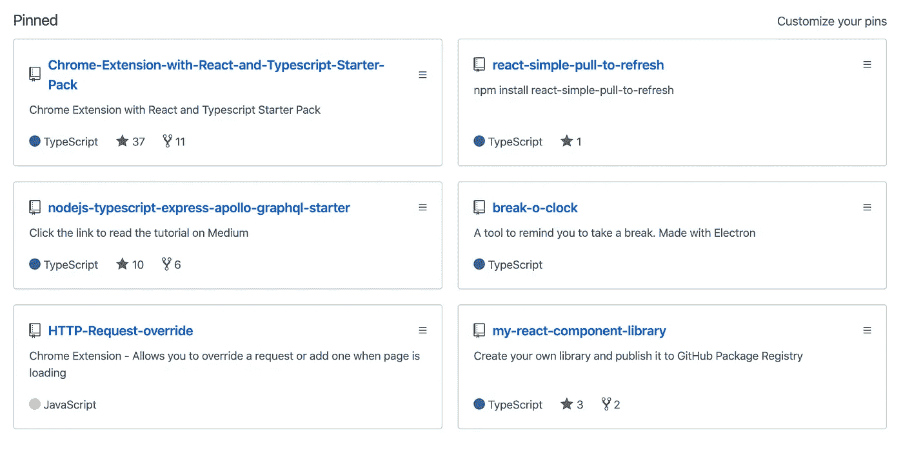
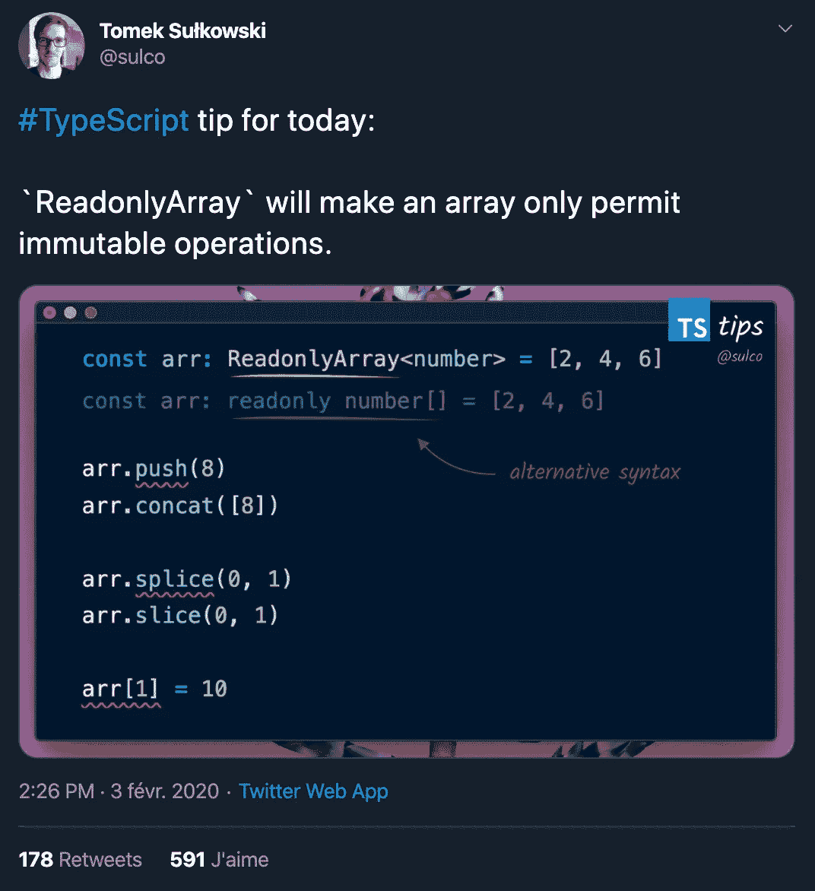

# 作为一名程序员，如何维护你的个人品牌

> 原文：<https://betterprogramming.pub/how-to-take-care-of-your-personal-branding-as-a-programmer-2d3aeba56cb9>

## 这不仅仅是刷新你的简历

Alex bljan 在 [Unsplash](https://unsplash.com?utm_source=medium&utm_medium=referral) 上拍摄的照片

个人品牌化是一个将你自己作为一个品牌、一种产品进行营销的持续过程。

使用工具和技术来突出你是谁，它允许你的对话者了解你的技能和经验，结合你独特的个性。

# 你为什么要维护你的个人品牌？

> “你的品牌是一种感知或情感，由别人而不是你来维护，它描述了与你建立关系的全部经历。”—大卫·麦克纳利和卡尔说——做你自己的品牌

有多种原因可以解释你为什么会在意你的个人品牌。

*   找份工作。
*   提高你在一个行业的可信度。
*   作为一个自由职业者，获得更多的合同。
*   让用户发现你的业务等等。

让我们举一个简单的例子。假设你正在找工作。你已经把你的简历和求职信发送给了你想去的公司。

如果你没有任何在线状态，那么在等待他们的反馈时，你就无能为力了。这两个文件虽然重要，但不能描述你的一切。它们没有最大化你被欣赏到自己真正价值的机会。

另一方面，如果你注意自己的网上形象，在搜索引擎中输入你的名字的招聘人员会对你有更多的了解，你也增加了被赏识的机会。

事实上，招聘人员希望尽可能了解候选人的一切。他们想看看你是否符合公司的价值观，你是否适合这个团队，等等…

他们想知道你喜欢什么，你的爱好，激情，特定的兴趣，你在这个行业的相关性，对你工作的热爱，是什么让你与众不同。

对他们来说，你在网上的存在是一种方式，可以找到更多关于你的正面信息。这些信息可能不会写在你的简历或求职信上。最终，这只能给你带来更多获得这份工作的机会。

# 如何培养自己的品牌

当然，简历是第一件要处理的事情。但我不打算谈论它。我想你已经有一个你引以为豪的了！

## 明确你是谁，你要去哪里

*   你想如何谈论你自己？
*   你想突出什么技术技能？
*   你是一个有领导能力的程序员吗？
*   你有没有想强调的创造性专长？

反思这一点将有助于你决定如何谈论自己，如何展示自己，以及使用什么工具。

## 不要隐藏让你独一无二的东西

为自己感到骄傲。不要误解我，我不是说你必须骄傲和炫耀。

我说的是你的个性，你的技能，还有你的背景。这些是让你独一无二的东西，你应该毫不犹豫地用它们来定义和展现你自己。

在一群人中的独特性激发创造力，开放思维，并形成一个强大的团队。作为一名开发人员，我也喜欢和独特的人一起工作！

## 不要低估自己

我一直是那种喜欢低估自己以防止失望的人，并希望对话者最终会看到，我可以超额完成我的承诺，并创造一个令人惊叹的效果。

这一战略可以讨论。因为我的个性，我相信这对我很有帮助。但是，事后看来，我很确定，因为我低估了自己，我错过了很多机会。

严格拒绝故意过度推销自己。我觉得不值得。但是要尽量接近自己正确的价值观。

让我们举一个具体的例子:如果你想在开发部门找到第一份工作，把自己推销成一名开发人员，而不是一名“有抱负的开发人员”或类似的人。

有开发人员空缺职位的公司愿意招聘开发人员，而不是“有抱负的开发人员”。招聘人员甚至不会看你的简历。

如果你在找工作，你就不是一个有抱负的开发者。说你是大三水平没问题。

## 拍大头照

我在上面说过:为你是谁而自豪。我知道这很难，相信我。我总是发现自己不上相，这使得为我的简历和社交网络选择图片相当困难！

但是我认为让每个人都看到他们在和谁互动是很重要的。如果你发现选择一张照片真的很难，那就和你信任并能帮助你的人一起选。穿上自己喜欢的衣服，别忘了微笑！

## 建立自己的网站

我不会说这是今天的必备，但有一个地方来集中你的在线状态总是很酷的，即使很小。

如果你花时间创建一个很好的网站，搜索引擎优化友好，键入你的名字到谷歌可能会显示你的网站在顶部的位置之一。把那些想更多了解你的人引向正确的地方，这很棒。

你网站的链接也可以添加到你的简历中。

## 将 GitHub 视为您的投资组合

设计师有 [Behance](https://www.behance.net/) 和[dribble](https://dribbble.com/)，我们有 [GitHub](https://github.com/) 。

如果你对前端开发感兴趣，这很好地展示了你能做什么，你绝对应该使用这些工具。然而，这并不能真正证明你的编码技能有多好。

证明你开发技能的是你的代码。那就展示一下你会编码吧！

放上你自己创作并引以为豪的 GitHub 代码(可以是 app，也可以是可重用的代码片段，无所谓)。

请记住，您的 GitHub 配置文件不是垃圾桶:您的配置文件必须是干净的。

清理你的回复…想想那些访问你的个人资料来更多了解你的人。他们不关心你的 React 任务列表教程，也不关心你是否创建了 React 存储库。

这里有两件事你可以做:

*   将您想要保留但不向访问者提供任何价值的存储库设置为 private。
*   通过转到您的个人资料页面并单击“自定义您的 pin”，自定义您的 pin 存储库

我的固定存储库

以上是当有人访问我的个人资料时，我选择首先显示的固定存储库。

它们大多是我做的小应用程序、我创建的样板文件、我写的文章的 npm 包或代码库。我认为这给人留下了我能做什么和能做什么的好印象。

通过这样做，你可以确保将招聘人员引向你引以为豪的项目。

## 活跃在 Twitter 和 LinkedIn 上

当你像我一样内向，不喜欢在社交网络上分享自己的时候，这一点并不容易。老实说，在你的简历或网站上放一个空 Twitter 账户的链接是完全适得其反的。

易于创建的内容示例— [Sulco](https://twitter.com/sulco/status/1224323249540038656)

很多开发者每天都在使用社交网络。

现在，你可以开始关注那些你感兴趣的人，关注他们的编程技能或生活方式，并转发或评论他们发布的内容。这是一个很好的方式来表明你紧跟潮流，并且你可以分享、讨论和捍卫自己的观点。

当你觉得准备好了，开始围绕你的项目进行讨论，创建你感兴趣的编码技巧的内容，询问或给出建议，等等。

Twitter 是一个非正式的地方，在这里你也可以展示你的个性，而不仅仅是谈论编码！这些平台是传播你个人品牌的好地方，所以要正确使用它们。

分享你是谁，分享你的知识，建立你的关系网。

## 创造高价值的内容，展示你对编码的热情

你不需要成为十年的专业人士来分享你的知识。总有比你经验少的人会很高兴找到你的建议。

写关于编码的博客是增加你可信度的好方法。

尽可能定期发帖，但最好保持高质量的内容。

说明你有规律的学习，说明你不是为了贴而贴。写作需要时间。你可以挑战自己每月写一篇文章，这已经是一个很好的目标了。

同样，分享你的知识也是一种有趣的测试方式。如果你在 Medium 这样的平台上发布，很可能会有很多人阅读。虽然读者不一定会说他们喜欢一篇文章，但当文章中有不正确的地方或想要讨论观点时，他们会留下评论。

这个很好的练习表明你有谈论一个话题的专业知识和诀窍，并且能让读者对它感兴趣。

然后，当你感到足够自信时，在聚会上做演讲对你的品牌和网络更有好处！

# 最后的想法

尽管忽视它并没有什么特别不好，但是好好保护你的个人品牌有助于你从其他人中脱颖而出。

如果做得正确，你的个人品牌反映了你的独特性，你的技能和你的优势。

不要做太多。自我推销。如果你想创造内容，选择质量而不是数量。

这篇文章就如何维护你的个人品牌给了你一些建议。这当然不是详尽无遗的，所以要有创造性！