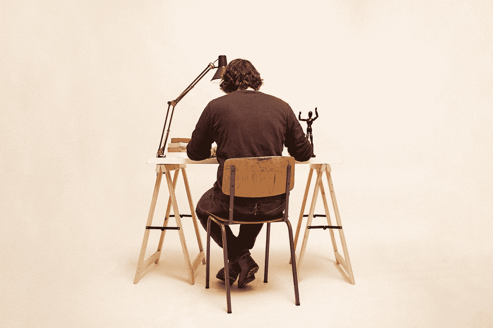

# 如何减少休息时间以提高工作效率

> 原文：<https://betterprogramming.pub/how-to-take-fewer-breaks-to-be-more-productive-at-work-d14ce2653b85>

## 提高工作日效率的秘诀

托马斯·弗兰克在 [Unsplash](https://unsplash.com?utm_source=medium&utm_medium=referral) 上拍摄的照片

程序员的工作可能看起来很容易，但事实证明对许多程序员来说压力很大。大多数程序员会抱怨效率低下——他们应该每天工作 8 小时，但是这 8 小时变成了 2 或 3 小时的工作。最大的原因是需要休息。

# 发生了什么事？

长时间的编码需要大量的注意力，这会导致疲劳，特别是当这种长时间的注意力包括长时间的坐着、分析、解决问题和仅仅编码的时候！在这一点上，程序员觉得他们再也不能找到解决方案，再也不能集中精力，并且感到非常头疼。

在这一点上，程序员不能再有生产力了。他们太累了，除了彻底休息，他们别无选择。他们的大脑告诉他们，休息后他们会再次恢复全部精力，但他们发现他们不能只休息五分钟，所以这种休息在最好的情况下会变成一个小时。此外，当他们重新集中注意力时，他们发现他们需要时间来再次记住他们在做什么，这浪费了更多的时间。

# 大家推荐的？

推荐很多，很多都有用。然而，它们不是解决问题的秘密方法。有些人会推荐 Pomodoro 技术，这是一项杰出的技术，但是许多程序员发现很难突然快速休息。

其他人会建议确保你不是一直坐着，这对我们的身体很重要，但仍然不是改变生活的解决方案。

你已经听了很多建议，你知道你仍然感到头痛。

# 秘密解决方案是…

在这篇文章中，我很乐意告诉你一个令人惊讶的解决方案，它将改变你八小时工作时间中没有头痛的时间。

我从学校学到了这个解决方案——你有没有想过他们是如何在同一天给孩子们上这么多课的？你记得你以前上学的日子，想知道你怎么能这么有效率和专注这么长时间？秘密在于:活动间隙。

# 什么是活动间隙？

通常，我们会彻底休息。彻底的休息就是停止做任何与工作相关的事情。我们有时需要这样，但我们不需要每天 10 次！我们每天需要的是活动间隙。我就是这么命名的，没必要谷歌。

简而言之，我们通常在工作时做一件主要的事情，为了恢复精力，我们只需要从工作中休息一下，而不是从整个工作中休息一下！

回到学校的例子。在学校里，他们看到一个学生听了很长时间的课，还做了很长时间的笔记，所以他们一定不是因为学了什么而累，而是因为听了又做了笔记而累！因此，学校会给学生一个让他们不用听的机会，给他们一个需要写的题目。这就是他们如何安排学校时间表的简单方法，确保他们在课间有活动时间，以免过度使用大脑或身体的一部分。

# 作为程序员怎么用？

这就像安排你的工作日一样简单。你可以在不同的活动中交替进行。当你因为专注太多和编码而疲惫时，你可能不需要完全休息。相反，你需要找到一个不同的工作活动，专注于其他事情，而不是专注和编码。

## 1.列出你工作中的活动

例如，假设您有以下列表:

*   编码
*   问题分析
*   头脑风暴
*   会议
*   规划我的工作日
*   回复电子邮件
*   书写文档

## 2.指定活动中需要的方法

在这一步，你需要分析你的身体或大脑消耗了什么，然后设定活动所需的方法。

例如，编码将包括在键盘上打字，思考和集中注意力，在屏幕前(这会导致眼睛疲劳)，以及大部分时间坐着。你将为每项活动做同样的事情。

例如，对于前面的列表:

*   编码:思考、专注、打字、屏幕、坐着
*   问题分析:思考、写作、聚焦、探索
*   会议:倾听、互动
*   规划我的工作日:写作
*   回复邮件:看屏幕、坐着、打字
*   编写文档:键入

您不必使用我的示例方法，它们可能没有那么准确，它只是一个示例。不过，我想你知道我的意思。您只需指定活动中的主要方法。

## 3.根据前面的列表选择你的下一个活动

根据前面的清单完美地安排你的一天。通过做一些仍然“工作”但不需要屏幕的事情，让你的屏幕时间休息一下。回复一些不需要集中注意力的邮件，让你的注意力得到休息。你明白了。通过改变活动来改变你正在使用的方法。

如果它们都有相同的方法，单独改变活动是不够的。因此，解决问题可能不会让你从编码中解脱出来，因为两者都需要专注。

所以，根据这个来计划你的一天吧。然而，即使你没有提前计划，你只是突然头疼，把这个列表放在你身边，这样你就知道如何进行活动休息，而不是完全休息。

因此，如果你正在编码，你有一个头痛，你不需要去彻底休息。看看你的活动方法清单，决定什么活动能让你休息一下。可能是写一份你已经要写的文件或者回复邮件。

遵循这个秘密会帮助你做更多的事情，让你感觉精力充沛，注意力再次集中，而不需要完全休息。所以，在拿起纸和笔，列出活动方法清单之前，不要写完这篇文章。