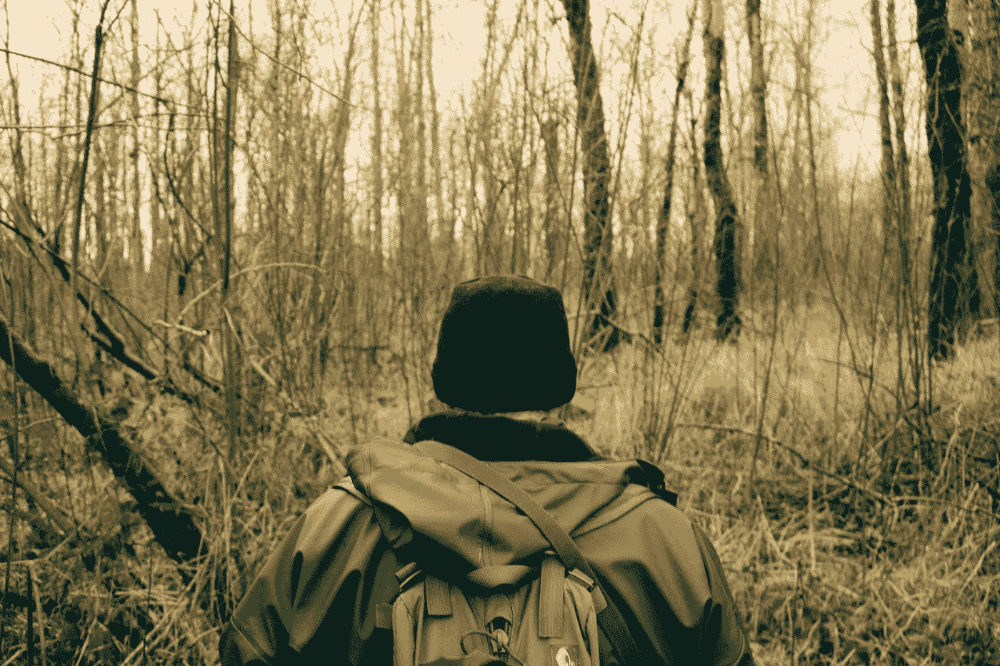
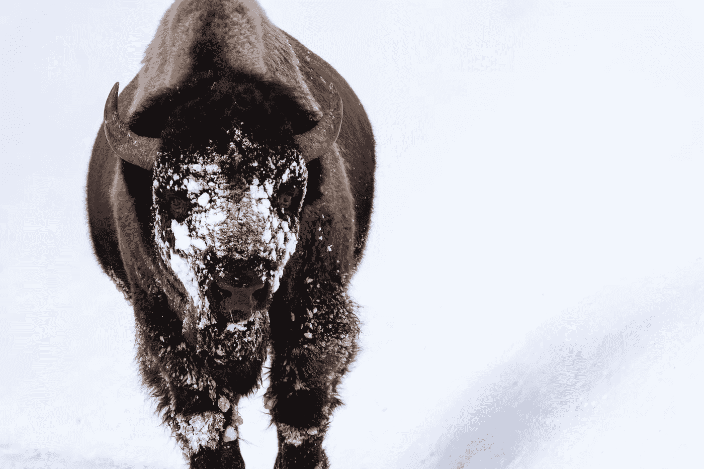
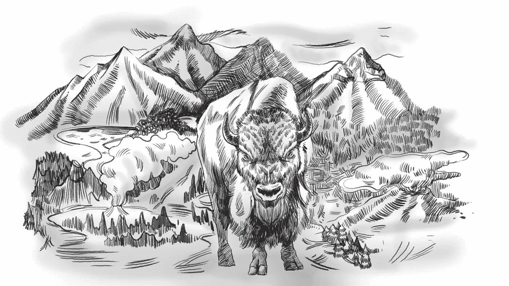

# 如何充分利用你的甲板上的友谊

> 原文：<https://betterprogramming.pub/how-to-take-full-advantage-of-your-on-deck-fellowship-88361662307c>

## 第二部分

凯尔·格伦在 [Unsplash](https://unsplash.com?utm_source=medium&utm_medium=referral) 上的照片

如果您错过了第 1 部分，您可以在这里阅读:

 [## 如何充分利用你的甲板上的友谊

### 第一部分

medium.com](https://medium.com/better-programming/how-to-take-full-advantage-of-your-on-deck-fellowship-part-1-ffce9b3cef3d) 

这是一个正在进行的生存指南系列的第二部分，从一个人的角度，最大限度地利用[甲板上的奖学金](https://www.beondeck.com/)(或任何类似的基于团队的创业加速器项目)。本文涵盖了生存心理学:如何管理压力，如何应对不确定性。

# 生存心理学

> “一些很少或没有受过生存训练的人设法在威胁生命的情况下生存下来。有些受过生存训练的人，技能还没用上，就死了。任何生存环境中的一个关键因素是相关个人的心理态度。”
> 
> —美国陆军野外生存手册 FM 3–05.70，2002 年 5 月

图 2.1 —愤怒的雄性野牛劳尔。他被雪覆盖的脸在他身后洁白的雪中伪装得很差。凡阮街 2020 号。

创业是一条孤独、精神疲惫、财务枯竭、极其无情的道路。你将面临巨大的压力、极端的不确定性和危险的挫折——然而生活将在你周围继续，完全无视你遇到的生死威胁。除此之外，全球性的疫情也极大地影响了你的工作和家庭生活。生存绝对需要心理学。

关键是了解威胁，在安全的环境中做好准备，然后在那一刻适应。在应对身体、法律和公司威胁之前，多了解你面临的精神和心理威胁以及如何最好地管理它们会有所帮助。

# 强调

## 压力是什么？

信不信由你，压力本身并不是一件坏事或负面的事情。

压力被定义为身体对某种情况的反应方式，无论这种情况是身体上的还是情绪上的威胁，心理上的障碍，甚至是想象中的事件。

压力让你的身体有机会学习如何对刺激做出反应。如果你后退一步，喘口气，把注意力集中在问题上，你可能会发现精神上的障碍不值得紧张。

与此同时，在紧急情况下，比如当一头 2000 磅(907 公斤)重、名叫劳尔的愤怒雄性野牛向你扑来时，你的身体会做出反应，在创纪录的时间内调整你的身体系统:

*   立即将储存的糖和脂肪转化为能量
*   关闭消化系统(非紧急需要)
*   降低免疫系统功能(非急需)
*   产生肾上腺素(增强感官、意识、速度和力量)
*   通过加速呼吸来增加氧气
*   启用*闪光灯记忆*——帮助你避免未来压力的情感记忆

这使你能更快地做出反应，并有希望找到掩护而幸存下来。这个过程需要消耗大量的能量，而且会令人难以置信的消耗。

然而，真正的问题是 T2 的慢性压力。

在上述野牛威胁的例子中，一旦你到达安全地带，你的身体通常会在 45 分钟内恢复正常功能。然而，如果你长时间(几天到几周)暴露在这些身体反应中，你的身体会有显著不同的反应:

## 从根本上降低免疫系统功能( [Graham J .，2006](https://www.ncbi.nlm.nih.gov/pmc/articles/PMC2805089) )

*   你更有可能慢慢愈合伤口
*   你更有可能生病
*   你更有可能病得更久，恢复得更慢

## 痛苦地改变荷尔蒙系统

*   你更有可能血压升高 [(Hans Selye，1936](https://www.britannica.com/biography/Hans-Selye) )
*   你更有可能变胖
*   你更有可能在愤怒或沮丧时发泄

## 毁灭性地降低脑容量 [(McKlveen，J.M .，2017](https://www.ncbi.nlm.nih.gov/pmc/articles/PMC4580281) )

*   你不太可能储存和回忆起记忆
*   你不太可能集中注意力、学习和适应 [(MedlinePlus，2019](https://web.archive.org/web/20191211001952/https://medlineplus.gov/ency/article/003211.htm) )
*   你更有可能感到疲劳和沮丧

图 2.2 —愤怒的雄性野牛劳尔的铅笔风格插图，背景是黄石国家公园的风格化版本。由 Enrique De Vera 为 Vidbase，Inc. 2020 Vidbase 绘制。

创建一家初创公司就像在飓风中试图在一艘更大的船上建造一艘船，你必须在劳尔身边工作……也就是下一级慢性压力。

但是，如果你明白发生了什么，并决定采取行动防止慢性压力副作用，将压力反应限制在几个小时或更少是可能的。

第一步是当你还在一个相对安全的环境中时，在精神上为可能发生的事情做好准备。

# 启动压力示例

作为一名创始人，无论你是刚开始创业，还是经历过一些风暴，你都会经历各种压力，包括但不限于:

*   你的储蓄/收入正在减少
*   你、你的合伙人或者你的团队不再有高水平的表现
*   一个强大的竞争对手已经发布了类似的产品(可能甚至在你发布之前)
*   你的个人生活中有一些戏剧性的冲突
*   一个又一个投资者拒绝了你
*   你被客户、以前的同事或投资者起诉

更糟糕的是，这些事件通常会一起、同时发生——进一步放大它给你的身体、思想和意志带来的压力。

期待就好。

做好准备。

走开。

# 压力管理 101

## 休息一下

如果可以的话，每晚保持 6-8 小时的稳定睡眠。

有大量的研究将睡眠不足和糟糕的决策联系起来([WSU 2018](https://neurosciencenews.com/sleep-deprivation-decision-making-9084/#:~:text=Summary%3A A new study will,decisions%2C with potentially disastrous outcomes.)； [Nat 科学睡眠，2020](https://www.ncbi.nlm.nih.gov/pmc/articles/PMC7261660/) 。睡眠剥夺(通宵)、睡眠限制(睡眠不足)或不规律的睡眠模式会导致你在工作中做出更冒险的决定、浪费精力和不顾一切的冲动。

创业是一场马拉松，不是短跑。

如果你认为做一个铁杆夜猫子是值得的，那就彻底审核一下你在那段时间所做的工作，以及几天后你所经历的影响(失眠和易怒之类的睡眠障碍)，并将这些数据与 Node.js/JavaScript/Golang 社区有史以来最多产的作家之一[休息良好的](https://twitter.com/tjholowaychuk/status/1305385357786058752?s=20) [550 个重要的开源模块](https://medium.com/u/bbb3c7ccb0a0#:~:text=You might be familiar with,self-funded startup called Apex.)而闻名，其中大多数都是各自领域中最受欢迎的(例如，Express，2020 年每周下载量为 1400 万)。

## 增强耐力

运动产生内啡肽，可以提升情绪，减少疼痛，并可以缓解(一些)抑郁症状。

同样，长期锻炼和线粒体生长之间也有明显的联系 [(T.E .摩根，1971](https://link.springer.com/chapter/10.1007/978-1-4613-4609-8_8)[；门什科娃，2006 年](https://www.ncbi.nlm.nih.gov/pmc/articles/PMC1540458/)。不管你多年轻或多老(或你感觉自己有多老)，定期和持续的锻炼会增加骨骼肌中的线粒体数量，导致更多的能量储存和更快的葡萄糖(和其他物质)转化为能量。这不仅增加了你的身体产生更多所需能量的能力(敏捷性、速度和力量)，而且这种能力持续的时间更长(耐力)。

它还负责减少你血液中的皮质醇(负责你身体压力反应的激素)，促进你的情绪和心理健康，减少患老年痴呆症和帕金森氏症等疾病的几率([泰勒医学博士，1985](https://www.ncbi.nlm.nih.gov/pmc/articles/PMC1424736/pdf/pubhealthrep00100-0085.pdf)[)；德斯兰德斯，2009 年](https://www.karger.com/Article/PDF/223730)。

如果这还不够的话，在适用于软件工程师相关 RSI 的健身和强化之间还有很强的相关性 [(Cheung，2013](https://www.ncbi.nlm.nih.gov/pmc/articles/PMC3795407/)[；何，2019](https://www.ncbi.nlm.nih.gov/pmc/articles/PMC6867778/) )。具体来说，如果你已经编程很长时间了，你很可能会经历颈部和背部疼痛。但是那些经常做伸展运动的人在他们的一生中很少会遇到这些问题。

## 加燃料

为了高质量的产出，消费高质量的食物。

多伦多大学和哥伦比亚大学最近分享的一项研究显示，一名中年男子罗伯特被诊断患有多动症、易怒和抑郁症，他可以通过提高食物摄入的质量来缓解易怒和抑郁。通过从薯片和饼干等营养不良的食物转向坚果、水果和蔬菜等营养丰富的食物，他体验到:

*   烦躁情绪大幅减少(确定是由于低血糖，也称为低血糖)
*   一整天中饥饿感出乎意料地明显减少
*   情绪的积极变化(与 omega-3 脂肪酸、纤维和维生素的增加有关)

正在进行的理论是，一些食物(咸零食、软饮料、精制谷物、红肉、无糖汽水、人造黄油等。)增加身体的炎症反应，引发各种问题。鱼类/鸡肉、叶类蔬菜、橄榄油/植物油、坚果等多种多样的饮食具有预防炎症的相反效果。

因此，提高你的食物质量，减少有害食物的摄入，享受对你的表现和降低压力的好处。

## **结论**

总而言之，通过改善你的睡眠、锻炼制度和饮食，你可以在应对开办公司所涉及的紧张工作量和压力方面获得显著优势。

另外，你收集的优势会随着时间的推移而积累和复合。试试看。为什么不利用你能得到的一切优势呢？

# 不确定

在创业和生活中，没有什么是肯定的。

*   人们可以违背自己的诺言
*   交易告吹
*   承诺会被打破

唯一可以保证的是没有任何保证。

如果你来自一个更加公司化的生活方式，可能就不是这样了。但是对于创业公司，你经常在一个高度竞争(残酷)的环境中，在有限的信息和不公平的资源分配下运营，在这个环境中，你对任何事情都几乎没有控制。在这种状态下工作可能会令人不安或彻底沮丧，但你可以做几件事让它变得更令人愉快。

## 控制你的环境

为不确定性做准备，有助于消除你生活中其他地方的不确定性，这样当一些计划外的或不可预见的事情发生时(它会发生)，你可以将所有的注意力集中在这上面，而不是其他任何事情上。

这意味着:

*   确保储备物资(食物、水、卫生纸、运动器材)
*   确保你有足够的存款(这样你的账单就会一直被支付)
*   确保你可以获得帮助、社区和市场(不要变得孤立)
*   确保你有一个安全的工作场所(没有干扰，没有噪音，等等)。)
*   确保你有一个安全可靠的地方来恐慌/抓狂/哭泣(发泄情绪)

你的环境和你的需求可能不一样，所以请相应调整。

但关键是，如果你已经消除了这些领域的不确定性，你在短期和中期要担心和处理的事情就会少得多。

以下是我能控制的一些实际的事情，我希望当我知道我打算开一家公司的时候就已经做了:

*   如果你有一套房子，并想获得 HELOC(股权担保贷款)，在你还有工作的时候比辞职后更容易获得(T2)
*   如果你有需要出售的股票期权，最好是在下一年的早些时候出售，而不是在接近年底时出售以延期纳税。你仍然要支付那些税，但是一点点的填充可以减轻你的压力和不确定感。
*   多走走。在照顾好睡眠、锻炼和食物之后，我发现在大自然中散步可以解决任何残留的焦虑或情绪问题。YMMV。

## 控制你的假设

根据我的经验，创业不确定性的最大来源之一是无效的假设(以及你没有意识到的隐含假设)。这些问题从最明显的到最微妙的都有，但是如果你不小心的话，它们都是非常致命的。

以下是一些常见的创业相关假设:

*   你的客户会在你刚推出网站时就找到你
*   你的客户群愿意付钱
*   你的客户群会真正阅读你的登陆页面
*   你的客户群足够大，如果他们真的付钱，你可以在扣除成本后获利
*   你的客户获取成本和流失率将会很低
*   你的潜在投资者只会给你一个想法
*   你只需要接触少数投资者/客户/新员工等。
*   你可以自己做任何事情

作为一名创始人，你做的每一个决定都可能基于一个或多个未经检验的假设。

你可能会急于推出一个登录页面来获得客户注册，但无论你的产品有多好，都没有人能找到或看到登录页面(因为你需要所谓的 [*分销*](https://learn.marsdd.com/article/distribution/) )。

你接触的一些投资者在理论上可能听起来很完美，但他们实际上可能只在基于启动指标、股权比例或创始人背景的某些心照不宣的条件下投资——除非你测试自己的假设，否则你不会知道。

你可能坚信你不需要任何帮助，可以自己做任何事情。但是，即使你具备了所有的必备技能、实践和经验，你最终会发现自己受到了多方面的攻击，并且由于生物/生理原因，一次只能应对一个方面。

重要的是要意识到这些假设，限制它们(因此，如果你错了，你就暴露在它们的负面影响下)，并解释它们。

## 故事时间

早在 2011 年左右，我的两个了不起的创始人朋友在大约四年的时间里建立了一个了不起的、盈利的初创公司。

他们按计划做了一切，一个他们认为是正确的计划。他们筹集了朋友和家人的一轮，preseed，seed，A 轮等。他们拥有付费客户、成功的分销战略和可观的利润率(足以支付自己高于最低工资的工资，并过上一点点生活)。据说，他们做得很好。

因此，当一个令人兴奋的收购要约出现时(大约 400-500 万美元)，他们抓住了这个机会。从各方面来看，这又是一次惊人的成功。投资者、供应商、成本等之后。，每位创始人拥有约 3%的股权。在这四年中，每个人都拿走了大约 6 万美元，外加这些年的最低工资。如果他们在谷歌工作同样长的时间，他们会得到更多的报酬(事实上，税前超过 8.3 倍)。

他们认为筹集资金对他们来说是正确的事情。他们白手起家——没有存款，没有跑道——所以他们也必须早点筹集资金。每一轮额外的融资都被认为是正确的举措(它带来了媒体、网络联系和更多的客户)。但是每一个假设都有代价——一个他们直到很久以后才看到或意识到的代价。

这让他们精疲力尽，并阻止他们再次经历这一过程。但我可以向你保证，如果他们再次尝试，他们不会犯同样的错误。

此外，创始人还会做出一些隐含的、非公司导向的假设:

*   你需要从顶级风险投资公司那里筹集资金。(有数以千计的投资公司、集团和基金。这还不算天使、辛迪加等。)
*   你会从第一个与你交谈的投资者那里筹集资金。(在得到改变你一生的一个肯定之前，你可能会得到 99 个否定。)
*   你是创建这家公司的最佳人选。(也许不是，但是你可以把*最好的团队*。)
*   你不能这么做。(每个成功的人都是从你的位置开始的——一个局外人；一个新手；一个天真的、与世无争的、或许过于理想化的创始人。如果他们能成功，你也能成功。)

# 控制你的反应

不幸的是，大多数人都很难应对不确定性。赌注很高，如果没有足够的信息来做出正确的决定，你实际上是在随机赌博。很容易屈服，失去希望，陷入沮丧。

同样，不幸的是，为了防止这种情况，你必须反其道而行之:

*   保持积极的态度
*   专注于利害攸关的事情
*   训练自己去应对

如果你能保持积极的态度，你就不太可能过早地放弃或者在最轻微的减速时接受失败。

如果你提醒自己什么是危险的，为什么你要建造你正在建造的东西，你就不太可能犯粗心的错误，或者在错误的事情上花费太多的时间和精力。通过将自己暴露在这些情况下(无论如何，作为一个创始人，你都会遇到)，你将训练自己应对这些情况，并随着时间的推移提高你的反应能力。这一切都来自于你自己的个人意志力。

当你的公司成功、起飞并变得巨大时，这种准备对于处理更严重的问题是至关重要的。

# 特别感谢

特别感谢 [Zvi Band](https://linkedin.com/in/zviband) 、 [Nnenna John](https://www.linkedin.com/in/nnennajohn/) 、 [Melissa Kargiannakis](https://linkedin.com/in/kargiannakis) 、 [JJ Nguyen](https://linkedin.com/in/juliejennifer) 、 [Ike Orizu](https://linkedin.com/in/ikeorizu) 、 [Aashni Shah](https://linkedin.com/in/aashnisshah) 、 [Zack Shapiro](http://twitter.com/zackshapiro) 和 [Sidni Standard](https://linkedin.com/in/sidnistandard) 审阅本文档、提交故事并提供早期反馈。

非常感谢 ODF 团队，特别是[希拉兹·多尔](https://linkedin.com/in/shirazdole)、[莉贾娜·嘉宝](https://linkedin.com/in/rpgbx)、[崔西·肯涅利](https://linkedin.com/in/trish-kennelly-922b8026)、[杰瑞米·斯托·托马斯](https://linkedin.com/in/jeremy-sto-tomas)、[布兰登·塔莱斯尼克](https://www.linkedin.com/in/brandon-taleisnik/)和[朱利安·韦瑟](https://linkedin.com/in/julianweisser)，他们为这项工作提供了大量支持。

# 第三部分

在下一章“第三部分:合适的住所:为成功做好准备”中，我们将涵盖提前设置工具以避免打嗝，准备个人资料以最大限度地获得意外收获，以及针对 ODF 的时间管理和组织的实用技巧。