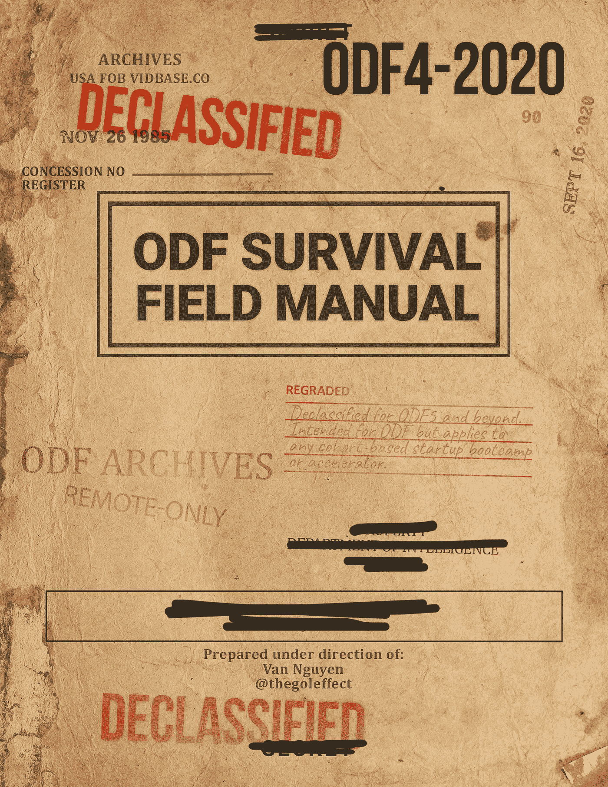
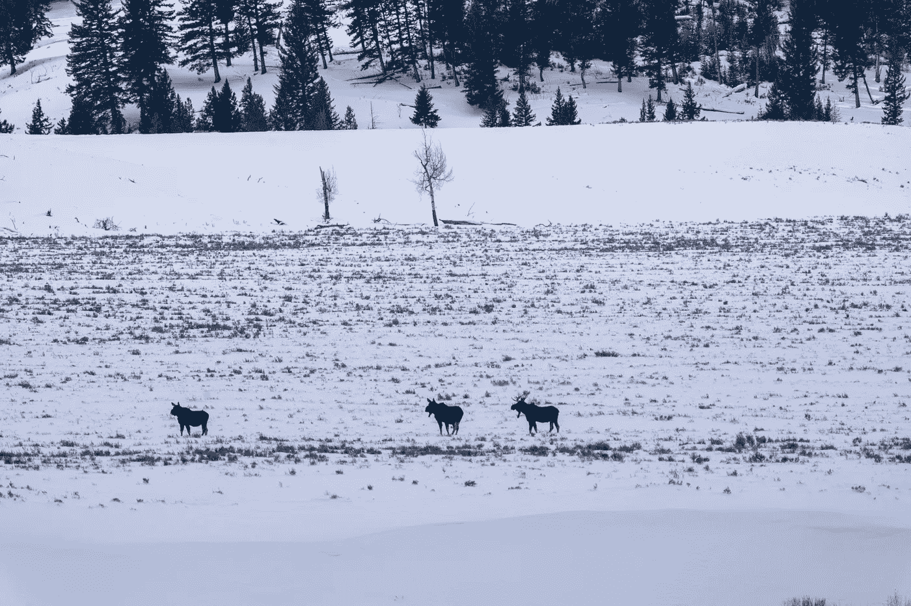
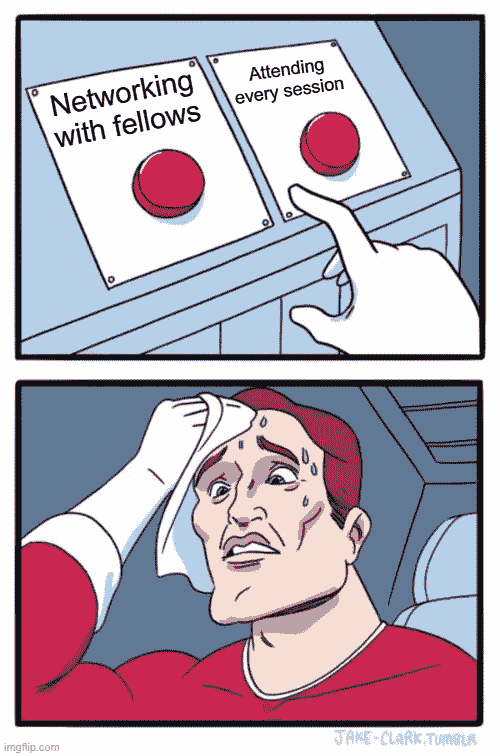
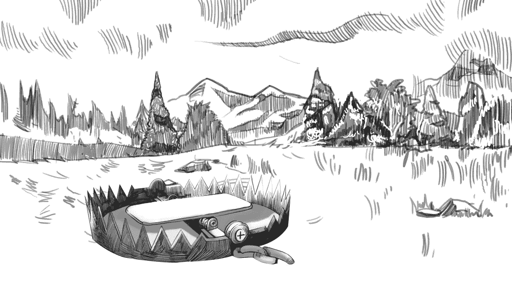

# 如何充分利用你的甲板上的友谊

> 原文：<https://betterprogramming.pub/how-to-take-full-advantage-of-your-on-deck-fellowship-part-1-ffce9b3cef3d>

## 第一部分

《ODF 野外生存手册》插图模拟封面

我完全没有准备好我的生活会因为甲板上的友谊而得到永远的改善。

2020 年 4 月，我决定创办自己的公司。但在大公司工作多年，导致了与旧金山熙熙攘攘的创业和企业家场景完全隔绝。我不再有任何网络连接，任何支持结构，或任何趋势或正在发生的事情的洞察力。有一个像旧金山这样的支持性和参与性的社区，建立一家科技公司已经足够困难了，更不用说没有任何社区了。我知道如果我想成功，我必须找到一个。

我抓住机会申请了一个项目:甲板奖学金，这个项目越来越受欢迎，但在当时并不像今天这样广为人知。这听起来正是我想要的那种社区。在 Twitter 上，它被吹捧为下一个 YCombinator，一个非常成功的创业加速器，但它不需要股权(只是前期成本)，却提供了大量的价值回报。它是排外的，苛刻的，严格的。我对入学的期望很低。

然后，在六月，令人惊讶的是，我被录取了。在这十个星期里，时间过得很快，我轻松地从它那里获得了比我投入的多 100 倍的价值，但我觉得我几乎不能利用可用资源的 1%。

我写这个指南是为了帮助未来的人们利用我的 1%以上。或者可能是因为相对而言，我对自己投入的太少感到内疚。不管怎样，感谢你的加入，让这个社区变得更大更好。让我们去创造伟大的产品。

# 🏞️环境:期待什么，如何准备

> “不做准备，就是在为失败做准备。”——这句谚语出自本杰明·富兰克林和 H.K 威廉姆斯之手

图 1.1 —一群驼鹿穿越黄石国家公园广阔荒凉的山谷的照片。它们四周都是森林覆盖的山脉。一英里外拍的照片。凡阮街 2020 号。

## 前两周

> 📣故事时间:
> 
> 在 2020 年 8 月 ODF4 快结束的时候，我和一位 ODF 的研究员聊了聊，他在一些技术问题上需要帮助。由于这个话题完全是我的专长，我很乐意向他推荐一系列优秀的资源、一些一般性的建议等等。他欣喜若狂——大叫我是多么的乐于助人，我是多么的慷慨，等等等等。更多的是出于对他的反应的震惊，我问他的背景和他在 ODF 的经历。
> 
> 遗憾的是，他对这次经历反应冷淡。他从这个项目中获得的价值没有他预期的多。
> 
> 难以置信！没有办法。
> 
> 毕竟，我有过完全相反的经历，所以我们相距甚远。所以我问他到目前为止见过多少人。他的回答？可能有几个。这周吗？不…总数。
> 
> 大错特错。
> 
> ODF 就像一个人工合成的意外收获的漏斗。这种意外收获不是假的，甚至不是很接近，但它是由设计产生的，你必须付出努力。
> 
> 还有。它。作品。
> 
> 听不听我的建议。不可否认，你只拿回你投入系统的东西。所以，在系统中投入更多的努力，在系统中投入更多的知识，投入更多的精力，你永远不知道你会得到什么。
> 
> 🎤 💧

我所交谈过的每一个前 ODF 研究员，如果没有在头两个星期尽可能多地与人交流和见面，那么他们成长得最少，总体上进步最少，没有从这个项目中获得太多，并最终后悔了。你在这里花费时间和金钱。

你将不会再有这样一个好机会，在这里几乎每个人都愿意聊天，并且有时间聊天。

利用这段时间。

## 为什么与人交往很重要？

像 ODF、YCombinator 或 500 Startups 这样的项目的大部分价值在于，它们将你放入一个由像你一样志同道合、有动力的个人组成的社区和智囊团。这些人你可以向他们学习，他们会看着你的背后，给你帮助和鼓励；还有你，他们。

越多的人了解你和你的工作，你就越有机会:

*   指出你可能没有听说过的竞争对手
*   指出适用于你的行业和创业的技巧和诀窍
*   为您联系潜在的联合创始人/员工/投资者/更多人
*   提供有价值的帮助、建议、服务和推荐
*   教你创业中你不知道、不擅长或需要帮助的方面
*   还有更多

反之亦然。你了解的人越多，你就越能帮助他们。随着时间的推移，每个人给予的帮助越多，这个网络就变得越有价值。

> 📣故事时间:
> 
> 在 ODF4 的最初几周， [Aashni Shah](https://aashni.me/) ，创始人， [Taonga](https://taongaapp.com/) 一直在支持其他人的努力，包括我自己——感谢 Aashni！她会不断尝试详述我和其他人的工作和分享。同样，她也不断分享自己的进步，构思和创建一家公司。
> 
> 她最终会建立一个公益创业公司。慷慨、无私、充满活力和激情——很难不被 Aashni 的出现所鼓舞。所以后来，当我重新联系上投资界的一些老熟人时，我已经失去了联系，他们当时正在寻找有前途的社会影响创业公司，我知道了完美的推荐。我安排了介绍，他们都很合得来，现在那些投资者欠我一个人情！
> 
> 甚至在后来，我为 ODF 研究员提供了一个登陆页面重新设计服务([如果你在 ODF，想了解更多信息，请点击这里](https://on-deck-fellowship.slack.com/?redir=%2Farchives%2FC018JLVM2CV%2Fp1597898043001200))。我很高兴能够为她的应用程序设计提供一点点帮助。她提醒我注意潜在的竞争对手，并在我自己的工作中提供了很多反馈。

## 现实的期望

在项目的前两周，新成员将熟悉 ODF 团队、流程和工具，以及流程的一般工作方式。因此，大部分课程将是轻松的，侧重于构思和发现，并且将有充足的时间与同事进行视频聊天。但是需要多少时间呢？

假设:

1.  您在太平洋标准时间时区每天工作八小时
2.  50%的时间用于课程和活动
3.  你花一个小时吃午饭
4.  你和人们见面 30 分钟

那么在这两周的时间里，理论上你最多能见 60 个人，或者说是你团队的三分之一。由于变焦疲劳或日程安排困难，你不太可能达到这个数字，所以在最好的情况下，你可能达到大约 20 次会议的理论上限。

在 ODF4 的前两周，我召开了一连串令人精疲力尽的 14 次一对一会议(总共约 250 次？在这个群体中)，其中大约有一半我仍然保持着定期联系(希望这种联系会永远持续下去)。

为了客观地看待这个问题，在最初阶段之后的 12 周内，我将与另外 7 人会面。

## 占便宜

有一些最佳的方式来利用这个难得的机会，以及一些住宿，使您的利益最大化。

理想情况下，如果你现在是全职员工，你应该腾出时间休息。此外，你应该预料到在这段时间内，你的实际启动不会完成太多。你是在为公司的长期成功投资，这是有成本的，但这是值得付出的。

通过专心、问好问题、真诚地对他人感兴趣，你会比只谈论自己获得更好的结果。

课程时段将被录制，因此如果您没有相关问题要问并且需要跳过，您可以稍后重新观看。你应该建立直觉，判断哪些会议值得参加，并无情地优先考虑如何利用时间。

最后，如果你在这段时间内无法会见理论上或实际上的最大数量的人，不要担心，之后你仍有机会这样做，但正如你将看到的，要说服某人中断甚至 30 分钟的聊天，门槛会更高。这将由你来决定，让你的客人尽可能地轻松、方便和不受打扰。

> 📣故事时间:
> 
> 如果你需要如何最好地利用这个惊人的网络的灵感，只需看看梅丽莎·卡尔吉安纳基斯的故事，它充满了悬念、阴谋和勇气。作为“将复杂的行话简化成简单的日常语言”的创始人兼首席执行官， [skritswap](https://skritswap.com/) ，她亲自展示了[在创业中脱颖而出的不懈的足智多谋](https://www.jasonshen.com/2012/how-to-be-relentlessly-resourceful)。
> 
> 在 2020 年 9 月 ODF 第五批早期，Melissa 锁定了她第一轮融资所需的大部分投资者。但 skritswap 的临时首席技术官即将离职(以寻找更有能力的高管)，这威胁到了筹资过程。所以为了结束这一轮，她需要找到一个替代者，而且要快。
> 
> 所以她开始认真工作。她在 Linkedin 上联系了 ODF 网络中的每一个人——我们 996 个人！用手！以一种可操作的，非欺诈的方式。忙碌和奉献是真实的。
> 
> 在 996 个连接中，有 144 个响应并收到了更详细的消息。然后，在经过 30 多次会面后，她联系或推荐了 12 名优秀的候选人。

## 程序的其余部分

在接下来的几周里，像你团队中的其他人一样，你很可能会埋头专注于进一步完善你的想法(通过做客户研究、分析和用户测试)或开发你的产品(设计、工程和运输)。ODF 的课程将变得更加注重行动，注重建设，并让你为与投资者交谈做好准备。

现在，你应该已经知道如何最好地管理你的时间了。如何确定哪些会议值得亲自参加，哪些会议可以等到以后再看(如果有的话)。如何围绕 ODF 活动安排你的生活？等等。

如果可以，利用这段时间:

*   完善和练习你的推销
*   建立你的个人品牌
*   主办社区会议/办公时间
*   提供你的服务
*   公开建造

> 📣故事时间
> 
> [线性](https://linear.app/)是公共建筑好处的突出例子。
> 
> 他们在推特上发布了他们的[变更日志](https://twitter.com/linear_app/status/1191861411678261248),其中包含详细的描述和高质量的 gif 图片。他们把复活节彩蛋藏起来，让用户去找。它真正展示了他们快速的开发速度和用户体验设计。顾客注意到了这一点。
> 
> 几个月后，2019 年 11 月，他们从红杉资本(Sequoia capital)和 Index Ventures 获得了 420 万美元的种子资金。
> 
> 直到今天，他们还在公共场所继续着同样的做法。

## 之后的时间

不要落入陷阱，以为你的利益和访问结束于你的计划

不要忘记，在你的团队结束后，你仍然可以完全进入社区。

你可以在事后观看所有群组的所有会议。如果他们愿意，你将能够接触到所有的演讲嘉宾，从他们那里获得反馈，并向他们学习。在你的团队结束后，加入该计划的价值会继续增长和扩大。

不仅所有当前群组会议被快速记录和上传，而且通常情况下，嘉宾发言人将在这些活动中包括他们的联系信息。因此，即使你没有参加，你仍然可以直接寻求帮助。大多数人(但不是所有人)愿意并乐于帮助你。但是请不要做一个有资格的混蛋！

此外，就内容而言，您可以继续访问办公时间、社区会议、破冰/社交、黑客马拉松等。

了解更多关于可用资源的信息，包括您可能不知道的资源(如免费登录页面重新设计、按活动对空闲频道进行排序等。)，等等，请关注本系列的后续部分。

特别感谢 [Zvi 乐队](https://linkedin.com/in/zviband)、 [Nnenna John](https://www.linkedin.com/in/nnennajohn/) 、 [Melissa Kargiannakis](https://linkedin.com/in/kargiannakis) 、 [JJ Nguyen](https://linkedin.com/in/juliejennifer) 、 [Ike Orizu](https://linkedin.com/in/ikeorizu) 、 [Aashni Shah](https://linkedin.com/in/aashnisshah) 、 [Zack Shapiro](https://linkedin.com/in/zackshapiro) 、&、 [Sidni Standard](https://linkedin.com/in/sidnistandard) 审阅本文档、提交故事并提供早期反馈。

非常感谢 ODF 团队，特别是[希拉兹·多尔](https://linkedin.com/in/shirazdole)、[瑞吉娜·嘉宝](https://linkedin.com/in/rpgbx)、[崔西·肯涅利](https://linkedin.com/in/trish-kennelly-922b8026)、[杰瑞米·斯托·托马斯](https://linkedin.com/in/jeremy-sto-tomas)、[布兰登·塔莱斯尼克](https://www.linkedin.com/in/brandon-taleisnik/)和[朱利安·韦瑟](https://linkedin.com/in/julianweisser)，他们为这项工作提供了大量支持。

在下一章[(第二部分生存心理学】](https://medium.com/better-programming/how-to-take-full-advantage-of-your-on-deck-fellowship-88361662307c)，我们将涵盖如何管理压力和如何应对不确定性。